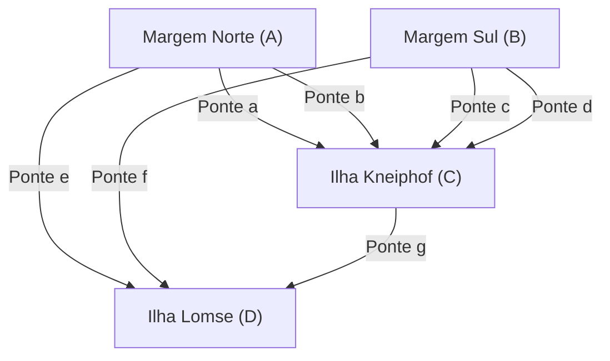

## Introdução

Na história da matemática, questões triviais e brincadeiras cotidianas às vezes servem como catalisadores para abrir campos matemáticos inteiramente novos. Um dos exemplos mais famosos e belos disso é o problema das **"Sete Pontes de Königsberg"** (Seven Bridges of Königsberg).

No século XVIII, a cidade de Königsberg (atual Kaliningrado, na Federação Russa), no Reino da Prússia, era atravessada pelo grande rio Pregel. Havia sete pontes construídas para conectar suas ilhas às margens. Os cidadãos da época criaram um jogo durante seus passeios ao entardecer: "Seria possível passear pela cidade atravessando todas as sete pontes exatamente uma vez e retornar ao ponto de partida?"

Quando este problema, que parecia ser apenas um mero quebra-cabeça, chegou às mãos do genial matemático **Leonhard Euler** , ocorreu uma revolução no mundo da matemática. Euler não apenas provou que isso era impossível, mas nesse processo reconceitualizou as propriedades do espaço de uma perspectiva totalmente nova, lançando as bases de dois campos extremamente importantes na matemática moderna: a **Teoria dos Grafos** (Graph Theory) e a **Topologia** (Topology).

Neste artigo, aprofundaremos no contexto histórico do problema das Sete Pontes de Königsberg, na solução brilhante de Euler e em como isso se conecta com a ciência e tecnologia modernas, incluindo os detalhes matemáticos. Mais do que apenas uma introdução histórica, aprecie a beleza das estruturas matemáticas que estão por trás disso.

## A Cidade de Königsberg e as Sete Pontes: Contexto Histórico

No início do século XVIII, Königsberg era uma próspera cidade comercial banhada pelo Mar Báltico e um centro de aprendizado. No centro da cidade, o rio Pregel corria para o oeste, e havia duas grandes ilhas no rio, chamadas Kneiphof e Lomse.

A estrutura geográfica da cidade era dividida em quatro grandes massas de terra:

- Margem Norte (A)
- Margem Sul (B)
- Ilha Kneiphof (C)
- Ilha Lomse, ou margem leste (D)

Para conectar essas quatro massas de terra, um total de **sete pontes** foram construídas.
Havia 2 entre a margem norte (A) e a ilha (C), 2 entre a margem sul (B) e a ilha (C), 1 entre a margem norte (A) e a ilha (D), 1 entre a margem sul (B) e a ilha (D), e 1 entre as duas ilhas (C) e (D). Essas pontes eram infraestruturas essenciais para a vida cívica e, ao mesmo tempo, elementos importantes que compunham a bela paisagem da cidade.

Intelectuais e cidadãos de Königsberg na época tentavam encontrar uma rota de passeio dominical que atravessasse cada uma dessas sete pontes "exatamente uma vez" para dar a volta na cidade. No entanto, não importava quanta tentativa e erro fizessem, ninguém conseguiu. Eles esqueciam de atravessar uma ponte ou atravessavam a mesma ponte duas vezes. Logo começou a se espalhar um rumor entre os cidadãos de que "talvez tal rota de passeio simplesmente não exista", mas ninguém era capaz de provar isso matematicamente.

## De um Quebra-Cabeça de Pontes a um Problema Matemático: O Sonho de Leibniz e a Intuição de Euler

Esse boato dos cidadãos acabou chegando aos ouvidos do grande matemático suíço **Leonhard Euler** , que na época estava na Academia de Ciências de São Petersburgo, na Rússia. O ano era 1735.

Inicialmente, parece que Euler sentiu que "isso não é matemática, mas sim um mero jogo de lógica". A corrente principal da matemática da época era a geometria euclidiana (que lidava com comprimento, ângulo, área, volume, etc.), a álgebra, e o cálculo diferencial e integral que havia acabado de ser fundado por Newton e Leibniz. O problema das pontes de Königsberg não dependia em nada de propriedades geométricas tradicionais, como quantos metros as pontes tinham de comprimento, qual era a área das ilhas ou em que ângulo as pontes cruzavam o rio. O importante era apenas a relação de **conexão** pura: "qual massa de terra está conectada a qual massa de terra e por quantas pontes".

Este era um tipo de problema geométrico completamente novo, que não podia ser tratado sob a estrutura métrica da geometria euclidiana da época. No entanto, Euler gradualmente começou a perceber a profundidade deste problema. Ele reconheceu que se tratava de um problema importante relacionado à "Análise de Posição" (Analysis Situs) ou "Geometria de Posição" (Geometria Situs) que Gottfried Wilhelm Leibniz havia sonhado anteriormente, e decidiu investigar o problema a fundo.

## A Abstração de Euler: Removendo Informações Desnecessárias

A manifestação mais notável da genialidade de Euler estava em sua capacidade excepcional de **abstração** (Abstraction), removendo todas as informações desnecessárias do complexo mundo real para extrair apenas a estrutura essencial do problema.

A partir de um mapa detalhado da Königsberg real, ele ignorou completamente a forma e o tamanho físicos das massas de terra, a largura do rio, a velocidade da correnteza e o material ou comprimento das pontes. E ele criou um modelo matemático extremamente simples e abstrato como o seguinte:

1. Representar as **massas de terra (ilhas e margens)** como meros "pontos" sem tamanho. Na terminologia moderna, isso é chamado de **vértice** (Vertex) ou **nó** (Node).
2. Representar as **pontes** como "linhas" conectando os vértices. Isso é chamado de **aresta** (Edge) ou **ligação** (Link). A curvatura ou comprimento da linha não importa.

Uma estrutura discreta representada dessa forma como um conjunto finito de vértices e arestas conectando-os é chamada de **grafo** (Graph) na matemática. Este foi precisamente o momento de nascimento do campo que hoje chamamos de "Teoria dos Grafos".

O diagrama Mermaid a seguir mostra como o mapa geográfico da cidade de Königsberg foi convertido para uma representação gráfica abstrata.

Por meio dessa poderosa abstração, a pergunta cotidiana dos cidadãos, "existe uma rota que cruze todas as sete pontes da cidade uma vez?", foi totalmente transformada em um problema matemático puramente lógico e rigoroso: "existe um caminho contínuo que percorra todas as arestas de um dado grafo exatamente uma vez?".

## Grau dos Vértices e o Teorema do Caminho Euleriano: A Prova de Euler

Após formular o problema na forma de um grafo, Euler descobriu uma lei universal extremamente simples, porém poderosa. A chave para essa prova foi a introdução do novo conceito de **grau** (Degree).

Na teoria dos grafos, o **grau** de um vértice $v$ é denotado como $d(v)$ ou $\text{deg}(v)$, e isso significa "o número total de arestas diretamente conectadas àquele vértice".

Euler considerou logicamente que tipo de restrição o ato de traçar um caminho que passa por todas as arestas uma vez ("desenhar sem levantar a caneta") imporia ao grau de cada vértice.

Suponha que exista um caminho que desenhe o grafo inteiro passando por todas as arestas exatamente uma vez. À medida que traçamos este caminho, vamos considerar um vértice que serve como um "ponto de passagem" (um vértice que não é nem o ponto de partida nem o ponto de chegada). O caminho requer o uso de uma aresta para "entrar" naquele vértice e o uso de outra aresta para "sair" daquele vértice.
Em outras palavras, cada vez que visitamos um vértice que serve como ponto de passagem, devemos inevitavelmente **consumir duas arestas em par** .

Portanto, em vértices que são meramente atravessados durante o caminho, as arestas para entrar e sair deles devem sempre existir em pares, o que significa que o número total de arestas (grau) conectadas a esse vértice deve obrigatoriamente ser **par** (Even).

As únicas exceções possíveis a essa regra seriam os vértices que correspondem ao "ponto de partida" e "ponto de chegada" do caminho.

Aqui, os padrões de caminho podem ser classificados em duas categorias:

1. **Circuito Euleriano (Eulerian Circuit)** : Quando o ponto de partida e o ponto de chegada são o mesmo vértice.
   Neste caso, o caminho dá uma volta completa e retorna ao vértice original. Portanto, **todos os vértices** , incluindo o ponto de partida = ponto de chegada, são efetivamente tratados da mesma forma que os "pontos de passagem". Uma vez que as entradas e saídas estão perfeitamente emparelhadas, **os graus de todos os vértices no grafo devem ser pares** .

2. **Caminho Euleriano (Eulerian Path)** : Quando o ponto de partida e o ponto de chegada são vértices diferentes.
   Neste caso, o ponto de partida requer uma aresta extra para "sair primeiro", e o ponto de chegada requer uma aresta extra para "entrar por último". Portanto, apenas para os dois vértices que são o ponto de partida e o ponto de chegada, os pares de arestas não se completam e eles terão um grau **ímpar** (Odd). Os graus de todos os outros pontos de passagem devem ser pares.

Este é o teorema fundamental e mais famoso da teoria dos grafos (Teorema de Euler), provado rigorosamente por Euler.

Expressando este teorema mais rigorosamente com fórmulas matemáticas, para um grafo não direcionado conectado $G = (V, E)$:

- **Condição necessária e suficiente para a existência de um Circuito Euleriano** :
  Para todo vértice $v \in V$ do grafo $G$, o grau $d(v)$ é par.
  $\forall v \in V, \ d(v) \equiv 0 \pmod 2$

- **Condição necessária e suficiente para a existência de um Caminho Euleriano** :
  No grafo $G$, existem "exatamente dois" vértices cujo grau é ímpar.
  $|\{v \in V \mid d(v) \equiv 1 \pmod 2\}| = 2$

## Aplicação ao Grafo de Königsberg e Conclusão

Agora, vamos aplicar este teorema perfeitamente deduzido por Euler ao grafo real das sete pontes de Königsberg.

Contemos o grau de cada uma das 4 massas de terra abstraídas (vértices $A, B, C, D$).

- Margem Norte $A$: Conectada por 2 pontes para a ilha $C$ e 1 ponte para a ilha $D$. Portanto, o grau é $d(A) = 3$ (ímpar).
- Margem Sul $B$: Conectada por 2 pontes para a ilha $C$ e 1 ponte para a ilha $D$. Portanto, o grau é $d(B) = 3$ (ímpar).
- Ilha Lomse $D$: Conectada por 1 ponte para a margem $A$, 1 ponte para a margem $B$ e 1 ponte para a ilha $C$. Portanto, o grau é $d(D) = 3$ (ímpar).
- Ilha Kneiphof $C$: Conectada por 2 pontes para a margem $A$, 2 pontes para a margem $B$ e 1 ponte para a ilha $D$. Portanto, o grau é $d(C) = 5$ (ímpar).

Resumindo os resultados, os graus dos 4 vértices presentes no grafo de Königsberg são "3, 3, 3, 5". Surpreendentemente, **os graus de todos os vértices são ímpares** .

De acordo com o Teorema de Euler, para que seja possível um caminho que passe por todas as arestas uma vez (desenho de um traço), o número de vértices com grau ímpar deve ser estritamente "0" ou "2". No entanto, no grafo de Königsberg, existem "4" vértices de grau ímpar.

Com base neste fato, Euler chegou à sua conclusão final:
**"Não existe absolutamente nenhuma rota possível para caminhar pelas sete pontes de Königsberg cruzando cada uma exatamente uma vez."**

Este foi um momento extremamente importante na história da matemática. Pois Euler não provou a impossibilidade tentando todas as infinitas rotas de passeio possíveis uma por uma. Ele provou a impossibilidade elegantemente usando apenas propriedades lógicas e universais puras: "estrutura do grafo" e "paridade" (ser par ou ímpar). Essa abordagem dedutiva pode ser dita como a verdadeira essência da matemática moderna.

## Desenvolvimento da Topologia: O Nascimento da Geometria de Posição

Através do problema das pontes de Königsberg, Euler abriu um paradigma de geometria completamente novo, que não dependia de nenhuma propriedade "métrica" tradicional da geometria euclidiana (como distância, comprimento, ângulo, área), focando puramente nas "maneiras de se conectar" (continuidade e conectividade) das formas e dos espaços.

Este foi o início do campo que mais tarde seria chamado de **Topologia** (Topology). Na topologia, são estudadas "propriedades que não mudam mesmo sob deformação contínua (propriedades topológicas)". Há uma piada bem conhecida que diz que "um topólogo não sabe distinguir uma xícara de café de um donut". Ambos são "objetos sólidos com um buraco" e, como podem ser deformados continuamente um no outro, como argila, sem cortar ou colar, são considerados "a mesma forma" no mundo da topologia.

O grafo de Königsberg é semelhante. Mesmo que as pontes sejam esticadas ou encolhidas como elásticos, ou as ilhas sejam esmagadas, desde que as relações de conexão ("qual vértice está conectado a qual vértice") sejam mantidas, a essência do grafo permanece inalterada. O que Euler focou foi precisamente nesta propriedade topológica da "conexão invariante sob deformação".

Mais tarde, em 1750, o próprio Euler descobriu uma incrível lei universal a respeito do número de vértices ($V$), arestas ($E$) e faces ($F$) de um poliedro, conhecida como **Teorema de Euler para Poliedros** ($V - E + F = 2$). Esta também capta uma invariante topológica que não depende da forma ou tamanho específicos do poliedro, tornando-se um marco extremamente importante no desenvolvimento da topologia.

## Aplicações e Expansão da Teoria dos Grafos na Sociedade Moderna

A teoria dos grafos e a topologia, que nasceram da exploração intelectual pura de um matemático do século XVIII, nunca ficaram restritas a uma torre de marfim acadêmica. Hoje, elas florescem como ferramentas extremamente práticas e indispensáveis que sustentam fundamentalmente nossa sociedade altamente informatizada e a tecnologia moderna.

### 1. Redes de Computadores e a Internet
A estrutura física e lógica da internet que usamos todos os dias é, essencialmente, um gigantesco grafo global. Roteadores, servidores e computadores individuais são os vértices, e os cabos de fibra óptica e links de comunicação sem fio que os conectam são as arestas. Os protocolos de roteamento para entregar pacotes de dados aos seus destinos o mais rápido e eficientemente possível evitando congestionamentos (por exemplo, o algoritmo de Dijkstra) são todos projetados como algoritmos em teoria dos grafos.

### 2. Sistemas de Navegação e Otimização Logística
A pesquisa de rotas em aplicativos de mapas em smartphones e sistemas de navegação automotiva realiza cálculos tratando cruzamentos e entroncamentos como vértices e estradas como arestas. Este é exatamente o **Problema do Caminho Mais Curto** (Shortest Path Problem) na teoria dos grafos. Além disso, nas redes de logística, o problema de determinar a rota que visita o maior número de destinos de entrega na ordem mais eficiente é conhecido como o **Problema do Caixeiro Viajante** (Traveling Salesman Problem).

### 3. Análise de Redes Sociais (SNA)
A análise de redes sociais, que ocupa um lugar importante nas ciências sociais modernas e na informática, também se baseia na teoria dos grafos. As relações humanas em redes sociais como o X (antigo Twitter) e o Facebook são modeladas como um "grafo social", com usuários como vértices e conexões de amizade ou seguidores como arestas. Analisando este grafo, é possível descobrir estruturas de comunidade e construir modelos de como a informação se espalha.

### 4. Ciências da Vida: Biologia, Química e Medicina
A teoria dos grafos também está ativa em várias escalas das ciências naturais. Na química, grafos com átomos como vértices e ligações químicas como arestas são usados para modelar estruturas moleculares. Na biologia, para compreender as complexas interações entre proteínas nas células como redes, e na neurociência, para entender como inúmeros neurônios estão conectados e processam informações (análise do conectoma), os poderosos métodos de análise da teoria dos grafos são indispensáveis.

## Conclusão

Em 1736, um único artigo publicado por Leonhard Euler, "A Solução de um Problema Relativo à Geometria de Posição", deu uma resposta completa ao quebra-cabeça de passeio de domingo dos cidadãos de Königsberg. No entanto, o que isso realmente significava não era o fim de um problema, mas o nascimento de um vasto universo matemático com inúmeras aplicações.

É a **força da abstração** de não ser limitado pela forma ou tamanho superficial das coisas, mas de discernir agudamente apenas a estrutura mais essencial de "o que está conectado a quê e como". A história das Sete Pontes de Königsberg nos ensina através das eras como o pensamento matemático abstrato pode desvendar o mundo real e se tornar uma arma poderosa para criar as tecnologias do futuro.

Da próxima vez que você caminhar pela cidade, ver uma ponte sobre um rio, ou olhar para um mapa de linhas de metrô, tire um momento para pensar sobre a estrutura de "conexão" por trás deles. Os belos fios invisíveis da matemática, descobertos por um gênio matemático há mais de 280 anos, ainda estão tecidos por toda parte, envolvendo-nos em nossos tempos modernos.
