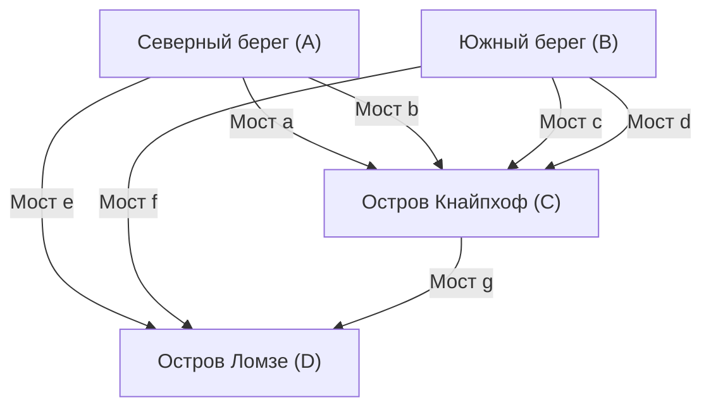

## Введение

В истории математики тривиальные повседневные вопросы и игры иногда становятся поводом для открытия совершенно новых математических областей. Одним из самых известных и красивых примеров этого является задача **«[Семь мостов Кёнигсберга](https://kenji.blog/ru/p/seven-bridges-of-konigsberg/)»** ([Seven Bridges of Königsberg](https://kenji.blog/ru/p/seven-bridges-of-konigsberg/)).

В XVIII веке в городе Кёнигсберг (современный Калининград, Российская Федерация) Прусского королевства протекала большая река Прегель. Через её острова и оба берега было перекинуто семь мостов. В то время горожане придумали следующую игру во время своих вечерних прогулок: «Можно ли обойти все семь мостов в городе, пройдя по каждому ровно один раз, и вернуться в исходную точку?»

Когда эта на первый взгляд простая головоломка попала в руки гениального математика **Леонарда Эйлера** ([Leonhard Euler](https://kenji.blog/ru/p/euler/)), в мире математики произошла революция. Эйлер не только доказал, что эта задача не имеет решения, но в процессе он переосмыслил природу пространства с совершенно новой точки зрения и заложил основы **теории графов** (Graph Theory) и **топологии** (Topology), двух чрезвычайно важных областей современной математики.

В этой статье мы глубоко погрузимся в исторический контекст задачи о семи мостах Кёнигсберга, блестящее решение Эйлера и то, как это связано с современной наукой и технологиями, сопровождая всё математическими деталями. Насладитесь не просто историческим введением, но и красотой математических структур, лежащих в его основе.

## Город Кёнигсберг и семь мостов: Исторический контекст

В начале XVIII века Кёнигсберг был процветающим торговым городом на берегу Балтийского моря, а также центром науки. В центре города река Прегель (Pregel) текла на запад, и в ней находились два больших острова (мели), называемые Кнайпхоф (Kneiphof) и Ломзе (Lomse).

Географическая структура города была условно разделена на следующие четыре участка суши:

- Суша на северном берегу (A)
- Суша на южном берегу (B)
- Остров Кнайпхоф (C)
- Остров Ломзе, или суша на востоке (D)

Чтобы соединить эти четыре участка суши, в общей сложности было построено **семь мостов**.
Два моста между северным берегом (A) и островом (C), два между южным берегом (B) и островом (C), один между северным берегом (A) и островом (D), один между южным берегом (B) и островом (D), и один между двумя островами (C) и (D). Эти мосты были важной инфраструктурой для жизни граждан и одновременно ключевыми элементами красивого городского пейзажа.

Интеллектуалы и горожане Кёнигсберга того времени во время своих воскресных послеобеденных прогулок пытались найти маршрут, который позволил бы обойти весь город, пройдя по каждому из этих семи мостов ровно по одному разу. Однако, сколько бы они ни пытались методом проб и ошибок, никому не удалось этого сделать. Они либо забывали перейти какой-то мост, либо переходили один и тот же мост дважды. Вскоре среди горожан пошли слухи о том, что «возможно, такого маршрута для прогулки просто не существует», но никто не мог доказать это математически.

## От головоломки с мостами к математической задаче: Мечта Лейбница и интуиция Эйлера

Эти слухи горожан в конце концов дошли до слуха великого швейцарского математика **Леонарда Эйлера**, который в то время находился в Петербургской академии наук в России. Это было в 1735 году.

Первоначально Эйлер, казалось, отнесся к этой задаче так: «Это не математика, а, возможно, всего лишь логическая игра». Основным направлением математики в то время были евклидова геометрия (имеющая дело с длиной, углами, площадью, объёмом и т.д.), алгебра, или недавно созданное Ньютоном и Лейбницем дифференциальное и интегральное исчисление. Задача о мостах Кёнигсберга совершенно не зависит от традиционных геометрических свойств, таких как длина мостов в метрах, площадь островов или угол, под которым мосты пересекают реку. Единственное, что имело значение — это чистое отношение **связанности (соединения)**, то есть «какой участок суши с каким участком суши соединён и сколькими мостами».

Это была геометрическая задача совершенно нового типа, с которой не могла справиться метрическая система евклидовой геометрии того времени. Однако Эйлер постепенно начал осознавать глубину этой проблемы. Он понял, что это важная задача, связанная с «анализом положения» (Analysis Situs) или «геометрией положения» (Geometria Situs), о которой когда-то мечтал Готфрид Вильгельм Лейбниц (Gottfried Wilhelm Leibniz), и решил всерьёз взяться за её разгадку.

## Абстракция Эйлера: Отбрасывание ненужной информации

Наиболее ярким проявлением гениальности Эйлера была его выдающаяся способность к **абстракции** (Abstraction) — умение отбрасывать всю ненужную информацию из сложного реального мира и извлекать только существенную структуру проблемы.

Из подробной карты реального Кёнигсберга он полностью проигнорировал физическую форму и размер суши, ширину реки и скорость течения, материал и длину мостов и так далее. Затем он создал следующую чрезвычайно простую и абстрактную математическую модель.

1. **Суша (острова и берега)** представляется просто как «точки», не имеющие размера. В современной терминологии это называется **вершиной** (Vertex) или **узлом** (Node).
2. **Мосты** представляются как «линии», соединяющие вершины. Они называются **рёбрами** (Edge) или **связями** (Link). Степень кривизны или длина линий не имеют значения.

Таким образом, дискретная структура, представленная в виде конечного набора вершин и множества рёбер, соединяющих их, в математике называется **графом** (Graph). Это был момент зарождения той области, которую мы сейчас называем «теорией графов».

Следующая диаграмма Mermaid показывает, как географическая карта города Кёнигсберга была преобразована в абстрактное представление графа.

Благодаря этой мощной абстракции повседневный вопрос горожан «Существует ли маршрут, чтобы пройти по семи мостам города по одному разу?» превратился в чисто логическую и строгую математическую задачу: «Существует ли непрерывный путь, который проходит по каждому ребру заданного графа ровно один раз?».

## Степень вершины и теорема об уникурсальном графе: Доказательство Эйлера

Сформулировав задачу в виде графа, Эйлер открыл очень простой, но чрезвычайно мощный универсальный закон. Ключом к его доказательству стало введение нового понятия — **степени** (Degree).

В теории графов **степень** вершины $v$ обозначается как $d(v)$ или $\text{deg}(v)$ и означает «общее количество рёбер, непосредственно соединённых с этой вершиной».

Эйлер логически рассмотрел, какие ограничения накладывает на степени каждой вершины процесс рисования «пути, проходящего через все рёбра по одному разу (рисование одним росчерком)» на графе.

Предположим, что существует путь, который проходит по всем рёбрам ровно один раз, обходя весь граф. Рассмотрим в процессе следования по этому пути какую-либо вершину, которая является «промежуточной точкой» (то есть вершину, не являющуюся ни начальной, ни конечной точкой). Чтобы путь «вошёл» в эту вершину, необходимо использовать одно ребро, а чтобы «выйти» из неё, нужно использовать другое ребро.
Иными словами, каждый раз при посещении вершины, являющейся промежуточной точкой, вы обязательно **расходуете два ребра в паре**.

Следовательно, для вершины, которая просто проходится на пути, обязательно должны существовать пары рёбер для входа и выхода, поэтому общее количество рёбер, соединённых с этой вершиной (степень), должно быть **чётным** (Even).

Единственные возможные исключения — это вершины, которые являются «начальной точкой» и «конечной точкой» пути.

Здесь паттерны путей делятся на следующие два типа.

1. **Эйлеров цикл (Eulerian Circuit)**: Случай, когда начальная и конечная точки являются одной и той же вершиной.
   В этом случае путь проходит полный круг и возвращается к исходной вершине. Следовательно, **все вершины**, включая начальную и конечную, фактически рассматриваются так же, как «промежуточные точки». Поскольку входы и выходы образуют идеальные пары, **степени всех вершин в графе должны быть чётными**.

2. **Эйлеров путь (Eulerian Path)**: Случай, когда начальная и конечная точки являются разными вершинами.
   В этом случае для начальной точки требуется одно дополнительное ребро, чтобы «изначально выйти» из неё, а для конечной точки — одно дополнительное ребро, чтобы «в конечном итоге войти» в неё. Таким образом, только у двух вершин — начальной и конечной — пары рёбер не полны, и они будут иметь **нечётную** (Odd) степень. Степени всех остальных промежуточных вершин должны быть чётными.

Это и есть самая базовая и известная теорема в теории графов, строго доказанная Эйлером (Теорема Эйлера).

Выражая эту теорему более строго с помощью математических формул, для связного неориентированного графа $G = (V, E)$:

- **Необходимое и достаточное условие существования Эйлерова цикла (Eulerian Circuit)**:
  Для всех вершин $v \in V$ графа $G$, их степень $d(v)$ чётная.
  $\forall v \in V, \ d(v) \equiv 0 \pmod 2$

- **Необходимое и достаточное условие существования Эйлерова пути (Eulerian Path)**:
  В графе $G$ существует «ровно две» вершины, степень которых нечётная.
  $|\{v \in V \mid d(v) \equiv 1 \pmod 2\}| = 2$

## Применение к Кёнигсбергскому графу и вывод

Теперь давайте применим эту красивую и совершенную теорему, выведенную Эйлером посредством дедуктивных рассуждений, к реальному графу семи мостов Кёнигсберга.

Посчитаем степени каждой из четырёх абстрагированных территорий (вершин $A, B, C, D$).

- Суша на северном берегу $A$: построено 2 моста к острову $C$ и 1 мост к острову $D$. Таким образом, степень $d(A) = 3$ (нечётная).
- Суша на южном берегу $B$: построено 2 моста к острову $C$ и 1 мост к острову $D$. Таким образом, степень $d(B) = 3$ (нечётная).
- Остров Ломзе $D$: построено по одному мосту к берегу $A$, берегу $B$ и острову $C$. Таким образом, степень $d(D) = 3$ (нечётная).
- Остров Кнайпхоф $C$: построено по 2 моста к берегу $A$, берегу $B$ и 1 мост к острову $D$. Таким образом, степень $d(C) = 5$ (нечётная).

Подводя итоги, степени четырёх вершин в кёнигсбергском графе равны «3, 3, 3, 5». Удивительно, но **степени всех вершин нечётные**.

Согласно теореме Эйлера, чтобы путь (уникурсальный обход) прошёл через все рёбра по одному разу, количество вершин с нечётной степенью должно быть строго «0» или «2». Однако в кёнигсбергском графе существует целых «4» вершины с нечётной степенью.

Опираясь на этот факт, Эйлер пришёл к следующему окончательному выводу.
**«Пути, позволяющего пройти по всем семи мостам Кёнигсберга ровно один раз, абсолютно не существует»**

Это был чрезвычайно важный момент в истории математики. Потому что Эйлер не стал методично и исчерпывающе проверять все возможные маршруты для прогулок, которых было бы почти бесконечное множество, чтобы убедиться в невозможности. Он элегантно доказал эту невозможность, используя лишь чисто логические и универсальные свойства, такие как «структура графа» и «чётность» (Parity). Этот дедуктивный подход можно назвать истинной сутью современной математики.

## Развитие в топологию: Рождение геометрии положения

Через задачу о кёнигсбергских мостах Эйлер открыл совершенно новую парадигму геометрии. Эта парадигма не зависела от «метрических» свойств традиционной евклидовой геометрии, таких как расстояние, длина, угол и площадь. Вместо этого в качестве существенного объекта исследования выступали только «способы соединения (непрерывность и отношения связности)» фигур и пространства.

Это положило начало той области, которая позже стала называться **топологией** (Topology). В топологии изучаются «свойства, которые не меняются при непрерывной деформации (топологические свойства)». Существует известная шутка: «Тополог не может отличить кофейную чашку от пончика». И то, и другое представляет собой «объёмное тело с одним отверстием», и если их непрерывно деформировать, словно глину, без разрезания и склеивания, они могут превратиться друг в друга. Поэтому в мире топологии оба считаются имеющими «одну и ту же форму».

То же самое касается и графа Кёнигсберга. Если мосты растягивать или сжимать, как резинки, или искажать острова, суть графа останется совершенно неизменной, пока сохраняются связи: «какая вершина с какой соединена». Эйлер обратил внимание именно на это топологическое свойство: «соединение, инвариантное при деформации».

Сам Эйлер впоследствии, в 1750 году, открыл удивительный универсальный закон о количестве вершин ($V$), рёбер ($E$) и граней ($F$) многогранников — так называемую **Теорему Эйлера для многогранников** ($V - E + F = 2$). Это открытие также запечатлело топологический инвариант, не зависящий от конкретной формы или размера многогранника, и стало важнейшей вехой в развитии топологии.

## Применение и распространение теории графов в современном обществе

Теория графов и топология, зародившиеся из чисто интеллектуальных поисков математика XVIII века, не остались исключительно академическими дисциплинами в башне из слоновой кости. В настоящее время они процветают как чрезвычайно практичные и незаменимые инструменты, которые фундаментально поддерживают наше высокоинформатизированное общество и технологии.

### 1. Компьютерные сети и Интернет
Физическая и логическая структура Интернета, которым мы пользуемся каждый день, сама по себе является гигантским графом в глобальном масштабе. Отдельные маршрутизаторы, серверы и компьютеры выступают в качестве вершин, а оптоволоконные или беспроводные линии связи, соединяющие их, представляются как рёбра. Протоколы маршрутизации для наиболее быстрой и эффективной доставки пакетов данных к месту назначения, избегая перегрузок (например, алгоритм Дейкстры), все разработаны как алгоритмы на основе теории графов.

### 2. Навигационные системы и оптимизация логистики
Поиск маршрута в картографических приложениях смартфонов и автомобильных навигационных системах выполняет расчёты, рассматривая перекрёстки и развязки как вершины, а дороги — как рёбра. Это не что иное, как **Задача о кратчайшем пути** (Shortest Path Problem) в теории графов. Кроме того, в логистических сетях задача определения наиболее эффективного маршрута для посещения множества точек доставки известна как **Задача коммивояжёра** (Traveling Salesman Problem).

### 3. Анализ социальных сетей (SNA)
Анализ социальных сетей, занимающий важное место в современных социальных науках и информатике, также основан на теории графов. Человеческие отношения в таких соцсетях, как X (ранее Twitter) или Facebook, моделируются в виде «социального графа», где вершины — это пользователи, а рёбра — отношения подписки. Анализируя этот граф, можно обнаруживать структуры сообществ и строить модели того, как распространяется информация.

### 4. Науки о жизни: Биология, химия и медицина
Теория графов активно используется и на различных уровнях естественных наук. В химии при моделировании молекулярных структур используется граф, в котором атомы являются вершинами, а химические связи — рёбрами. В биологии сложные взаимодействия между белками в клетках рассматриваются как сеть, а в науках о мозге, чтобы понять, как соединяются многочисленные нейроны и обрабатывают информацию (коннектомика), мощные методы анализа на основе теории графов совершенно необходимы.

## Заключение

В 1736 году статья Леонарда Эйлера «Решение задачи, связанной с геометрией положения» дала окончательный ответ на пустяковую головоломку кёнигсбергских горожан для их воскресных прогулок. Однако истинный смысл этого события заключался не в решении одной задачи, а в рождении огромной математической вселенной с бесчисленными применениями.

**Сила абстракции** заключается в способности не зацикливаться на поверхностной форме или размере вещей, а проницательно видеть только самую существенную структуру: «что, с чем и как связано». История о семи мостах Кёнигсберга сквозь века учит нас тому, как абстрактное математическое мышление может стать мощным инструментом для понимания реального мира и создания технологий будущего.

Если в следующий раз, гуляя по городу, вы увидите мост через реку или взглянете на схему линий метро, пожалуйста, задумайтесь о структуре «связей», стоящей за ними. Невидимые красивые нити математики, открытые одним гениальным математиком более 280 лет назад, по-прежнему оплетают и охватывают нас сегодня.
