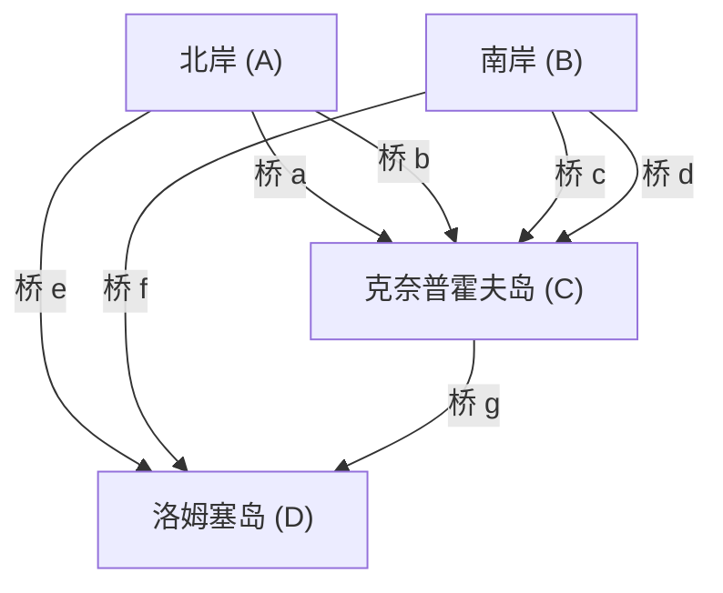

## 引言

在数学史上，日常中微小的疑问或游戏，有时会成为开辟全新数学领域的契机。其中最著名且优美的例子之一，就是 **“[柯尼斯堡的七座桥](https://kenji.blog/zh-cn/p/seven-bridges-of-konigsberg/)”** ([Seven Bridges of Königsberg](https://kenji.blog/zh-cn/p/seven-bridges-of-konigsberg/)) 问题。

18世纪，在普鲁士王国的柯尼斯堡（现俄罗斯联邦加里宁格勒），有一条名为普列戈利亚河的大河穿城而过，河中的沙洲与两岸之间架设了七座桥。当时的市民们在黄昏散步时，想到了这样一个游戏：“能否将城里的七座桥全部走过一次，然后再回到原来的出发点？”

这个乍看之下不过是一个普通谜题的问题，当它传到天才数学家 **[莱昂哈德·欧拉](https://kenji.blog/zh-cn/p/euler/)** (Leonhard Euler) 手中时，数学世界发生了一场革命。欧拉不仅证明了这个问题是不可能的，而且在这个过程中，他从一个全新的视角重新审视了空间的性质，奠定了 **图论** ([Graph Theory](https://kenji.blog/zh-cn/p/graph-theory-dijkstra-a-star/)) 和 **拓扑学** (Topology) 这两个在现代数学中极其重要领域的基石。

本文将结合数学细节，深入探讨[柯尼斯堡的七座桥](https://kenji.blog/zh-cn/p/seven-bridges-of-konigsberg/)问题的历史背景、欧拉巧妙的解决方法，以及它如何与现代科学和技术相联系。请不仅将其作为历史的介绍，更要细细品味其背后数学结构的优美。

## 柯尼斯堡的城市与七座桥：历史背景

18世纪初的柯尼斯堡是一座面向波罗的海、繁荣的商业城市，同时也是学术中心。市中心有普列戈利亚河（Pregel）向西流淌，河中有两个被称为克奈普霍夫（Kneiphof）和洛姆塞（Lomse）的大岛（沙洲）。

城市的地理结构大致可以分为以下四块陆地：

- 北岸的陆地 (A)
- 南岸的陆地 (B)
- 克奈普霍夫岛 (C)
- 洛姆塞岛，即东侧的陆地 (D)

为了连接这四块陆地，总共架设了 **七座桥** 。
北岸(A)和岛(C)之间有2座，南岸(B)和岛(C)之间有2座，北岸(A)和岛(D)之间有1座，南岸(B)和岛(D)之间有1座，而两个岛(C)和(D)之间有1座。这些桥是市民生活中不可或缺的基础设施，同时也是构成美丽街景的重要元素。

当时柯尼斯堡的知识分子和市民们，在假日的午后散步时，试图找到一条路线，将这七座桥“恰好各走一次”并绕城一圈。然而，无论怎么反复尝试，都没有人能够成功。总会忘记走某座桥，或者同一座桥走了两次。久而久之，市民中开始流传“这样的散步路线根本就不存在”的说法，但没有人能够从数学上证明这一点。

## 从过桥谜题到数学问题：莱布尼茨的梦想与欧拉的直觉

市民们的这个传闻，最终传到了当时逗留在俄罗斯圣彼得堡科学院的伟大瑞士数学家 **[莱昂哈德·欧拉](https://kenji.blog/zh-cn/p/euler/)** 的耳中。那是1735年的事情。

起初，欧拉对这个问题似乎觉得“这并非数学，只不过是普通的逻辑游戏罢了”。当时数学的主流是[欧几里得](https://kenji.blog/zh-cn/p/euclid/)几何学（研究长度、角度、面积、体积等）、代数学，或者是牛顿和莱布尼茨刚刚创立的微积分学。柯尼斯堡的桥问题，完全不依赖于桥的长度是多少米、岛屿的面积有多大、桥与河流的夹角是多少等传统的几何学性质。重要的是，“哪块陆地和哪块陆地通过几座桥相连”这种纯粹的 **连接（连接关系）** 。

这是当时的[欧几里得](https://kenji.blog/zh-cn/p/euclid/)几何学的度量框架所无法处理的、一种全新类型的几何学问题。然而，欧拉逐渐开始意识到这个问题的深刻之处。他认识到，这涉及到曾经由戈特弗里德·威廉·莱布尼茨（Gottfried Wilhelm Leibniz）所梦想的“位置分析（Analysis Situs）”或“位置几何学（Geometria Situs）”的重要问题，于是他决定正式着手解开这个谜题。

## 欧拉的抽象化：剔除多余的信息

欧拉天才最显著的体现，在于他卓越的 **抽象化** (Abstraction) 能力，能够从复杂的现实世界中剔除所有多余的信息，仅提取问题本质的结构。

他从现实中柯尼斯堡精密的地图中，完全忽略了陆地的物理形状和大小、河流的宽度和水流速度、桥梁的材质和长度等一切细节。然后，他建立了一个极其简单且抽象的数学模型，如下所示：

1. 将 **陆地（岛屿和两岸）** 表示为没有大小的纯粹的“点”。在现代术语中，这被称为 **顶点** (Vertex) 或 **节点** (Node)。
2. 将 **桥** 表示为连接顶点和顶点的“线”。这被称为 **边** (Edge) 或 **链接** (Link)。线的弯曲程度和长度都不成问题。

像这样，将有限个顶点和连接它们的边的集合所表示的离散结构，在数学中被称为 **图** ([Graph](https://kenji.blog/zh-cn/p/tree-graph-data-structures-search-dfs-bfs-dijkstra/))。这正是现在我们称之为“图论”这一领域的诞生时刻。

下面的 Mermaid 图展示了柯尼斯堡的城市地理地图是如何转化为抽象的图表示的。

通过这种强大的抽象化，市民们关于“是否存在一次性走遍城市七座桥的路线”的日常疑问，被完全转化为了一个纯粹逻辑且严密的数学问题：“是否存在一条连续的路径（一笔画），能够恰好一次走遍给定图的所有边？”

## 顶点的度与一笔画定理：欧拉的证明

在将问题转化为图的形式后，欧拉发现了一条非常简单却极其强大的普遍法则。证明的关键在于引入了 **度** (Degree) 这一新概念。

在图论中，某个顶点 $v$ 的 **度** 记为 $d(v)$ 或 $\text{deg}(v)$ ，其含义是“直接连接到该顶点的边的总数”。

欧拉从逻辑上考察了在图上“描绘一条走遍所有边一次的路径（一笔画）”这一行为，会对每个顶点的度产生怎样的限制。

假设存在一条能够恰好走遍所有边一次并画完整张图的路径。在沿着这条路径行进的过程中，我们考虑某个作为“经过点”的顶点（既不是起点也不是终点的顶点）。为了让路径“进入”该顶点，必须使用一条边，而为了从该顶点“出去”，必须使用另一条边。
也就是说，每当访问作为经过点的顶点时，必定会 **成对地消耗两条边** 。

因此，在路径中途仅仅经过的顶点上，为了进出该顶点所连接的边必定是成对存在的，所以连接到该顶点的边的总数（度）必定是 **偶数** (Even)。

可能出现例外的，只有相当于路径“起点”和“终点”的顶点。

在这里，路径的模式可以分为以下两种：

1. **欧拉回路 (Eulerian Circuit)** ：起点和终点是同一个顶点的情况。
   在这种情况下，路径会绕一圈回到原来的顶点。因此，包含起点（即终点）在内的 **所有顶点** 实质上都等同于“经过点”。由于进出完全成对， **图中所有顶点的度都必须是偶数** 。

2. **欧拉路径 (Eulerian Path)** ：起点和终点是不同顶点的情况。
   在这种情况下，起点需要额外一条用于“最初出发”的边，而终点需要额外一条用于“最后进入”的边。因此，只有起点和终点这两个顶点的边无法成对结束，它们将拥有 **奇数** (Odd) 的度。除此之外所有其他经过点的度都必须是偶数。

这就是欧拉严格证明的图论中最基本、最著名的定理（欧拉定理）。

用数学公式更严格地表达这一定理，在连通的无向图 $G = (V, E)$ 中：

- **存在欧拉回路（Eulerian Circuit）的充要条件** ：
  对于图 $G$ 中的所有顶点 $v \in V$ ，其度 $d(v)$ 均为偶数。
  $\forall v \in V, \ d(v) \equiv 0 \pmod 2$

- **存在欧拉路径（Eulerian Path）的充要条件** ：
  在图 $G$ 中，度为奇数的顶点“恰好只有两个”。
  $|\{v \in V \mid d(v) \equiv 1 \pmod 2\}| = 2$

## 应用于柯尼斯堡的图及结论

现在，让我们将欧拉通过演绎推理得出的这个优美而完美的定理，应用到实际的柯尼斯堡七座桥的图中。

我们来数一数抽象出的4块陆地（顶点 $A, B, C, D$ ）各自的度。

- 北岸的陆地 $A$: 架设了通往岛 $C$ 的2座桥，通往岛 $D$ 的1座桥。因此，度为 $d(A) = 3$ （奇数）。
- 南岸的陆地 $B$: 架设了通往岛 $C$ 的2座桥，通往岛 $D$ 的1座桥。因此，度为 $d(B) = 3$ （奇数）。
- 洛姆塞岛 $D$: 架设了通往岸 $A$ 的1座桥，通往岸 $B$ 的1座桥，通往岛 $C$ 的1座桥。因此，度为 $d(D) = 3$ （奇数）。
- 克奈普霍夫岛 $C$: 架设了通往岸 $A$ 的2座桥，通往岸 $B$ 的2座桥，通往岛 $D$ 的1座桥。因此，度为 $d(C) = 5$ （奇数）。

总结这些结果，柯尼斯堡的图中存在的4个顶点的度分别为“3, 3, 3, 5”。令人惊讶的是， **所有顶点的度都是奇数** 。

根据欧拉的定理，为了使一次走遍所有边的路径（一笔画）成为可能，奇数度顶点的数量绝对必须是“0个”或“2个”。然而，在柯尼斯堡的图中，奇数度的顶点竟有“4个”之多。

基于这个事实，欧拉得出了如下最终结论。
**“将[柯尼斯堡的七座桥](https://kenji.blog/zh-cn/p/seven-bridges-of-konigsberg/)全部各走一次的路径，是绝对不存在的”**

这是数学史上极其重要的时刻。因为欧拉并非通过将几乎无限多种可能的散步路线一一尝试来确认其不可能性。他仅仅利用了“图的结构”和“奇偶性 (Parity)”这种纯粹逻辑的、普遍的性质，便优雅地证明了其不可能性。这种演绎方法的应用，正是近代数学的精髓所在。

## 拓扑学的发展：位置几何学的诞生

通过柯尼斯堡的桥问题，欧拉开创了一种全新的几何学范式，这种范式完全不依赖于距离、长度、角度、面积等传统[欧几里得](https://kenji.blog/zh-cn/p/euclid/)几何学中的“度量”性质，而仅仅将图形和空间的“连接方式（连续性或连接关系）”作为本质的研究对象。

这就是后来被称为 **拓扑学** (Topology) 领域的开端。在拓扑学中，研究的是“即使连续变形也不会改变的性质（拓扑性质）”。一个广为人知的笑话是：“拓扑学家分不清咖啡杯和甜甜圈”。两者都是“带有一个孔的立体”，如果不进行剪切或粘贴，而是像黏土一样连续地使其变形，它们就能相互转换，因此在拓扑学的世界里，两者被视为“相同的形状”。

柯尼斯堡的图也是如此。即使把桥像橡皮筋一样拉长或缩短，或者把岛屿压扁，只要“哪个顶点和哪个顶点相连”这种连接关系保持不变，作为图的本质就完全不会改变。欧拉所关注的，正是这种“变形也不变的连接”的拓扑性质。

欧拉本人随后也在1750年发现了一个关于多面体的顶点（ $V$ ）、边（ $E$ ）、面（ $F$ ）数量的令人惊叹的普遍法则，即所谓的 **[欧拉多面体定理](https://kenji.blog/zh-cn/p/eulers-polyhedron-formula/)** （ $V - E + F = 2$ ）。这也同样抓住了不依赖于多面体具体形状和大小的拓扑不变量，成为拓扑学发展中极其重要的一座丰碑。

## 图论在现代社会中的应用与扩展

图论和拓扑学虽然诞生于18世纪数学家纯粹的智力探索，但它们绝没有停留在象牙塔之中。如今，它们已开花结果，成为彻底支撑我们高度信息化的社会和技术基础的、极为实用且不可或缺的工具。

### 1. 计算机网络与互联网
我们每天使用的互联网，其物理和逻辑结构本身就是一个全球规模的巨大图。每一个路由器、服务器或计算机都是顶点，连接它们的光纤和无线通信线路则表示为边。为了避开拥堵，以最快、最有效的方式将数据包送达目的地而设计的路由协议（例如迪杰斯特拉算法），全部是作为图论中的算法而设计的。

### 2. 导航系统与物流优化
智能手机地图应用中的路线搜索和汽车导航系统，是将交叉路口和汇合点视为顶点、将道路视为边来进行计算的。这正是图论中的 **最短路径问题** (Shortest Path Problem)。此外，在物流网络中，决定以最有效顺序巡回多个配送目的地的路线问题，被称为 **旅行商问题** (Traveling Salesman Problem)。

### 3. 社交网络分析 (SNA)
在现代社会科学和信息学中占据重要地位的社交网络分析，也以图论为基础。像X（原Twitter）和Facebook等SNS中的人际关系，被建模为以用户为顶点、以关注关系为边的“社交图谱”。通过分析这个图，可以发现社区结构，或者构建信息如何扩散的模型。

### 4. 生命科学：生物学、化学、医学
在自然科学的各个尺度上，图论也大显身手。在化学中，当对分子结构进行建模时，会使用以原子为顶点、以化学键为边的图。在生物学中，将细胞内蛋白质之间复杂的相互作用视为网络，或者在脑科学中理解无数神经元是如何连接并进行信息处理的（连接体分析），图论强大的分析方法已成为不可或缺的工具。

## 结语

1736年，[莱昂哈德·欧拉](https://kenji.blog/zh-cn/p/euler/)发表了一篇名为《位置几何学相关问题的解法》的论文，为柯尼斯堡市民闲暇时的散步谜题给出了完美的解答。然而，这真正意味着的，并非一个问题的终结，而是一个具有无数应用的广阔数学宇宙的诞生。

不被事物表面的形状和大小所迷惑，而敏锐地看穿“什么和什么以何种方式相连”这一最本质结构的 **抽象化能力** 。[柯尼斯堡的七座桥](https://kenji.blog/zh-cn/p/seven-bridges-of-konigsberg/)的故事，跨越时代地向我们揭示了，抽象的数学思维是如何成为解开现实世界之谜、创造未来科技的强大武器的。

如果你下次走在街上，看到架在河上的桥，或者凝视地铁的路线图时，请一定要想象一下隐藏在它们背后的“连接”结构。在那里，280多年前一位天才数学家所发现的那根看不见的、美丽的数学之线，如今依然如包围着我们现代人一般，交织蔓延在每一个角落。
