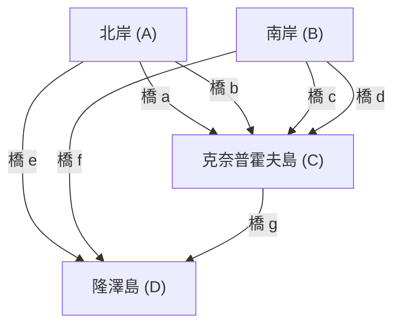

## 簡介

在數學的歷史中，日常中微小的疑問或遊戲，有時會成為開創全新數學領域的契機。其中最著名且優美的例子之一，就是 **「柯尼斯堡七橋」** ([Seven Bridges of Königsberg](https://kenji.blog/zh-tw/p/seven-bridges-of-konigsberg/)) 問題。

18世紀，普魯士王國的柯尼斯堡（現俄羅斯聯邦加里寧格勒）有一條名為普列戈利亞河的大河流過，為了連接河中的沙洲與兩岸，架設了七座橋。當時的市民在傍晚散步時，想到了這樣一個遊戲：「是否能夠將城裡的七座橋，都剛好走過一次，然後回到原來的出發點？」

這個乍看之下不過是個單純謎題的問題，到了天才數學家 **萊昂哈德·歐拉** ([Leonhard Euler](https://kenji.blog/zh-tw/p/euler/)) 的手中，卻在數學世界中掀起了革命。歐拉不僅證明了這個問題是不可能做到的，在這個過程中，他更從全新的視角重新捕捉了空間的性質，奠定了 **圖論** (Graph Theory) 與 **拓撲學** (Topology、位相幾何學) 這兩個在現代數學中極為重要的領域的基礎。

本文將帶您深入探討[柯尼斯堡七橋問題](https://kenji.blog/zh-tw/p/seven-bridges-of-konigsberg/)的歷史背景、歐拉那精彩絕倫的解決方法，以及它如何與現代的科學與科技產生連結，並在過程中交織數學細節的深入剖析。這不僅僅是歷史的介紹，更請您細細品味其背後數學結構之美。

## 柯尼斯堡這座城市與七座橋：歷史背景

18世紀初的柯尼斯堡，是座面向波羅的海、繁榮的商業都市，同時也是學術中心。城市的中心有普列戈利亞河（Pregel）向西流淌，河中有被稱為克奈普霍夫（Kneiphof）與隆澤（Lomse）的兩座大島（沙洲）。

這座城市的地理結構，大致可以劃分為以下四塊陸地：

- 北岸陸地 (A)
- 南岸陸地 (B)
- 克奈普霍夫島 (C)
- 隆澤島，或者說是東側陸地 (D)

為了連接這四塊陸地，總共架設了 **七座橋** 。
北岸 (A) 與島 (C) 之間有2座，南岸 (B) 與島 (C) 之間有2座，北岸 (A) 與島 (D) 之間有1座，南岸 (B) 與島 (D) 之間有1座，而兩座島 (C) 與 (D) 之間則有1座。這些橋不僅是市民生活中不可或缺的基礎設施，同時也是構成美麗市容的重要元素。

當時柯尼斯堡的知識份子與市民們，在假日午後的散步中，試圖找出能將這七座橋分別「剛好走過1次」並繞行城市一圈的路線。然而，無論怎麼反覆嘗試，卻沒有任何一個人能夠成功。總會忘記走某座橋，或者是同一座橋走了兩次。不久後，市民之間開始流傳「該不會根本就不存在這種散步路線吧」的耳語，但當時卻沒有人能夠在數學上證明這一點。

## 從過橋謎題到數學問題：萊布尼茲的夢想與歐拉的直覺

市民們的這個傳聞，不久後傳到了當時正滯留於俄羅斯聖彼得堡科學院的偉大瑞士數學家 **萊昂哈德·歐拉** 的耳中。那是1735年的事。

起初，歐拉對這個問題的感覺似乎是「這應該不是數學，只不過是單純的邏輯遊戲吧」。當時數學的主流，是[歐幾里得](https://kenji.blog/zh-tw/p/euclid/)幾何學（探討長度、角度、面積、體積等）、代數學，或者是剛由牛頓與萊布尼茲創立的微積分學。柯尼斯堡的橋的問題，完全不依賴橋的長度是幾公尺、島嶼的面積有多大、橋與河川呈現什麼角度等傳統的幾何學性質。唯一重要的，只有「哪塊陸地與哪塊陸地，被幾座橋連接起來」這種純粹的 **連結（連接）** 關係而已。

這是當時[歐幾里得](https://kenji.blog/zh-tw/p/euclid/)幾何學的計量框架所無法處理的，一種全新類型的幾何學問題。然而，歐拉逐漸開始意識到這個問題的深奧之處。他認知到，這是個與過去戈特弗里德·威廉·萊布尼茲（Gottfried Wilhelm Leibniz）所夢想的「位置分析（Analysis Situs）」或「位置幾何學（Geometria Situs）」相關的重要問題，並下定決心要正式致力於解開這個問題。

## 歐拉的抽象化：剃除不必要的資訊

歐拉的天才最顯著的表現，就在於他卓越的 **抽象化** (Abstraction) 能力：從複雜的現實世界中剃除所有不必要的資訊，只萃取出問題本質上的結構。

他從現實中精密的柯尼斯堡地圖裡，將陸地的物理形狀與大小、河川的寬度與水流速度、橋的材質與長度等完全忽略。然後，他建立出以下這種極度簡單且抽象的數學模型。

1. 將 **陸地（島嶼或河岸）** ，表示為不具備大小、單純的「點」。在現代術語中，我們稱之為 **頂點** (Vertex) 或 **節點** (Node)。
2. 將 **橋** ，表示為連接頂點與頂點的「線」。我們稱之為 **邊** (Edge) 或 **連結** (Link)。線的彎曲程度或長度都不成問題。

像這樣由有限個頂點，以及連接它們的邊的集合所表示的離散結構，在數學中被稱為 **圖** (Graph)。這正是現在我們稱為「圖論」這個領域誕生的瞬間。

以下的 Mermaid 圖表，展示了柯尼斯堡的地理地圖是如何被轉換為抽象的圖表示法的。

透過這種強大的抽象化，市民們日常的疑問「是否存在將城裡的七座橋走過一次的路線」，被完全轉換為一個純粹邏輯且嚴密的數學問題：「是否存在連續的路徑（一筆畫），能將給定圖中的所有邊剛好走過一次？」。

## 頂點的度數與一筆畫定理：歐拉的證明

在將問題定式化為圖的形式後，歐拉發現了一個極為簡單卻又極其強大的普遍法則。其證明的關鍵，就在於導入了 **度數** (Degree) 這個新概念。

在圖論中，我們將某個頂點 $v$ 的 **度數** 標記為 $d(v)$ 或 $\text{deg}(v)$ ，這代表「直接連接到該頂點的邊的總數」。

歐拉在邏輯上探討了在圖上執行「走過所有邊一次的路徑（一筆畫）」這個行為，會對各個頂點的度數施加什麼樣的限制。

假設存在一條路徑，能將所有的邊剛好走過一次，並畫出整個圖。我們在追溯這條路徑的過程中，想像一個作為「中途點」的頂點（既不是出發點也不是終點的頂點）。路徑要「進入」該頂點，需要使用1條邊，而要從該頂點「離開」，則必須使用另1條邊。
也就是說，每次造訪作為中途點的頂點時，必定會 **成對消耗2條邊** 。

因此，對於在路徑中途只是經過的頂點而言，用來進出該點的邊必定是成對存在的，所以連接到該頂點的邊的總數（度數），必定會是 **偶數** (Even)。

可能成為例外的，只有符合路徑「出發點」與「終點」的頂點。

在這裡，路徑的模式可以分為以下兩種。

1. **歐拉迴路 (Eulerian Circuit)** ：出發點與終點是同一個頂點的情況。
   在這種情況下，路徑會繞行一圈並回到原來的頂點。因此，包含出發點＝終點在內的 **所有頂點** ，實際上都會被當作「中途點」來處理。因為進出完全成對，所以 **圖中所有頂點的度數都必須是偶數** 。

2. **歐拉路徑 (Eulerian Path)** ：出發點與終點是不同頂點的情況。
   在這種情況下，從出發點會多需要1條「最初走出去」的邊，而終點會多需要1條「最後走進來」的邊。因此，只有出發點與終點這兩個頂點的邊無法成對完結，會具有 **奇數** (Odd) 的度數。除此之外所有的中途點，其度數都必須是偶數。

這就是歐拉嚴密證明的，圖論中最基本且著名的定理（歐拉定理）。

若使用數學式來更嚴密地表達這個定理，在連通的無向圖 $G = (V, E)$ 中：

- **存在歐拉迴路 (Eulerian Circuit) 的充要條件** ：
  對於圖 $G$ 中的所有頂點 $v \in V$ ，其度數 $d(v)$ 皆為偶數。
  $\forall v \in V, \ d(v) \equiv 0 \pmod 2$

- **存在歐拉路徑 (Eulerian Path) 的充要條件** ：
  在圖 $G$ 中，度數為奇數的頂點「剛好只有2個」。
  $|\{v \in V \mid d(v) \equiv 1 \pmod 2\}| = 2$

## 應用於柯尼斯堡圖表與結論

那麼，我們就將歐拉透過演繹推理所導出的這個優美且完美的定理，實際套用到柯尼斯堡七橋的圖上吧。

我們來計算抽象化後的4塊陸地（頂點 $A, B, C, D$ ）各自的度數。

- 北岸陸地 $A$：有2座橋通往島 $C$ ，1座橋通往島 $D$ 。因此，度數為 $d(A) = 3$ （奇數）。
- 南岸陸地 $B$：有2座橋通往島 $C$ ，1座橋通往島 $D$ 。因此，度數為 $d(B) = 3$ （奇數）。
- 隆澤島 $D$：有1座橋通往岸 $A$ ，1座橋通往岸 $B$ ，1座橋通往島 $C$ 。因此，度數為 $d(D) = 3$ （奇數）。
- 克奈普霍夫島 $C$：有2座橋通往岸 $A$ ，2座橋通往岸 $B$ ，1座橋通往島 $D$ 。因此，度數為 $d(C) = 5$ （奇數）。

總結結果，存在於柯尼斯堡圖中的4個頂點，其度數分別為「3, 3, 3, 5」。令人驚訝的是， **所有頂點的度數都是奇數** 。

根據歐拉定理，為了使走過所有邊一次的路徑（一筆畫）成為可能，奇數度數的頂點數量絕對必須是「0個」或「2個」。然而，在柯尼斯堡的圖中，奇數度數的頂點卻多達「4個」。

基於這個事實，歐拉做出了以下最終結論。
**「絕對不存在能將柯尼斯堡的七座橋都剛好走過一次的路徑」**

這是數學史上極為重要的一刻。因為歐拉並不是將可能存在、近乎無限多種的散步路線，逐一徹底走過來確認其不可能性。他僅僅使用了「圖的結構」與「奇偶性（偶奇性）」這種純粹邏輯且普遍的性質，就優雅地證明了這是不可能的。這種演繹的方法，可以說是近代數學的精髓。

## 發展至拓撲學：位置幾何學的誕生

透過[柯尼斯堡七橋問題](https://kenji.blog/zh-tw/p/seven-bridges-of-konigsberg/)，歐拉開創了一個全新的幾何學典範：它完全不依賴距離、長度、角度、面積等傳統[歐幾里得](https://kenji.blog/zh-tw/p/euclid/)幾何學的「計量」性質，而僅將圖形與空間的「連接方式（連續性或連接關係）」作為本質上的研究對象。

這就是後來被稱為 **拓撲學** (Topology、位相幾何學) 這個領域的開端。在拓撲學中，研究的是「即使經過連續變形也不會改變的性質（拓撲性質）」。有個眾所皆知的笑話是「拓撲學家分不清咖啡杯和甜甜圈」。因為兩者都是「有一個洞的立體」，只要不進行剪開或黏合，像黏土一樣連續變形就能互相轉換，所以在拓撲學的世界裡，這兩者被視為「相同的形狀」。

柯尼斯堡的圖也是如此。即使把橋像橡皮筋一樣拉長或縮短，或者是把島嶼壓扁，只要「哪個頂點和哪個頂點相連」的連接關係保持不變，作為圖的本質就不會有任何改變。歐拉所著眼的，正是這種「即使變形也不變的連接」的拓撲性質。

歐拉本人在之後的1750年，也發現了關於多面體的頂點 ( $V$ )、邊 ( $E$ )、面 ( $F$ ) 數量的驚人普遍法則，也就是所謂的 **歐拉多面體定理** ( $V - E + F = 2$ )。這同樣是捕捉了不依賴多面體具體形狀或大小的拓撲不變量，並成為了拓撲學發展中極為重要的里程碑。

## 圖論在現代社會的應用與擴展

發源自18世紀數學家純粹知識探索的圖論與拓撲學，絕不僅止於象牙塔內的學問。它們現在已經開花結果，成為從根本上支撐我們高度資訊化社會與科技、極具實踐性且不可或缺的工具。

### 1. 電腦網路與網際網路
我們每天使用的網際網路，其物理與邏輯結構，正是一個世界規模的巨大圖。個別的路由器、伺服器、電腦成為了頂點，而連接它們的光纖與無線通訊線路則表現為邊。為了避開擁塞，將資料封包最快速、最有效率地送達目的地的路由協定（例如戴克斯特拉演算法），全都是作為圖論上的演算法而設計出來的。

### 2. 導航系統與物流的最佳化
智慧型手機地圖應用程式中的路徑規劃，以及車用導航系統，是將十字路口與匯流處視為頂點、道路視為邊來進行計算。這正是圖論中的 **最短路徑問題** (Shortest Path Problem)。此外，在物流網路中，決定以最有效率的順序繞行多個配送地點的路線問題，則以 **旅行推銷員問題** (Traveling Salesman Problem) 廣為人知。

### 3. 社群網路分析 (SNA)
在現代社會科學與資訊學中佔據重要地位的社群網路分析，也是以圖論為基礎。在 X（舊稱 Twitter）或 Facebook 等 SNS 中的人際關係，被模型化為以使用者為頂點、追蹤關係為邊的「社群圖（Social Graph）」。透過分析這個圖，就有可能發現社群的結構，或是建立資訊如何擴散的模型。

### 4. 生命科學：生物學・化學・醫學
圖論在自然科學的各種尺度中也大顯身手。在化學中，為分子結構建立模型時，會使用以原子為頂點、化學鍵為邊的圖。在生物學中，為了將細胞內蛋白質之間複雜的交互作用視為網路來掌握，或者在腦神經科學中理解無數的神經元是如何結合並進行資訊處理（連接體分析），圖論強大的分析手法都是不可缺少的。

## 結語

1736年，萊昂哈德·歐拉發表了一篇名為《位置幾何學相關問題的解法》的論文，為柯尼斯堡市民們那無傷大雅的假日散步謎題提供了完美的解答。然而，這真正意味著的，並非一個問題的終結，而是擁有著無數應用的廣闊數學宇宙的誕生。

不被事物的表面形狀與大小所侷限，敏銳地看穿「什麼和什麼是如何連接的」這種最本質結構的 **抽象化能力** 。柯尼斯堡七橋的故事跨越了時代，告訴我們抽象的數學思考是如何成為解開現實世界奧秘、創造未來科技的強大武器。

如果您下次在街上漫步，看到架設在河上的橋樑，或者是注視著地下鐵的路線圖時，請務必想像一下潛藏在其背後的「連接」結構。在那裡，280多年前由一位天才數學家所發現、那看不見的優美數學之絲，如今也正像包覆著現代的我們一般，在各處交織蔓延著。
