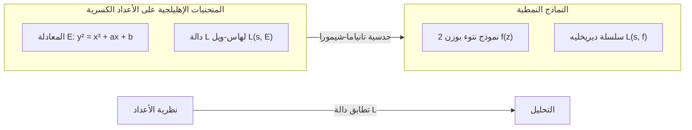

## 1. مقدمة: عملاق نظرية الأعداد، [غورو شيمورا](https://kenji.blog/ar/p/shimura-goro/)

في تاريخ الرياضيات الحديثة، هناك عالم رياضيات ياباني كان له تأثير حاسم على مجال الهندسة الحسابية. اسمه **[غورو شيمورا](https://kenji.blog/ar/p/shimura-goro/)** (1930 - 2019). إنجازاته لا حصر لها، فقد اقترح "حدسية تانياما-شيمورا" (المعروفة الآن باسم مبرهنة النمطية)، والتي أصبحت فيما بعد المفتاح الأكبر لإثبات "[مبرهنة فيرما الأخيرة](https://kenji.blog/ar/p/fermats-last-theorem/)"، وقام ببناء "تنوعات شيمورا"، وهي كائن في غاية الأهمية في نظرية الأعداد الحديثة.

في هذا المقال، وبينما نلقي نظرة على حياة [غورو شيمورا](https://kenji.blog/ar/p/shimura-goro/)، عالم الرياضيات المنعزل، سنتعمق في الإنجازات الأثرية التي أسسها في عالم الرياضيات، والفلسفة والجماليات الشرسة وراءها. ليس من المبالغة القول إن فهم إنجازاته مرادف لفهم كيف تطورت الرياضيات في أواخر القرن العشرين.

## 2. الأيام الأولى واليقظة نحو الرياضيات

### 2.1 ظل الحرب والتعطش للمعرفة

ولد [غورو شيمورا](https://kenji.blog/ar/p/shimura-goro/) في 23 فبراير 1930 في مدينة هاماماتسو بمحافظة شيزوكا. كانت طفولته تحديدًا في تلك الحقبة القاسية عندما تجمعت الغيوم الداكنة للحرب العالمية الثانية. حتى وسط نقص المواد في زمن الحرب ورعب الغارات الجوية، لم يفقد فضوله الفكري أبدًا. في فترة ما بعد الحرب الفوضوية، عندما كان العديد من الشباب يكافحون من أجل البقاء، نمّى شيمورا اهتمامًا عميقًا بالرياضيات والفيزياء والأدب.

وفقًا لكتابه "خريطة حياتي"، فقد قرأ كتب الرياضيات المتقدمة بمفرده وكان يصل أحيانًا إلى نصوص الرياضيات الفرنسية الصعبة. هذا الموقف المتمثل في "استكشاف الحقيقة بقوة المرء الذاتية دون أن يعلمه أحد" شكل أساس أسلوب شيمورا الرياضي طوال حياته.

### 2.2 الأيام في جامعة طوكيو

في عام 1949، التحق شيمورا بقسم الرياضيات في كلية العلوم بجامعة طوكيو. في ذلك الوقت، كان مجتمع الرياضيات الياباني، على الرغم من أنه كان يعتمد على نظرية مجال الفصل لتيجي تاكاجي وغيره، يواجه تحدي كيفية اللحاق بالاتجاهات العالمية خلال فترة إعادة الإعمار بعد الحرب. هناك، التقى شيمورا بـ **[يوتاكا تانياما](https://kenji.blog/ar/p/taniyama-yutaka/)**، الذي شكل معه لاحقًا صداقة عميقة وشاركه مصيرًا مشتركًا.

كان تانياما عالم رياضيات عبقريًا يتمتع بأفكار بديهية وغير مقيدة، بينما كان شيمورا يسعى للكمال ويقدر الصرامة ولم يسمح أبدًا بأي تنازلات في تفاصيل المنطق. أدى لقاء هذين الشخصين المتناقضين في النهاية إلى ولادة بذرة نظرية ضخمة من شأنها أن تهز عالم الرياضيات.

## 3. اللقاء مع [يوتاكا تانياما](https://kenji.blog/ar/p/taniyama-yutaka/) و"حدسية تانياما-شيمورا"

### 3.1 لقاء مصيري

يُقال إن سبب تقارب شيمورا وتانياما كان تبادلًا بسيطًا حول مسألة رياضية واحدة. اعترف كل منهما بمواهب الآخر وانغمسا في النقاشات الرياضية ليلاً ونهارًا. ما كانا مهتمين به بشكل خاص هو تحديث "نظرية الضرب المعقد" عند تقاطع الهندسة الجبرية ونظرية الأعداد.

### 3.2 ندوة نيكو عام 1955

في عام 1955، عُقدت ندوة دولية حول نظرية الأعداد الجبرية في نيكو بمحافظة توتشيغي. حضر هذا المؤتمر علماء رياضيات من الطراز العالمي مثل أندريه ويل وجان بيير سير.

من أجل هذه الندوة، جلب علماء الرياضيات اليابانيون الشباب مسائلهم غير المحلولة وجمعوها في مجموعة مسائل. ومن بين هذه المسائل كانت هناك العديد من المسائل التي قدمها [يوتاكا تانياما](https://kenji.blog/ar/p/taniyama-yutaka/). كان هذا هو النموذج الأولي لما سيُطلق عليه لاحقًا "حدسية تانياما-شيمورا".

### 3.3 الجسر بين المنحنيات الإهليلجية والنماذج النمطية

ببساطة شديدة، حدسية تانياما-شيمورا هي الادعاء بأن "كل منحنى إهليلجي على حقل الأعداد الكسرية هو نمطي". لقد كانت حدسية مذهلة تربط بين عالمين رياضيين مختلفين تمامًا.

$$
E: y^2 = x^3 + ax + b \quad (a, b \in \mathbb{Q})
$$

تتميز خصائص المنحنى الإهليلجي $E$ الممثل بمثل هذه المعادلة بمتتالية $\{a_p\}$ مرتبطة بعدد حلول المعادلة بتردد كل عدد أولي $p$. من هذا، يتم تعريف دالة L لهاس-ويل $L(s, E)$.

$$
L(s, E) = \prod_{p \mid \Delta} (1 - a_p p^{-s})^{-1} \prod_{p \nmid \Delta} (1 - a_p p^{-s} + p^{1-2s})^{-1}
$$

من ناحية أخرى، النموذج النمطي $f$ (هنا، نموذج نتوء بوزن 2) هو دالة شديدة التناظر محددة على النصف العلوي المركب للمستوى، ويتم تعريف دالة L الخاصة بها $L(s, f)$ من معاملات توسيع فورييه $\{c_n\}$.

$$
f(z) = \sum_{n=1}^{\infty} c_n e^{2\pi i n z}
$$

كان ادعاء تانياما وشيمورا هو أنه **"لأي منحنى إهليلجي $E$، يوجد نموذج نمطي $f$ بحيث يكون $a_p = c_p$ صحيحًا لجميع الأعداد الأولية $p$"**، أي $L(s, E) = L(s, f)$. هذا يعني أن عالم نظرية الأعداد (المنحنيات الإهليلجية) وعالم التحليل (النماذج النمطية) متطابقان تمامًا.

في البداية، كانت هذه الحدسية غريبة لدرجة أن كبار علماء الرياضيات مثل ويل شككوا فيها. ومع ذلك، قدم شيمورا دعمًا رياضيًا صارمًا لهذه الحدسية البديهية وصقلها إلى نظرية.

## 4. مأساة تانياما وعزيمة شيمورا

في عام 1958، وبينما كان بناء النظرية يبدأ بجدية، وقعت مأساة. أنهى [يوتاكا تانياما](https://kenji.blog/ar/p/taniyama-yutaka/) حياته وهو في ريعان شبابه عن عمر يناهز 23 عامًا. تحدثت رسالة انتحاره عن "الامتنان لأولئك الذين ربوني حتى الآن" و "الإرهاق الذي لا أستطيع حتى أنا تحديد سبب واضح له". علاوة على ذلك، بعد بضعة أسابيع، تلا ذلك حدث مأساوي آخر حيث أنهت المرأة المخطوبة لتانياما حياتها أيضًا لتنضم إليه.

بالنسبة لشيمورا، كان حزن فقدان تانياما، أفضل من يفهمه والمتعاون معه، لا يقاس. ومع ذلك، تغلب شيمورا على الحزن وحمل إحساسًا قويًا بالرسالة لإثبات الأفكار غير المكتملة التي تركها تانياما وراءه بيديه وجعل العالم يعترف بها. انتقل شيمورا لاحقًا إلى الولايات المتحدة، واستمر في بحثه في جامعة برينستون وأماكن أخرى، بينما صاغ هذه الحدسية في شكل أكثر دقة ورفع مكانتها الدولية. وبسبب هذا، أصبحت الحدسية تُعرف باسم "حدسية تانياما-شيمورا".

## 5. الطريق إلى [مبرهنة فيرما الأخيرة](https://kenji.blog/ar/p/fermats-last-theorem/)

### 5.1 فكرة فراي وإثبات ريبت

مر الوقت، وفي ثمانينيات القرن العشرين، ارتبطت حدسية تانياما-شيمورا بشكل دراماتيكي بـ "[مبرهنة فيرما الأخيرة](https://kenji.blog/ar/p/fermats-last-theorem/)". في عام 1984، أظهر جيرهارد فراي أنه إذا افترض المرء وجود مثال مضاد $a^n + b^n = c^n$ ل[مبرهنة فيرما الأخيرة](https://kenji.blog/ar/p/fermats-last-theorem/)، فيمكن بناء منحنى إهليلجي غريب (منحنى فراي) منه.

$$
y^2 = x(x - a^n)(x + b^n)
$$

خمن فراي أنه نظرًا لأن هذا المنحنى له خصائص غير طبيعية بشكل استثنائي، **لا يمكن أن يكون نمطيًا** (مما يعني أنه لا يفي بحدسية تانياما-شيمورا). إذا كان هذا صحيحًا، فهذا يعني أنه "إذا تم إثبات حدسية تانياما-شيمورا، فسيتم أيضًا إثبات [مبرهنة فيرما الأخيرة](https://kenji.blog/ar/p/fermats-last-theorem/)".

في عام 1986، أثبت كين ريبت تمامًا حدسية فراي (حدسية إبسيلون). وبذلك، تم اختزال [مبرهنة فيرما الأخيرة](https://kenji.blog/ar/p/fermats-last-theorem/)، التي ظلت دون حل لمدة 350 عامًا، تمامًا إلى مشكلة إثبات حدسية تانياما-شيمورا.

### 5.2 الإثبات بواسطة [أندرو وايلز](https://kenji.blog/ar/p/wiles/)

الشخص الذي برز عند سماع هذا الخبر كان عالم الرياضيات البريطاني **[أندرو وايلز](https://kenji.blog/ar/p/wiles/)**. بعد سبع سنوات من البحث السري، أعلن عن إثبات لحدسية تانياما-شيمورا للمنحنيات الإهليلجية شبه المستقرة في عام 1993. على طول الطريق، كانت هناك أزمة حيث تم العثور على خلل حاسم في الإثبات، ولكن بمساعدة طالبه السابق ريتشارد تايلور، تم إصلاحه بالكامل في عام 1994.

كان إثبات وايلز (لجزء من) حدسية تانياما-شيمورا يعني إثباتًا كاملاً ل[مبرهنة فيرما الأخيرة](https://kenji.blog/ar/p/fermats-last-theorem/). لقد كانت واحدة من أعظم الأعمال الدرامية في تاريخ الرياضيات.

### 5.3 رد فعل شيمورا: "لقد قلت لكم ذلك"

عندما تم الإعلان عن إثبات وايلز وغرق العالم في دوامة من الحماس، أجاب [غورو شيمورا](https://kenji.blog/ar/p/shimura-goro/)، عندما سأله أحد المراسلين عن رأيه، بهدوء ولكن بحزم:

> **"I told you so."** (لقد أخبرتكم بذلك)

تضمنت هذه الكلمات ثقة مطلقة في أن حدسه (وحدس تانياما) كان على حق، وعاطفة عميقة لأنه تم إثبات ذلك بعد سنوات طويلة. لم يتفاجأ على الإطلاق. بالنسبة له، كان من **البديهي** أن يتم إثبات الحقيقة في النهاية. في عام 1999، تم إثبات حدسية تانياما-شيمورا تمامًا لجميع المنحنيات الإهليلجية بواسطة كريستوف برويل وبريان كونراد وفريد دايموند وريتشارد تايلور، لتصبح مبرهنة ثابتة تُعرف باسم "مبرهنة النمطية".

## 6. تنوعات شيمورا: أفق جديد في الهندسة الحسابية

على الرغم من أن حدسية تانياما-شيمورا تطغى عليها غالبًا، إلا أن ما يعزز اسم [غورو شيمورا](https://kenji.blog/ar/p/shimura-goro/) في عالم الرياضيات المحترف هو نظرية **"تنوعات شيمورا"**.

### 6.1 نظرية الضرب المعقد عالية الأبعاد

أظهر عالم الرياضيات في القرن التاسع عشر كرونيكر أنه يمكن بناء جميع الامتدادات الأبيلية لحقل تربيعي تخيلي باستخدام نقاط التقسيم للمنحنيات الإهليلجية ذات الضرب المعقد (حلم شباب كرونيكر). أخذ شيمورا على عاتقه مشروعًا كبيرًا لتعميم ذلك على التنوعات الأبيلية عالية الأبعاد.

قام ببناء كائنات هندسية ضخمة تعتبر نظائر عالية الأبعاد للمنحنيات النمطية، باستخدام المجموعات الجبرية الاختزالية والمجالات المتماثلة الهرميتية. هذه هي "تنوعات شيمورا". تمتلك تنوعات شيمورا هياكل غنية للغاية حيث تتقاطع نظرية الأعداد والهندسة الجبرية ونظرية التمثيل.

### 6.2 مكانة تنوعات شيمورا في الرياضيات الحديثة

تلعب تنوعات شيمورا اليوم دورًا مركزيًا في "برنامج لانجلاندز" الذي اقترحه روبرت لانجلاندز. في هذا البرنامج الكبير الذي يربط تمثيلات مجموعات جالوا بالتمثيلات الأوتومورفية، تعد تنوعات شيمورا المسرح الذي لا غنى عنه لتحقيق هذا التوافق هندسيًا. تم إثبات بُعد نظر شيمورا أيضًا من خلال حقيقة أن النظرية التي بناها أصبحت الأساس لتطور الرياضيات بعد عقود.

## 7. الوجه الحقيقي لعالم رياضيات منعزل: فلسفته وجمالياته

### 7.1 موقف صارم لا هوادة فيه

حافظ [غورو شيمورا](https://kenji.blog/ar/p/shimura-goro/) على موقف صارم للغاية ولا هوادة فيه تجاه الرياضيات. في أبحاثه وكتبه، أزال تمامًا التعبيرات الغامضة والإثباتات غير المكتملة. كما كان ينتقد بشدة أحيانًا أخطاء أو أوجه قصور علماء الرياضيات الآخرين، وكان الكثيرون يخشونه بسبب صرامته.

ومع ذلك، كانت هذه الصرامة موجهة أيضًا نحو نفسه. كان لديه إيمان قوي بأن "الرياضيات يجب أن تكون جميلة"، وكان يكره الإثباتات القبيحة والنظريات المصطنعة. كان الموقف المتمثل في السعي وراء الجمال الطبيعي والحقيقة المطلقة في جذور رياضيات شيمورا.

### 7.2 إيماري بورسلين والإنجازات الأدبية

بعيدًا عن عالم الرياضيات القاسي، كان شيمورا جامعًا شغوفًا وباحثًا في التحف، وخاصة **بورسلين إيماري**. كان يمتلك معرفة عميقة لدرجة أنه كتب كتابًا متخصصًا عن بورسلين إيماري باللغة الإنجليزية، وأحب الحس الجمالي الياباني التقليدي الموجود فيه.

كما كان ضليعًا في الأدب الياباني والكلاسيكيات الصينية، وتتخلل كتاباته ثقافة عميقة ومفردات غنية. ربما كان تفكيره المنطقي والراقي مدعومًا بمثل هذا الفهم العميق للأدب والفن.

### 7.3 ما تقوله لنا "خريطة حياتي"

في مقال سيرته الذاتية "خريطة حياتي" الذي نُشر في سنواته الأخيرة، يروي بصراحة فكره الحاد وروح الدعابة التي يتمتع بها أحيانًا، وعاطفته العميقة تجاه الأشخاص الذين أحبهم (وخاصة [يوتاكا تانياما](https://kenji.blog/ar/p/taniyama-yutaka/)). تتيح قراءة هذا الكتاب للمرء معرفة الحياة الداخلية المعقدة والغنية للإنسان [غورو شيمورا](https://kenji.blog/ar/p/shimura-goro/)، والتي تتجاوز مجرد صورة "عالم الرياضيات الصارم".

## 8. الخاتمة: النور الذي تركه [غورو شيمورا](https://kenji.blog/ar/p/shimura-goro/)

في 3 مايو 2019، أنهى [غورو شيمورا](https://kenji.blog/ar/p/shimura-goro/) حياته البالغة 89 عامًا في نيوجيرسي، الولايات المتحدة الأمريكية. حتى بعد أن رحل عن هذا العالم، فقد تم حفر اسمه إلى الأبد في تاريخ الرياضيات كـ "حدسية تانياما-شيمورا" و "تنوعات شيمورا".

بدءًا من أنقاض ما بعد الحرب المحترقة، صعد [غورو شيمورا](https://kenji.blog/ar/p/shimura-goro/) إلى قمة الرياضيات العالمية مسلحًا فقط بفكره الخاص وإرادته المرنة. تُظهر حياته مدى سمو الروح البشرية التي تسعى وراء الحقيقة، وكيف يمكن أن تنتج أشياء عظيمة.

لا يزال علماء الرياضيات المعاصرون الذين يعالجون المشاكل غير المحلولة في نظرية الأعداد يمشون على الأرض الواسعة التي رادها [غورو شيمورا](https://kenji.blog/ar/p/shimura-goro/). من المؤكد أن النور الرياضي الذي أضاءه سيستمر في السطوع طويلاً وبقوة.
