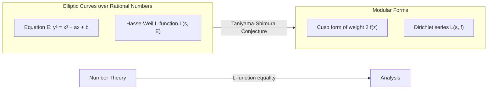

## 1. Introduction: A Giant of Number Theory, [Goro Shimura](https://kenji.blog/en/p/shimura-goro/)

In the history of modern mathematics, there is a Japanese mathematician who had a decisive impact on the field of arithmetic geometry. His name is **[Goro Shimura](https://kenji.blog/en/p/shimura-goro/)** (1930 - 2019). His achievements are immeasurable, having proposed the "Taniyama-Shimura Conjecture" (now known as the Modularity Theorem), which later became the biggest key to the proof of "[Fermat's Last Theorem](https://kenji.blog/en/p/fermats-last-theorem/)", and constructing "Shimura varieties", an extremely important object in modern number theory.

In this article, while looking back on the life of [Goro Shimura](https://kenji.blog/en/p/shimura-goro/), a solitary mathematician, we will delve deeply into the monumental achievements he established in the mathematical world, and the fierce philosophy and aesthetics behind them. It is no exaggeration to say that understanding his achievements is synonymous with understanding how mathematics developed in the late 20th century.

## 2. Early Days and Awakening to Mathematics

### 2.1 The Shadow of War and Thirst for Knowledge

[Goro Shimura](https://kenji.blog/en/p/shimura-goro/) was born on February 23, 1930, in Hamamatsu City, Shizuoka Prefecture. His childhood was exactly the harsh era when the dark clouds of World War II were gathering. Even amidst wartime material shortages and the terror of air raids, his intellectual curiosity was never lost. In the chaotic post-war period, when many young people were struggling just to survive, Shimura nurtured a deep interest in mathematics, physics, and literature.

According to his book "The Map of My Life", he read advanced mathematics books on his own and sometimes reached out for difficult French mathematical texts. This attitude of "exploring the truth by one's own power without being taught by anyone" would form the foundation of Shimura's mathematical style throughout his life.

### 2.2 Days at the University of Tokyo

In 1949, Shimura entered the Department of Mathematics, Faculty of Science, at the University of Tokyo. At the time, the Japanese mathematical community, while based on Teiji [Takagi](https://kenji.blog/en/p/takagi-teiji/)'s class field theory and the like, was facing the challenge of how to catch up with global trends during the post-war reconstruction period. Here, Shimura met **[Yutaka Taniyama](https://kenji.blog/en/p/taniyama-yutaka/)**, with whom he would later form a deep friendship and share a common destiny.

Taniyama was a genius mathematician with intuitive and uninhibited ideas, while Shimura was a perfectionist who valued strictness and never allowed any compromise on the details of logic. The meeting of these two contrasting figures would eventually give birth to the seed of a massive theory that would shake the mathematical world.

## 3. Encounter with [Yutaka Taniyama](https://kenji.blog/en/p/taniyama-yutaka/) and the "Taniyama-Shimura Conjecture"

### 3.1 A Fateful Encounter

It is said that the trigger for Shimura and Taniyama becoming close was a trivial exchange over a single mathematical problem. They recognized each other's talents and immersed themselves in mathematical discussions day and night. What they were particularly interested in was the modernization of the "theory of complex multiplication" at the intersection of algebraic geometry and number theory.

### 3.2 The 1955 Nikko Symposium

In 1955, an international symposium on algebraic number theory was held in Nikko, Tochigi Prefecture. This conference was attended by world-class mathematicians such as [André Weil](https://kenji.blog/en/p/weil/) and Jean-Pierre Serre.

For this symposium, young Japanese mathematicians brought their unsolved problems and compiled a problem collection. Included among these were several problems submitted by [Yutaka Taniyama](https://kenji.blog/en/p/taniyama-yutaka/). This is the prototype of what would later come to be called the "Taniyama-Shimura Conjecture".

### 3.3 The Bridge Between Elliptic Curves and Modular Forms

Put extremely simply, the Taniyama-Shimura Conjecture is the assertion that "every elliptic curve over the field of rational numbers is modular". This was an earth-shattering conjecture connecting two completely different mathematical universes.

$$
E: y^2 = x^3 + ax + b \quad (a, b \in \mathbb{Q})
$$

The properties of an elliptic curve $E$ represented by such an equation are characterized by a sequence $\{a_p\}$ related to the number of solutions to the equation modulo each prime $p$. From this, the Hasse-Weil $L$-function $L(s, E)$ is defined.

$$
L(s, E) = \prod_{p \mid \Delta} (1 - a_p p^{-s})^{-1} \prod_{p \nmid \Delta} (1 - a_p p^{-s} + p^{1-2s})^{-1}
$$

On the other hand, a modular form $f$ (here, a cusp form of weight 2) is a highly symmetric function defined on the complex upper half-plane, and its own $L$-function $L(s, f)$ is defined from its Fourier expansion coefficients $\{c_n\}$.

$$
f(z) = \sum_{n=1}^{\infty} c_n e^{2\pi i n z}
$$

The assertion of Taniyama and Shimura was that **"for any elliptic curve $E$, there exists a modular form $f$ such that $a_p = c_p$ holds for all primes $p$"**, that is, $L(s, E) = L(s, f)$. This means that the world of number theory (elliptic curves) and the world of analysis (modular forms) are perfectly in correspondence.

Initially, this conjecture was so outlandish that even great mathematicians like Weil were skeptical. However, Shimura provided rigorous mathematical backing for this intuitive conjecture and polished it into a theory.

## 4. Taniyama's Tragedy and Shimura's Determination

In 1958, just as the construction of the theory was beginning in earnest, a tragedy occurred. [Yutaka Taniyama](https://kenji.blog/en/p/taniyama-yutaka/) took his own life at the young age of 23. His suicide note spoke of "gratitude to those who have raised me thus far" and "fatigue for which even I cannot clearly define a reason". Furthermore, a few weeks later, a tragic event followed where the woman engaged to Taniyama also took her own life to join him.

For Shimura, the grief of losing Taniyama, his best understander and collaborator, was immeasurable. However, Shimura overcame the sorrow and harbored a strong sense of mission to prove the incomplete ideas Taniyama left behind with his own hands and have the world recognize them. Shimura later moved to the United States, continuing his research at Princeton University and elsewhere, while formulating this conjecture into a more precise form and raising its international profile. Because of this, the conjecture came to be called the "Taniyama-Shimura Conjecture".

## 5. The Path to [Fermat's Last Theorem](https://kenji.blog/en/p/fermats-last-theorem/)

### 5.1 Frey's Idea and Ribet's Proof

Time passed, and in the 1980s, the Taniyama-Shimura Conjecture became dramatically linked to "[Fermat's Last Theorem](https://kenji.blog/en/p/fermats-last-theorem/)". In 1984, Gerhard Frey showed that if one assumes a counterexample $a^n + b^n = c^n$ to [Fermat's Last Theorem](https://kenji.blog/en/p/fermats-last-theorem/) exists, a strange elliptic curve (Frey curve) could be constructed from it.

$$
y^2 = x(x - a^n)(x + b^n)
$$

Frey conjectured that because this curve has such extraordinarily abnormal properties, it **cannot be modular** (meaning it does not satisfy the Taniyama-Shimura Conjecture). If this were true, it would mean that "if the Taniyama-Shimura Conjecture is proven, [Fermat's Last Theorem](https://kenji.blog/en/p/fermats-last-theorem/) is also proven".

In 1986, Ken Ribet completely proved Frey's conjecture (the epsilon conjecture). With this, [Fermat's Last Theorem](https://kenji.blog/en/p/fermats-last-theorem/), which had been unsolved for 350 years, was completely reduced to the problem of proving the Taniyama-Shimura Conjecture.

### 5.2 Proof by [Andrew Wiles](https://kenji.blog/en/p/wiles/)

The one who stood up upon hearing this news was the British mathematician **[Andrew Wiles](https://kenji.blog/en/p/wiles/)**. After seven years of secret research, he announced a proof of the Taniyama-Shimura Conjecture for semistable elliptic curves in 1993. Along the way, there was a crisis where a critical flaw was found in the proof, but with the help of his former student Richard Taylor, it was completely fixed in 1994.

Wiles' proof of (a part of) the Taniyama-Shimura Conjecture meant a complete proof of [Fermat's Last Theorem](https://kenji.blog/en/p/fermats-last-theorem/). It was one of the greatest dramas in the history of mathematics.

### 5.3 Shimura's Reaction: "I told you so"

When Wiles' proof was announced and the world was engulfed in a whirlpool of enthusiasm, [Goro Shimura](https://kenji.blog/en/p/shimura-goro/), asked for his thoughts by a reporter, answered quietly but firmly:

> **"I told you so."**

These words contained an absolute confidence that his (and Taniyama's) intuition was right, and a deep emotion that it had been proven after many long years. He was not surprised at all; to him, it was **self-evident** that the truth would eventually be proven. In 1999, the Taniyama-Shimura Conjecture was completely proven for all elliptic curves by Christophe Breuil, Brian Conrad, Fred Diamond, and Richard Taylor, becoming a firm theorem known as the "Modularity Theorem".

## 6. Shimura Varieties: A New Horizon in Arithmetic Geometry

While often overshadowed by the Taniyama-Shimura Conjecture, what further solidifies the name of [Goro Shimura](https://kenji.blog/en/p/shimura-goro/) in the professional mathematical world is the theory of **"Shimura Varieties"**.

### 6.1 Higher-Dimensional Complex Multiplication Theory

The 19th-century mathematician [Kronecker](https://kenji.blog/en/p/kronecker/) showed that all abelian extensions of an imaginary quadratic field can be constructed using the division points of elliptic curves with complex multiplication ([Kronecker](https://kenji.blog/en/p/kronecker/)'s Jugendtraum). Shimura undertook a grand project to generalize this to higher-dimensional abelian varieties.

He constructed massive geometric objects that are higher-dimensional analogues of modular curves, using reductive algebraic groups and Hermitian symmetric domains. These are the "Shimura varieties". Shimura varieties possess extremely rich structures where number theory, algebraic geometry, and representation theory intersect.

### 6.2 The Position of Shimura Varieties in Modern Mathematics

Today, Shimura varieties play a central role in the "Langlands Program" proposed by Robert Langlands. In this grand program that connects representations of [Galois](https://kenji.blog/en/p/galois/) groups with automorphic representations, Shimura varieties are the indispensable stage for geometrically realizing that correspondence. Shimura's foresight is also proven by the fact that the theory he built became the foundation for the development of mathematics decades later.

## 7. The True Face of a Solitary Mathematician: His Philosophy and Aesthetics

### 7.1 An Uncompromisingly Strict Attitude

[Goro Shimura](https://kenji.blog/en/p/shimura-goro/) maintained an extremely strict and uncompromising attitude towards mathematics. In his papers and books, he thoroughly eliminated ambiguous expressions and incomplete proofs. He also sometimes relentlessly criticized mistakes or inadequacies of other mathematicians, and many feared him because of his strictness.

However, that strictness was also directed at himself. He held a strong belief that "mathematics must be beautiful", and detested ugly proofs and artificial theories. An attitude of pursuing natural beauty and absolute truth was at the root of his mathematics.

### 7.2 Imari Porcelain and Literary Accomplishments

When away from the harsh world of mathematics, Shimura was an avid collector and researcher of antiques, especially **Imari porcelain**. He possessed such deep knowledge that he wrote a specialized book on Imari porcelain in English, and loved the traditional Japanese aesthetic sense residing within it.

He was also well-versed in Japanese literature and Chinese classics, and his writings are studded with deep cultivation and a rich vocabulary. His logical and refined thinking may have been backed by such a profound understanding of literature and art.

### 7.3 What "The Map of My Life" Tells Us

In his autobiographical essay "The Map of My Life" published in his later years, his sharp intellect, occasional humor, and deep affection for the people he loved (especially [Yutaka Taniyama](https://kenji.blog/en/p/taniyama-yutaka/)) are candidly recounted. Reading this book allows one to know the complex and rich inner life of the human [Goro Shimura](https://kenji.blog/en/p/shimura-goro/), which goes beyond the mere image of a "strict mathematician".

## 8. Conclusion: The Light Left by [Goro Shimura](https://kenji.blog/en/p/shimura-goro/)

On May 3, 2019, [Goro Shimura](https://kenji.blog/en/p/shimura-goro/) closed his 89 years of life in New Jersey, USA. Even after he passed away from this world, his name is eternally etched in the history of mathematics as the "Taniyama-Shimura Conjecture" and "Shimura varieties".

Starting from the burnt-out ruins of the post-war era, [Goro Shimura](https://kenji.blog/en/p/shimura-goro/) climbed to the summit of global mathematics armed only with his own intellect and resilient will. His life shows how sublime the human spirit seeking truth is, and how it can produce great things.

Modern mathematicians tackling unsolved problems in number theory are still walking on the vast land pioneered by [Goro Shimura](https://kenji.blog/en/p/shimura-goro/). The mathematical light he lit will surely continue to shine long and brightly.
