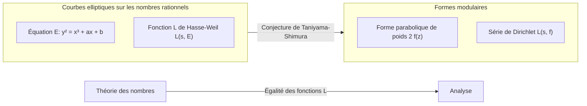

## 1. Introduction : Un géant de la théorie des nombres, [Gorō Shimura](https://kenji.blog/fr/p/shimura-goro/)

Dans l'histoire des mathématiques modernes, il est un mathématicien japonais qui a eu un impact décisif sur le domaine de la géométrie arithmétique. Son nom est **[Gorō Shimura](https://kenji.blog/fr/p/shimura-goro/)** (1930 - 2019). Ses réalisations sont incommensurables : il a proposé la « conjecture de Taniyama-Shimura » (aujourd'hui appelée théorème de modularité), qui est devenue par la suite la clé majeure de la preuve du « dernier théorème de Fermat », et a construit les « variétés de Shimura », un objet d'une importance capitale dans la théorie des nombres moderne.

Dans cet article, tout en revenant sur la vie de [Gorō Shimura](https://kenji.blog/fr/p/shimura-goro/), un mathématicien solitaire, nous plongerons profondément dans les réalisations monumentales qu'il a établies dans le monde mathématique, ainsi que dans la philosophie féroce et l'esthétique qui les sous-tendent. Il n'est pas exagéré de dire que comprendre ses réalisations est synonyme de comprendre comment les mathématiques se sont développées à la fin du XXe siècle.

## 2. Jeunesse et éveil aux mathématiques

### 2.1 L'ombre de la guerre et la soif de connaissances

[Gorō Shimura](https://kenji.blog/fr/p/shimura-goro/) est né le 23 février 1930 dans la ville de Hamamatsu, préfecture de Shizuoka. Son enfance a correspondu exactement à cette époque difficile où s'amoncelaient les sombres nuages de la Seconde Guerre mondiale. Même au milieu des pénuries matérielles du temps de guerre et de la terreur des raids aériens, sa curiosité intellectuelle ne s'est jamais perdue. Dans la période chaotique de l'après-guerre, alors que de nombreux jeunes luttaient simplement pour survivre, Shimura a nourri un profond intérêt pour les mathématiques, la physique et la littérature.

Selon son livre « The Map of My Life », il lisait seul des livres de mathématiques avancées et s'attaquait parfois à des textes mathématiques français difficiles. Cette attitude consistant à « explorer la vérité par ses propres moyens sans l'aide de quiconque » constituera le fondement du style mathématique de Shimura tout au long de sa vie.

### 2.2 Ses jours à l'Université de Tokyo

En 1949, Shimura est entré au département de mathématiques de la faculté des sciences de l'Université de Tokyo. À l'époque, la communauté mathématique japonaise, bien que fondée sur la théorie du corps de classes de Teiji Takagi et consorts, était confrontée au défi de savoir comment rattraper les tendances mondiales pendant la période de reconstruction d'après-guerre. C'est là que Shimura a rencontré **[Yutaka Taniyama](https://kenji.blog/fr/p/taniyama-yutaka/)**, avec qui il nouera plus tard une profonde amitié et partagera un destin commun.

Taniyama était un mathématicien de génie aux idées intuitives et décomplexées, tandis que Shimura était un perfectionniste qui accordait une grande valeur à la rigueur et ne permettait jamais de compromis sur les détails de la logique. La rencontre de ces deux figures contrastées allait finalement donner naissance à la graine d'une théorie massive qui allait ébranler le monde mathématique.

## 3. Rencontre avec [Yutaka Taniyama](https://kenji.blog/fr/p/taniyama-yutaka/) et la « conjecture de Taniyama-Shimura »

### 3.1 Une rencontre fatidique

On dit que l'élément déclencheur du rapprochement entre Shimura et Taniyama fut un échange trivial sur un seul problème mathématique. Ils ont reconnu leurs talents respectifs et se sont plongés dans des discussions mathématiques jour et nuit. Ce qui les intéressait particulièrement était la modernisation de la « théorie de la multiplication complexe » à l'intersection de la géométrie algébrique et de la théorie des nombres.

### 3.2 Le symposium de Nikko de 1955

En 1955, un symposium international sur la théorie algébrique des nombres s'est tenu à Nikko, dans la préfecture de Tochigi. À cette conférence ont participé des mathématiciens de renommée mondiale tels qu'[André Weil](https://kenji.blog/fr/p/weil/) et Jean-Pierre Serre.

Pour ce symposium, de jeunes mathématiciens japonais ont apporté leurs problèmes non résolus et ont compilé un recueil de problèmes. Parmi ceux-ci figuraient plusieurs problèmes soumis par [Yutaka Taniyama](https://kenji.blog/fr/p/taniyama-yutaka/). C'est le prototype de ce qui sera appelé plus tard la « conjecture de Taniyama-Shimura ».

### 3.3 Le pont entre les courbes elliptiques et les formes modulaires

Pour le dire très simplement, la conjecture de Taniyama-Shimura est l'affirmation selon laquelle « toute courbe elliptique sur le corps des nombres rationnels est modulaire ». Il s'agissait d'une conjecture bouleversante reliant deux univers mathématiques complètement différents.

$$
E: y^2 = x^3 + ax + b \quad (a, b \in \mathbb{Q})
$$

Les propriétés d'une courbe elliptique $E$ représentée par une telle équation sont caractérisées par une suite $\{a_p\}$ liée au nombre de solutions de l'équation modulo chaque nombre premier $p$. À partir de là, la fonction $L$ de Hasse-Weil $L(s, E)$ est définie.

$$
L(s, E) = \prod_{p \mid \Delta} (1 - a_p p^{-s})^{-1} \prod_{p \nmid \Delta} (1 - a_p p^{-s} + p^{1-2s})^{-1}
$$

D'autre part, une forme modulaire $f$ (ici, une forme parabolique de poids 2) est une fonction hautement symétrique définie sur le demi-plan de Poincaré, et sa propre fonction $L$, $L(s, f)$, est définie à partir de ses coefficients de développement de Fourier $\{c_n\}$.

$$
f(z) = \sum_{n=1}^{\infty} c_n e^{2\pi i n z}
$$

L'affirmation de Taniyama et Shimura était que **« pour toute courbe elliptique $E$, il existe une forme modulaire $f$ telle que $a_p = c_p$ est vrai pour tous les nombres premiers $p$ »**, c'est-à-dire $L(s, E) = L(s, f)$. Cela signifie que le monde de la théorie des nombres (courbes elliptiques) et le monde de l'analyse (formes modulaires) sont parfaitement en correspondance.

Initialement, cette conjecture était si farfelue que même de grands mathématiciens comme Weil étaient sceptiques. Cependant, Shimura a fourni un support mathématique rigoureux à cette conjecture intuitive et l'a affinée en une théorie.

## 4. La tragédie de Taniyama et la détermination de Shimura

En 1958, alors que la construction de la théorie commençait sérieusement, une tragédie s'est produite. [Yutaka Taniyama](https://kenji.blog/fr/p/taniyama-yutaka/) s'est suicidé à l'âge de 23 ans. Sa lettre d'adieu parlait de « gratitude envers ceux qui m'ont élevé jusqu'à présent » et de « fatigue dont même moi je ne peux pas définir clairement la raison ». De plus, quelques semaines plus tard, un événement tragique a suivi lorsque la femme fiancée à Taniyama a également mis fin à ses jours pour le rejoindre.

Pour Shimura, le chagrin de perdre Taniyama, son meilleur confident et collaborateur, était incommensurable. Cependant, Shimura a surmonté la douleur et a nourri un fort sentiment de mission pour prouver les idées inachevées laissées par Taniyama de ses propres mains et les faire reconnaître par le monde. Shimura a ensuite déménagé aux États-Unis, poursuivant ses recherches à l'Université de Princeton et ailleurs, tout en formulant cette conjecture sous une forme plus précise et en augmentant sa renommée internationale. Pour cette raison, la conjecture est devenue connue sous le nom de « conjecture de Taniyama-Shimura ».

## 5. Le chemin vers le dernier théorème de Fermat

### 5.1 L'idée de Frey et la preuve de Ribet

Le temps a passé, et dans les années 1980, la conjecture de Taniyama-Shimura s'est dramatiquement liée au « dernier théorème de Fermat ». En 1984, Gerhard Frey a montré que si l'on suppose qu'il existe un contre-exemple $a^n + b^n = c^n$ au dernier théorème de Fermat, une courbe elliptique étrange (courbe de Frey) pourrait être construite à partir de celui-ci.

$$
y^2 = x(x - a^n)(x + b^n)
$$

Frey a émis la conjecture que parce que cette courbe a des propriétés extraordinairement anormales, elle **ne peut pas être modulaire** (ce qui signifie qu'elle ne satisfait pas la conjecture de Taniyama-Shimura). Si cela était vrai, cela signifierait que « si la conjecture de Taniyama-Shimura est prouvée, le dernier théorème de Fermat est également prouvé ».

En 1986, Ken Ribet a complètement prouvé la conjecture de Frey (la conjecture epsilon). Avec cela, le dernier théorème de Fermat, non résolu pendant 350 ans, a été complètement réduit au problème de prouver la conjecture de Taniyama-Shimura.

### 5.2 La preuve par [Andrew Wiles](https://kenji.blog/fr/p/wiles/)

Celui qui s'est levé en apprenant cette nouvelle était le mathématicien britannique **[Andrew Wiles](https://kenji.blog/fr/p/wiles/)**. Après sept ans de recherches secrètes, il a annoncé une preuve de la conjecture de Taniyama-Shimura pour les courbes elliptiques semi-stables en 1993. En cours de route, il y a eu une crise lorsqu'une faille critique a été trouvée dans la preuve, mais avec l'aide de son ancien étudiant Richard Taylor, elle a été complètement corrigée en 1994.

La preuve de Wiles d'une partie de la conjecture de Taniyama-Shimura signifiait une preuve complète du dernier théorème de Fermat. Ce fut l'un des plus grands drames de l'histoire des mathématiques.

### 5.3 La réaction de Shimura : « Je vous l'avais dit »

Lorsque la preuve de Wiles a été annoncée et que le monde a été englouti dans un tourbillon d'enthousiasme, [Gorō Shimura](https://kenji.blog/fr/p/shimura-goro/), invité par un journaliste à partager ses pensées, a répondu calmement mais fermement :

> **"I told you so."** (Je vous l'avais bien dit)

Ces mots contenaient une confiance absolue dans le fait que son intuition (et celle de Taniyama) était la bonne, et une profonde émotion quant au fait qu'elle avait été prouvée après de longues années. Il n'était pas du tout surpris ; pour lui, il était **évident** que la vérité finirait par être prouvée. En 1999, la conjecture de Taniyama-Shimura a été complètement prouvée pour toutes les courbes elliptiques par Christophe Breuil, Brian Conrad, Fred Diamond et Richard Taylor, devenant un théorème solide connu sous le nom de « théorème de modularité ».

## 6. Les variétés de Shimura : Un nouvel horizon en géométrie arithmétique

Bien que souvent éclipsé par la conjecture de Taniyama-Shimura, ce qui consolide encore plus le nom de [Gorō Shimura](https://kenji.blog/fr/p/shimura-goro/) dans le monde mathématique professionnel est la théorie des **« variétés de Shimura »**.

### 6.1 Théorie de la multiplication complexe en dimension supérieure

Le mathématicien du XIXe siècle Kronecker a montré que toutes les extensions abéliennes d'un corps quadratique imaginaire peuvent être construites en utilisant les points de division des courbes elliptiques à multiplication complexe (le Jugendtraum de Kronecker). Shimura a entrepris un vaste projet pour généraliser cela aux variétés abéliennes de dimension supérieure.

Il a construit des objets géométriques massifs qui sont des analogues en dimension supérieure des courbes modulaires, en utilisant des groupes algébriques réductifs et des domaines symétriques hermitiens. Ce sont les « variétés de Shimura ». Les variétés de Shimura possèdent des structures extrêmement riches où se croisent la théorie des nombres, la géométrie algébrique et la théorie des représentations.

### 6.2 La position des variétés de Shimura dans les mathématiques modernes

Aujourd'hui, les variétés de Shimura jouent un rôle central dans le « programme de Langlands » proposé par Robert Langlands. Dans ce vaste programme qui relie les représentations des groupes de Galois aux représentations automorphes, les variétés de Shimura sont la scène indispensable pour réaliser géométriquement cette correspondance. La clairvoyance de Shimura est également prouvée par le fait que la théorie qu'il a construite est devenue le fondement du développement des mathématiques des décennies plus tard.

## 7. Le vrai visage d'un mathématicien solitaire : Sa philosophie et son esthétique

### 7.1 Une attitude intransigeante et stricte

[Gorō Shimura](https://kenji.blog/fr/p/shimura-goro/) a maintenu une attitude extrêmement stricte et intransigeante envers les mathématiques. Dans ses articles et ses livres, il a soigneusement éliminé les expressions ambiguës et les preuves incomplètes. Il a également parfois critiqué sans relâche les erreurs ou les insuffisances d'autres mathématiciens, et beaucoup le craignaient en raison de sa sévérité.

Cependant, cette sévérité s'adressait également à lui-même. Il avait la forte conviction que « les mathématiques doivent être belles », et détestait les preuves laides et les théories artificielles. Une attitude de poursuite de la beauté naturelle et de la vérité absolue était à la base de ses mathématiques.

### 7.2 Porcelaine d'Imari et accomplissements littéraires

Lorsqu'il était éloigné du monde difficile des mathématiques, Shimura était un fervent collectionneur et chercheur d'antiquités, en particulier de **porcelaine d'Imari**. Il possédait des connaissances si approfondies qu'il a écrit un livre spécialisé sur la porcelaine d'Imari en anglais, et aimait le sens esthétique traditionnel japonais qui y réside.

Il était également bien versé dans la littérature japonaise et les classiques chinois, et ses écrits sont parsemés d'une profonde culture et d'un riche vocabulaire. Sa pensée logique et raffinée a peut-être été soutenue par une telle compréhension profonde de la littérature et de l'art.

### 7.3 Ce que nous dit « The Map of My Life »

Dans son essai autobiographique « The Map of My Life » publié dans ses dernières années, son intellect vif, son humour occasionnel et sa profonde affection pour les personnes qu'il aimait (en particulier [Yutaka Taniyama](https://kenji.blog/fr/p/taniyama-yutaka/)) sont racontés avec franchise. La lecture de ce livre permet de connaître la vie intérieure complexe et riche de l'humain [Gorō Shimura](https://kenji.blog/fr/p/shimura-goro/), qui va au-delà de la simple image d'un « mathématicien strict ».

## 8. Conclusion : La lumière laissée par [Gorō Shimura](https://kenji.blog/fr/p/shimura-goro/)

Le 3 mai 2019, [Gorō Shimura](https://kenji.blog/fr/p/shimura-goro/) a achevé ses 89 ans de vie dans le New Jersey, aux États-Unis. Même après son départ de ce monde, son nom est éternellement gravé dans l'histoire des mathématiques sous le nom de « conjecture de Taniyama-Shimura » et « variétés de Shimura ».

Parti des ruines incendiées de l'après-guerre, [Gorō Shimura](https://kenji.blog/fr/p/shimura-goro/) a grimpé au sommet des mathématiques mondiales armé uniquement de son propre intellect et d'une volonté résiliente. Sa vie montre à quel point l'esprit humain cherchant la vérité est sublime, et comment il peut produire de grandes choses.

Les mathématiciens modernes s'attaquant à des problèmes non résolus en théorie des nombres marchent toujours sur les vastes terres défrichées par [Gorō Shimura](https://kenji.blog/fr/p/shimura-goro/). La lumière mathématique qu'il a allumée continuera sûrement de briller longtemps et avec éclat.
