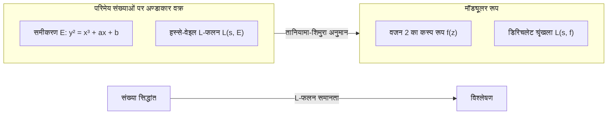

## 1. परिचय: संख्या सिद्धांत के एक दिग्गज, [गोरो शिमुरा](https://kenji.blog/p/shimura-goro/)

आधुनिक गणित के इतिहास में, एक जापानी गणितज्ञ हैं जिनका अंकगणितीय ज्यामिति के क्षेत्र में निर्णायक प्रभाव था। उनका नाम **[गोरो शिमुरा](https://kenji.blog/p/shimura-goro/)** (1930 - 2019) है। उनकी उपलब्धियां अथाह हैं, उन्होंने "तानियामा-शिमुरा अनुमान" (जिसे अब मॉड्यूलरिटी प्रमेय के रूप में जाना जाता है) का प्रस्ताव दिया, जो बाद में "फर्मेट के अंतिम प्रमेय" के प्रमाण की सबसे बड़ी कुंजी बन गया, और "शिमुरा किस्मों" का निर्माण किया, जो आधुनिक संख्या सिद्धांत में एक अत्यंत महत्वपूर्ण वस्तु है।

इस लेख में, एक अकेले गणितज्ञ [गोरो शिमुरा](https://kenji.blog/p/shimura-goro/) के जीवन को पीछे मुड़कर देखते हुए, हम गणितीय दुनिया में उनके द्वारा स्थापित स्मारकीय उपलब्धियों, और उनके पीछे की उग्र दर्शन और सौंदर्यशास्त्र में गहराई से उतरेंगे। यह कहना कोई अतिशयोक्ति नहीं होगी कि उनकी उपलब्धियों को समझना यह समझने का पर्याय है कि 20वीं सदी के उत्तरार्ध में गणित का विकास कैसे हुआ।

## 2. शुरुआती दिन और गणित के प्रति जागरण

### 2.1 युद्ध की छाया और ज्ञान की प्यास

[गोरो शिमुरा](https://kenji.blog/p/shimura-goro/) का जन्म 23 फरवरी, 1930 को शिज़ुओका प्रान्त के हमामात्सु शहर में हुआ था। उनका बचपन ठीक वही कठोर युग था जब द्वितीय विश्व युद्ध के काले बादल घने हो रहे थे। युद्ध के समय सामग्री की कमी और हवाई हमलों के आतंक के बीच भी, उनकी बौद्धिक जिज्ञासा कभी खत्म नहीं हुई। अराजक युद्ध के बाद की अवधि में, जब कई युवा केवल जीवित रहने के लिए संघर्ष कर रहे थे, शिमुरा ने गणित, भौतिकी और साहित्य में गहरी रुचि पैदा की।

उनकी पुस्तक "द मैप ऑफ माई लाइफ" के अनुसार, उन्होंने उन्नत गणित की किताबें अपने दम पर पढ़ीं और कभी-कभी कठिन फ्रांसीसी गणितीय ग्रंथों को भी पढ़ा। "बिना किसी के सिखाए अपनी शक्ति से सत्य की खोज करने" का यह दृष्टिकोण उनके पूरे जीवन में शिमुरा की गणितीय शैली की नींव बनाएगा।

### 2.2 टोक्यो विश्वविद्यालय में दिन

1949 में, शिमुरा ने टोक्यो विश्वविद्यालय में विज्ञान संकाय के गणित विभाग में प्रवेश किया। उस समय, जापानी गणितीय समुदाय, हालांकि तेजी ताकागी के वर्ग क्षेत्र सिद्धांत और इसी तरह पर आधारित था, इस चुनौती का सामना कर रहा था कि युद्ध के बाद के पुनर्निर्माण अवधि के दौरान वैश्विक रुझानों को कैसे पकड़ा जाए। यहां, शिमुरा की मुलाकात **[युताका तानियामा](https://kenji.blog/p/taniyama-yutaka/)** से हुई, जिनके साथ वह बाद में गहरी दोस्ती बनाएंगे और एक साझा नियति साझा करेंगे।

तानियामा एक प्रतिभाशाली गणितज्ञ थे जिनके पास सहज और अबाधित विचार थे, जबकि शिमुरा एक पूर्णतावादी थे जो कठोरता को महत्व देते थे और तर्क के विवरण पर कभी भी कोई समझौता नहीं होने देते थे। इन दो विपरीत आकृतियों की बैठक अंततः एक बड़े सिद्धांत के बीज को जन्म देगी जो गणितीय दुनिया को हिला देगा।

## 3. [युताका तानियामा](https://kenji.blog/p/taniyama-yutaka/) के साथ मुठभेड़ और "तानियामा-शिमुरा अनुमान"

### 3.1 एक भाग्यपूर्ण मुलाकात

कहा जाता है कि शिमुरा और तानियामा के करीब आने का कारण एक ही गणितीय समस्या पर एक तुच्छ आदान-प्रदान था। उन्होंने एक-दूसरे की प्रतिभा को पहचाना और दिन-रात गणितीय चर्चाओं में डूब गए। बीजीय ज्यामिति और संख्या सिद्धांत के चौराहे पर "जटिल गुणन सिद्धांत" के आधुनिकीकरण में उनकी विशेष रुचि थी।

### 3.2 1955 का निक्को संगोष्ठी

1955 में, तोचिगी प्रान्त के निक्को में बीजीय संख्या सिद्धांत पर एक अंतर्राष्ट्रीय संगोष्ठी आयोजित की गई थी। इस सम्मेलन में [आंद्रे वेइल](https://kenji.blog/p/weil/) और जीन-पियरे सेरे जैसे विश्व स्तरीय गणितज्ञों ने भाग लिया था।

इस संगोष्ठी के लिए, युवा जापानी गणितज्ञ अपनी अनसुलझी समस्याओं को लाए और समस्याओं का एक संग्रह संकलित किया। इनमें [युताका तानियामा](https://kenji.blog/p/taniyama-yutaka/) द्वारा प्रस्तुत की गई कई समस्याएं शामिल थीं। यह उसका प्रोटोटाइप है जिसे बाद में "तानियामा-शिमुरा अनुमान" कहा जाएगा।

### 3.3 अण्डाकार वक्र और मॉड्यूलर रूपों के बीच का पुल

अत्यंत सरलता से कहा जाए तो, तानियामा-शिमुरा अनुमान यह दावा है कि "परिमेय संख्याओं के क्षेत्र में हर अण्डाकार वक्र मॉड्यूलर है"। यह दो पूरी तरह से अलग गणितीय ब्रह्मांडों को जोड़ने वाला एक पृथ्वी-बिखरने वाला अनुमान था।

$$
E: y^2 = x^3 + ax + b \quad (a, b \in \mathbb{Q})
$$

इस तरह के समीकरण द्वारा दर्शाए गए अण्डाकार वक्र $E$ के गुणों को प्रत्येक अभाज्य $p$ के मापांक समीकरण के समाधानों की संख्या से संबंधित एक अनुक्रम $\{a_p\}$ द्वारा चित्रित किया जाता है। इससे, हस्से-वेइल $L$-फलन $L(s, E)$ परिभाषित किया गया है।

$$
L(s, E) = \prod_{p \mid \Delta} (1 - a_p p^{-s})^{-1} \prod_{p \nmid \Delta} (1 - a_p p^{-s} + p^{1-2s})^{-1}
$$

दूसरी ओर, एक मॉड्यूलर रूप $f$ (यहां, वजन 2 का एक कस्प रूप) जटिल ऊपरी आधे तल पर परिभाषित एक अत्यधिक सममित कार्य है, और इसका अपना $L$-फलन $L(s, f)$ इसके फूरियर विस्तार गुणांक $\{c_n\}$ से परिभाषित होता है।

$$
f(z) = \sum_{n=1}^{\infty} c_n e^{2\pi i n z}
$$

तानियामा और शिमुरा का दावा था कि **"किसी भी अण्डाकार वक्र $E$ के लिए, एक मॉड्यूलर रूप $f$ मौजूद है जैसे कि $a_p = c_p$ सभी अभाज्य संख्याओं $p$ के लिए सही है"**, अर्थात, $L(s, E) = L(s, f)$। इसका मतलब यह है कि संख्या सिद्धांत (अण्डाकार वक्र) की दुनिया और विश्लेषण (मॉड्यूलर रूप) की दुनिया पूरी तरह से पत्राचार में है।

शुरू में, यह अनुमान इतना विचित्र था कि वेइल जैसे महान गणितज्ञ भी संशय में थे। हालांकि, शिमुरा ने इस सहज अनुमान के लिए कठोर गणितीय समर्थन प्रदान किया और इसे एक सिद्धांत में पॉलिश किया।

## 4. तानियामा की त्रासदी और शिमुरा का दृढ़ संकल्प

1958 में, जैसे ही सिद्धांत का निर्माण बयाना में शुरू हो रहा था, एक त्रासदी हुई। [युताका तानियामा](https://kenji.blog/p/taniyama-yutaka/) ने 23 वर्ष की कम उम्र में अपनी जान ले ली। उनके सुसाइड नोट में "अब तक मुझे पालने वालों के प्रति कृतज्ञता" और "थकान जिसके लिए मैं भी स्पष्ट रूप से कोई कारण परिभाषित नहीं कर सकता" के बारे में बात की गई थी। इसके अलावा, कुछ हफ़्ते बाद, एक दुखद घटना हुई जहाँ तानियामा से सगाई करने वाली महिला ने भी उनके साथ जुड़ने के लिए अपनी जान ले ली।

शिमुरा के लिए, तानियामा, जो उनके सबसे अच्छे समझदार और सहयोगी थे, को खोने का दुख अथाह था। हालाँकि, शिमुरा ने दुख को पार कर लिया और तानियामा द्वारा छोड़े गए अधूरे विचारों को अपने हाथों से साबित करने और दुनिया को उन्हें पहचानने के लिए एक मजबूत मिशन की भावना को आश्रय दिया। शिमुरा बाद में संयुक्त राज्य अमेरिका चले गए, प्रिंसटन विश्वविद्यालय और अन्य जगहों पर अपना शोध जारी रखते हुए, जबकि इस अनुमान को अधिक सटीक रूप में तैयार किया और इसकी अंतर्राष्ट्रीय प्रोफ़ाइल को बढ़ाया। इस वजह से, अनुमान को "तानियामा-शिमुरा अनुमान" कहा जाने लगा।

## 5. फर्मेट के अंतिम प्रमेय का मार्ग

### 5.1 फ़्रे का विचार और रिबेट का प्रमाण

समय बीतता गया, और 1980 के दशक में, तानियामा-शिमुरा अनुमान नाटकीय रूप से "फर्मेट के अंतिम प्रमेय" से जुड़ गया। 1984 में, गेरहार्ड फ़्रे ने दिखाया कि यदि कोई मान लेता है कि फर्मेट के अंतिम प्रमेय का एक प्रति-उदाहरण $a^n + b^n = c^n$ मौजूद है, तो उससे एक अजीब अण्डाकार वक्र (फ़्रे वक्र) का निर्माण किया जा सकता है।

$$
y^2 = x(x - a^n)(x + b^n)
$$

फ़्रे ने अनुमान लगाया कि क्योंकि इस वक्र में ऐसे असाधारण रूप से असामान्य गुण हैं, यह **मॉड्यूलर नहीं हो सकता है** (जिसका अर्थ है कि यह तानियामा-शिमुरा अनुमान को संतुष्ट नहीं करता है)। यदि यह सच होता, तो इसका मतलब यह होगा कि "यदि तानियामा-शिमुरा अनुमान सिद्ध हो जाता है, तो [फर्मेट का अंतिम प्रमेय](https://kenji.blog/p/fermats-last-theorem/) भी सिद्ध हो जाता है"।

1986 में, केन रिबेट ने फ़्रे के अनुमान (एप्सिलॉन अनुमान) को पूरी तरह से साबित कर दिया। इसके साथ, [फर्मेट का अंतिम प्रमेय](https://kenji.blog/p/fermats-last-theorem/), जो 350 वर्षों से अनसुलझा था, पूरी तरह से तानियामा-शिमुरा अनुमान को साबित करने की समस्या में कम हो गया था।

### 5.2 [एंड्रयू विल्स](https://kenji.blog/p/wiles/) द्वारा प्रमाण

यह खबर सुनकर जो खड़ा हुआ वह ब्रिटिश गणितज्ञ **[एंड्रयू विल्स](https://kenji.blog/p/wiles/)** था। सात साल के गुप्त शोध के बाद, उन्होंने 1993 में सेमीस्टेबल अण्डाकार वक्रों के लिए तानियामा-शिमुरा अनुमान के प्रमाण की घोषणा की। रास्ते में, एक संकट था जहाँ प्रमाण में एक महत्वपूर्ण दोष पाया गया था, लेकिन उनके पूर्व छात्र रिचर्ड टेलर की मदद से, इसे 1994 में पूरी तरह से ठीक कर दिया गया था।

विल्स द्वारा तानियामा-शिमुरा अनुमान (के एक हिस्से) का प्रमाण का अर्थ फर्मेट के अंतिम प्रमेय का पूर्ण प्रमाण था। यह गणित के इतिहास के सबसे महान नाटकों में से एक था।

### 5.3 शिमुरा की प्रतिक्रिया: "मैंने तो कहा ही था"

जब विल्स के प्रमाण की घोषणा की गई और दुनिया उत्साह के भंवर में घिरी हुई थी, तो [गोरो शिमुरा](https://kenji.blog/p/shimura-goro/), एक रिपोर्टर द्वारा उनके विचारों के लिए पूछे जाने पर, चुपचाप लेकिन दृढ़ता से जवाब दिया:

> **"I told you so."** (मैंने आपको ऐसा कहा था)

इन शब्दों में एक पूर्ण विश्वास था कि उनका (और तानियामा का) अंतर्ज्ञान सही था, और एक गहरी भावना थी कि यह इतने लंबे वर्षों के बाद साबित हो गया था। वह बिल्कुल भी हैरान नहीं थे; उनके लिए, यह **स्वयंसिद्ध** था कि सच्चाई अंततः साबित हो जाएगी। 1999 में, तानियामा-शिमुरा अनुमान सभी अण्डाकार वक्रों के लिए क्रिस्टोफ़ ब्रेउइल, ब्रायन कॉनराड, फ्रेड डायमंड और रिचर्ड टेलर द्वारा पूरी तरह से सिद्ध किया गया था, जो "मॉड्यूलरिटी प्रमेय" के रूप में जाना जाने वाला एक दृढ़ प्रमेय बन गया।

## 6. शिमुरा किस्में: अंकगणितीय ज्यामिति में एक नया क्षितिज

जबकि तानियामा-शिमुरा अनुमान से अक्सर छाया हुआ है, जो पेशेवर गणितीय दुनिया में [गोरो शिमुरा](https://kenji.blog/p/shimura-goro/) के नाम को और मजबूत करता है वह **"शिमुरा किस्मों"** का सिद्धांत है।

### 6.1 उच्च-आयामी जटिल गुणन सिद्धांत

19वीं सदी के गणितज्ञ क्रोनेकर ने दिखाया कि जटिल गुणन (क्रोनेकर के जुगेंन्ट्राम) वाले अण्डाकार वक्रों के विभाजन बिंदुओं का उपयोग करके एक काल्पनिक द्विघात क्षेत्र के सभी एबेलियन एक्सटेंशन का निर्माण किया जा सकता है। शिमुरा ने इसे उच्च-आयामी एबेलियन किस्मों में सामान्य बनाने के लिए एक भव्य परियोजना शुरू की।

उन्होंने बड़े पैमाने पर ज्यामितीय वस्तुओं का निर्माण किया जो घटिया बीजगणितीय समूहों और हर्मिटियन सममित डोमेन का उपयोग करके मॉड्यूलर वक्रों के उच्च-आयामी एनालॉग हैं। ये "शिमुरा किस्में" हैं। शिमुरा किस्मों में अत्यंत समृद्ध संरचनाएँ होती हैं जहाँ संख्या सिद्धांत, बीजगणितीय ज्यामिति और प्रतिनिधित्व सिद्धांत प्रतिच्छेद करते हैं।

### 6.2 आधुनिक गणित में शिमुरा किस्मों की स्थिति

आज, शिमुरा किस्में रॉबर्ट लैंगलैंड्स द्वारा प्रस्तावित "लैंगलैंड्स प्रोग्राम" में एक केंद्रीय भूमिका निभाती हैं। इस भव्य कार्यक्रम में जो गैलोज़ समूहों के प्रतिनिधित्व को ऑटोमोर्फिक अभ्यावेदन से जोड़ता है, शिमुरा किस्में ज्यामितीय रूप से उस पत्राचार को साकार करने के लिए अपरिहार्य चरण हैं। शिमुरा की दूरदर्शिता इस तथ्य से भी साबित होती है कि उन्होंने जो सिद्धांत बनाया वह दशकों बाद गणित के विकास का आधार बना।

## 7. एक अकेले गणितज्ञ का असली चेहरा: उनका दर्शन और सौंदर्यशास्त्र

### 7.1 एक समझौता न करने वाला सख्त रवैया

[गोरो शिमुरा](https://kenji.blog/p/shimura-goro/) ने गणित के प्रति अत्यंत सख्त और अडिग रवैया बनाए रखा। अपने शोधपत्रों और पुस्तकों में, उन्होंने अस्पष्ट अभिव्यक्तियों और अधूरे प्रमाणों को पूरी तरह से समाप्त कर दिया। वह कभी-कभी अन्य गणितज्ञों की गलतियों या अपर्याप्तताओं की भी लगातार आलोचना करते थे, और कई लोग उनकी सख्ती के कारण उनसे डरते थे।

हालाँकि, वह सख्ती उनके प्रति भी निर्देशित थी। उनका दृढ़ विश्वास था कि "गणित सुंदर होना चाहिए", और उन्हें बदसूरत प्रमाणों और कृत्रिम सिद्धांतों से घृणा थी। प्राकृतिक सुंदरता और पूर्ण सत्य को आगे बढ़ाने का रवैया उनके गणित की जड़ में था।

### 7.2 इमरी चीनी मिट्टी के बरतन और साहित्यिक उपलब्धियां

जब गणित की कठोर दुनिया से दूर थे, तो शिमुरा प्राचीन वस्तुओं, विशेष रूप से **इमरी चीनी मिट्टी के बरतन** के एक शौकीन संग्राहक और शोधकर्ता थे। उनके पास इतना गहरा ज्ञान था कि उन्होंने अंग्रेजी में इमरी पोर्सिलेन पर एक विशेष पुस्तक लिखी, और इसमें रहने वाले पारंपरिक जापानी सौंदर्य बोध से प्यार करते थे।

वह जापानी साहित्य और चीनी क्लासिक्स में भी पारंगत थे, और उनके लेखन में गहरी खेती और एक समृद्ध शब्दावली शामिल है। उनकी तार्किक और परिष्कृत सोच को साहित्य और कला की इतनी गहरी समझ का समर्थन प्राप्त हो सकता है।

### 7.3 "द मैप ऑफ माई लाइफ" हमें क्या बताता है

उनके बाद के वर्षों में प्रकाशित उनके आत्मकथात्मक निबंध "द मैप ऑफ माई लाइफ" में, उनकी तेज बुद्धि, सामयिक हास्य, और जिन लोगों से वह प्यार करते थे (विशेष रूप से [युताका तानियामा](https://kenji.blog/p/taniyama-yutaka/)) के प्रति गहरा स्नेह स्पष्ट रूप से वर्णित किया गया है। इस पुस्तक को पढ़ने से मानव [गोरो शिमुरा](https://kenji.blog/p/shimura-goro/) के जटिल और समृद्ध आंतरिक जीवन को जानने की अनुमति मिलती है, जो एक "सख्त गणितज्ञ" की मात्र छवि से परे है।

## 8. निष्कर्ष: [गोरो शिमुरा](https://kenji.blog/p/shimura-goro/) द्वारा छोड़ी गई रोशनी

3 मई, 2019 को [गोरो शिमुरा](https://kenji.blog/p/shimura-goro/) ने न्यू जर्सी, संयुक्त राज्य अमेरिका में 89 वर्ष का जीवन पूरा किया। इस दुनिया से चले जाने के बाद भी, उनका नाम गणित के इतिहास में "तानियामा-शिमुरा अनुमान" और "शिमुरा किस्मों" के रूप में हमेशा के लिए उकेरा गया है।

युद्ध के बाद के युग के जले हुए खंडहरों से शुरू होकर, [गोरो शिमुरा](https://kenji.blog/p/shimura-goro/) केवल अपनी बुद्धि और लचीली इच्छाशक्ति से लैस वैश्विक गणित के शिखर पर चढ़ गए। उनका जीवन दर्शाता है कि सत्य की खोज करने वाली मानवीय भावना कितनी उदात्त है, और यह कैसे महान चीजों का निर्माण कर सकती है।

संख्या सिद्धांत में अनसुलझी समस्याओं से निपटने वाले आधुनिक गणितज्ञ अभी भी [गोरो शिमुरा](https://kenji.blog/p/shimura-goro/) द्वारा विकसित विशाल भूमि पर चल रहे हैं। उनके द्वारा जलाई गई गणितीय रोशनी निश्चित रूप से लंबे समय तक और चमकती रहेगी।
