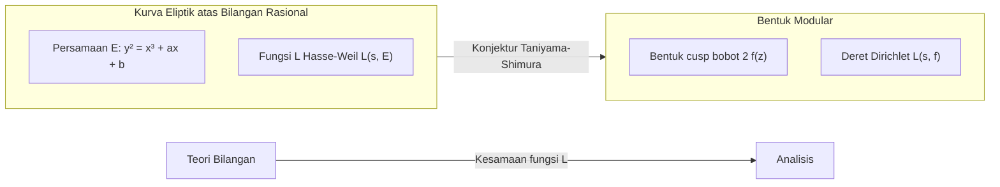

## 1. Pendahuluan: Raksasa Teori Bilangan, [Goro Shimura](https://kenji.blog/id/p/shimura-goro/)

Dalam sejarah matematika modern, ada seorang matematikawan Jepang yang memiliki dampak yang sangat menentukan di bidang geometri aritmetika. Namanya adalah **[Goro Shimura](https://kenji.blog/id/p/shimura-goro/)** (1930 - 2019). Pencapaiannya tidak terukur, setelah mengusulkan "Konjektur Taniyama-Shimura" (sekarang dikenal sebagai Teorema Modularitas), yang kemudian menjadi kunci terbesar untuk membuktikan "[Teorema Terakhir Fermat](https://kenji.blog/id/p/fermats-last-theorem/)", dan mengonstruksi "Varietas Shimura", sebuah objek yang sangat penting dalam teori bilangan modern.

Dalam artikel ini, sembari menelusuri kembali kehidupan [Goro Shimura](https://kenji.blog/id/p/shimura-goro/), seorang matematikawan yang penyendiri, kita akan menggali lebih dalam pencapaian monumental yang dia bangun di dunia matematika, serta filosofi dan estetika keras di baliknya. Tidak berlebihan untuk mengatakan bahwa memahami pencapaiannya sama dengan memahami bagaimana matematika berkembang di akhir abad ke-20.

## 2. Masa Muda dan Kebangkitan Matematika

### 2.1 Bayang-bayang Perang dan Haus Akan Ilmu

[Goro Shimura](https://kenji.blog/id/p/shimura-goro/) lahir pada tanggal 23 Februari 1930, di Kota Hamamatsu, Prefektur Shizuoka. Masa kecilnya bertepatan dengan masa kelam berkumpulnya awan gelap Perang Dunia II. Bahkan di tengah kekurangan material selama perang dan teror serangan udara, rasa keingintahuan intelektualnya tidak pernah hilang. Di masa pascaperang yang kacau, ketika banyak kaum muda berjuang hanya untuk bertahan hidup, Shimura memupuk minat yang dalam pada matematika, fisika, dan sastra.

Menurut bukunya "The Map of My Life", dia membaca buku-buku matematika tingkat lanjut sendiri dan kadang-kadang mencoba membaca teks matematika bahasa Prancis yang sulit. Sikap "mengeksplorasi kebenaran dengan kekuatan sendiri tanpa diajari oleh siapa pun" ini akan menjadi fondasi gaya matematika Shimura sepanjang hidupnya.

### 2.2 Masa-masa di Universitas Tokyo

Pada tahun 1949, Shimura masuk ke Departemen Matematika, Fakultas Sains, Universitas Tokyo. Pada saat itu, komunitas matematika Jepang, meskipun berlandaskan pada teori medan kelas Teiji Takagi dan lainnya, menghadapi tantangan bagaimana mengejar tren global selama masa rekonstruksi pascaperang. Di sana, Shimura bertemu **[Yutaka Taniyama](https://kenji.blog/id/p/taniyama-yutaka/)**, dengan siapa dia kemudian akan menjalin persahabatan yang erat dan berbagi takdir yang sama.

Taniyama adalah seorang matematikawan jenius dengan ide-ide intuitif dan tanpa hambatan, sedangkan Shimura adalah seorang perfeksionis yang menghargai ketelitian dan tidak pernah membiarkan kompromi dalam detail logika. Pertemuan dua sosok yang kontras ini pada akhirnya akan melahirkan benih dari teori masif yang akan mengguncang dunia matematika.

## 3. Pertemuan dengan [Yutaka Taniyama](https://kenji.blog/id/p/taniyama-yutaka/) dan "Konjektur Taniyama-Shimura"

### 3.1 Pertemuan yang Ditakdirkan

Dikatakan bahwa pemicu Shimura dan Taniyama menjadi dekat adalah percakapan sepele tentang satu masalah matematika. Mereka menyadari bakat satu sama lain dan tenggelam dalam diskusi matematika siang dan malam. Apa yang sangat menarik bagi mereka adalah modernisasi "teori perkalian kompleks" di persimpangan geometri aljabar dan teori bilangan.

### 3.2 Simposium Nikko 1955

Pada tahun 1955, simposium internasional tentang teori bilangan aljabar diadakan di Nikko, Prefektur Tochigi. Konferensi ini dihadiri oleh matematikawan kelas dunia seperti [André Weil](https://kenji.blog/id/p/weil/) dan Jean-Pierre Serre.

Untuk simposium ini, para matematikawan muda Jepang membawa masalah-masalah yang belum terpecahkan dan menyusun sebuah kumpulan masalah. Di antaranya terdapat beberapa masalah yang diajukan oleh [Yutaka Taniyama](https://kenji.blog/id/p/taniyama-yutaka/). Ini adalah prototipe dari apa yang nantinya akan disebut "Konjektur Taniyama-Shimura".

### 3.3 Jembatan Antara Kurva Eliptik dan Bentuk Modular

Secara sangat sederhana, Konjektur Taniyama-Shimura adalah pernyataan bahwa "setiap kurva eliptik pada lapangan bilangan rasional adalah modular". Ini adalah konjektur luar biasa yang menghubungkan dua alam semesta matematika yang sama sekali berbeda.

$$
E: y^2 = x^3 + ax + b \quad (a, b \in \mathbb{Q})
$$

Sifat-sifat dari kurva eliptik $E$ yang direpresentasikan oleh persamaan tersebut dikarakterisasi oleh barisan $\{a_p\}$ yang terkait dengan jumlah solusi persamaan modulo setiap bilangan prima $p$. Dari sini, fungsi $L$ Hasse-Weil $L(s, E)$ didefinisikan.

$$
L(s, E) = \prod_{p \mid \Delta} (1 - a_p p^{-s})^{-1} \prod_{p \nmid \Delta} (1 - a_p p^{-s} + p^{1-2s})^{-1}
$$

Di sisi lain, bentuk modular $f$ (di sini, bentuk cusp dari bobot 2) adalah fungsi yang sangat simetris yang didefinisikan pada setengah bidang atas kompleks, dan fungsi $L$-nya sendiri $L(s, f)$ didefinisikan dari koefisien ekspansi Fourier-nya $\{c_n\}$.

$$
f(z) = \sum_{n=1}^{\infty} c_n e^{2\pi i n z}
$$

Pernyataan Taniyama dan Shimura adalah bahwa **"untuk kurva eliptik $E$ apa pun, ada bentuk modular $f$ sedemikian rupa sehingga $a_p = c_p$ berlaku untuk semua bilangan prima $p$"**, yaitu, $L(s, E) = L(s, f)$. Ini berarti bahwa dunia teori bilangan (kurva eliptik) dan dunia analisis (bentuk modular) saling berkorespondensi secara sempurna.

Awalnya, konjektur ini sangat aneh sehingga bahkan matematikawan hebat seperti Weil pun skeptis. Namun, Shimura memberikan dukungan matematis yang ketat untuk konjektur intuitif ini dan menyempurnakannya menjadi sebuah teori.

## 4. Tragedi Taniyama dan Tekad Shimura

Pada tahun 1958, tepat saat pembangunan teori ini dimulai dengan sungguh-sungguh, sebuah tragedi terjadi. [Yutaka Taniyama](https://kenji.blog/id/p/taniyama-yutaka/) mengakhiri hidupnya sendiri di usia muda 23 tahun. Catatan bunuh dirinya berbicara tentang "rasa terima kasih kepada mereka yang telah membesarkanku selama ini" dan "kelelahan yang bahkan diriku sendiri tidak bisa mendefinisikan alasannya dengan jelas". Selanjutnya, beberapa minggu kemudian, peristiwa tragis menyusul ketika wanita yang bertunangan dengan Taniyama juga mengakhiri hidupnya sendiri untuk menyusulnya.

Bagi Shimura, kesedihan kehilangan Taniyama, orang yang paling memahaminya dan kolaborator terbaiknya, tidak terukur. Namun, Shimura mengatasi kesedihannya dan menyimpan rasa misi yang kuat untuk membuktikan ide-ide tak terselesaikan yang ditinggalkan Taniyama dengan tangannya sendiri dan membuat dunia mengakuinya. Shimura kemudian pindah ke Amerika Serikat, melanjutkan penelitiannya di Universitas Princeton dan di tempat lain, sembari merumuskan konjektur ini ke dalam bentuk yang lebih tepat dan meningkatkan profil internasionalnya. Karena inilah konjektur tersebut dikenal sebagai "Konjektur Taniyama-Shimura".

## 5. Jalan Menuju [Teorema Terakhir Fermat](https://kenji.blog/id/p/fermats-last-theorem/)

### 5.1 Ide Frey dan Bukti Ribet

Waktu berlalu, dan pada tahun 1980-an, Konjektur Taniyama-Shimura secara dramatis dikaitkan dengan "[Teorema Terakhir Fermat](https://kenji.blog/id/p/fermats-last-theorem/)". Pada tahun 1984, Gerhard Frey menunjukkan bahwa jika seseorang mengasumsikan ada contoh penyangkal $a^n + b^n = c^n$ terhadap [Teorema Terakhir Fermat](https://kenji.blog/id/p/fermats-last-theorem/), kurva eliptik yang aneh (kurva Frey) dapat dikonstruksi darinya.

$$
y^2 = x(x - a^n)(x + b^n)
$$

Frey membuat konjektur bahwa karena kurva ini memiliki sifat tidak normal yang luar biasa, ia **tidak mungkin modular** (berarti kurva ini tidak memenuhi Konjektur Taniyama-Shimura). Jika ini benar, itu berarti bahwa "jika Konjektur Taniyama-Shimura terbukti, [Teorema Terakhir Fermat](https://kenji.blog/id/p/fermats-last-theorem/) juga terbukti".

Pada tahun 1986, Ken Ribet sepenuhnya membuktikan konjektur Frey (konjektur epsilon). Dengan ini, [Teorema Terakhir Fermat](https://kenji.blog/id/p/fermats-last-theorem/), yang belum terpecahkan selama 350 tahun, sepenuhnya direduksi menjadi masalah pembuktian Konjektur Taniyama-Shimura.

### 5.2 Bukti oleh [Andrew Wiles](https://kenji.blog/id/p/wiles/)

Orang yang bangkit setelah mendengar berita ini adalah matematikawan Inggris **[Andrew Wiles](https://kenji.blog/id/p/wiles/)**. Setelah tujuh tahun penelitian rahasia, ia mengumumkan bukti Konjektur Taniyama-Shimura untuk kurva eliptik semistabil pada tahun 1993. Dalam perjalanannya, ada krisis di mana kelemahan kritis ditemukan dalam buktinya, tetapi dengan bantuan mantan muridnya Richard Taylor, kelemahan itu sepenuhnya diperbaiki pada tahun 1994.

Bukti Wiles atas (sebagian dari) Konjektur Taniyama-Shimura berarti bukti lengkap dari [Teorema Terakhir Fermat](https://kenji.blog/id/p/fermats-last-theorem/). Itu adalah salah satu drama terbesar dalam sejarah matematika.

### 5.3 Reaksi Shimura: "Sudah kubilang"

Ketika bukti Wiles diumumkan dan dunia dilanda pusaran antusiasme, [Goro Shimura](https://kenji.blog/id/p/shimura-goro/), saat ditanya pendapatnya oleh seorang reporter, menjawab dengan tenang namun tegas:

> **"I told you so."** (Sudah kubilang)

Kata-kata ini mengandung keyakinan mutlak bahwa intuisi dirinya (dan Taniyama) adalah benar, dan emosi yang mendalam bahwa hal itu telah dibuktikan setelah bertahun-tahun lamanya. Dia sama sekali tidak terkejut; baginya, sudah **terbukti dengan sendirinya** bahwa kebenaran pada akhirnya akan dibuktikan. Pada tahun 1999, Konjektur Taniyama-Shimura sepenuhnya dibuktikan untuk semua kurva eliptik oleh Christophe Breuil, Brian Conrad, Fred Diamond, dan Richard Taylor, dan menjadi teorema mapan yang dikenal sebagai "Teorema Modularitas".

## 6. Varietas Shimura: Cakrawala Baru dalam Geometri Aritmetika

Meskipun sering dibayangi oleh Konjektur Taniyama-Shimura, apa yang lebih memperkuat nama [Goro Shimura](https://kenji.blog/id/p/shimura-goro/) di dunia matematika profesional adalah teori **"Varietas Shimura"**.

### 6.1 Teori Perkalian Kompleks Dimensi Lebih Tinggi

Matematikawan abad ke-19 Kronecker menunjukkan bahwa semua perluasan abelian dari lapangan kuadratik imajiner dapat dikonstruksi menggunakan titik pembagian dari kurva eliptik dengan perkalian kompleks (Jugendtraum Kronecker). Shimura melakukan proyek besar untuk menggeneralisasi hal ini ke varietas abelian berdimensi lebih tinggi.

Dia mengonstruksi objek geometris masif yang merupakan analogi dimensi yang lebih tinggi dari kurva modular, menggunakan grup aljabar reduktif dan domain simetris Hermitian. Ini adalah "Varietas Shimura". Varietas Shimura memiliki struktur yang sangat kaya di mana teori bilangan, geometri aljabar, dan teori representasi saling berpotongan.

### 6.2 Posisi Varietas Shimura dalam Matematika Modern

Saat ini, varietas Shimura memainkan peran sentral dalam "Program Langlands" yang diusulkan oleh Robert Langlands. Dalam program besar yang menghubungkan representasi kelompok Galois dengan representasi automorfik ini, varietas Shimura adalah panggung yang sangat diperlukan untuk mewujudkan korespondensi tersebut secara geometris. Visi Shimura juga terbukti dengan fakta bahwa teori yang dibangunnya menjadi landasan bagi perkembangan matematika beberapa dekade kemudian.

## 7. Wajah Asli Seorang Matematikawan Penyendiri: Filosofi dan Estetikanya

### 7.1 Sikap Tegas Tanpa Kompromi

[Goro Shimura](https://kenji.blog/id/p/shimura-goro/) mempertahankan sikap yang sangat keras dan tanpa kompromi terhadap matematika. Dalam makalah dan buku-bukunya, ia benar-benar menghilangkan ungkapan yang ambigu dan bukti yang tidak lengkap. Dia juga terkadang dengan tanpa henti mengkritik kesalahan atau kekurangan matematikawan lain, dan banyak yang takut padanya karena ketegasannya.

Namun, ketegasan itu juga ditujukan kepada dirinya sendiri. Ia memegang keyakinan kuat bahwa "matematika haruslah indah", dan membenci bukti yang jelek dan teori yang artifisial. Sikap mengejar keindahan alami dan kebenaran absolut menjadi akar dari matematikanya.

### 7.2 Porselen Imari dan Pencapaian Sastra

Saat jauh dari dunia matematika yang keras, Shimura adalah seorang kolektor dan peneliti barang antik yang tekun, terutama **porselen Imari**. Ia memiliki pengetahuan yang mendalam sehingga menulis buku khusus tentang porselen Imari dalam bahasa Inggris, dan mencintai rasa estetika tradisional Jepang yang ada di dalamnya.

Ia juga sangat fasih dalam sastra Jepang dan klasik Tiongkok, dan tulisan-tulisannya dipenuhi dengan kultivasi mendalam dan kosakata yang kaya. Pemikiran logis dan halusnya mungkin didukung oleh pemahaman yang mendalam tentang sastra dan seni.

### 7.3 Apa yang Dikatakan "The Map of My Life" Kepada Kita

Dalam esai otobiografinya "The Map of My Life" yang diterbitkan pada tahun-tahun terakhirnya, kecerdasannya yang tajam, humornya yang sesekali muncul, dan kasih sayangnya yang dalam kepada orang-orang yang dicintainya (terutama [Yutaka Taniyama](https://kenji.blog/id/p/taniyama-yutaka/)) diceritakan dengan jujur. Membaca buku ini memungkinkan kita mengetahui kehidupan batin manusia [Goro Shimura](https://kenji.blog/id/p/shimura-goro/) yang kompleks dan kaya, yang melampaui sekadar citra seorang "matematikawan yang tegas".

## 8. Kesimpulan: Cahaya yang Ditinggalkan oleh [Goro Shimura](https://kenji.blog/id/p/shimura-goro/)

Pada tanggal 3 Mei 2019, [Goro Shimura](https://kenji.blog/id/p/shimura-goro/) menutup kehidupannya yang ke-89 tahun di New Jersey, AS. Bahkan setelah ia meninggalkan dunia ini, namanya terukir abadi dalam sejarah matematika sebagai "Konjektur Taniyama-Shimura" dan "Varietas Shimura".

Berangkat dari puing-puing pascaperang, [Goro Shimura](https://kenji.blog/id/p/shimura-goro/) mendaki puncak matematika global dengan hanya berbekal kecerdasannya sendiri dan kemauan yang tangguh. Kehidupannya menunjukkan betapa luhurnya jiwa manusia yang mencari kebenaran, dan bagaimana hal itu dapat menghasilkan hal-hal yang besar.

Para matematikawan modern yang memecahkan masalah-masalah yang belum terselesaikan dalam teori bilangan masih berjalan di tanah luas yang dirintis oleh [Goro Shimura](https://kenji.blog/id/p/shimura-goro/). Cahaya matematika yang dinyalakannya pasti akan terus bersinar lama dan terang.
