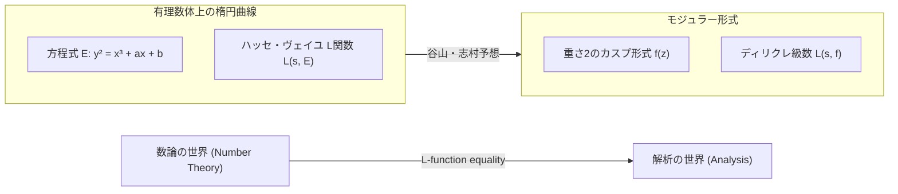

## 1. はじめに：数論の巨星、[志村五郎](https://kenji.blog/p/shimura-goro/)

現代数学の歴史において、数論幾何学という分野に決定的な影響を与えた日本人数学者がいます。その名は **[志村五郎](https://kenji.blog/p/shimura-goro/)** （[Goro Shimura](https://kenji.blog/p/shimura-goro/)、1930年 - 2019年）です。彼は、のちに「[フェルマーの最終定理](https://kenji.blog/p/fermats-last-theorem/)」の証明における最大の鍵となった「谷山・志村予想（現在はモジュラー性定理と呼ばれる）」を提唱し、さらには現代の数論における極めて重要な対象である「志村多様体」を構成するなど、その業績は計り知れません。

本記事では、[志村五郎](https://kenji.blog/p/shimura-goro/)という孤高の数学者の生涯を振り返りながら、彼が数学界にどのような金字塔を打ち立てたのか、そしてその背景にある苛烈なる哲学と美学について深く掘り下げていきます。彼の業績を理解することは、20世紀後半の数学がどのように発展してきたのかを理解することと同義と言っても過言ではありません。

## 2. 若き日々と数学への目覚め

### 2.1 戦争の影と学問への渇望

[志村五郎](https://kenji.blog/p/shimura-goro/)は1930年（昭和5年）2月23日、静岡県浜松市に生まれました。彼の少年時代は、まさに第二次世界大戦の暗雲が立ち込める過酷な時代でした。戦時中の物資不足や空襲の恐怖の中にあっても、彼の知的好奇心が失われることはありませんでした。戦後の混乱期において、多くの若者が生きることに精一杯であった中、志村は数学や物理学、そして文学への深い関心を育んでいきました。

彼の著書『記憶の切繪図』によれば、彼は独学で高度な数学書を読み漁り、時には難解なフランス語の数学書にも手を伸ばしていたと言います。この「誰に教わるでもなく自らの力で真理を探究する」という姿勢は、生涯を通じて志村の数学的スタイルの根幹をなすことになります。

### 2.2 東京大学での日々

1949年、志村は東京大学理学部数学科に入学します。当時の日本の数学界は、高木貞治の類体論などを基盤としつつも、戦後の復興期にあって世界的な潮流にどう追いつくかという課題に直面していました。志村はここで、後に深い親交を結び、また運命を共にすることになる **[谷山豊](https://kenji.blog/p/taniyama-yutaka/)** （[Yutaka Taniyama](https://kenji.blog/p/taniyama-yutaka/)）と出会います。

谷山は直感的で奔放な発想を持つ天才肌の数学者であり、一方の志村は厳密性を重んじ、論理の細部まで決して妥協を許さない完璧主義者でした。この対照的な二人の出会いが、やがて数学界を揺るがす巨大な理論の種を生み出すことになります。

## 3. [谷山豊](https://kenji.blog/p/taniyama-yutaka/)との出会いと「谷山・志村予想」

### 3.1 運命的な出会い

志村と谷山が親しくなったきっかけは、ある一つの数学的な問題をめぐる些細なやり取りだったと言われています。彼らは互いの才能を認め合い、昼夜を問わず数学の議論に没頭しました。特に彼らが興味を持っていたのは、代数幾何学と数論の交差点にある「複素乗法論」の近代化でした。

### 3.2 1955年の日光シンポジウム

1955年、栃木県の日光で代数的整数論に関する国際シンポジウムが開催されました。この会議には、アンドレ・[ヴェイユ](https://kenji.blog/p/weil/)（[André Weil](https://kenji.blog/p/weil/)）やジャン＝ピエール・セール（Jean-Pierre Serre）といった世界トップクラスの数学者が参加していました。

このシンポジウムに向けて、日本の若手数学者たちは未解決問題を持ち寄って問題集を作成しました。その中に、[谷山豊](https://kenji.blog/p/taniyama-yutaka/)が提出したいくつかの問題が含まれていました。これが、後に「谷山・志村予想」と呼ばれるようになるものの原型です。

### 3.3 楕円曲線とモジュラー形式の架け橋

谷山・志村予想を極めて簡単に言えば、「すべての有理数体上の楕円曲線はモジュラーである」という主張です。これは全く異なる二つの数学的宇宙を繋ぐ、驚天動地の予想でした。

$$
E: y^2 = x^3 + ax + b \quad (a, b \in \mathbb{Q})
$$

このような方程式で表される楕円曲線 $E$ の性質は、各素数 $p$ を法としたときの方程式の解の数に関連する数列 $\{a_p\}$ によって特徴付けられます。これにより、[ハッセ](https://kenji.blog/p/hasse/)・[ヴェイユ](https://kenji.blog/p/weil/)の $L$ 関数 $L(s, E)$ が定義されます。

$$
L(s, E) = \prod_{p \mid \Delta} (1 - a_p p^{-s})^{-1} \prod_{p \nmid \Delta} (1 - a_p p^{-s} + p^{1-2s})^{-1}
$$

一方、モジュラー形式 $f$ （ここでは重さ2のカスプ形式）は、複素上半平面で定義される極めて対称性の高い関数であり、そのフーリエ展開の係数 $\{c_n\}$ から独自の $L$ 関数 $L(s, f)$ が定義されます。

$$
f(z) = \sum_{n=1}^{\infty} c_n e^{2\pi i n z}
$$

谷山と志村の主張は、**「任意の楕円曲線 $E$ に対して、あるモジュラー形式 $f$ が存在し、すべての素数 $p$ において $a_p = c_p$ が成り立つ」**、すなわち $L(s, E) = L(s, f)$ となる、というものでした。これは、数論の世界（楕円曲線）と解析の世界（モジュラー形式）が完全に対応していることを意味します。

当初、この予想はあまりにも突飛であり、[ヴェイユ](https://kenji.blog/p/weil/)などの大数学者でさえも懐疑的でした。しかし、志村はこの直感的な予想に対して厳密な数学的裏付けを与え、理論として磨き上げていきました。

## 4. 谷山の悲劇と志村の決意

理論の構築が本格化しようとしていた矢先の1958年、悲劇が起こります。[谷山豊](https://kenji.blog/p/taniyama-yutaka/)が、23歳という若さで自ら命を絶ってしまったのです。遺書には「これまで私を育ててくれた人たちへの感謝」と「自分でも理由がはっきりしない疲労」が記されていました。さらにその数週間後、谷山と婚約していた女性も彼の後を追って命を絶つという、痛ましい出来事が重なりました。

志村にとって、最高の理解者であり共同研究者であった谷山を失った悲しみは計り知れません。しかし、志村は悲しみを乗り越え、谷山が残した未完成のアイディアを自らの手で証明し、世界に認めさせるという強い使命感を抱きます。志村はその後アメリカに渡り、プリンストン大学などで研究を続けながら、この予想をより正確な形で定式化し、国際的な認知度を高めていきました。このため、この予想は「谷山・志村予想」と呼ばれるようになったのです。

## 5. [フェルマーの最終定理](https://kenji.blog/p/fermats-last-theorem/)への道程

### 5.1 フライのアイディアとリベットの証明

時が流れ1980年代、谷山・志村予想は「[フェルマーの最終定理](https://kenji.blog/p/fermats-last-theorem/)」と劇的な形で結びつきます。1984年、ゲルハルト・フライ（Gerhard Frey）は、もし[フェルマーの最終定理](https://kenji.blog/p/fermats-last-theorem/)の反例 $a^n + b^n = c^n$ が存在すると仮定した場合、そこから奇妙な楕円曲線（フライ曲線）が構成できることを示しました。

$$
y^2 = x(x - a^n)(x + b^n)
$$

フライは、この曲線があまりにも異常な性質を持つため、**モジュラーになり得ない** （つまり谷山・志村予想を満たさない）と予想しました。これが正しければ、「谷山・志村予想が証明されれば、[フェルマーの最終定理](https://kenji.blog/p/fermats-last-theorem/)も証明される」ことになります。

1986年、ケン・リベット（Ken Ribet）がフライの予想（イプシロン予想）を完全に証明しました。これにより、350年間未解決だった[フェルマーの最終定理](https://kenji.blog/p/fermats-last-theorem/)は、谷山・志村予想を証明するという問題に完全に帰着されたのです。

### 5.2 [アンドリュー・ワイルズ](https://kenji.blog/p/wiles/)による証明

この知らせを聞いて立ち上がったのが、イギリスの数学者 **[アンドリュー・ワイルズ](https://kenji.blog/p/wiles/)** （[Andrew Wiles](https://kenji.blog/p/wiles/)）です。彼は7年間の隠密裡の研究の末、1993年に半安定な楕円曲線に対する谷山・志村予想の証明を発表しました。途中、証明に重大な欠陥が見つかるという危機的状況がありましたが、元教え子のリチャード・テイラー（Richard Taylor）の協力により、1994年に完全に修正されました。

[ワイルズ](https://kenji.blog/p/wiles/)による谷山・志村予想（の一部）の証明は、そのまま[フェルマーの最終定理](https://kenji.blog/p/fermats-last-theorem/)の完全な証明を意味しました。数学史における最大のドラマの一つです。

### 5.3 志村の反応「当然のことだ」

[ワイルズ](https://kenji.blog/p/wiles/)の証明が発表され、世界中が熱狂の渦に包まれていたとき、記者から感想を求められた[志村五郎](https://kenji.blog/p/shimura-goro/)は、静かに、しかし力強くこう答えました。

> **"I told you so."** （だから言ったでしょう）

この言葉には、自分の（そして谷山の）直感が正しかったことへの絶対的な自信と、長い年月を経てそれが証明されたことに対する深い感慨が込められていました。彼は決して驚いたわけではなく、真理がいずれ証明されることは彼にとって **自明** だったのです。1999年には、クリストフ・ブレイユ、ブライアン・コンラッド、フレッド・ダイアモンド、リチャード・テイラーらによって、すべての楕円曲線に対して谷山・志村予想が完全に証明され、「モジュラー性定理」という確固たる定理となりました。

## 6. 志村多様体：数論幾何学の新たな地平

谷山・志村予想の陰に隠れがちですが、専門的な数学の世界において[志村五郎](https://kenji.blog/p/shimura-goro/)の名前をさらに不動のものとしているのが **「志村多様体」 (Shimura Varieties)** の理論です。

### 6.1 複素乗法論の高次元化

19世紀の数学者クロネッカーは、虚数乗法（複素乗法）を持つ楕円曲線の等分点を用いて、虚二次体のすべてのアーベル拡大を構成できること（クロネッカーの青春の夢）を示しました。志村は、これを高次元のアーベル多様体へと一般化する壮大なプロジェクトに取り組みました。

彼は、簡約代数群とエルミート対称領域を用いて、モジュラー曲線の高次元の類似物である巨大な幾何学的対象を構成しました。これが「志村多様体」です。志村多様体は、数論、代数幾何学、表現論が交差する極めて豊かな構造を持っています。

### 6.2 現代数学における志村多様体の位置づけ

現在、志村多様体はロバート・ラングランズ（Robert Langlands）が提唱した「ラングランズ・プログラム」において中心的な役割を果たしています。ガロア群の表現と保型表現を結びつけるこの壮大なプログラムにおいて、志村多様体はその対応関係を幾何学的に実現するための不可欠な舞台となっています。志村の先見性は、彼が構築した理論が数十年後の数学の発展の基盤となっていることからも証明されています。

## 7. 孤高の数学者の素顔：その哲学と美学

### 7.1 妥協を許さない厳格な姿勢

[志村五郎](https://kenji.blog/p/shimura-goro/)は、数学に対して極めて厳格で妥協を許さない姿勢を貫きました。彼は自身の論文や著書において、曖昧な表現や不完全な証明を徹底的に排除しました。また、他の数学者の間違いや不十分な点に対しても容赦のない批判を行うことがあり、その厳しさから彼を恐れる数学者も少なくありませんでした。

しかし、その厳しさは自己に対しても向けられていました。彼は「数学は美しくなければならない」という強い信念を持っており、醜い証明や人工的な理論を嫌いました。自然な美しさと絶対的な真理を追求する姿勢が、彼の数学の根底にありました。

### 7.2 伊万里焼と文学への造詣

数学の厳しい世界から離れたとき、志村は古美術、特に **伊万里焼** の熱心な収集家であり研究者でもありました。彼は伊万里焼に関する専門書を英語で執筆するほどの深い知識を持っており、そこに宿る日本の伝統的な美意識を愛していました。

また、日本文学や中国の古典にも精通しており、彼の文章には深い教養と豊かな語彙が散りばめられています。彼の論理的で洗練された思考は、こうした文学や芸術への深い理解によって裏打ちされていたのかもしれません。

### 7.3 『記憶の切繪図』が語るもの

晩年に出版された自伝的エッセイ『記憶の切繪図』では、彼の鋭い知性と、時折見せるユーモア、そして彼が愛した人々（特に[谷山豊](https://kenji.blog/p/taniyama-yutaka/)）への深い愛情が率直に語られています。この本を読むと、単なる「厳格な数学者」というイメージにとどまらない、人間・[志村五郎](https://kenji.blog/p/shimura-goro/)の複雑で豊かな内面を知ることができます。

## 8. おわりに：[志村五郎](https://kenji.blog/p/shimura-goro/)が遺した光

2019年5月3日、[志村五郎](https://kenji.blog/p/shimura-goro/)はアメリカ合衆国ニュージャージー州で89年の生涯を閉じました。彼がこの世を去った後も、彼の名前は「谷山・志村予想」や「志村多様体」として、数学の歴史に永遠に刻まれています。

戦後の焼け野原から出発し、自らの知性と強靭な意志だけを武器に世界の数学の頂点へと登り詰めた[志村五郎](https://kenji.blog/p/shimura-goro/)。彼の生涯は、真理を探求する人間の精神がいかに崇高であり、いかに偉大なものを生み出し得るかを示しています。

数論の未解決問題に挑む現代の数学者たちは、今もなお、[志村五郎](https://kenji.blog/p/shimura-goro/)が切り拓いた広大な大地の上を歩み続けているのです。彼が灯した数学の光は、これからも長く、そして眩しく輝き続けることでしょう。
