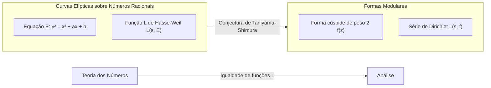

## 1. Introdução: Um Gigante da Teoria dos Números, [Goro Shimura](https://kenji.blog/pt/p/shimura-goro/)

Na história da matemática moderna, há um matemático japonês que teve um impacto decisivo no campo da geometria aritmética. Seu nome é **[Goro Shimura](https://kenji.blog/pt/p/shimura-goro/)** (1930 - 2019). Suas conquistas são imensuráveis, tendo proposto a "Conjectura de Taniyama-Shimura" (agora conhecida como Teorema da Modularidade), que mais tarde se tornou a maior chave para a prova do "Último Teorema de Fermat", e construindo as "variedades de Shimura", um objeto extremamente importante na moderna teoria dos números.

Neste artigo, ao relembrar a vida de [Goro Shimura](https://kenji.blog/pt/p/shimura-goro/), um matemático solitário, nos aprofundaremos nas conquistas monumentais que ele estabeleceu no mundo matemático, e a feroz filosofia e estética por trás delas. Não é exagero dizer que entender suas conquistas é sinônimo de entender como a matemática se desenvolveu no final do século XX.

## 2. Primeiros Anos e Despertar para a Matemática

### 2.1 A Sombra da Guerra e a Sede de Conhecimento

[Goro Shimura](https://kenji.blog/pt/p/shimura-goro/) nasceu em 23 de fevereiro de 1930, na cidade de Hamamatsu, província de Shizuoka. Sua infância foi exatamente a dura época em que as nuvens escuras da Segunda Guerra Mundial se formavam. Mesmo em meio à escassez de materiais do tempo de guerra e ao terror dos ataques aéreos, sua curiosidade intelectual nunca se perdeu. No caótico período do pós-guerra, quando muitos jovens lutavam apenas para sobreviver, Shimura cultivou um profundo interesse por matemática, física e literatura.

Segundo o seu livro "The Map of My Life", lia livros de matemática avançada por conta própria e, por vezes, aventurava-se em difíceis textos matemáticos em francês. Esta atitude de "explorar a verdade pelos próprios meios sem ser ensinado por ninguém" formaria a base do estilo matemático de Shimura ao longo da sua vida.

### 2.2 Dias na Universidade de Tóquio

Em 1949, Shimura ingressou no Departamento de Matemática, Faculdade de Ciências, da Universidade de Tóquio. Na época, a comunidade matemática japonesa, embora baseada na teoria dos corpos de classes de Teiji Takagi e outros, enfrentava o desafio de como se atualizar com as tendências globais durante o período de reconstrução do pós-guerra. Lá, Shimura conheceu **[Yutaka Taniyama](https://kenji.blog/pt/p/taniyama-yutaka/)**, com quem mais tarde faria uma profunda amizade e compartilharia um destino comum.

Taniyama era um gênio da matemática com ideias intuitivas e desinibidas, enquanto Shimura era um perfeccionista que valorizava o rigor e nunca permitia concessões nos detalhes da lógica. O encontro dessas duas figuras contrastantes acabaria por dar origem à semente de uma teoria massiva que abalaria o mundo matemático.

## 3. Encontro com [Yutaka Taniyama](https://kenji.blog/pt/p/taniyama-yutaka/) e a "Conjectura de Taniyama-Shimura"

### 3.1 Um Encontro Fatídico

Diz-se que o gatilho para que Shimura e Taniyama se tornassem próximos foi uma troca trivial sobre um único problema matemático. Eles reconheceram o talento um do outro e mergulharam em discussões matemáticas dia e noite. O que eles estavam particularmente interessados era a modernização da "teoria da multiplicação complexa" na interseção da geometria algébrica e da teoria dos números.

### 3.2 O Simpósio de Nikko de 1955

Em 1955, um simpósio internacional sobre teoria algébrica dos números foi realizado em Nikko, na província de Tochigi. Esta conferência contou com a presença de matemáticos de classe mundial, como [André Weil](https://kenji.blog/pt/p/weil/) e Jean-Pierre Serre.

Para este simpósio, jovens matemáticos japoneses trouxeram os seus problemas não resolvidos e compilaram uma coleção de problemas. Incluídos entre estes estavam vários problemas submetidos por [Yutaka Taniyama](https://kenji.blog/pt/p/taniyama-yutaka/). Este é o protótipo do que mais tarde viria a ser chamado de "Conjectura de Taniyama-Shimura".

### 3.3 A Ponte Entre Curvas Elípticas e Formas Modulares

Exposto de forma extremamente simples, a Conjectura de Taniyama-Shimura é a afirmação de que "toda curva elíptica sobre o corpo dos números racionais é modular". Esta foi uma conjectura revolucionária que conectou dois universos matemáticos completamente diferentes.

$$
E: y^2 = x^3 + ax + b \quad (a, b \in \mathbb{Q})
$$

As propriedades de uma curva elíptica $E$ representada por tal equação são caracterizadas por uma sequência $\{a_p\}$ relacionada ao número de soluções da equação módulo cada número primo $p$. A partir disso, a função $L$ de Hasse-Weil $L(s, E)$ é definida.

$$
L(s, E) = \prod_{p \mid \Delta} (1 - a_p p^{-s})^{-1} \prod_{p \nmid \Delta} (1 - a_p p^{-s} + p^{1-2s})^{-1}
$$

Por outro lado, uma forma modular $f$ (aqui, uma forma cúspide de peso 2) é uma função altamente simétrica definida no semiplano superior complexo, e a sua própria função $L$, $L(s, f)$, é definida a partir dos seus coeficientes de expansão de Fourier $\{c_n\}$.

$$
f(z) = \sum_{n=1}^{\infty} c_n e^{2\pi i n z}
$$

A afirmação de Taniyama e Shimura era que **"para qualquer curva elíptica $E$, existe uma forma modular $f$ tal que $a_p = c_p$ vale para todos os números primos $p$"**, isto é, $L(s, E) = L(s, f)$. Isso significa que o mundo da teoria dos números (curvas elípticas) e o mundo da análise (formas modulares) estão perfeitamente em correspondência.

Inicialmente, essa conjectura era tão bizarra que mesmo grandes matemáticos como Weil eram céticos. No entanto, Shimura forneceu um rigoroso apoio matemático para esta conjectura intuitiva e poliu-a numa teoria.

## 4. A Tragédia de Taniyama e a Determinação de Shimura

Em 1958, quando a construção da teoria começava a sério, ocorreu uma tragédia. [Yutaka Taniyama](https://kenji.blog/pt/p/taniyama-yutaka/) tirou a própria vida na tenra idade de 23 anos. A sua nota de suicídio falava de "gratidão àqueles que me criaram até agora" e "fadiga para a qual nem eu posso definir claramente uma razão". Além disso, algumas semanas depois, seguiu-se um evento trágico onde a mulher noiva de Taniyama também tirou a própria vida para se juntar a ele.

Para Shimura, a dor de perder Taniyama, o seu melhor entendedor e colaborador, era imensurável. No entanto, Shimura superou a dor e abrigou um forte senso de missão para provar as ideias inacabadas que Taniyama deixou para trás com as suas próprias mãos e fazer com que o mundo as reconhecesse. Mais tarde, Shimura mudou-se para os Estados Unidos, continuando as suas pesquisas na Universidade de Princeton e noutros lugares, ao mesmo tempo em que formulava esta conjectura numa forma mais precisa e elevava o seu perfil internacional. Por causa disso, a conjectura passou a ser chamada de "Conjectura de Taniyama-Shimura".

## 5. O Caminho para o Último Teorema de Fermat

### 5.1 A Ideia de Frey e a Prova de Ribet

O tempo passou e, na década de 1980, a Conjectura de Taniyama-Shimura tornou-se dramaticamente ligada ao "Último Teorema de Fermat". Em 1984, Gerhard Frey mostrou que se assumirmos que um contraexemplo $a^n + b^n = c^n$ ao Último Teorema de Fermat existe, uma estranha curva elíptica (curva de Frey) poderia ser construída a partir dele.

$$
y^2 = x(x - a^n)(x + b^n)
$$

Frey conjeturou que, por esta curva ter propriedades extraordinariamente anormais, ela **não pode ser modular** (o que significa que não satisfaz a Conjectura de Taniyama-Shimura). Se isso fosse verdade, significaria que "se a Conjectura de Taniyama-Shimura for provada, o Último Teorema de Fermat também estará provado".

Em 1986, Ken Ribet provou completamente a conjectura de Frey (a conjectura epsilon). Com isso, o Último Teorema de Fermat, que estava sem solução há 350 anos, foi completamente reduzido ao problema de provar a Conjectura de Taniyama-Shimura.

### 5.2 A Prova por [Andrew Wiles](https://kenji.blog/pt/p/wiles/)

Aquele que se levantou ao ouvir esta notícia foi o matemático britânico **[Andrew Wiles](https://kenji.blog/pt/p/wiles/)**. Após sete anos de pesquisa secreta, ele anunciou uma prova da Conjectura de Taniyama-Shimura para curvas elípticas semiestáveis em 1993. Ao longo do caminho, houve uma crise onde uma falha crítica foi encontrada na prova, mas com a ajuda do seu ex-aluno Richard Taylor, foi completamente corrigida em 1994.

A prova de Wiles (de uma parte) da Conjectura de Taniyama-Shimura significou uma prova completa do Último Teorema de Fermat. Foi um dos maiores dramas da história da matemática.

### 5.3 A Reação de Shimura: "Eu avisei"

Quando a prova de Wiles foi anunciada e o mundo estava engolido num turbilhão de entusiasmo, [Goro Shimura](https://kenji.blog/pt/p/shimura-goro/), quando um repórter pediu a sua opinião, respondeu calmamente mas firmemente:

> **"I told you so."** (Eu avisei-vos)

Estas palavras continham uma confiança absoluta de que a sua intuição (e de Taniyama) estava certa, e uma profunda emoção por ter sido provada após muitos longos anos. Ele não ficou surpreendido de forma alguma; para ele, era **evidente** que a verdade acabaria por ser provada. Em 1999, a Conjectura de Taniyama-Shimura foi completamente provada para todas as curvas elípticas por Christophe Breuil, Brian Conrad, Fred Diamond e Richard Taylor, tornando-se um teorema firme conhecido como o "Teorema da Modularidade".

## 6. Variedades de Shimura: Um Novo Horizonte na Geometria Aritmética

Embora frequentemente ofuscada pela Conjectura de Taniyama-Shimura, o que solidifica ainda mais o nome de [Goro Shimura](https://kenji.blog/pt/p/shimura-goro/) no mundo matemático profissional é a teoria das **"Variedades de Shimura"**.

### 6.1 Teoria da Multiplicação Complexa de Dimensões Superiores

O matemático do século XIX Kronecker mostrou que todas as extensões abelianas de um corpo quadrático imaginário podem ser construídas usando os pontos de divisão de curvas elípticas com multiplicação complexa (o Jugendtraum de Kronecker). Shimura empreendeu um grande projeto para generalizar isso para variedades abelianas de dimensões superiores.

Ele construiu objetos geométricos massivos que são análogos de dimensões superiores a curvas modulares, usando grupos algébricos redutivos e domínios simétricos hermitianos. Estas são as "variedades de Shimura". As variedades de Shimura possuem estruturas extremamente ricas onde a teoria dos números, a geometria algébrica e a teoria das representações se cruzam.

### 6.2 A Posição das Variedades de Shimura na Matemática Moderna

Hoje, as variedades de Shimura desempenham um papel central no "Programa de Langlands" proposto por Robert Langlands. Neste grandioso programa que conecta representações de grupos de Galois com representações automórficas, as variedades de Shimura são o palco indispensável para realizar geometricamente essa correspondência. A visão de Shimura também é provada pelo fato de que a teoria que ele construiu se tornou a base para o desenvolvimento da matemática décadas depois.

## 7. A Verdadeira Face de um Matemático Solitário: Sua Filosofia e Estética

### 7.1 Uma Atitude Intransigente e Rigorosa

[Goro Shimura](https://kenji.blog/pt/p/shimura-goro/) manteve uma atitude extremamente rigorosa e intransigente em relação à matemática. Nos seus artigos e livros, ele eliminou completamente expressões ambíguas e provas incompletas. Ele também às vezes criticava implacavelmente erros ou inadequações de outros matemáticos, e muitos temiam-no por causa do seu rigor.

No entanto, esse rigor também era direcionado a si mesmo. Ele mantinha a forte crença de que "a matemática deve ser bonita", e detestava provas feias e teorias artificiais. A atitude de buscar a beleza natural e a verdade absoluta estava na raiz da sua matemática.

### 7.2 Porcelana de Imari e Realizações Literárias

Quando afastado do mundo rigoroso da matemática, Shimura era um ávido colecionador e investigador de antiguidades, especialmente **porcelana de Imari**. Ele possuía um conhecimento tão profundo que escreveu um livro especializado sobre porcelana de Imari em inglês, e amava o tradicional senso estético japonês que residia nela.

Ele também era bem versado na literatura japonesa e nos clássicos chineses, e os seus escritos estão repletos de profundo cultivo e rico vocabulário. O seu pensamento lógico e refinado pode ter sido apoiado por uma compreensão tão profunda da literatura e da arte.

### 7.3 O que "The Map of My Life" nos diz

No seu ensaio autobiográfico "The Map of My Life" publicado nos seus últimos anos, o seu intelecto aguçado, o seu humor ocasional e a sua profunda afeição pelas pessoas que amava (especialmente [Yutaka Taniyama](https://kenji.blog/pt/p/taniyama-yutaka/)) são contados com franqueza. Ler este livro permite conhecer o complexo e rico mundo interior do humano [Goro Shimura](https://kenji.blog/pt/p/shimura-goro/), que vai além da mera imagem de um "matemático rigoroso".

## 8. Conclusão: A Luz Deixada por [Goro Shimura](https://kenji.blog/pt/p/shimura-goro/)

Em 3 de maio de 2019, [Goro Shimura](https://kenji.blog/pt/p/shimura-goro/) encerrou os seus 89 anos de vida em Nova Jersey, EUA. Mesmo depois de deixar este mundo, o seu nome está gravado eternamente na história da matemática como a "Conjectura de Taniyama-Shimura" e as "Variedades de Shimura".

Partindo das ruínas do pós-guerra, [Goro Shimura](https://kenji.blog/pt/p/shimura-goro/) escalou o cume da matemática global armado apenas com o seu próprio intelecto e vontade resiliente. A sua vida mostra o quão sublime é o espírito humano em busca da verdade, e como isso pode produzir grandes coisas.

Os matemáticos modernos que lidam com problemas não resolvidos na teoria dos números ainda caminham sobre as vastas terras pioneiras de [Goro Shimura](https://kenji.blog/pt/p/shimura-goro/). A luz matemática que ele acendeu certamente continuará a brilhar forte e por muito tempo.
