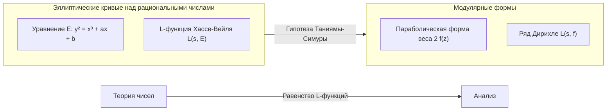

## 1. Введение: Гигант теории чисел, [Горо Симура](https://kenji.blog/ru/p/shimura-goro/)

В истории современной математики есть японский математик, оказавший решающее влияние на область арифметической геометрии. Его имя — **[Горо Симура](https://kenji.blog/ru/p/shimura-goro/)** (1930 - 2019). Его достижения неизмеримы: он предложил «гипотезу Таниямы-Симуры» (ныне известную как теорема о модулярности), которая позже стала главным ключом к доказательству «Великой теоремы Ферма», и сконструировал «многообразия Симуры», чрезвычайно важный объект в современной теории чисел.

В этой статье, оглядываясь на жизнь Горо Симуры, математика-одиночки, мы глубоко погрузимся в монументальные достижения, которые он установил в математическом мире, а также в суровую философию и эстетику, стоящие за ними. Не будет преувеличением сказать, что понимание его достижений является синонимом понимания того, как развивалась математика в конце 20-го века.

## 2. Ранние годы и пробуждение к математике

### 2.1 Тень войны и жажда знаний

[Горо Симура](https://kenji.blog/ru/p/shimura-goro/) родился 23 февраля 1930 года в городе Хамамацу, префектура Сидзуока. Его детство пришлось как раз на то суровое время, когда сгущались темные тучи Второй мировой войны. Даже в условиях нехватки материалов в военное время и ужаса воздушных налетов его интеллектуальное любопытство никогда не угасало. В хаотичный послевоенный период, когда многие молодые люди изо всех сил пытались просто выжить, Симура питал глубокий интерес к математике, физике и литературе.

Согласно его книге «Карта моей жизни» (The Map of My Life), он самостоятельно читал книги по высшей математике, а иногда и обращался к трудным французским математическим текстам. Это отношение «исследовать истину собственными силами, не обучаясь ни у кого» ляжет в основу математического стиля Симуры на протяжении всей его жизни.

### 2.2 Дни в Токийском университете

В 1949 году Симура поступил на математический факультет естественных наук Токийского университета. В то время японское математическое сообщество, хотя и опиралось на теорию полей классов [Тэйдзи Такаги](/ru/p/takagi-teiji/) и других, столкнулось с проблемой: как догнать мировые тенденции в период послевоенной реконструкции. Здесь Симура встретил **Ютаку Танияму**, с которым он позже установил глубокую дружбу и разделил общую судьбу.

Танияма был гениальным математиком с интуитивными и раскованными идеями, в то время как Симура был перфекционистом, который ценил строгость и никогда не допускал компромиссов в деталях логики. Встреча этих двух контрастирующих фигур в конечном итоге породила семя массивной теории, которая потрясла математический мир.

## 3. Встреча с Ютакой Таниямой и «Гипотеза Таниямы-Симуры»

### 3.1 Судьбоносная встреча

Говорят, что толчком к сближению Симуры и Таниямы послужил тривиальный обмен мнениями по поводу одной математической задачи. Они признали таланты друг друга и погрузились в математические дискуссии днем и ночью. Что их особенно интересовало, так это модернизация «теории комплексного умножения» на стыке алгебраической геометрии и теории чисел.

### 3.2 Симпозиум в Никко 1955 года

В 1955 году в Никко, префектура Тотиги, состоялся международный симпозиум по алгебраической теории чисел. В этой конференции приняли участие математики мирового класса, такие как [Андре Вейль](https://kenji.blog/ru/p/weil/) и Жан-Пьер Серр.

Для этого симпозиума молодые японские математики принесли свои нерешенные проблемы и составили сборник задач. Среди них было несколько задач, представленных Ютакой Таниямой. Это прототип того, что позже будет названо «гипотезой Таниямы-Симуры».

### 3.3 Мост между эллиптическими кривыми и модулярными формами

Проще говоря, гипотеза Таниямы-Симуры — это утверждение о том, что «каждая эллиптическая кривая над полем рациональных чисел является модулярной». Это была потрясающая гипотеза, соединившая две совершенно разные математические вселенные.

$$
E: y^2 = x^3 + ax + b \quad (a, b \in \mathbb{Q})
$$

Свойства эллиптической кривой $E$, представленной таким уравнением, характеризуются последовательностью $\{a_p\}$, связанной с числом решений уравнения по модулю каждого простого числа $p$. Из этого определяется L-функция Хассе-Вейля $L(s, E)$.

$$
L(s, E) = \prod_{p \mid \Delta} (1 - a_p p^{-s})^{-1} \prod_{p \nmid \Delta} (1 - a_p p^{-s} + p^{1-2s})^{-1}
$$

С другой стороны, модулярная форма $f$ (здесь — параболическая форма веса 2) является высокосимметричной функцией, определенной на комплексной верхней полуплоскости, и ее собственная L-функция $L(s, f)$ определяется из коэффициентов ее разложения Фурье $\{c_n\}$.

$$
f(z) = \sum_{n=1}^{\infty} c_n e^{2\pi i n z}
$$

Утверждение Таниямы и Симуры состояло в том, что **«для любой эллиптической кривой $E$ существует модулярная форма $f$ такая, что $a_p = c_p$ выполняется для всех простых чисел $p$»**, то есть $L(s, E) = L(s, f)$. Это означает, что мир теории чисел (эллиптические кривые) и мир анализа (модулярные формы) находятся в идеальном соответствии.

Первоначально эта гипотеза была настолько диковинной, что даже великие математики, такие как Вейль, были настроены скептически. Однако Симура обеспечил строгое математическое обоснование этой интуитивной гипотезы и отполировал ее до теории.

## 4. Трагедия Таниямы и решимость Симуры

В 1958 году, когда построение теории только началось всерьез, произошла трагедия. [Ютака Танияма](https://kenji.blog/ru/p/taniyama-yutaka/) покончил с собой в молодом возрасте 23 лет. В его предсмертной записке говорилось о «благодарности тем, кто растил меня до сих пор» и «усталости, причину которой даже я не могу четко определить». Более того, несколько недель спустя последовало трагическое событие, когда женщина, помолвленная с Таниямой, также покончила с собой, чтобы присоединиться к нему.

Для Симуры горе от потери Таниямы, его лучшего понимающего человека и соавтора, было неизмеримым. Тем не менее Симура преодолел горе и затаил в себе сильное чувство миссии — собственными руками доказать незавершенные идеи, оставленные Таниямой, и заставить мир признать их. Позже Симура переехал в Соединенные Штаты, продолжив свои исследования в Принстонском университете и других местах, одновременно формулируя эту гипотезу в более точной форме и повышая ее международный авторитет. Из-за этого гипотеза стала называться «гипотезой Таниямы-Симуры».

## 5. Путь к Великой теореме Ферма

### 5.1 Идея Фрая и доказательство Рибета

Шло время, и в 1980-х годах гипотеза Таниямы-Симуры драматическим образом связалась с «Великой теоремой Ферма». В 1984 году Герхард Фрай показал, что если предположить существование контрпримера $a^n + b^n = c^n$ к Великой теореме Ферма, то из него можно построить странную эллиптическую кривую (кривую Фрая).

$$
y^2 = x(x - a^n)(x + b^n)
$$

Фрай предположил, что поскольку эта кривая обладает столь необычными свойствами, она **не может быть модулярной** (что означает, что она не удовлетворяет гипотезе Таниямы-Симуры). Если бы это было так, это означало бы, что «если гипотеза Таниямы-Симуры доказана, [Великая теорема Ферма](https://kenji.blog/ru/p/fermats-last-theorem/) также доказана».

В 1986 году Кен Рибет полностью доказал гипотезу Фрая (эпсилон-гипотезу). Благодаря этому [Великая теорема Ферма](https://kenji.blog/ru/p/fermats-last-theorem/), которая не была решена в течение 350 лет, была полностью сведена к проблеме доказательства гипотеза Таниямы-Симуры.

### 5.2 Доказательство [Эндрю Уайлс](https://kenji.blog/ru/p/wiles/)а

Тем, кто встал, услышав эту новость, был британский математик **[Эндрю Уайлс](https://kenji.blog/ru/p/wiles/)**. После семи лет секретных исследований он объявил о доказательстве гипотезы Таниямы-Симуры для полустабильных эллиптических кривых в 1993 году. На этом пути возник кризис, когда в доказательстве был обнаружен критический недостаток, но с помощью его бывшего студента Ричарда Тейлора он был полностью исправлен в 1994 году.

Доказательство Уайлсом (части) гипотезы Таниямы-Симуры означало полное доказательство Великой теореме Ферма. Это была одна из величайших драм в истории математики.

### 5.3 Реакция Симуры: «Я же говорил»

Когда было объявлено о доказательстве Уайлса и мир был охвачен водоворотом энтузиазма, [Горо Симура](https://kenji.blog/ru/p/shimura-goro/), отвечая на вопрос репортера о его мыслях, ответил тихо, но твердо:

> **"I told you so."** (Я же вам говорил)

В этих словах заключалась абсолютная уверенность в том, что его интуиция (и Таниямы) была верной, и глубокая эмоция от того, что это было доказано спустя много долгих лет. Он нисколько не удивился; для него было **самоочевидно**, что истина в конечном итоге будет доказана. В 1999 году гипотеза Таниямы-Симуры была полностью доказана для всех эллиптических кривых Кристофом Брейлем, Брайаном Конрадом, Фредом Даймондом и Ричардом Тейлором, став твердой теоремой, известной как «Теорема о модулярности».

## 6. Многообразия Симуры: новый горизонт в арифметической геометрии

Хотя теория **«многообразий Симуры»** часто остается в тени гипотезы Таниямы-Симуры, именно она еще больше укрепляет имя Горо Симуры в профессиональном математическом мире.

### 6.1 Многомерная теория комплексного умножения

Математик 19-го века Кронекер показал, что все абелевы расширения мнимого квадратичного поля можно построить, используя точки деления эллиптических кривых с комплексным умножением (Jugendtraum Кронекера). Симура предпринял грандиозный проект по обобщению этого на абелевы многообразия более высоких размерностей.

Он сконструировал массивные геометрические объекты, которые являются многомерными аналогами модулярных кривых, используя редуктивные алгебраические группы и эрмитовы симметрические области. Это «многообразия Симуры». Многообразия Симуры обладают чрезвычайно богатыми структурами, где пересекаются теория чисел, алгебраическая геометрия и теория представлений.

### 6.2 Положение многообразий Симуры в современной математике

Сегодня многообразия Симуры играют центральную роль в «Программе Ленглендса», предложенной Робертом Ленглендсом. В этой грандиозной программе, которая связывает представления групп Галуа с автоморфными представлениями, многообразия Симуры являются незаменимой ареной для геометрической реализации этого соответствия. Дальновидность Симуры также подтверждается тем фактом, что созданная им теория стала основой для развития математики десятилетия спустя.

## 7. Истинное лицо математика-одиночки: его философия и эстетика

### 7.1 Бескомпромиссно строгое отношение

[Горо Симура](https://kenji.blog/ru/p/shimura-goro/) сохранял чрезвычайно строгое и бескомпромиссное отношение к математике. В своих статьях и книгах он тщательно устранял двусмысленные выражения и неполные доказательства. Он также иногда безжалостно критиковал ошибки или недостатки других математиков, и многие боялись его из-за его строгости.

Однако эта строгость была направлена и на него самого. Он твердо верил, что «математика должна быть красивой», и ненавидел уродливые доказательства и искусственные теории. В основе его математики лежало стремление к естественной красоте и абсолютной истине.

### 7.2 Имари фарфор и литературные достижения

Находясь вдали от сурового мира математики, Симура был страстным коллекционером и исследователем антиквариата, особенно **фарфора Имари**. Он обладал настолько глубокими знаниями, что написал специализированную книгу о фарфоре Имари на английском языке и любил традиционное японское эстетическое чувство, кроющееся в нем.

Он также был хорошо знаком с японской литературой и китайской классикой, и его произведения изобилуют глубокой культурой и богатым словарным запасом. Его логическое и утонченное мышление, возможно, подкреплялось таким глубоким пониманием литературы и искусства.

### 7.3 О чем нам говорит «Карта моей жизни»

В его автобиографическом эссе «Карта моей жизни» (The Map of My Life), опубликованном в последние годы его жизни, откровенно рассказывается о его остром интеллекте, иногда юморе и глубокой привязанности к людям, которых он любил (особенно к Ютаке Танияме). Чтение этой книги позволяет узнать сложный и богатый внутренний мир человека Горо Симуры, который выходит за рамки простого образа «строгого математика».

## 8. Заключение: Свет, оставленный Горо Симурой

3 мая 2019 года [Горо Симура](https://kenji.blog/ru/p/shimura-goro/) завершил свою 89-летнюю жизнь в Нью-Джерси, США. Даже после того, как он покинул этот мир, его имя навсегда вписано в историю математики как «Гипотеза Таниямы-Симуры» и «Многообразия Симуры».

Начиная с выжженных руин послевоенной эпохи, [Горо Симура](https://kenji.blog/ru/p/shimura-goro/) поднялся на вершину мировой математики, вооружившись только собственным интеллектом и стойкой волей. Его жизнь показывает, насколько возвышен человеческий дух, ищущий истину, и как он может создавать великие вещи.

Современные математики, решающие нерешенные проблемы в теории чисел, все еще идут по огромной земле, первопроходцем которой был [Горо Симура](https://kenji.blog/ru/p/shimura-goro/). Математический свет, который он зажег, несомненно, будет сиять долго и ярко.
