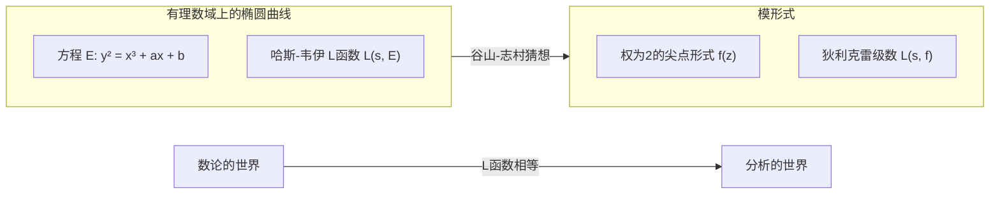

## 1. 前言：数论的巨星，[志村五郎](https://kenji.blog/zh-cn/p/shimura-goro/)

在现代数学的历史中，有一位对算术几何学领域产生决定性影响的日本数学家。他的名字是 **[志村五郎](https://kenji.blog/zh-cn/p/shimura-goro/)** （[Goro Shimura](https://kenji.blog/zh-cn/p/shimura-goro/)，1930年 - 2019年）。他的成就是不可估量的，他提出了后来成为证明“[费马大定理](https://kenji.blog/zh-cn/p/fermats-last-theorem/)”最大关键的“谷山-志村猜想”（现称为模块性定理），并构造了现代数论中极为重要的对象“志村簇”。

在这篇文章中，我们将一边回顾[志村五郎](https://kenji.blog/zh-cn/p/shimura-goro/)这位孤高数学家的一生，一边深入探讨他在数学界树立的不朽丰碑，以及其背后严酷的哲学与美学。毫不夸张地说，理解他的成就，就等于理解20世纪后期数学是如何发展的。

## 2. 早年岁月与数学的觉醒

### 2.1 战争的阴影与对求知的渴望

[志村五郎](https://kenji.blog/zh-cn/p/shimura-goro/)于1930年2月23日出生在静冈县滨松市。他的童年时代，正值第二次世界大战乌云密布的严酷时期。即使在战时物资匮乏和空袭的恐惧中，他那求知的探索心也从未消失。在战后的混乱时期，许多年轻人仅仅为了生存就已竭尽全力，而志村却培养了对数学、物理学和文学的深厚兴趣。

根据他的著作《记忆的切绘图》（The Map of My Life）所述，他自学阅读了高级数学书籍，有时甚至会去读难懂的法语数学书。这种“不靠任何人教导，凭自己的力量探索真理”的态度，成为志村一生数学风格的基础。

### 2.2 在东京大学的日子

1949年，志村进入东京大学理学部数学科。当时的日本数学界，虽然以高木贞治的类域论等为基础，但在战后复兴期，面临着如何跟上世界潮流的课题。在这里，志村遇到了 **[谷山丰](https://kenji.blog/zh-cn/p/taniyama-yutaka/)** （[Yutaka Taniyama](https://kenji.blog/zh-cn/p/taniyama-yutaka/)），两人后来结下了深厚的友谊，并命运与共。

谷山是一位拥有直觉和奔放发想的天才型数学家，而志村则是一位极度重视严密性，对逻辑细节绝不妥协的完美主义者。这两位形成鲜明对比的人的相遇，最终孕育出足以震撼数学界的巨大理论的种子。

## 3. 与[谷山丰](https://kenji.blog/zh-cn/p/taniyama-yutaka/)的相遇及“谷山-志村猜想”

### 3.1 宿命的相遇

据说志村和谷山变得亲密的契机，是围绕着一个数学问题的琐碎交流。他们互相认可对方的才华，日以继夜地沉浸在数学的讨论中。他们特别感兴趣的是代数几何和数论交叉点上的“复乘理论”的近代化。

### 3.2 1955年的日光研讨会

1955年，在栃木县日光市举办了关于代数整数论的国际研讨会。这次会议汇集了[安德烈·韦伊](https://kenji.blog/zh-cn/p/weil/)（[André Weil](https://kenji.blog/zh-cn/p/weil/)）和让-皮埃尔·塞尔（Jean-Pierre Serre）等世界顶级数学家。

为了这次研讨会，日本的年轻数学家们带来了各自的未解决问题并编制成问题集。其中包含了几道由[谷山丰](https://kenji.blog/zh-cn/p/taniyama-yutaka/)提出的问题。这就是后来被称为“谷山-志村猜想”的原型。

### 3.3 椭圆曲线与模形式的桥梁

用极度简单的话来说，谷山-志村猜想的主张是“所有有理数域上的椭圆曲线都是模曲线”。这是一个将两个完全不同的数学宇宙连接起来的惊天动地的猜想。

$$
E: y^2 = x^3 + ax + b \quad (a, b \in \mathbb{Q})
$$

由这种方程表示的椭圆曲线 $E$ 的性质，可以通过一个序列 $\{a_p\}$ 来刻画，该序列与每个素数 $p$ 取模时方程解的数量有关。由此，可以定义哈斯-韦伊的 $L$ 函数 $L(s, E)$。

$$
L(s, E) = \prod_{p \mid \Delta} (1 - a_p p^{-s})^{-1} \prod_{p \nmid \Delta} (1 - a_p p^{-s} + p^{1-2s})^{-1}
$$

另一方面，模形式 $f$ （在这里是权为2的尖点形式）是定义在复上半平面的高度对称的函数，从其傅里叶展开系数 $\{c_n\}$ 中可以定义它自己的 $L$ 函数 $L(s, f)$。

$$
f(z) = \sum_{n=1}^{\infty} c_n e^{2\pi i n z}
$$

谷山和志村的主张是， **“对于任何椭圆曲线 $E$，存在一个模形式 $f$，使得在所有的素数 $p$ 上都有 $a_p = c_p$ 成立”** ，也就是 $L(s, E) = L(s, f)$。这意味着数论的世界（椭圆曲线）和分析的世界（模形式）是完美对应的。

起初，这个猜想过于突兀，连韦伊等大数学家都持怀疑态度。然而，志村为这个直觉性的猜想提供了严密的数学支撑，并将其打磨成理论。

## 4. 谷山的悲剧与志村的决心

1958年，正当理论的构建要正式开始时，悲剧发生了。[谷山丰](https://kenji.blog/zh-cn/p/taniyama-yutaka/)在23岁的英年选择了结束自己的生命。他的遗书中写道“对迄今为止培育我的人们表示感谢”以及“连我自己也说不清楚原因的疲劳”。更令人痛心的是，几周后，与谷山订婚的女性也追随他而自尽。

对志村来说，失去了最好的理解者和合作者谷山，悲痛是无法估量的。但是，志村克服了悲伤，心中燃起了强烈的使命感：要亲手证明谷山留下的未完成的想法，并让世界承认它。志村随后前往美国，在普林斯顿大学等地继续研究，同时将这一猜想公式化为更精确的形式，提高了其国际知名度。正因为如此，这一猜想后来被称为“谷山-志村猜想”。

## 5. 走向[费马大定理](https://kenji.blog/zh-cn/p/fermats-last-theorem/)之路

### 5.1 弗雷的想法与里贝特的证明

时光流逝，到了20世纪80年代，谷山-志村猜想以戏剧性的方式与“[费马大定理](https://kenji.blog/zh-cn/p/fermats-last-theorem/)”结合在了一起。1984年，格哈德·弗雷（Gerhard Frey）表明，如果假设[费马大定理](https://kenji.blog/zh-cn/p/fermats-last-theorem/)存在反例 $a^n + b^n = c^n$，那么就可以由此构造出一条奇怪的椭圆曲线（弗雷曲线）。

$$
y^2 = x(x - a^n)(x + b^n)
$$

弗雷猜想，因为这条曲线具有非常异常的性质，所以它 **不可能是模曲线** （即不满足谷山-志村猜想）。如果这是对的，那就意味着“如果谷山-志村猜想被证明，[费马大定理](https://kenji.blog/zh-cn/p/fermats-last-theorem/)也就被证明了”。

1986年，肯·里贝特（Ken Ribet）完全证明了弗雷的猜想（Epsilon猜想）。由此，350年未解决的[费马大定理](https://kenji.blog/zh-cn/p/fermats-last-theorem/)，完全归结为了证明谷山-志村猜想的问题。

### 5.2 [安德鲁·怀尔斯](https://kenji.blog/zh-cn/p/wiles/)的证明

听到这个消息后站出来的，是英国数学家 **[安德鲁·怀尔斯](https://kenji.blog/zh-cn/p/wiles/)** （[Andrew Wiles](https://kenji.blog/zh-cn/p/wiles/)）。经过7年的秘密研究，他于1993年宣布了半稳定椭圆曲线的谷山-志村猜想的证明。期间发生了一次危机，证明中发现了一个重大缺陷，但在他以前的学生理查德·泰勒（Richard Taylor）的协助下，于1994年被完全修正。

怀尔斯对谷山-志村猜想（的一部分）的证明，就意味着[费马大定理](https://kenji.blog/zh-cn/p/fermats-last-theorem/)的完全证明。这是数学史上最伟大的戏剧之一。

### 5.3 志村的反应：“我早就说过了”

当怀尔斯的证明被公布，全世界都陷入狂热的漩涡时，有记者询问[志村五郎](https://kenji.blog/zh-cn/p/shimura-goro/)的感想，他平静但有力地回答道：

> **"I told you so."** （我早就告诉过你们了）

这句话蕴含着他对自己（以及谷山）的直觉是正确的绝对自信，以及经过漫长岁月终于被证明的深深感慨。他完全没有感到惊讶；对他来说，真理迟早会被证明，这是 **不言而喻** 的。1999年，克里斯托夫·布勒伊、布莱恩·康拉德、弗雷德·戴蒙德和理查德·泰勒等人完全证明了所有椭圆曲线的谷山-志村猜想，它成为了一个确凿的定理，即“模块性定理”。

## 6. 志村簇：算术几何学的新地平线

虽然常被谷山-志村猜想的光芒所掩盖，但在专业数学的世界里，让[志村五郎](https://kenji.blog/zh-cn/p/shimura-goro/)的名字更加不可动摇的，是 **“志村簇”** （Shimura Varieties）理论。

### 6.1 复乘理论的高维化

19世纪的数学家克罗内克表明，利用具有复乘的椭圆曲线的等分点，可以构造出虚二次域的所有阿贝尔扩张（克罗内克的青春之梦）。志村致力于将此推广到高维阿贝尔簇的宏大项目。

他使用约化代数群和埃尔米特对称域，构造了巨大的几何对象，这些对象是模曲线的高维类似物。这就是“志村簇”。志村簇拥有极其丰富的结构，是数论、代数几何和表示论交汇的场所。

### 6.2 现代数学中志村簇的地位

现在，志村簇在罗伯特·朗兰兹（Robert Langlands）提出的“朗兰兹纲领”中发挥着核心作用。在这个将伽罗瓦群的表示与自守表示联系起来的宏大纲领中，志村簇是几何地实现这种对应关系不可或缺的舞台。他建立的理论成为几十年后数学发展的基础，这也证明了志村的先见之明。

## 7. 孤高数学家的真实面貌：他的哲学与美学

### 7.1 绝不妥协的严厉态度

[志村五郎](https://kenji.blog/zh-cn/p/shimura-goro/)对数学保持着极其严厉和绝不妥协的态度。在他的论文和著作中，他彻底排除了模糊的表达和不完整的证明。有时，他也会对其他数学家的错误或不足进行毫不留情的批评，许多数学家因为他的严厉而对他感到敬畏。

但是，这种严厉也是针对他自己的。他坚信“数学必须是美的”，厌恶丑陋的证明和人为造作的理论。追求自然之美和绝对真理的态度，是他数学的根基。

### 7.2 伊万里瓷器与文学造诣

在离开严酷的数学世界时，志村是一位热情的古美术，特别是 **伊万里瓷器** 的收藏家和研究者。他拥有如此深厚的知识，甚至用英语撰写了关于伊万里瓷器的专业书籍，他热爱其中蕴含的日本传统审美意识。

同时，他精通日本文学和中国古典文学，他的文章中点缀着深厚的修养和丰富的词汇。他那逻辑性强、文雅的思考，或许正是由这种对文学和艺术的深刻理解所支撑的。

### 7.3 《记忆的切绘图》所讲述的

在晚年出版的自传体散文《记忆的切绘图》中，坦率地讲述了他敏锐的才智、偶尔展现的幽默，以及对他所爱的人（特别是[谷山丰](https://kenji.blog/zh-cn/p/taniyama-yutaka/)）的深厚感情。读这本书，可以了解到人类[志村五郎](https://kenji.blog/zh-cn/p/shimura-goro/)那复杂而丰富的内心世界，而不仅仅是“严厉的数学家”这一刻板印象。

## 8. 结语：[志村五郎](https://kenji.blog/zh-cn/p/shimura-goro/)留下的光芒

2019年5月3日，[志村五郎](https://kenji.blog/zh-cn/p/shimura-goro/)在美国新泽西州结束了89岁的一生。即使他离开了这个世界，他的名字也作为“谷山-志村猜想”和“志村簇”永远刻在了数学的史册上。

从战后的废墟中出发，[志村五郎](https://kenji.blog/zh-cn/p/shimura-goro/)仅仅依靠自己的智慧和坚韧的意志，攀登上了世界数学的顶峰。他的一生表明，探求真理的人类精神是多么崇高，能创造出多么伟大的事物。

挑战数论未解决问题的现代数学家们，至今仍在[志村五郎](https://kenji.blog/zh-cn/p/shimura-goro/)开辟的广阔大地上继续前行。他点燃的数学之光，今后也必将长久而耀眼地照耀下去。
