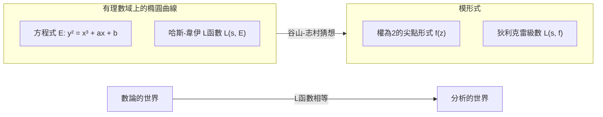

## 1. 前言：數論的巨星，[志村五郎](https://kenji.blog/zh-tw/p/shimura-goro/)

在現代數學的歷史中，有一位對算術幾何學領域產生決定性影響的日本數學家。他的名字是 **[志村五郎](https://kenji.blog/zh-tw/p/shimura-goro/)** （[Goro Shimura](https://kenji.blog/zh-tw/p/shimura-goro/)，1930年 - 2019年）。他的成就是不可估量的，他提出了後來成為證明「費馬大定理」最大關鍵的「谷山-志村猜想」（現稱為模組性定理），並構造了現代數論中極為重要的對象「志村簇」。

在這篇文章中，我們將一邊回顧[志村五郎](https://kenji.blog/zh-tw/p/shimura-goro/)這位孤高數學家的一生，一邊深入探討他在數學界樹立的不朽豐碑，以及其背後嚴酷的哲學與美學。毫不誇張地說，理解他的成就，就等於理解20世紀後期數學是如何發展的。

## 2. 早年歲月與數學的覺醒

### 2.1 戰爭的陰影與對求知的渴望

[志村五郎](https://kenji.blog/zh-tw/p/shimura-goro/)於1930年2月23日出生在靜岡縣濱松市。他的童年時代，正值第二次世界大戰烏雲密布的嚴酷時期。即使在戰時物資匱乏和空襲的恐懼中，他那求知的探索心也從未消失。在戰後的混亂時期，許多許多年輕人僅僅為了生存就已竭盡全力，而志村卻培養了對數學、物理學和文學的深厚興趣。

根據他的著作《記憶的切繪圖》（The Map of My Life）所述，他自學閱讀了高級數學書籍，有時甚至會去讀難懂的法語數學書。這種「不靠任何人教導，憑自己的力量探索真理」的態度，成為志村一生數學風格的基礎。

### 2.2 在東京大學的日子

1949年，志村進入東京大學理學部數學科。當時的日本數學界，雖然以[高木貞治](https://kenji.blog/zh-tw/p/takagi-teiji/)的類域論等為基礎，但在戰後復興期，面臨著如何跟上世界潮流的課題。在這裡，志村遇到了 **[谷山豐](https://kenji.blog/zh-tw/p/taniyama-yutaka/)** （[Yutaka Taniyama](https://kenji.blog/zh-tw/p/taniyama-yutaka/)），兩人後來結下了深厚的友誼，並命運與共。

谷山是一位擁有直覺和奔放發想的天才型數學家，而志村則是一位極度重視嚴密性，對邏輯細節絕不妥協的完美主義者。這兩位形成鮮明對比的人的相遇，最終孕育出足以震撼數學界的巨大理論的種子。

## 3. 與[谷山豐](https://kenji.blog/zh-tw/p/taniyama-yutaka/)的相遇及「谷山-志村猜想」

### 3.1 宿命的相遇

據說志村和谷山變得親密的契機，是圍繞著一個數學問題的瑣碎交流。他們互相認可對方的才華，日以繼夜地沉浸在數學的討論中。他們特別感興趣的是代數幾何和數論交叉點上的「複乘理論」的近代化。

### 3.2 1955年的日光研討會

1955年，在栃木縣日光市舉辦了關於代數整數論的國際研討會。這次會議匯集了[安德烈·韋伊](https://kenji.blog/zh-tw/p/weil/)（[André Weil](https://kenji.blog/zh-tw/p/weil/)）和讓-皮埃爾·塞爾（Jean-Pierre Serre）等世界頂級數學家。

為了這次研討會，日本的年輕數學家們帶來了各自的未解決問題並編製成問題集。其中包含了幾道由[谷山豐](https://kenji.blog/zh-tw/p/taniyama-yutaka/)提出的問題。這就是後來被稱為「谷山-志村猜想」的原型。

### 3.3 橢圓曲線與模形式的橋樑

用極度簡單的話來說，谷山-志村猜想的主張是「所有有理數域上的橢圓曲線都是模曲線」。這是一個將兩個完全不同的數學宇宙連接起來的驚天動地的猜想。

$$
E: y^2 = x^3 + ax + b \quad (a, b \in \mathbb{Q})
$$

由這種方程式表示的橢圓曲線 $E$ 的性質，可以通過一個序列 $\{a_p\}$ 來刻畫，該序列與每個質數 $p$ 取模時方程解的數量有關。由此，可以定義哈斯-韋伊的 $L$ 函數 $L(s, E)$。

$$
L(s, E) = \prod_{p \mid \Delta} (1 - a_p p^{-s})^{-1} \prod_{p \nmid \Delta} (1 - a_p p^{-s} + p^{1-2s})^{-1}
$$

另一方面，模形式 $f$ （在這裡是權為2的尖點形式）是定義在複上半平面的高度對稱的函數，從其傅立葉展開係數 $\{c_n\}$ 中可以定義它自己的 $L$ 函數 $L(s, f)$。

$$
f(z) = \sum_{n=1}^{\infty} c_n e^{2\pi i n z}
$$

谷山和志村的主張是， **「對於任何橢圓曲線 $E$，存在一個模形式 $f$，使得在所有的質數 $p$ 上都有 $a_p = c_p$ 成立」** ，也就是 $L(s, E) = L(s, f)$。這意味著數論的世界（橢圓曲線）和分析的世界（模形式）是完美對應的。

起初，這個猜想過於突兀，連韋伊等大數學家都持懷疑態度。然而，志村為這個直覺性的猜想提供了嚴密的數學支撐，並將其打磨成理論。

## 4. 谷山的悲劇與志村的決心

1958年，正當理論的建構要正式開始時，悲劇發生了。[谷山豐](https://kenji.blog/zh-tw/p/taniyama-yutaka/)在23歲的英年選擇了結束自己的生命。他的遺書中寫道「對迄今為止培育我的人們表示感謝」以及「連我自己也說不清楚原因的疲勞」。更令人痛心的是，幾週後，與谷山訂婚的女性也追隨他而自盡。

對志村來說，失去了最好的理解者和合作者谷山，悲痛是無法估量的。但是，志村克服了悲傷，心中燃起了強烈的使命感：要親手證明谷山留下的未完成的想法，並讓世界承認它。志村隨後前往美國，在普林斯頓大學等地繼續研究，同時將這一猜想公式化為更精確的形式，提高了其國際知名度。正因為如此，這一猜想後來被稱為「谷山-志村猜想」。

## 5. 走向費馬大定理之路

### 5.1 弗雷的想法與里貝特的證明

時光流逝，到了20世紀80年代，谷山-志村猜想以戲劇性的方式與「費馬大定理」結合在了一起。1984年，格哈德·弗雷（Gerhard Frey）表明，如果假設費馬大定理存在反例 $a^n + b^n = c^n$，那麼就可以由此構造出一條奇怪的橢圓曲線（弗雷曲線）。

$$
y^2 = x(x - a^n)(x + b^n)
$$

弗雷猜想，因為這條曲線具有非常異常的性質，所以它 **不可能是模曲線** （即不滿足谷山-志村猜想）。如果這是對的，那就意味著「如果谷山-志村猜想被證明，費馬大定理也就被證明了」。

1986年，肯·里貝特（Ken Ribet）完全證明了弗雷的猜想（Epsilon猜想）。由此，350年未解決的費馬大定理，完全歸結為了證明谷山-志村猜想的問題。

### 5.2 [安德魯·懷爾斯](https://kenji.blog/zh-tw/p/wiles/)的證明

聽到這個消息後站出來的，是英國數學家 **[安德魯·懷爾斯](https://kenji.blog/zh-tw/p/wiles/)** （[Andrew Wiles](https://kenji.blog/zh-tw/p/wiles/)）。經過7年的秘密研究，他於1993年宣布了半穩定橢圓曲線的谷山-志村猜想的證明。期間發生了一次危機，證明中發現了一個重大缺陷，但在他以前的學生理查德·泰勒（Richard Taylor）的協助下，於1994年被完全修正。

懷爾斯對谷山-志村猜想（的一部分）的證明，就意味著費馬大定理的完全證明。這是數學史上最偉大的戲劇之一。

### 5.3 志村的反應：「我早就說過了」

當懷爾斯的證明被公佈，全世界都陷入狂熱的漩渦時，有記者詢問[志村五郎](https://kenji.blog/zh-tw/p/shimura-goro/)的感想，他平靜但有力地回答道：

> **"I told you so."** （我早就告訴過你們了）

這句話蘊含著他對自己（以及谷山）的直覺是正確的絕對自信，以及經過漫長歲月終於被證明的深深感慨。他完全沒有感到驚訝；對他來說，真理遲早會被證明，這是 **不言而喻** 的。1999年，克里斯多福·布勒伊、布萊恩·康拉德、弗雷德·戴蒙德和理查德·泰勒等人完全證明了所有橢圓曲線的谷山-志村猜想，它成為了一個確鑿的定理，即「模組性定理」。

## 6. 志村簇：算術幾何學的新地平線

雖然常被谷山-志村猜想的光芒所掩蓋，但在專業數學的世界裡，讓[志村五郎](https://kenji.blog/zh-tw/p/shimura-goro/)的名字更加不可動搖的，是 **「志村簇」** （Shimura Varieties）理論。

### 6.1 複乘理論的高維化

19世紀的數學家克羅內克表明，利用具有複乘的橢圓曲線的等分點，可以構造出虛二次域的所有阿貝爾擴張（克羅內克的青春之夢）。志村致力於將此推廣到高維阿貝爾簇的宏大項目。

他使用約化代數群和埃爾米特對稱域，構造了巨大的幾何對象，這些對象是模曲線的高維類似物。這就是「志村簇」。志村簇擁有極其豐富的結構，是數論、代數幾何和表示論交匯的場所。

### 6.2 現代數學中志村簇的地位

現在，志村簇在羅伯特·朗蘭茲（Robert Langlands）提出的「朗蘭茲綱領」中發揮著核心作用。在這個將伽羅華群的表示與自守表示聯繫起來的宏大綱領中，志村簇是幾何地實現這種對應關係不可或缺的舞台。他建立的理論成為幾十年後數學發展的基礎，這也證明了志村的先見之明。

## 7. 孤高數學家的真實面貌：他的哲學與美學

### 7.1 絕不妥協的嚴厲態度

[志村五郎](https://kenji.blog/zh-tw/p/shimura-goro/)對數學保持著極其嚴厲和絕不妥協的態度。在他的論文和著作中，他徹底排除了模糊的表達和不完整的證明。有時，他也會對其他數學家的錯誤或不足進行毫不留情的批評，許多數學家因為他的嚴厲而對他感到敬畏。

但是，這種嚴厲也是針對他自己的。他堅信「數學必須是美的」，厭惡醜陋的證明和人為造作的理論。追求自然之美和絕對真理的態度，是他數學的根基。

### 7.2 伊萬里瓷器與文學造詣

在離開嚴酷的數學世界時，志村是一位熱情的古美術，特別是 **伊萬里瓷器** 的收藏家和研究者。他擁有如此深厚的知識，甚至用英語撰寫了關於伊萬里瓷器的專業書籍，他熱愛其中蘊含的日本傳統審美意識。

同時，他精通日本文學和中國古典文學，他的文章中點綴著深厚的修養和豐富的詞彙。他那邏輯性強、文雅的思考，或許正是由這種對文學和藝術的深刻理解所支撐的。

### 7.3 《記憶的切繪圖》所講述的

在晚年出版的自傳體散文《記憶的切繪圖》中，坦率地講述了他敏銳的才智、偶爾展現的幽默，以及對他所愛的人（特別是[谷山豐](https://kenji.blog/zh-tw/p/taniyama-yutaka/)）的深厚感情。讀這本書，可以了解到人類[志村五郎](https://kenji.blog/zh-tw/p/shimura-goro/)那複雜而豐富的內心世界，而不僅僅是「嚴厲的數學家」這一刻板印象。

## 8. 結語：[志村五郎](https://kenji.blog/zh-tw/p/shimura-goro/)留下的光芒

2019年5月3日，[志村五郎](https://kenji.blog/zh-tw/p/shimura-goro/)在美國新澤西州結束了89歲的一生。即使他離開了這個世界，他的名字也作為「谷山-志村猜想」和「志村簇」永遠刻在了數學的史冊上。

從戰後的廢墟中出發，[志村五郎](https://kenji.blog/zh-tw/p/shimura-goro/)僅僅依靠自己的智慧和堅韌的意志，攀登上了世界數學的頂峰。他的一生表明，探求真理的人類精神是多麼崇高，能創造出多麼偉大的事物。

挑戰數論未解決問題的現代數學家們，至今仍在[志村五郎](https://kenji.blog/zh-tw/p/shimura-goro/)開闢的廣闊大地上繼續前行。他點燃的數學之光，今後也必將長久而耀眼地照耀下去。
