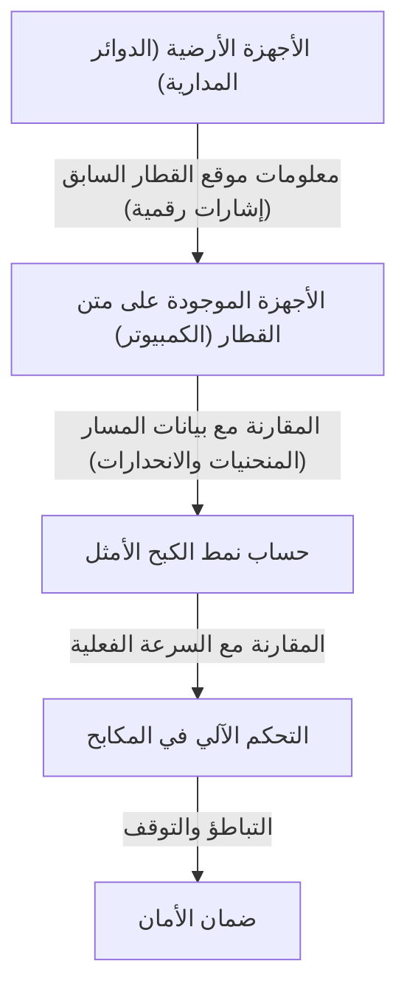

# آلية عمل قطار شينكانسن: مسيرة اليابان في الجمع بين الأمان والسرعة الفائقة

حافظ قطار شينكانسن الياباني، منذ انطلاق خط توكايدو شينكانسن في عام 1964، على سجل مذهل يتمثل في انعدام حوادث وفيات الركاب لأكثر من نصف قرن. هذا الإنجاز ليس مجرد صدفة، بل هو ثمرة أنظمة أمان متداخلة ومعقدة، وابتكارات تكنولوجية مستمرة. في هذا المقال، سنتعمق في التقنيات الأساسية التي تمكن الشينكانسن من التوفيق بين المتطلبين المتعارضين وهما "الأمان" و"السرعة الفائقة" بمستوى عالٍ من الدقة.

## 1. الاعتماد المطلق على نظام الحماية من الفشل (Fail-Safe) من خلال نظام التحكم الآلي في القطارات (ATC)

أهم نظام عند الحديث عن أمان الشينكانسن هو نظام ATC (التحكم الآلي في القطارات: Automatic Train Control). في السكك الحديدية التقليدية، كان السائق يتحقق بصريًا من الإشارات الموجودة على جانب المسار ويقوم بتشغيل المكابح يدويًا. ومع ذلك، في القيادة بسرعات تتجاوز 200 كم/ساعة، فإن الاعتماد على الرؤية البشرية وسرعة رد الفعل يعتبر أمرًا خطيرًا للغاية.

يقوم نظام ATC باستمرار بحساب السرعة القصوى (السرعة المسموح بها) التي يمكن للقطار أن يسير بها، وذلك بناءً على المسافة بينه وبين القطار الذي أمامه وظروف المسار (المنحنيات، والانحدارات، إلخ)، ويعرضها على لوحة القيادة. إذا تجاوزت السرعة الفعلية للقطار هذه السرعة المسموح بها، يقوم النظام تلقائيًا بتفعيل المكابح، وإبطاء القطار إلى سرعة آمنة، أو إيقافه تمامًا.

### تطور نظام ATC الرقمي

في نظام ATC التناظري الأولي، تم تقسيم الدوائر المدارية (الأنظمة التي تستخدم القضبان كجزء من دائرة كهربائية) إلى أقسام معينة (أقسام مغلقة)، وتم تعيين حد سرعة واحد (على سبيل المثال، 210 كم/ساعة، 160 كم/ساعة، 30 كم/ساعة، إلخ) لكل قسم. مع هذا النظام، كانت هناك حاجة إلى تقليل السرعة تدريجيًا، مما أدى إلى مشاكل مثل تدهور راحة الركوب وإهدار الوقت في توقيت الكبح.

في قطارات الشينكانسن الحديثة (مثل ATC-NS في توكايدو شينكانسن و DS-ATC في توهوكو شينكانسن)، تم اعتماد "نظام ATC الرقمي". في نظام ATC الرقمي، يستقبل القطار فقط معلومات موقع القطار الذي أمامه من المحطات الأرضية، ويقوم الكمبيوتر الموجود على متن القطار بحساب نمط الكبح الأمثل (منحنى التباطؤ) بشكل مستمر بناءً على أداء مكابح القطار نفسه وبيانات المسار (الانحدارات والمنحنيات).

بفضل هذا "التحكم في الكبح بخطوة واحدة"، تم التخلص من التباطؤ غير الضروري، مما أدى إلى تحسين راحة الركوب وزيادة هائلة في سعة المسار (مدى تقارب تشغيل القطارات). علاوة على ذلك، حتى في حالة تعطل جزء من النظام، يتم تطبيق مبدأ التصميم "Fail-Safe" (آمن من الفشل)، والذي يعمل دائمًا في الجانب الآمن (باتجاه إيقاف القطار).

## 2. تخفيف وزن الهيكل بشكل جذري وتطور المواد

تزداد الطاقة الحركية للقطار الذي يسير بسرعة عالية بشكل يتناسب طرديًا مع مربع السرعة. لذلك، من أجل تحقيق سرعات أعلى وتوفير الطاقة، بالإضافة إلى تقليل الأضرار التي تلحق بالمسارات، فإن تخفيف وزن هيكل القطار أمر ضروري.

في الجيل الأول من شينكانسن (سلسلة 0)، تم استخدام الصلب (الصلب العادي)، ولكن من خلال السلسلة 100 والسلسلة 200 اللاحقة، أصبحت سبائك الألومنيوم هي السائدة. وتحديداً في القطارات الحالية (مثل سلسلة N700 وسلسلة E5)، تم اعتماد "هيكل الألومنيوم المزدوج الجلد" ذو البنية المجوفة.

### مزايا هيكل الألومنيوم المزدوج الجلد

هيكل الألومنيوم المزدوج الجلد هو هيكل يمتلك حرفياً "جلداً مزدوجاً" من الألومنيوم. على غرار المقطع العرضي للورق المقوى، يتم تصنيعه عن طريق لحام أجزاء مبثوقة تتميز بأضلاع تقوية على شكل جمالون بين لوحين من الألومنيوم.

1. **خفيف الوزن وعالي الصلابة**: بالمقارنة مع الهيكل أحادي الجلد التقليدي (طريقة ربط الألواح بالإطار)، فهو أخف وزنًا بكثير، ومع ذلك يتمتع بصلابة عالية (مقاومة الانحناء والالتواء) يمكنها تحمل سرعات الشينكانسن العالية.
2. **تحسين عزل الصوت**: نظرًا لأن المساحة بين اللوحين تعمل كطبقة هوائية، فإنها تمنع دخول الضوضاء الخارجية (ضوضاء السير والضوضاء الديناميكية الهوائية) إلى داخل القطار.
3. **تقليل تكاليف التصنيع وإعادة التدوير**: يقلل استخدام الأجزاء المبثوقة الكبيرة من عدد نقاط اللحام، مما يبسط عملية التصنيع. بالإضافة إلى ذلك، نظرًا لاستخدام الكثير من مادة واحدة (الألومنيوم)، فإن إعادة تدوير القطار بعد خروجه من الخدمة أمر سهل.

بالإضافة إلى ذلك، يتم استخدام الفولاذ عالي الشد وأجزاء الصب الخاصة في أجزاء العربات (الجزء الذي توجد به العجلات)، مما يؤدي إلى تقليل الوزن بالجرامات.

## 3. راحة ركوب مثالية من خلال النوابض الهوائية والتعليق النشط

القدرة على السفر بسرعة 300 كم/ساعة دون سكب القهوة داخل القطار هي بفضل نظام التعليق المتقدم.

### النوابض الهوائية ونظام إمالة الهيكل

يتم تركيب "نوابض هوائية" بين هيكل القطار والعربات. وهي عبارة عن نوابض تستخدم مرونة الهواء المضغوط، وهي أكثر نعومة من النوابض اللولبية المعدنية وتمتص الاهتزازات الدقيقة بشكل فعال.

في أحدث القطارات مثل سلسلة N700، تم تجهيزها بـ "نظام إمالة الهيكل" الذي يعزز تطبيق هذه النوابض الهوائية. عند الاقتراب من المنحنيات، يتم نفخ النوابض الهوائية الخارجية وتفريغ النوابض الداخلية، مما يؤدي إلى إمالة الهيكل بحد أقصى يتراوح بين 1 إلى 1.5 درجة. يؤدي هذا إلى إلغاء قوة الطرد المركزي المؤثرة على الركاب، مما يسمح للقطار بالمرور عبر المنحنيات دون التباطؤ مع الحفاظ على راحة الركوب.

### نظام التعليق النشط الكامل

لقمع الاهتزازات من جانب إلى آخر، تم أيضًا إدخال "نظام التعليق النشط الكامل". عندما تكتشف أجهزة الاستشعار المثبتة على الهيكل تسارع التمايل الجانبي، يقوم الكمبيوتر بإجراء حسابات فورية ويقوم بتشغيل أسطوانات هيدروليكية (أو مشغلات كهربائية) بين العربات والهيكل لتطبيق قوة قسرية في الاتجاه الذي يلغي التمايل.
يقلل هذا بشكل كبير من الاهتزازات الجانبية المفاجئة التي تحدث عند دخول الأنفاق أو عند مرور القطارات ببعضها البعض.

## 4. بلورة ديناميكا الموائع لمنع موجات الضغط الجزئي (فرقعة الأنفاق)

يتميز تصميم العربة الأمامية للشينكانسن بشكل فريد للغاية يشبه منقار خلد الماء أو الطيور. هذا ليس مجرد تصميم، بل هو نتيجة لنهج ديناميكا الموائع لحل مشكلة "موجات الضغط الجزئي (موجات الضغط الجزئي للأنفاق)"، وهي مشكلة بيئية فريدة من نوعها في السكك الحديدية عالية السرعة.

### آلية فرقعة الأنفاق

عندما يندفع قطار يسير بسرعة عالية إلى نفق، يتم دفع الهواء داخل النفق إلى الأمام مثل المكبس، مما يولد موجة ضغط. عندما تنتقل هذه الموجة عبر النفق بسرعة الصوت وتخرج من الطرف الآخر، فإنها تولد صوتًا منخفض التردد (موجة ضغط جزئي) يشبه صوت انفجار "بووم". ويسبب هذا مشاكل بيئية، مثل اهتزاز نوافذ المنازل المجاورة.

### تطور شكل الواجهة الأمامية

لتقليل موجة الضغط الجزئي هذه، من الضروري تخفيف السرعة التي يتم بها سحق الهواء (تدرج تغير الضغط) عندما يدخل القطار النفق.

- **سلسلة 0**: مقدمة مستديرة على شكل زلابية. في سرعات ذلك الوقت (210 كم/ساعة)، لم تكن تمثل مشكلة.
- **سلسلة 500**: لتحقيق سرعة 300 كم/ساعة، تم اعتماد مقدمة حادة ومدببة يصل طولها إلى 15 مترًا، مستوحاة من منقار طائر الرفراف. أدى ذلك إلى تقليل موجات الضغط الجزئي بشكل كبير، ولكن كان له عيب وهو تضييق مساحة مقصورة الركاب.
- **سلسلة N700**: شكل يسمى "Aero Double Wing" (الجناح المزدوج الديناميكي). من خلال الأسطح المنحنية ثلاثية الأبعاد المعقدة التي تشبه طائرًا يفرد جناحيه، يتم تقليل طول المقدمة إلى حوالي 10.7 مترًا مع تشتيت موجات الضغط الجزئي بشكل مثالي.
- **سلسلة E5**: تم تمديد طول المقدمة إلى 15 مترًا واعتماد شكل يسمى "Arrow Line" (خط السهم). وهو يجمع بين التشغيل التجاري عند 320 كم/ساعة - وهي السرعة القصوى في اليابان - والأداء البيئي.

هذه الأشكال المعقدة للواجهة الأمامية مشتقة من عمليات محاكاة ضخمة لتحليل الموائع (CFD) بواسطة أجهزة الكمبيوتر العملاقة، ويمكن القول بحق إنها تبلور للتكنولوجيا التي تنافس هندسة الطيران الحديثة.

## الخاتمة

الشينكانسن هو نظام ضخم لا يكتمل إلا بتكامل وثيق بين العربات، والمسارات، وأنظمة الإشارات، والمعرفة البشرية التي تديرها. ضمان الأمان المطلق بواسطة نظام ATC، وتقنيات تخفيف الوزن والتعليق التي تم السعي إليها إلى أقصى حد، وديناميكا الموائع للتناغم مع البيئة. إن تراكم كل هذه التقنيات الفردية هو ما خلق أسطورة خلوه من الحوادث لأكثر من نصف قرن، ولا يزال مستمرًا في التطور حتى اليوم.
لا تعد تكنولوجيا الشينكانسن اليابانية مجرد وسيلة نقل، بل أصبحت معيارًا عالميًا يوضح كيف يجب أن تكون البنية التحتية المستقبلية.
