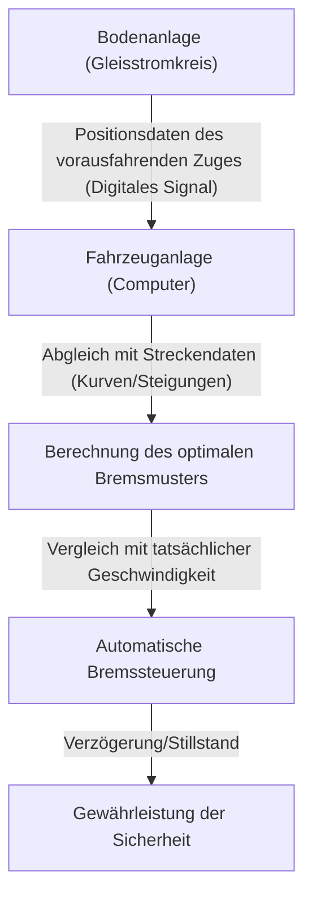

# Die Technologie des Shinkansen: Japans Weg zur Vereinbarkeit von Sicherheit und Hochgeschwindigkeit

Japans Shinkansen hält seit der Eröffnung der Tokaido-Shinkansen-Linie im Jahr 1964 eine erstaunliche Bilanz: über ein halbes Jahrhundert ohne einen einzigen tödlichen Unfall von Fahrgästen. Dieser Erfolg ist kein reiner Zufall, sondern das Ergebnis tiefgreifender Sicherheitssysteme und kontinuierlicher technologischer Innovation. In diesem Artikel werden wir uns eingehend mit den Kerntechnologien befassen, die es dem Shinkansen ermöglichen, die scheinbar widersprüchlichen Anforderungen von "Sicherheit" und "Hochgeschwindigkeit" auf höchstem Niveau miteinander zu vereinbaren.

## 1. Absolute Fail-Safe-Funktionalität durch ATC (Automatic Train Control)

Das wichtigste System, wenn man von der Sicherheit des Shinkansen spricht, ist das ATC (Automatic Train Control - Automatische Zugsteuerung). Bei herkömmlichen Eisenbahnen überprüften die Triebfahrzeugführer die streckenseitigen Signale visuell und betätigten die Bremsen manuell. Bei Geschwindigkeiten von über 200 km/h ist es jedoch extrem gefährlich, sich auf das menschliche Sehvermögen und die Reaktionsgeschwindigkeit zu verlassen.

Das ATC berechnet kontinuierlich die zulässige Höchstgeschwindigkeit, mit der der Zug fahren darf (die erlaubte Geschwindigkeit), basierend auf der Entfernung zum vorausfahrenden Zug und den Streckenbedingungen (Kurven, Steigungen usw.), und zeigt diese im Führerstand an. Wenn die tatsächliche Geschwindigkeit des Zuges diese zulässige Geschwindigkeit überschreitet, aktiviert das System automatisch die Bremsen, um den Zug auf eine sichere Geschwindigkeit abzubremsen oder ihn vollständig zum Stillstand zu bringen.

### Die Evolution des digitalen ATC

Beim frühen analogen ATC wurden Gleisstromkreise (ein System, das die Schienen als Teil eines elektrischen Stromkreises nutzt) in bestimmte Abschnitte (Blockabschnitte) unterteilt, und jedem Abschnitt wurde eine einzige Geschwindigkeitsbegrenzung zugewiesen (z. B. 210 km/h, 160 km/h, 30 km/h usw.). Bei dieser Methode musste die Geschwindigkeit stufenweise reduziert werden, was zu Problemen wie einer Verschlechterung des Fahrkomforts und Ineffizienzen beim Bremszeitpunkt führte.

Moderne Shinkansen-Züge (wie z. B. das ATC-NS auf der Tokaido-Shinkansen oder das DS-ATC auf der Tohoku-Shinkansen) verwenden "digitales ATC". Beim digitalen ATC werden nur die Positionsdaten des vorausfahrenden Zuges vom Boden empfangen, und der fahrzeugseitige Computer berechnet kontinuierlich das optimale Bremsmuster (Verzögerungskurve) basierend auf der Bremsleistung des eigenen Zuges und den Streckendaten (Steigungen und Kurven).

Durch diese "Einstufen-Bremssteuerung" entfällt unnötiges Abbremsen, der Fahrkomfort wird verbessert und die Streckenkapazität (wie dicht die Züge hintereinander fahren können) wird drastisch erhöht. Darüber hinaus wird die Designphilosophie des "Fail-Safe", bei der das System selbst im Falle eines teilweisen Ausfalls immer auf der sicheren Seite arbeitet (indem es den Zug anhält), strikt angewendet.

## 2. Gründliche Gewichtsreduzierung der Karosserie und Materialentwicklung

Die kinetische Energie eines mit hoher Geschwindigkeit fahrenden Zuges nimmt proportional zum Quadrat der Geschwindigkeit zu. Daher ist eine Reduzierung des Gewichts der Wagenkästen unerlässlich, um höhere Geschwindigkeiten und Energieeinsparungen zu erreichen sowie die Schäden an den Gleisen zu minimieren.

Der Shinkansen der Serie 0 der ersten Generation verwendete Stahl (normalen Kohlenstoffstahl), aber bei den nachfolgenden Serien 100 und 200 wurde Aluminiumlegierung zum Mainstream. Insbesondere bei den heutigen Zügen (wie der Serie N700 und E5) wird eine hohle "Aluminium-Double-Skin-Struktur" (Doppelwand-Struktur) eingesetzt.

### Vorteile der Aluminium-Double-Skin-Struktur

Die Aluminium-Double-Skin-Struktur ist, wie der Name schon sagt, eine Struktur mit einer "doppelten Haut" aus Aluminium. Ähnlich wie der Querschnitt von Wellpappe besteht sie aus stranggepressten Profilen mit fachwerkartigen Verstärkungsrippen, die zwischen zwei Aluminiumplatten eingeschweißt sind.

1. **Leicht und hochgradig steif**: Im Vergleich zur herkömmlichen Single-Skin-Struktur (bei der Platten an einem Rahmen befestigt werden) ist sie viel leichter, verfügt aber über eine hohe Steifigkeit (Beständigkeit gegen Biegung und Torsion), die den Belastungen von Hochgeschwindigkeitsfahrten standhält.
2. **Verbesserte Schalldämmung**: Da der Raum zwischen den beiden Paneelen als Luftschicht fungiert, verhindert sie wirksam, dass Außenlärm (Fahrgeräusche und aerodynamischer Lärm) in den Innenraum eindringt.
3. **Reduzierung der Herstellungskosten und Recycling**: Die Verwendung großer, stranggepresster Profile reduziert die Anzahl der Schweißnähte und vereinfacht den Herstellungsprozess. Da außerdem ein großer Teil aus einem einzigen Material (Aluminium) besteht, ist das Recycling nach der Außerdienststellung einfach.

Darüber hinaus werden in den Bauteilen der Drehgestelle (den Teilen mit den Rädern) hochfester Stahl und spezielle Gussteile verwendet, um das Gewicht grammweise zu reduzieren.

## 3. Ultimativer Fahrkomfort durch Luftfedern und aktive Federung

Die Fähigkeit, den Fahrkomfort so weit aufrechtzuerhalten, dass bei 300 km/h kein Kaffee verschüttet wird, ist das Ergebnis hochentwickelter Federungssysteme.

### Luftfedern und Neigetechnik-Systeme

Zwischen den Wagenkästen und den Drehgestellen des Shinkansen sind "Luftfedern" installiert. Diese Federn nutzen die Elastizität von Druckluft, sind weicher als metallische Schraubenfedern und absorbieren wirkungsvoll kleinste Vibrationen.

Die neuesten Fahrzeuge, wie die Serie N700, sind mit einem "Neigetechnik-System" ausgestattet, das eine Weiterentwicklung dieser Luftfedern darstellt. Wenn sich der Zug einer Kurve nähert, füllt sich die äußere Luftfeder, während sich die innere zusammenzieht, wodurch sich der Wagenkasten um bis zu 1 bis 1,5 Grad neigt. Dadurch wird die auf die Passagiere einwirkende Zentrifugalkraft neutralisiert, sodass der Zug Kurven ohne Geschwindigkeitsverlust und unter Beibehaltung einer komfortablen Fahrt durchfahren kann.

### Volllaktive Federung (Full Active Suspension)

Um das seitliche Schwanken zu unterdrücken, wurde auch ein "vollaktives Federungssystem" eingeführt. Wenn Sensoren an der Karosserie eine seitliche Beschleunigung (Schwanken) erkennen, berechnet ein Computer sofort und betätigt Hydraulikzylinder (oder elektrische Aktuatoren) zwischen dem Drehgestell und dem Wagenkasten, um eine Gegenkraft zur Unterdrückung des Schwankens auszuüben.
Dadurch wird das plötzliche seitliche Schwanken, das beim Einfahren in einen Tunnel oder bei Zugkreuzungen auftritt, drastisch reduziert.

## 4. Kristallisation der Strömungsmechanik zur Vermeidung von Mikrodruckwellen (Tunnelknall)

Der vorderste Wagen des Shinkansen hat eine sehr markante Form, die dem Schnabel eines Schnabeltiers oder eines Vogels ähnelt. Dies ist nicht nur ein Design, sondern das Ergebnis eines strömungsmechanischen Ansatzes zur Lösung eines für Hochgeschwindigkeitszüge spezifischen Umweltproblems: der "Mikrodruckwelle" (Tunnelmikrodruckwelle).

### Der Mechanismus des Tunnelknalls

Wenn ein Zug mit hoher Geschwindigkeit in einen Tunnel einfährt, wird die Luft im Tunnel wie von einem Kolben nach vorne gedrückt, wodurch eine Kompressionswelle entsteht. Wenn sich diese Kompressionswelle mit Schallgeschwindigkeit durch den Tunnel ausbreitet und an der gegenüberliegenden Öffnung austritt, erzeugt sie ein explosionsartiges, tieffrequentes Geräusch (Mikrodruckwelle), das oft als "Boom" wahrgenommen wird. Dies verursacht Umweltprobleme, wie z. B. das Erschüttern von Fensterscheiben in nahegelegenen Wohnhäusern.

### Die Evolution der Nasenform

Um diese Mikrodruckwelle zu unterdrücken, muss die Geschwindigkeit, mit der die Luft beim Einfahren des Zuges in den Tunnel komprimiert wird (der Gradient der Druckänderung), geglättet werden.

- **Serie 0**: Abgerundete "Kloß-Nase". Bei den damaligen Geschwindigkeiten (210 km/h) war dies kein Problem.
- **Serie 500**: Um 300 km/h zu erreichen, wurde eine bis zu 15 Meter lange, spitz zulaufende Nasenform gewählt, die vom Schnabel eines Eisvogels inspiriert war. Die Mikrodruckwelle wurde dadurch deutlich reduziert, der Nachteil war jedoch eine Verkleinerung des Fahrgastraumvolumens.
- **Serie N700**: Eine Form namens "Aero Double Wing". Durch komplexe dreidimensionale gekrümmte Oberflächen, ähnlich einem Vogel mit ausgebreiteten Flügeln, wird die Länge der Nase auf etwa 10,7 Meter begrenzt, während die Mikrodruckwellen optimal gestreut werden.
- **Serie E5**: Die Nase wurde weiter auf 15 Meter verlängert und eine Form namens "Arrow Line" (Pfeillinie) wurde übernommen. Damit lassen sich Japans höchste Betriebsgeschwindigkeit von 320 km/h und Umweltverträglichkeit miteinander in Einklang bringen.

Diese komplexen Nasenformen sind das Ergebnis umfangreicher Strömungssimulationen (CFD), die auf Supercomputern durchgeführt wurden, und können wahrhaftig als Kristallisation von Technologie bezeichnet werden, die mit der modernen Luft- und Raumfahrttechnik vergleichbar ist.

## Fazit

Der Shinkansen ist ein riesiges System, das nur durch die Dreifaltigkeit von Fahrzeugen, Schienen, Signalsystemen und dem Know-how der Menschen, die sie bedienen, zustande kommt. Die absolute Sicherheitsgarantie durch ATC, die extrem angestrebte Gewichtsreduzierung und Federungstechnologie sowie die Aerodynamik im Einklang mit der Umwelt. Die Anhäufung jeder einzelnen dieser Technologien hat den Mythos von über einem halben Jahrhundert ohne Unfall geschaffen, der sich auch heute noch weiterentwickelt.
Japans Shinkansen-Technologie ist weit mehr als nur ein Transportmittel; sie hat sich zu einem globalen Maßstab dafür entwickelt, wie die Infrastruktur der Zukunft aussehen sollte.
