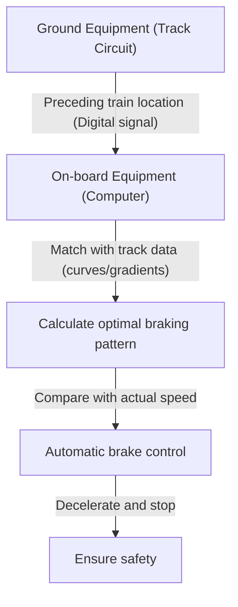

# How the Shinkansen Works: Japan's Path to Balancing Safety and High Speed

Since the inauguration of the Tokaido Shinkansen in 1964, Japan's Shinkansen has maintained an astonishing record of zero passenger fatalities for over half a century. This achievement is not mere coincidence; it is the result of multiple layers of safety systems and continuous technological innovation. In this article, we will delve deeply into the core technologies that allow the Shinkansen to achieve a high-level balance between the conflicting demands of "safety" and "high speed."

## 1. Absolute Fail-Safe with ATC (Automatic Train Control)

The most important system when discussing Shinkansen safety is ATC (Automatic Train Control). In conventional railways, train drivers visually checked wayside signals and manually applied the brakes. However, at high speeds exceeding 200 km/h, relying on human vision and reaction times is extremely dangerous.

ATC constantly calculates the maximum permissible speed for the train based on the distance to the preceding train and track conditions (curves, gradients, etc.), displaying it in the driver's cab. If the train's actual speed exceeds this permissible speed, the system automatically applies the brakes, decelerating or stopping the train safely.

### Evolution of Digital ATC

In early analog ATC, track circuits (systems using rails as part of an electrical circuit) were divided into fixed blocks (block sections), and a single speed limit (e.g., 210 km/h, 160 km/h, 30 km/h) was assigned to each section. Because this method required reducing speed in steps, it caused issues such as deteriorated ride comfort and inefficient brake timing.

Modern Shinkansen (such as Tokaido Shinkansen's ATC-NS and Tohoku Shinkansen's DS-ATC) employ "Digital ATC." In Digital ATC, the train receives only the position information of the preceding train from the ground equipment. The on-board computer continuously calculates the optimal braking pattern (deceleration curve) based on the train's braking performance and track data (gradients and curves).

This "single-step brake control" eliminates unnecessary deceleration, improving ride comfort while dramatically increasing track capacity (how densely trains can run). Furthermore, a "fail-safe" design philosophy is strictly implemented, ensuring that even if part of the system fails, it always operates on the safe side (the direction of stopping the train).

## 2. Extreme Weight Reduction and Material Evolution

The kinetic energy of a train traveling at high speeds increases in proportion to its mass and the square of its velocity. Therefore, reducing the weight of the car body is essential for achieving higher speeds, saving energy, and minimizing damage to the tracks.

The first-generation 0 Series Shinkansen used steel (carbon steel), but through the subsequent 100 Series and 200 Series, aluminum alloys became the mainstream. In particular, current trains (such as the N700 Series and E5 Series) utilize an "aluminum double-skin structure" with a hollow design.

### Advantages of the Aluminum Double-Skin Structure

The aluminum double-skin structure is, literally, a structure with an aluminum "double skin." Similar to a cross-section of cardboard, it is made by welding extruded profiles that have truss-like reinforcing ribs between two aluminum plates.

1. **Lightweight and High Rigidity**: Compared to conventional single-skin structures (attaching plates to a framework), it is significantly lighter yet possesses the high rigidity (resistance to bending and twisting) necessary to withstand the Shinkansen's high-speed travel.
2. **Improved Sound Insulation**: Because the space between the two panels acts as an air layer, it effectively prevents exterior noise (running noise and aerodynamic noise) from entering the cabin.
3. **Manufacturing Cost Reduction and Recycling**: Using large extruded profiles reduces the number of welding points, simplifying the manufacturing process. Additionally, because it predominantly uses a single material (aluminum), it is easy to recycle after the train is decommissioned.

Furthermore, components in the bogie (the part with wheels) also use high-tensile steel and special cast parts, achieving weight reduction down to the gram.

## 3. Ultimate Ride Comfort via Air Springs and Active Suspension

Riding at 300 km/h without spilling a drop of coffee is made possible by highly advanced suspension systems.

### Air Springs and Body Inclination Systems

"Air springs" are installed between the Shinkansen's car body and the bogie. These springs utilize the elasticity of compressed air; they are softer than metallic coil springs and effectively absorb microscopic vibrations.

The latest trains, such as the N700 Series, are equipped with a "body inclination system" that further applies these air springs. When approaching a curve, the outer air springs inflate and the inner ones deflate, tilting the car body by a maximum of 1 to 1.5 degrees. This counteracts the centrifugal force acting on passengers, allowing the train to pass through curves without decelerating while maintaining a comfortable ride.

### Full Active Suspension

To suppress lateral swaying, "full active suspension" has also been introduced. When sensors mounted on the car body detect the acceleration of lateral movement, a computer instantly performs calculations and operates hydraulic cylinders (or electric actuators) located between the bogie and car body to forcibly apply a counteracting force.
This dramatically reduces the sudden lateral swaying that occurs when entering tunnels or when trains pass each other.

## 4. Fluid Dynamics Crystallized to Prevent Micro-Pressure Waves (Tunnel Boom)

The lead car of a Shinkansen has a highly unique shape, resembling a platypus or a bird's beak. This is not a mere design choice; it is the result of a fluid dynamic approach to solving "micro-pressure waves" (tunnel micro-pressure waves), an environmental problem specific to high-speed railways.

### The Mechanism of Tunnel Boom

When a high-speed train plunges into a tunnel, the air inside is pushed forward like a piston, generating a compression wave. As this compression wave travels through the tunnel at the speed of sound and is emitted from the opposite exit, it creates a low-frequency sound resembling an explosion (micro-pressure wave) known as a "boom." This causes environmental issues, such as rattling the windows of nearby houses.

### Evolution of the Nose Shape

To suppress these micro-pressure waves, it is necessary to smooth out the speed at which air is compressed (the gradient of pressure change) when the train enters the tunnel.

- **0 Series**: A rounded, bullet-like nose. At the speeds of the time (210 km/h), this was not an issue.
- **500 Series**: To achieve 300 km/h, it adopted a sharp, pointed nose measuring up to 15 meters long, inspired by a kingfisher's beak. It significantly reduced micro-pressure waves but had the drawback of narrowing the cabin space.
- **N700 Series**: A shape called the "Aero Double-Wing." With complex three-dimensional curved surfaces resembling a bird spreading its wings, it optimally disperses micro-pressure waves while keeping the nose length to about 10.7 meters.
- **E5 Series**: Extending the nose length further to 15 meters, it adopts a shape known as the "Arrow Line." It achieves a balance between environmental performance and commercial operation at 320 km/h, the fastest in Japan.

These complex nose shapes are derived from massive computational fluid dynamics (CFD) simulations using supercomputers, truly representing the crystallization of technology on par with modern aerospace engineering.

## Conclusion

The Shinkansen is a massive system that is only realized when vehicles, tracks, signaling systems, and the know-how of the humans operating them come together as a trinity. Absolute safety guaranteed by ATC, extreme lightweighting and suspension technology pushed to the limit, and fluid dynamics harmonizing with the environment. The accumulation of each of these technologies has birthed the myth of over half a century without an accident, and it continues to evolve even now.
Japan's Shinkansen technology transcends a mere means of transportation; it has become a global benchmark showing what the infrastructure of the future should look like.
