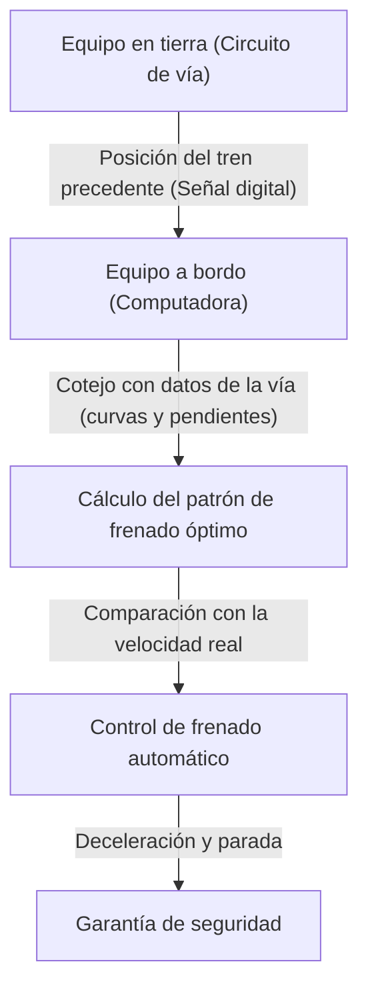

# El mecanismo del Shinkansen: La trayectoria japonesa que equilibra seguridad y alta velocidad

El Shinkansen de Japón ha mantenido un asombroso récord de cero muertes de pasajeros por accidentes durante más de medio siglo desde la inauguración del Tokaido Shinkansen en 1964. Este logro no es una mera coincidencia, sino el resultado de sistemas de seguridad de múltiples capas y de una innovación tecnológica constante. En este artículo, profundizaremos en las tecnologías centrales de cómo el Shinkansen equilibra a un alto nivel las exigencias contradictorias de "seguridad" y "alta velocidad".

## 1. Implementación exhaustiva del mecanismo a prueba de fallos mediante el ATC (Control Automático de Trenes)

El sistema más importante al hablar de la seguridad del Shinkansen es el ATC (Automatic Train Control: Control Automático de Trenes). En los ferrocarriles convencionales, el maquinista confirmaba visualmente las señales al lado de la vía y operaba los frenos manualmente. Sin embargo, en operaciones de alta velocidad que superan los 200 km/h, depender de la visión y la velocidad de reacción humanas es extremadamente peligroso.

El ATC calcula constantemente la velocidad máxima permitida (velocidad tolerable) a la que el tren puede circular, de acuerdo con la distancia respecto al tren precedente y las condiciones de la vía (curvas, pendientes, etc.), y la muestra en la cabina. Si la velocidad real del tren supera esta velocidad tolerable, el sistema aplica automáticamente los frenos, reduciendo la velocidad hasta un nivel seguro o deteniendo el tren por completo.

### La evolución del ATC digital

En los ATC analógicos iniciales, los circuitos de vía (sistemas que utilizan los rieles como parte de un circuito eléctrico) se dividían en secciones de longitud fija (tramos de bloqueo), y a cada sección se le asignaba un único límite de velocidad (por ejemplo, 210 km/h, 160 km/h, 30 km/h, etc.). Este método requería reducir la velocidad por etapas, lo que planteaba problemas como el deterioro del confort de marcha o el desperdicio en los tiempos de frenado.

En los Shinkansen modernos (por ejemplo, el ATC-NS del Tokaido Shinkansen y el DS-ATC del Tohoku Shinkansen), se ha adoptado el "ATC digital". En el ATC digital, solo se recibe la información de la posición del tren precedente desde las instalaciones en tierra, y la computadora a bordo calcula de forma continua el patrón de frenado óptimo (curva de deceleración) basándose en el rendimiento de frenado del propio tren y los datos de la vía (pendientes y curvas).

Gracias a este "control de frenado de una sola etapa", se eliminan las deceleraciones innecesarias, mejorando el confort del viaje e incrementando drásticamente la capacidad de la vía (la densidad con la que pueden circular los trenes). Además, incluso si parte del sistema falla, se aplica rigurosamente la filosofía de diseño "fail-safe", que siempre actúa hacia el lado seguro (en la dirección de detener el tren).

## 2. Reducción exhaustiva del peso de la carrocería y evolución de los materiales

La energía cinética de un tren que circula a alta velocidad aumenta en proporción al cuadrado de su velocidad. Por lo tanto, para lograr velocidades más altas, ahorrar energía y, además, reducir los daños a la vía, es indispensable aligerar el peso de los vagones.

En los Shinkansen de la serie 0 de primera generación se utilizaba acero (acero común), pero tras las series 100 y 200, la aleación de aluminio se convirtió en la norma. Especialmente en los vehículos actuales (como las series N700 y E5), se emplea una estructura hueca conocida como "estructura de aluminio de doble revestimiento" (aluminum double-skin structure).

### Ventajas de la estructura de aluminio de doble revestimiento

La estructura de aluminio de doble revestimiento es, literalmente, una estructura con una "doble piel" de aluminio. Similar a la sección transversal del cartón corrugado, se fabrica soldando perfiles extruidos que cuentan con nervaduras de refuerzo en forma de armadura (truss) entre dos placas de aluminio.

1. **Ligereza y alta rigidez**: En comparación con la estructura convencional de piel simple (un método de adherir placas a un armazón), es mucho más ligera pero posee una alta rigidez (resistencia a la flexión y la torsión) capaz de soportar el funcionamiento a alta velocidad del Shinkansen.
2. **Mejora del aislamiento acústico**: Dado que el espacio entre los dos paneles sirve como capa de aire, tiene el efecto de evitar que el ruido exterior (ruido de rodadura y ruido aerodinámico) penetre en el interior del tren.
3. **Reducción de costos de fabricación y reciclaje**: Al usar grandes perfiles extruidos, se reduce el número de puntos de soldadura, simplificando el proceso de fabricación. Además, al utilizar una gran cantidad de un solo material (aluminio), el reciclaje después de retirar el vehículo de servicio es más fácil.

Adicionalmente, se utilizan aceros de alta resistencia y piezas fundidas especiales para los componentes de los bogies (la parte donde se encuentran las ruedas), logrando reducir el peso gramo a gramo.

## 3. El máximo confort gracias a la suspensión neumática y activa

El hecho de viajar a 300 km/h sin que se derrame el café dentro del tren se logra gracias al poder de un avanzado sistema de suspensión.

### Resortes neumáticos y sistema de inclinación de la carrocería

Entre la carrocería y los bogies del Shinkansen se instalan "resortes neumáticos" (air springs). Estos son resortes que utilizan la elasticidad del aire comprimido, siendo más suaves que los resortes helicoidales de metal y absorbiendo eficazmente las vibraciones diminutas.

En los vehículos más recientes, como la serie N700, está equipado un "sistema de inclinación de la carrocería" que aplica aún más estos resortes neumáticos. Al acercarse a una curva, el resorte neumático exterior se infla y el interior se desinfla, inclinando la carrocería entre 1 y 1.5 grados como máximo. Esto contrarresta la fuerza centrífuga ejercida sobre los pasajeros, permitiendo pasar por las curvas manteniendo una marcha cómoda y sin reducir la velocidad.

### Suspensión completamente activa

Para suprimir el balanceo lateral, también se ha introducido la "suspensión completamente activa" (full active suspension). Cuando un sensor montado en la carrocería detecta la aceleración del balanceo lateral, una computadora realiza un cálculo instantáneo y acciona un cilindro hidráulico (o un actuador eléctrico) ubicado entre el bogie y la carrocería para aplicar a la fuerza un movimiento que contrarreste el balanceo.
Gracias a esto, se reduce drásticamente el movimiento brusco lateral que ocurre al entrar en los túneles o cuando los trenes se cruzan.

## 4. Cristalización de la dinámica de fluidos para prevenir la onda de micropresión (Boom sónico de túneles)

El vagón de cabecera del Shinkansen tiene una forma muy distintiva, similar al pico de un ornitorrinco o un pájaro. Esto no es solo un diseño, sino el resultado de un enfoque hidrodinámico para resolver el problema de la "onda de micropresión" (onda de micropresión en túneles), un problema ambiental específico de los trenes de alta velocidad.

### El mecanismo del boom sónico en túneles

Cuando un tren que circula a alta velocidad entra en un túnel, el aire del interior es empujado hacia adelante como un pistón, generando una onda de compresión. Esta onda viaja a través del túnel a la velocidad del sonido, y al ser liberada por la salida opuesta, genera un ruido de baja frecuencia (onda de micropresión) que suena como una explosión. Esto causa problemas ambientales, como hacer temblar los cristales de las casas vecinas.

### Evolución de la forma frontal

Para suprimir esta onda de micropresión, es necesario suavizar la velocidad a la que el tren aplasta el aire al entrar en el túnel (el gradiente de cambio de presión).

- **Serie 0**: Nariz redonda. A las velocidades de la época (210 km/h) no representaba un problema.
- **Serie 500**: Para alcanzar los 300 km/h, se adoptó una forma delantera afilada que llegaba a medir 15 metros de largo, inspirada en el pico de un martín pescador. Redujo significativamente la onda de micropresión, pero tenía el inconveniente de estrechar el espacio de la cabina de pasajeros.
- **Serie N700**: Una forma llamada "Aero Double-Wing". Mediante una compleja superficie tridimensional que asemeja a un ave extendiendo sus alas, mantiene la longitud frontal en unos 10.7 metros al tiempo que dispersa la onda de micropresión de manera óptima.
- **Serie E5**: Prolonga aún más la nariz hasta los 15 metros, adoptando una forma llamada "Arrow Line". Logra un equilibrio entre la velocidad operativa comercial más rápida de Japón (320 km/h) y el rendimiento ambiental.

Estas complejas formas frontales se derivan de masivas simulaciones de análisis de fluidos (CFD) utilizando supercomputadoras, y verdaderamente se pueden considerar la cristalización de una tecnología comparable a la ingeniería aeroespacial moderna.

## Conclusión

El Shinkansen es un sistema gigantesco que solo se hace realidad cuando los vehículos, las vías, los sistemas de señales y el conocimiento humano para operarlos funcionan como una trinidad. La garantía absoluta de seguridad proporcionada por el ATC, la reducción de peso y la tecnología de suspensión llevadas al extremo, y la dinámica de fluidos para armonizar con el medio ambiente. La acumulación de cada una de estas tecnologías ha creado el mito de cero accidentes durante más de medio siglo, y aún hoy continúa evolucionando.
La tecnología del Shinkansen de Japón ha trascendido el hecho de ser un mero medio de transporte, convirtiéndose en un punto de referencia mundial que indica cómo debe ser la infraestructura del futuro.
