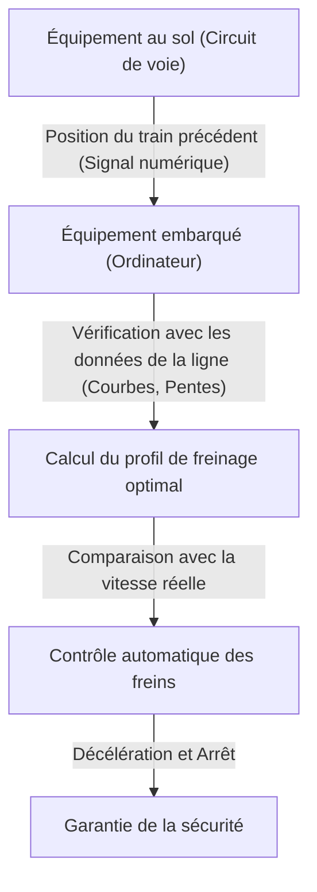

# Le fonctionnement du Shinkansen : la trajectoire du Japon conciliant sécurité et grande vitesse

Depuis l'inauguration de la ligne Tōkaidō Shinkansen en 1964, le train à grande vitesse japonais maintient le record stupéfiant de zéro passager tué dans un accident depuis plus d'un demi-siècle. Ce résultat n'est pas une simple coïncidence, mais le fruit de systèmes de sécurité superposés et d'une innovation technologique incessante. Cet article explore en profondeur les technologies de base qui permettent au Shinkansen de concilier à un niveau très élevé les exigences paradoxales de « sécurité » et de « grande vitesse ».

## 1. La sécurité à sûreté intégrée (fail-safe) assurée par l'ATC (Contrôle Automatique des Trains)

Le système le plus important lorsque l'on parle de la sécurité du Shinkansen est l'ATC (Automatic Train Control, ou Contrôle Automatique des Trains). Dans les chemins de fer traditionnels, le conducteur vérifiait visuellement les signaux le long de la voie et actionnait manuellement les freins. Cependant, à des vitesses dépassant les 200 km/h, s'en remettre à la vision et au temps de réaction humains est extrêmement dangereux.

L'ATC calcule en permanence la vitesse maximale autorisée (vitesse permise) à laquelle le train peut circuler, en fonction de la distance avec le train précédent et des conditions de la voie (courbes, pentes, etc.), et l'affiche dans la cabine de conduite. Si la vitesse réelle du train dépasse cette vitesse autorisée, le système active automatiquement les freins pour ralentir jusqu'à une vitesse sûre ou arrêter le train.

### L'évolution de l'ATC numérique

Dans l'ATC analogique initial, le circuit de voie (un système utilisant les rails comme une partie d'un circuit électrique) était divisé en sections fixes (sections de cantonnement), et chaque section se voyait attribuer une limite de vitesse unique (par exemple 210 km/h, 160 km/h, 30 km/h, etc.). Dans ce système, la vitesse devait être réduite par paliers, ce qui détériorait le confort de conduite et entraînait une perte d'efficacité dans le timing du freinage.

Les Shinkansen modernes (comme l'ATC-NS sur la ligne Tōkaidō et le DS-ATC sur la ligne Tōhoku) utilisent un « ATC numérique ». Dans l'ATC numérique, seules les informations de position du train précédent sont reçues depuis le sol, et l'ordinateur embarqué calcule en continu le profil de freinage optimal (courbe de décélération) basé sur les performances de freinage de son propre train et les données de la ligne (pentes et courbes).

Grâce à ce « contrôle de freinage en une étape », les ralentissements inutiles sont éliminés, ce qui améliore le confort des passagers et augmente considérablement la capacité de la ligne (la densité de circulation des trains). De plus, même en cas de panne d'une partie du système, la philosophie de conception « fail-safe » (à sûreté intégrée) garantit que le système agit toujours de manière sûre (dans le sens de l'arrêt du train).

## 2. Allégement radical de la carrosserie et évolution des matériaux

L'énergie cinétique d'un train se déplaçant à grande vitesse augmente proportionnellement au carré de sa vitesse. Par conséquent, pour augmenter la vitesse, économiser de l'énergie et réduire les dommages causés aux voies, l'allègement de la carrosserie est indispensable.

La première génération de Shinkansen de la série 0 utilisait de l'acier (acier ordinaire), mais en passant par les séries 100 et 200, l'alliage d'aluminium est devenu la norme. En particulier, les véhicules actuels (comme les séries N700 et E5) adoptent une structure creuse en « double peau d'aluminium ».

### Les avantages de la structure en double peau d'aluminium

La structure en double peau d'aluminium, comme son nom l'indique, possède une « double peau » en aluminium. Semblable à la coupe transversale d'un carton ondulé, elle est fabriquée en soudant des profilés extrudés dotés de nervures de renforcement en treillis entre deux plaques d'aluminium.

1. **Légèreté et haute rigidité** : Par rapport à la structure à simple peau classique (plaques fixées sur une ossature), elle est beaucoup plus légère tout en offrant une rigidité élevée (résistance à la flexion et à la torsion) capable de résister à la course à grande vitesse du Shinkansen.
2. **Amélioration de l'isolation phonique** : L'espace entre les deux panneaux formant une couche d'air, cela empêche efficacement le bruit extérieur (bruit de roulement et bruit aérodynamique) de pénétrer dans l'habitacle.
3. **Réduction des coûts de fabrication et recyclage** : L'utilisation de grands profilés extrudés réduit le nombre de points de soudure et simplifie le processus de fabrication. De plus, comme elle utilise en grande partie un matériau unique (l'aluminium), le recyclage est facilité après la mise au rebut du véhicule.

En outre, des aciers à haute résistance et des pièces moulées spéciales sont utilisés pour les composants des bogies (la partie où se trouvent les roues), permettant un allègement au gramme près.

## 3. Le confort ultime grâce aux ressorts pneumatiques et à la suspension active

Si le Shinkansen offre un confort tel qu'on ne renverse pas son café tout en roulant à 300 km/h, c'est grâce à la puissance de ses systèmes de suspension avancés.

### Ressorts pneumatiques et système d'inclinaison de la carrosserie

Des « ressorts pneumatiques » sont installés entre la carrosserie du Shinkansen et les bogies. Il s'agit de ressorts utilisant l'élasticité de l'air comprimé ; ils sont plus souples que les ressorts hélicoïdaux métalliques et absorbent efficacement les micro-vibrations.

Les véhicules les plus récents, comme la série N700, sont équipés d'un « système d'inclinaison de la carrosserie » qui applique davantage le principe de ces ressorts pneumatiques. À l'approche d'une courbe, le système gonfle les ressorts pneumatiques extérieurs et dégonfle les ressorts intérieurs, inclinant ainsi la carrosserie d'un angle maximal de 1 à 1,5 degré. Cela annule la force centrifuge s'exerçant sur les passagers, permettant de traverser les courbes sans ralentir tout en maintenant un trajet confortable.

### Suspension entièrement active

Pour supprimer les balancements latéraux, une « suspension entièrement active » a également été introduite. Lorsque des capteurs embarqués détectent l'accélération d'un balancement latéral, l'ordinateur effectue un calcul immédiat et actionne des vérins hydrauliques (ou des actionneurs électriques) situés entre le bogie et la carrosserie pour appliquer de force une contre-poussée annulant le balancement.
Cela réduit considérablement les secousses latérales soudaines qui se produisent à l'entrée des tunnels ou lors du croisement de deux trains.

## 4. La cristallisation de la dynamique des fluides pour prévenir les micro-ondes de pression (boom de tunnel)

La voiture de tête du Shinkansen possède une forme très particulière, semblable à un ornithorynque ou au bec d'un oiseau. Il ne s'agit pas d'un simple design, mais du résultat d'une approche de dynamique des fluides visant à résoudre le problème des « micro-ondes de pression » (ou micro-ondes de pression en tunnel), un problème environnemental spécifique aux trains à grande vitesse.

### Le mécanisme du boom de tunnel

Lorsqu'un train circulant à grande vitesse pénètre dans un tunnel, l'air à l'intérieur est poussé vers l'avant comme par un piston, créant une onde de compression. Cette onde de compression se propage dans le tunnel à la vitesse du son et, lorsqu'elle est expulsée par la sortie opposée, génère un bruit à basse fréquence (micro-onde de pression) ressemblant au son d'une explosion (« boom »). Cela provoque des problèmes environnementaux tels que le tremblement des vitres des maisons environnantes.

### Évolution de la forme de la tête

Pour atténuer cette micro-onde de pression, il est nécessaire de lisser la vitesse à laquelle l'air est écrasé (le gradient de changement de pression) lorsque le train entre dans le tunnel.

- **Série 0** : Un nez rond et bulbeux. Aux vitesses de l'époque (210 km/h), cela ne posait pas de problème.
- **Série 500** : Pour atteindre 300 km/h, elle a adopté une forme avant pointue de 15 mètres de long, inspirée du bec du martin-pêcheur. Elle a considérablement réduit les micro-ondes de pression, mais présentait l'inconvénient de restreindre l'espace de la cabine passagers.
- **Série N700** : Une forme appelée « Aero Double-Wing ». Grâce à une surface tridimensionnelle complexe rappelant les ailes déployées d'un oiseau, elle maintient la longueur de l'avant à environ 10,7 mètres tout en dispersant de manière optimale les micro-ondes de pression.
- **Série E5** : La longueur de l'avant est étendue à 15 mètres et adopte une forme appelée « Arrow Line ». Elle parvient à concilier des performances environnementales avec une exploitation commerciale à 320 km/h, la vitesse la plus élevée du Japon.

Ces formes avant complexes sont le fruit d'immenses simulations d'analyse des fluides (CFD) sur supercalculateurs, et représentent véritablement l'aboutissement d'une technologie rivalisant avec l'ingénierie aérospatiale moderne.

## Conclusion

Le Shinkansen est un système colossal qui n'est possible que grâce à la trinité que forment les véhicules, les voies, les systèmes de signalisation, ainsi que le savoir-faire humain qui les gère. La garantie absolue de sécurité par l'ATC, l'allègement poussé à l'extrême, la technologie de suspension, et la dynamique des fluides pour s'harmoniser avec l'environnement : l'accumulation de chacune de ces technologies a donné naissance au mythe de plus d'un demi-siècle sans accident, et l'innovation se poursuit encore aujourd'hui.
La technologie du Shinkansen japonais dépasse le simple moyen de transport et constitue une référence mondiale qui montre la voie aux infrastructures de demain.
