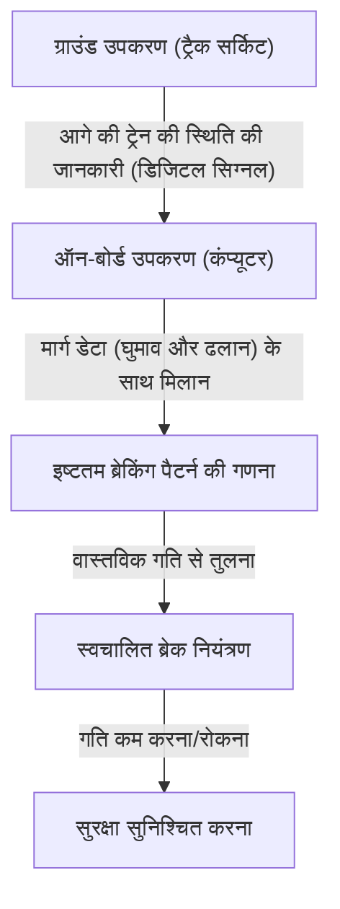

# शिनकानसेन की कार्यप्रणाली: सुरक्षा और उच्च गति को संतुलित करने का जापानी मार्ग

जापान की शिनकानसेन (Shinkansen) ने 1964 में टोकाइडो शिनकानसेन (Tokaido Shinkansen) के उद्घाटन के बाद से आधी सदी से भी अधिक समय तक यात्रियों की मृत्यु के बिना शून्य घातक दुर्घटनाओं का एक आश्चर्यजनक रिकॉर्ड बनाए रखा है। यह उपलब्धि महज़ कोई संयोग नहीं है, बल्कि यह कई परतों में बिछाए गए सुरक्षा प्रणालियों और निरंतर तकनीकी नवाचार (technical innovation) का परिणाम है। इस लेख में, हम उन मुख्य तकनीकों की गहराई से पड़ताल करेंगे जिनके माध्यम से शिनकानसेन ने "सुरक्षा" और "उच्च गति" की परस्पर विरोधी मांगों को उच्च स्तर पर सफलतापूर्वक संतुलित किया है।

## 1. ATC (स्वचालित ट्रेन नियंत्रण) के माध्यम से फेल-सेफ (Fail-Safe) का कड़ाई से पालन

शिनकानसेन की सुरक्षा पर चर्चा करते समय सबसे महत्वपूर्ण प्रणाली ATC (Automatic Train Control: स्वचालित ट्रेन नियंत्रण प्रणाली) है। पारंपरिक रेलवे में, ट्रेन ड्राइवर पटरियों के किनारे लगे सिग्नलों को नेत्रहीन रूप से (visual check) जांचते थे और मैन्युअल रूप से ब्रेक लगाते थे। हालाँकि, 200 किमी/घंटा से अधिक की उच्च गति वाली ड्राइविंग में, मानवीय दृष्टि और प्रतिक्रिया गति पर निर्भर रहना अत्यंत खतरनाक है।

ATC आगे चल रही ट्रेन से दूरी और ट्रैक की स्थितियों (घुमाव, ढलान आदि) के आधार पर लगातार उस अधिकतम गति (अनुमेय गति - allowable speed) की गणना करता है जिस पर ट्रेन सुरक्षित रूप से चल सकती है और इसे ड्राइवर के कैब में प्रदर्शित करता है। यदि ट्रेन की वास्तविक गति इस अनुमेय गति से अधिक हो जाती है, तो सिस्टम स्वचालित रूप से ब्रेक लगा देता है और सुरक्षित गति तक धीमा कर देता है, या ट्रेन को रोक देता है।

### डिजिटल ATC (Digital ATC) का विकास

प्रारंभिक एनालॉग (Analog) ATC में, ट्रैक सर्किट (एक प्रणाली जो रेल को विद्युत सर्किट के हिस्से के रूप में उपयोग करती है) को कुछ विशिष्ट खंडों (ब्लॉक सेक्शन) में विभाजित किया गया था, और प्रत्येक खंड को एकल गति सीमा (जैसे 210 किमी/घंटा, 160 किमी/घंटा, 30 किमी/घंटा आदि) दी गई थी। इस पद्धति में गति को चरणों में कम करने की आवश्यकता होती थी, जिससे यात्रा का आराम (ride quality) खराब होता था और ब्रेक लगाने के समय में बर्बादी (inefficiency) की समस्या उत्पन्न होती थी।

आधुनिक शिनकानसेन (उदाहरण के लिए, टोकाइडो शिनकानसेन का ATC-NS और तोहोकू शिनकानसेन का DS-ATC) में, "डिजिटल ATC" (Digital ATC) को अपनाया गया है। डिजिटल ATC में, केवल आगे की ट्रेन की स्थिति की जानकारी ग्राउंड (जमीन) से प्राप्त की जाती है, और ट्रेन पर लगा कंप्यूटर ट्रेन के ब्रेकिंग प्रदर्शन और ट्रैक डेटा (ढलान और घुमाव) के आधार पर लगातार सबसे इष्टतम ब्रेकिंग पैटर्न (मंदी वक्र - deceleration curve) की गणना करता है।

इस "वन-स्टेप ब्रेकिंग कंट्रोल" (1-step brake control) के कारण, अनावश्यक गति में कमी (deceleration) समाप्त हो गई है, यात्रा का आराम बेहतर हुआ है, और ट्रैक की क्षमता (ट्रेनों को कितनी सघनता से चलाया जा सकता है) में नाटकीय रूप से वृद्धि हुई है। इसके अलावा, भले ही सिस्टम का कोई हिस्सा विफल हो जाए, यह "फेल-सेफ" (fail-safe) डिज़ाइन दर्शन (design philosophy) का सख्ती से पालन करता है, जो हमेशा सुरक्षित पक्ष (ट्रेन को रोकने की दिशा) की ओर कार्य करता है।

## 2. ट्रेन बॉडी के वजन में अत्यधिक कमी और सामग्रियों का विकास

उच्च गति पर चलने वाली ट्रेन की गतिज ऊर्जा (kinetic energy) द्रव्यमान (mass) और गति के वर्ग के अनुपात में बढ़ जाती है। इसलिए, उच्च गति प्राप्त करने, ऊर्जा बचाने और पटरियों (tracks) को होने वाले नुकसान को कम करने के लिए, ट्रेन की बॉडी (car body) का वजन कम करना आवश्यक है।

पहली पीढ़ी की 0 सीरीज़ शिनकानसेन (0 Series Shinkansen) में, स्टील (साधारण स्टील) का उपयोग किया गया था, लेकिन बाद की 100 और 200 सीरीज़ के विकास के साथ, एल्यूमीनियम मिश्र धातु (aluminum alloy) मुख्यधारा बन गई। विशेष रूप से वर्तमान ट्रेनों (जैसे N700 और E5 सीरीज़) में, खोखले संरचना वाले "एल्युमिनियम डबल-स्किन स्ट्रक्चर" (Aluminum Double-Skin Structure) को अपनाया गया है।

### एल्युमिनियम डबल-स्किन संरचना के लाभ

एल्युमिनियम डबल-स्किन संरचना (Aluminum double-skin structure) का शाब्दिक अर्थ है एल्युमिनियम की "दोहरी त्वचा" वाली संरचना। कार्डबोर्ड के क्रॉस-सेक्शन की तरह, यह दो एल्युमिनियम प्लेटों के बीच ट्रस-जैसी मजबूत रिब्स (truss-like reinforcing ribs) वाले एक्सट्रूडेड प्रोफाइल (extruded profiles) को वेल्डिंग करके बनाया जाता है।

1. **हल्का और उच्च कठोरता (Lightweight and High Rigidity)**: पारंपरिक सिंगल-स्किन संरचना (फ्रेम में प्लेटें जोड़ने की विधि) की तुलना में, यह काफी हल्का है, फिर भी इसमें शिनकानसेन की उच्च गति वाली यात्रा का सामना करने के लिए उच्च कठोरता (झुकने और मुड़ने के प्रति प्रतिरोध) होती है।
2. **बेहतर ध्वनि इन्सुलेशन (Improved Sound Insulation)**: क्योंकि दो पैनलों के बीच का स्थान एक वायु परत बन जाता है, यह बाहरी शोर (जैसे चलने की आवाज़ और वायुगतिकीय शोर) को ट्रेन के अंदर आने से रोकने में प्रभावी होता है।
3. **विनिर्माण लागत में कमी और रीसाइक्लिंग (Manufacturing Cost Reduction and Recycling)**: बड़े एक्सट्रूडेड प्रोफाइल का उपयोग करके, वेल्डिंग बिंदुओं की संख्या कम हो जाती है और विनिर्माण प्रक्रिया सरल हो जाती है। इसके अलावा, चूँकि बड़ी मात्रा में एकल सामग्री (एल्यूमीनियम) का उपयोग किया जाता है, सेवामुक्त (decommissioned) होने के बाद इसका पुनर्चक्रण (recycling) करना भी आसान होता है।

इसके अलावा, बोगी (bogies - वह हिस्सा जहाँ पहिए लगे होते हैं) के हिस्सों में भी उच्च-तन्यता वाले स्टील (high-tensile steel) और विशेष कच्चा लोहा भागों (cast parts) का उपयोग किया जाता है, ताकि ग्राम के स्तर तक वजन कम किया जा सके।

## 3. एयर स्प्रिंग और एक्टिव सस्पेंशन के साथ यात्रा का बेहतरीन अनुभव

300 किमी/घंटा की गति से यात्रा करते समय ट्रेन में कॉफी न छलकने जैसा आराम प्रदान करने का श्रेय उन्नत सस्पेंशन सिस्टम (advanced suspension system) को जाता है।

### एयर स्प्रिंग और कार बॉडी टिल्टिंग सिस्टम

शिनकानसेन की कार बॉडी और बोगी के बीच "एयर स्प्रिंग" (Air Spring) स्थापित किया गया है। यह एक स्प्रिंग है जो संपीड़ित हवा (compressed air) के लचीलेपन का उपयोग करता है; धातु के कॉइल स्प्रिंग्स की तुलना में यह अधिक नरम होता है, और सूक्ष्म कंपन को प्रभावी ढंग से अवशोषित करता है।

N700 सीरीज़ जैसी नवीनतम ट्रेनों में, एक "कार बॉडी टिल्टिंग सिस्टम" (Car body tilting system) शामिल है, जो इस एयर स्प्रिंग का और अधिक उपयोग करता है। जब ट्रेन एक घुमाव (curve) पर पहुँचती है, तो बाहरी एयर स्प्रिंग फूल जाती है और भीतरी सिकुड़ जाती है, जिससे कार की बॉडी अधिकतम 1 से 1.5 डिग्री तक झुक जाती है। इसके परिणामस्वरूप, यात्रियों पर लगने वाले अपकेंद्रीय बल (centrifugal force) का प्रभाव कम हो जाता है, और ट्रेन घुमाव पर भी गति कम किए बिना एक आरामदायक सवारी बनाए रखते हुए गुजर सकती है।

### फुल-एक्टिव सस्पेंशन (Full-Active Suspension)

बाएं-दाएं (पार्श्व) झटकों को दबाने के लिए, "फुल-एक्टिव सस्पेंशन" (Full-active suspension) भी पेश किया गया है। जब कार बॉडी पर लगे सेंसर पार्श्व झटके (lateral sway) के त्वरण (acceleration) का पता लगाते हैं, तो कंप्यूटर तुरंत गणना करता है और बोगी और कार बॉडी के बीच स्थित हाइड्रोलिक सिलेंडर (या इलेक्ट्रिक एक्चुएटर) को चलाकर झटके को बेअसर करने की दिशा में बल लगाता है।
इससे सुरंगों में प्रवेश करते समय या ट्रेनों के एक-दूसरे के पास से गुजरते समय होने वाले अचानक पार्श्व झटके (lateral vibrations) में नाटकीय रूप से कमी आई है।

## 4. माइक्रो-प्रेशर वेव (टनल बूम) को रोकने के लिए द्रव गतिकी का उत्कृष्ट उदाहरण

शिनकानसेन की प्रमुख (front) गाड़ी का आकार बहुत ही अनूठा होता है, जैसे कि प्लैटिपस (platypus) या किसी पक्षी की चोंच। यह केवल कोई डिज़ाइन नहीं है, बल्कि यह उच्च गति वाले रेलवे की एक विशिष्ट पर्यावरणीय समस्या, "माइक्रो-प्रेशर वेव" (Micro-pressure wave - टनल माइक्रो-प्रेशर वेव) को हल करने के लिए द्रव गतिकी (fluid dynamics) दृष्टिकोण का परिणाम है।

### टनल बूम का तंत्र (Mechanism of Tunnel Boom)

जब तेज़ गति से चलने वाली ट्रेन किसी सुरंग में प्रवेश करती है, तो सुरंग के अंदर की हवा पिस्टन की तरह आगे की ओर धकेली जाती है, जिससे संपीड़न लहरें (compression waves) उत्पन्न होती हैं। यह संपीड़न लहर ध्वनि की गति से सुरंग के माध्यम से यात्रा करती है, और जब यह विपरीत निकास से बाहर निकलती है, तो यह एक कम-आवृत्ति वाली ध्वनि (माइक्रो-प्रेशर वेव) उत्पन्न करती है जो "बूम" (विस्फोट जैसी ध्वनि) की तरह सुनाई देती है। यह आसपास के घरों की खिड़कियों के शीशे हिलने जैसी पर्यावरणीय समस्याएं पैदा करती है।

### फ्रंट आकार का विकास (Evolution of Front Shape)

इस सूक्ष्म-दबाव लहर (माइक्रो-प्रेशर वेव) को दबाने के लिए, उस गति (दबाव परिवर्तन की ढाल) को सुचारू करना आवश्यक है जिस पर ट्रेन सुरंग में प्रवेश करते समय हवा को संपीड़ित करती है।

- **0 सीरीज़**: गोल बुलेट-जैसी नाक। उस समय की गति (210 किमी/घंटा) पर, यह कोई समस्या नहीं थी।
- **500 सीरीज़**: 300 किमी/घंटा की गति प्राप्त करने के लिए, किंगफिशर (kingfisher) पक्षी की चोंच से प्रेरित एक 15-मीटर लंबी तीखी नुकीली सामने की आकृति अपनाई गई। इसने माइक्रो-प्रेशर तरंगों को काफी कम कर दिया, लेकिन इसमें यात्री केबिन स्थान को संकीर्ण करने का नुकसान था।
- **N700 सीरीज़**: एक आकृति जिसे "एयरो डबल-विंग" (Aero Double-Wing) कहा जाता है। एक जटिल 3D घुमावदार सतह के साथ, जो किसी पक्षी के फैले हुए पंखों की तरह दिखती है, यह सामने की लंबाई को लगभग 10.7 मीटर तक रखते हुए सूक्ष्म दबाव तरंगों को बेहतर ढंग से फैलाती है।
- **E5 सीरीज़**: सामने की लंबाई को 15 मीटर तक बढ़ा दिया गया, और "एरो लाइन" (Arrow Line) नामक आकार अपनाया गया। यह 320 किमी/घंटा (जापान में सबसे तेज़) की व्यावसायिक परिचालन गति को पर्यावरणीय प्रदर्शन (environmental performance) के साथ संतुलित करता है।

ये जटिल फ्रंट आकृतियाँ सुपर कंप्यूटरों का उपयोग करके बड़े पैमाने पर द्रव विश्लेषण (CFD - Computational Fluid Dynamics) सिमुलेशन से प्राप्त की गई थीं, और इन्हें आधुनिक एयरोस्पेस इंजीनियरिंग के बराबर तकनीक का उत्कृष्ट उदाहरण कहा जा सकता है।

## निष्कर्ष

शिनकानसेन एक विशाल प्रणाली है जो केवल तभी काम करती है जब वाहन, ट्रैक, सिग्नलिंग सिस्टम और उनका संचालन करने वाले मानव ज्ञान (know-how) एक साथ एक त्रिमूर्ति (trinity) के रूप में आते हैं। ATC के माध्यम से पूर्ण सुरक्षा की गारंटी, सीमा तक धकेला गया वजन कम करने और सस्पेंशन की तकनीक, और पर्यावरण के साथ सामंजस्य बिठाने के लिए द्रव गतिकी। इन व्यक्तिगत तकनीकों के संचय ने आधी सदी से अधिक की दुर्घटना-मुक्त (accident-free) मिथक को जन्म दिया है, और यह आज भी विकसित हो रहा है।
जापान की शिनकानसेन तकनीक परिवहन के एक मात्र साधन से आगे बढ़ गई है, जो भविष्य के बुनियादी ढांचे (infrastructure) के लिए एक वैश्विक बेंचमार्क (global benchmark) बन गई है।
