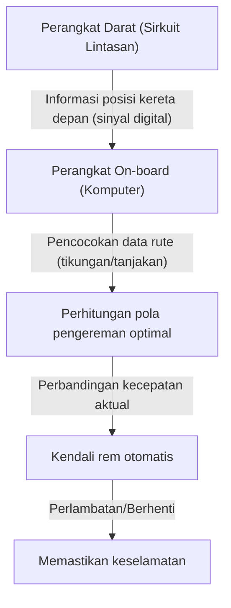

# Mekanisme Shinkansen: Jejak Langkah Jepang Memadukan Keamanan dan Kecepatan Tinggi

Shinkansen Jepang, sejak peluncuran Tokaido Shinkansen pada tahun 1964, telah mempertahankan rekor luar biasa yaitu nol kecelakaan fatal penumpang selama lebih dari setengah abad. Pencapaian ini bukanlah sebuah kebetulan semata, melainkan buah dari sistem keamanan yang berlapis-lapis dan inovasi teknologi yang terus-menerus. Dalam artikel ini, kita akan menggali lebih dalam teknologi inti tentang bagaimana Shinkansen berhasil memadukan dua tuntutan yang saling bertolak belakang, yaitu "keamanan" dan "kecepatan", pada tingkat yang sangat tinggi.

## 1. Penerapan Fail-Safe Melalui ATC (Automatic Train Control)

Sistem yang paling penting ketika berbicara tentang keamanan Shinkansen adalah ATC (Automatic Train Control / Kendali Kereta Otomatis). Pada kereta api konvensional, masinis secara visual memeriksa sinyal di samping rel dan mengoperasikan rem secara manual. Namun, pada operasi berkecepatan tinggi melebihi 200 km/jam, sangatlah berbahaya untuk bergantung pada penglihatan dan kecepatan reaksi manusia.

ATC secara konstan menghitung kecepatan maksimum yang diizinkan untuk kereta saat itu (kecepatan yang diizinkan) berdasarkan jarak dengan kereta di depannya serta kondisi lintasan (tikungan, tanjakan, dll.), dan menampilkannya di kabin masinis. Jika kecepatan aktual kereta melebihi kecepatan yang diizinkan ini, sistem secara otomatis akan mengaktifkan rem untuk memperlambat atau menghentikan kereta hingga kecepatan aman.

### Evolusi ATC Digital

Pada ATC analog awal, sirkuit lintasan (sistem yang menggunakan rel sebagai bagian dari sirkuit listrik) dibagi menjadi beberapa bagian tertentu (blok stasiun), dan batas kecepatan tunggal (misalnya, 210 km/jam, 160 km/jam, 30 km/jam, dll.) dialokasikan ke masing-masing blok. Dalam metode ini, karena kecepatan harus dikurangi secara bertahap, terdapat kendala seperti kenyamanan berkendara yang memburuk atau waktu pengereman yang tidak efisien.

Shinkansen modern (misalnya, ATC-NS di Tokaido Shinkansen dan DS-ATC di Tohoku Shinkansen) menggunakan "ATC Digital". Dalam ATC Digital, hanya informasi posisi kereta di depan yang diterima dari tanah, dan komputer di dalam kereta secara terus-menerus menghitung pola pengereman optimal (kurva perlambatan) berdasarkan kinerja rem kereta sendiri dan data lintasan (tanjakan dan tikungan).

Dengan "kendali rem satu tahap" ini, perlambatan yang tidak efisien dapat dihilangkan, meningkatkan kenyamanan penumpang, serta secara dramatis meningkatkan kapasitas lintasan (seberapa rapat jarak antar kereta yang bisa beroperasi). Selanjutnya, bahkan jika sebagian dari sistem mengalami kerusakan, prinsip desain "fail-safe" (gagal aman) yang selalu bekerja ke sisi yang aman (arah menghentikan kereta) diterapkan secara menyeluruh.

## 2. Pengurangan Bobot Bodi Secara Menyeluruh dan Evolusi Material

Energi kinetik dari sebuah kereta yang berjalan pada kecepatan tinggi meningkat sebanding dengan kuadrat kecepatannya. Oleh karena itu, untuk mencapai kecepatan yang lebih tinggi dan penghematan energi, serta untuk meminimalkan kerusakan pada lintasan, pengurangan bobot bodi kereta adalah hal yang mutlak diperlukan.

Pada Shinkansen seri 0 generasi pertama, baja ringan digunakan, tetapi setelah melewati seri 100 dan 200, paduan aluminium menjadi material utama. Secara khusus, pada kereta masa kini (seperti seri N700 dan E5), "Struktur Kulit Ganda Aluminium" (Aluminum Double-Skin Structure) yang berongga telah diadopsi.

### Keuntungan Struktur Kulit Ganda Aluminium

Struktur Kulit Ganda Aluminium, seperti namanya, adalah struktur yang memiliki "dua lapis kulit" berbahan aluminium. Layaknya penampang kardus bergelombang, struktur ini dibuat dengan mengelas profil ekstrusi yang dilengkapi tulang penguat berbentuk rangka batang di antara dua pelat aluminium.

1. **Ringan namun Sangat Kaku (Rigid)**: Dibandingkan dengan struktur kulit tunggal tradisional (metode di mana pelat dipasang pada kerangka), struktur ini jauh lebih ringan tetapi memiliki tingkat kekakuan yang tinggi (ketahanan terhadap kelengkungan dan puntiran) untuk menahan operasi kecepatan tinggi Shinkansen.
2. **Peningkatan Insulasi Suara**: Karena ruang antara kedua panel berfungsi sebagai lapisan udara, struktur ini memiliki efek mencegah kebisingan eksternal (suara perjalanan atau suara aerodinamis) masuk ke dalam kereta.
3. **Pengurangan Biaya Produksi dan Daur Ulang**: Penggunaan profil ekstrusi yang besar mengurangi titik pengelasan dan menyederhanakan proses perakitan. Selain itu, karena sebagian besar menggunakan material tunggal (aluminium), proses daur ulang setelah kereta tidak beroperasi lagi juga menjadi lebih mudah.

Selain itu, baja bertegangan tinggi dan suku cadang cor khusus digunakan untuk komponen bogie (bagian yang menempel pada roda), untuk mencapai pengurangan berat hingga hitungan gram.

## 3. Kenyamanan Berkendara Terbaik dengan Pegas Udara dan Suspensi Aktif

Rahasia yang memungkinkan kenyamanan berkendara di mana kopi tidak akan tumpah di dalam kereta meskipun berjalan dengan kecepatan 300 km/jam adalah sistem suspensi yang canggih.

### Pegas Udara dan Sistem Kemiringan Bodi

Di antara bodi Shinkansen dan bogie terpasang "pegas udara" (air spring). Pegas ini memanfaatkan elastisitas udara terkompresi, lebih lembut dibandingkan dengan pegas koil logam, dan secara efektif menyerap getaran kecil.

Pada model terbaru seperti seri N700, "Sistem Kemiringan Bodi" (Body Tilting System) yang merupakan aplikasi lanjutan dari pegas udara ini juga dipasang. Saat mendekati tikungan, sistem ini mengembangkan pegas udara di sisi luar dan mengempiskannya di sisi dalam, memiringkan bodi kereta maksimal 1 hingga 1,5 derajat. Hal ini dapat menangkal gaya sentrifugal yang dirasakan penumpang, memungkinkan kereta melewati tikungan tanpa mengurangi kecepatan sembari mempertahankan perjalanan yang nyaman.

### Suspensi Aktif Penuh

Untuk menekan guncangan dari sisi ke sisi, "Suspensi Aktif Penuh" (Full-Active Suspension) juga diperkenalkan. Ketika sensor yang terpasang pada bodi mendeteksi akselerasi guncangan lateral, komputer akan melakukan perhitungan secara instan dan menggerakkan silinder hidrolik (atau aktuator elektrik) yang terletak di antara bogie dan bodi untuk memaksa memberikan gaya yang menetralkan guncangan tersebut.
Hal ini secara dramatis mengurangi guncangan lateral mendadak yang terjadi ketika kereta memasuki terowongan atau ketika kereta saling berpapasan.

## 4. Hasil Kristalisasi Dinamika Fluida untuk Mencegah Gelombang Mikro-Tekanan (Ledakan Terowongan)

Gerbong paling depan Shinkansen memiliki bentuk yang sangat unik, menyerupai paruh platipus atau burung. Ini bukan sekadar desain, melainkan hasil dari pendekatan dinamika fluida (fluid dynamics) untuk mengatasi "gelombang mikro-tekanan terowongan", sebuah masalah lingkungan khusus untuk kereta berkecepatan tinggi.

### Mekanisme Ledakan Terowongan (Tunnel Boom)

Ketika kereta api berkecepatan tinggi melaju masuk ke dalam terowongan, udara di dalam terowongan terdorong ke depan seperti oleh piston, yang kemudian menghasilkan gelombang kompresi. Gelombang kompresi ini merambat melalui terowongan dengan kecepatan suara dan, ketika dilepaskan dari pintu keluar di sisi lain, menghasilkan suara berfrekuensi rendah yang menggelegar seperti ledakan (gelombang mikro-tekanan). Hal ini menyebabkan masalah lingkungan seperti bergetarnya kaca jendela rumah-rumah penduduk di sekitarnya.

### Evolusi Bentuk Hidung Kereta

Untuk menekan gelombang mikro-tekanan ini, sangat penting untuk memperlancar kecepatan dengan mana kereta menekan udara (gradien perubahan tekanan) saat memasuki terowongan.

- **Seri 0**: Hidung bulat seperti dango. Pada kecepatannya di masa itu (210 km/jam), hal ini bukanlah masalah.
- **Seri 500**: Untuk mencapai 300 km/jam, bentuk hidung yang sangat runcing dengan panjang mencapai 15 meter diadopsi, terinspirasi dari paruh burung pekakak (kingfisher). Bentuk ini sangat berhasil menekan gelombang mikro-tekanan, namun memiliki kelemahan di mana ruang kabin penumpang menjadi sempit.
- **Seri N700**: Bentuk yang disebut "Aero Double Wing". Dengan permukaan kurva 3D yang kompleks, seperti burung yang melebarkan sayapnya, bentuk ini mempertahankan panjang hidung sekitar 10,7 meter sambil menyebarkan gelombang mikro-tekanan secara optimal.
- **Seri E5**: Panjang hidung semakin diperpanjang hingga 15 meter dan mengadopsi bentuk yang disebut "Arrow Line". Seri ini mampu menyeimbangkan kinerja operasi komersial tercepat di Jepang pada kecepatan 320 km/jam dan menjaga kelestarian lingkungannya.

Bentuk hidung depan yang rumit ini dirancang melalui simulasi analitik fluida yang sangat besar (CFD) menggunakan superkomputer, dan dengan tepat dapat disebut sebagai kristalisasi teknologi yang sebanding dengan teknik kedirgantaraan (aerospace) modern.

## Kesimpulan

Shinkansen adalah sebuah sistem raksasa yang hanya dapat berhasil ketika pengetahuan dan keahlian tentang kereta, lintasan, sistem persinyalan, dan manusia yang mengoperasikannya bersatu. Jaminan mutlak keamanan dari ATC, pengejaran pengurangan bobot yang ekstrem dan teknologi suspensi, serta dinamika fluida untuk selaras dengan lingkungan sekitar. Setiap dan semua dari tumpukan teknologi inilah yang melahirkan legenda bahwa belum pernah ada kecelakaan fatal dalam lebih dari setengah abad, dan ia masih terus berevolusi hingga kini.
Teknologi Shinkansen Jepang telah melampaui batas sebagai alat transportasi belaka dan menjadi tolok ukur global yang menunjukkan bagaimana masa depan infrastruktur seharusnya berada.
