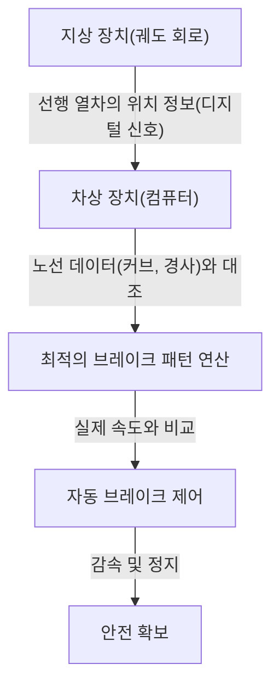

# 신칸센의 원리: 안전과 고속을 양립하는 일본의 궤적

일본의 신칸센은 1964년 도카이도 신칸센 개통 이후, 반세기 이상에 걸쳐 승객 사망 사고 제로라는 경이로운 기록을 유지하고 있습니다. 이러한 실적은 단순한 우연이 아니라, 겹겹이 쳐진 안전 시스템과 끊임없는 기술 혁신의 산물입니다. 본 기사에서는 신칸센이 어떻게 '안전'과 '고속'이라는 상반된 요구를 높은 차원에서 양립시키고 있는지, 그 핵심 기술을 깊이 파헤쳐 보겠습니다.

## 1. ATC(자동열차제어장치)에 의한 페일세이프의 철저

신칸센의 안전성을 논하는 데 있어 가장 중요한 시스템이 ATC(Automatic Train Control: 자동열차제어장치)입니다. 기존 철도에서는 기관사가 선로 옆의 신호기를 육안으로 확인하고 수동으로 브레이크를 조작했습니다. 하지만 시속 200km가 넘는 고속 운행에서는 인간의 시각과 반응 속도에 의존하는 것은 매우 위험합니다.

ATC는 선행 열차와의 거리나 선로의 조건(커브, 경사 등)에 따라, 자기 열차가 주행해도 되는 최고 속도(허용 속도)를 항상 계산하여 운전대에 표시합니다. 만약 열차의 실제 속도가 이 허용 속도를 초과할 경우, 시스템이 자동으로 브레이크를 작동시켜 안전한 속도까지 감속하거나 정지시킵니다.

### 디지털 ATC의 진화

초기 아날로그 ATC에서는 궤도 회로(레일을 전기 회로의 일부로 이용하는 시스템)를 일정 구간(폐색 구간)마다 나누고, 각 구간에 단일 제한 속도(예를 들어 210km/h, 160km/h, 30km/h 등)를 할당했습니다. 이 방식에서는 속도를 단계적으로 줄여야 하므로 승차감이 나빠지거나 브레이크 타이밍에 낭비가 생기는 문제가 있었습니다.

현대의 신칸센(예를 들어 도카이도 신칸센의 ATC-NS나 도호쿠 신칸센의 DS-ATC)에서는 '디지털 ATC'가 채택되고 있습니다. 디지털 ATC에서는 선행 열차의 위치 정보만을 지상에서 받아, 차상측 컴퓨터가 자기 열차의 제동 성능이나 선로 데이터(경사와 커브)를 바탕으로 최적의 브레이크 패턴(감속 곡선)을 연속적으로 계산합니다.

이 '1단 브레이크 제어'를 통해 불필요한 감속이 사라져 승차감이 향상됨과 동시에, 선로 용량(열차를 얼마나 조밀하게 운행할 수 있는지)도 비약적으로 증가했습니다. 더욱이 시스템의 일부가 고장나더라도 항상 안전한 쪽(열차를 정지시키는 방향)으로 작동하는 '페일세이프(Fail-safe)' 설계 사상이 철저하게 적용되어 있습니다.

## 2. 철저한 차체 경량화와 소재의 진화

고속으로 주행하는 열차의 운동 에너지는 질량과 속도의 제곱에 비례하여 증가합니다. 따라서 고속화와 에너지 절약, 나아가 궤도에 대한 손상을 줄이기 위해서는 차체의 경량화가 필수적입니다.

초대 0계 신칸센에서는 강철(보통강)이 사용되었으나, 이후 100계, 200계를 거쳐 알루미늄 합금이 주류가 되었습니다. 특히 현재의 차량(N700계나 E5계 등)에서는 중공 구조인 '알루미늄 더블 스킨 구조'가 채택되고 있습니다.

### 알루미늄 더블 스킨 구조의 장점

알루미늄 더블 스킨 구조란 말 그대로 알루미늄의 '이중 피부'를 가진 구조입니다. 골판지의 단면처럼 2장의 알루미늄 판 사이에 트러스 형태의 보강 리브를 둔 압출 형재를 용접하여 만듭니다.

1. **경량 및 고강성**: 기존의 싱글 스킨 구조(뼈대에 판을 붙이는 방식)와 비교하여 훨씬 가벼우면서도 신칸센의 고속 주행을 견딜 수 있는 높은 강성(휨이나 비틀림에 대한 강도)을 가지고 있습니다.
2. **차음성 향상**: 두 패널 사이의 공간이 공기층이 되기 때문에, 차외의 소음(주행음이나 공력 소음)이 차내로 들어오는 것을 막는 효과가 있습니다.
3. **제조 비용 절감 및 재활용**: 대형 압출 형재를 사용함으로써 용접 부위가 줄어들어 제조 공정이 간소화됩니다. 또한 단일 소재(알루미늄)를 많이 사용하기 때문에 폐차 후 재활용도 용이합니다.

또한 대차(바퀴가 있는 부분) 부품에도 고장력강이나 특수한 주조 부품을 사용하여 그램 단위의 경량화를 도모하고 있습니다.

## 3. 공기 스프링과 액티브 서스펜션을 통한 궁극의 승차감

시속 300km로 주행하면서도 차내에서 커피가 쏟아지지 않을 정도의 승차감을 실현하고 있는 것은 고도화된 서스펜션 시스템의 힘입니다.

### 공기 스프링과 차체 경사 시스템

신칸센의 차체와 대차 사이에는 '공기 스프링'이 설치되어 있습니다. 이것은 압축 공기의 탄력을 이용한 스프링으로, 금속제 코일 스프링에 비해 부드럽고 미세한 진동을 효과적으로 흡수합니다.

N700계 등 최신 차량에는 이 공기 스프링을 더욱 응용한 '차체 경사 시스템'이 탑재되어 있습니다. 커브에 접어들면 바깥쪽 공기 스프링을 부풀리고 안쪽을 수축시킴으로써 차체를 최대 1도~1.5도 기울입니다. 이를 통해 승객에게 가해지는 원심력을 상쇄하여 커브에서도 감속하지 않고 쾌적한 승차감을 유지한 채 통과할 수 있는 것입니다.

### 풀 액티브 서스펜션

좌우 흔들림을 억제하기 위해 '풀 액티브 서스펜션'도 도입되어 있습니다. 차체에 탑재된 센서가 가로 흔들림의 가속도를 감지하면 컴퓨터가 즉각적으로 계산을 수행하고, 대차와 차체 사이에 있는 유압 실린더(또는 전동 액추에이터)를 움직여 흔들림을 상쇄하는 방향의 힘을 강제로 가합니다.
이를 통해 터널 진입 시나 열차 간 교행 시 발생하는 돌발적인 가로 흔들림이 획기적으로 줄어듭니다.

## 4. 미기압파(터널 붐)를 막는 유체 역학의 결정체

신칸센의 선두 차량은 오리너구리나 새의 부리 같은 매우 독특한 형태를 하고 있습니다. 이는 단순한 디자인이 아니라, 고속철도 특유의 환경 문제인 '미기압파(터널 미기압파)'를 해결하기 위한 유체 역학적 접근의 결과입니다.

### 터널 붐의 메커니즘

고속으로 주행하는 열차가 터널에 돌입하면 터널 안의 공기가 피스톤처럼 앞으로 밀려나가 압축파가 발생합니다. 이 압축파가 음속으로 터널 안을 전파하여 반대쪽 출구로 방출될 때, '쾅'하는 폭발음 같은 저주파음(미기압파)을 발생시킵니다. 이것이 주변 민가의 유리창을 흔드는 등의 환경 문제를 일으킵니다.

### 선두 형상의 진화

이 미기압파를 억제하기 위해서는 열차가 터널에 들어갈 때 공기를 짓누르는 속도(압력 변화의 구배)를 부드럽게 할 필요가 있습니다.

- **0계**: 둥그스름한 경단코. 당시의 속도(210km/h)에서는 문제가 되지 않았습니다.
- **500계**: 시속 300km를 실현하기 위해 물총새의 부리를 힌트로 삼은, 길이가 15미터에 달하는 날카롭고 뾰족한 선두 형상을 채택. 미기압파를 대폭 줄였으나 객실 공간이 좁아지는 단점이 있었습니다.
- **N700계**: '에어로 더블 윙'이라 불리는 형태. 새가 날개를 펼친 듯한 복잡한 3차원 곡면을 통해 선두 길이를 약 10.7미터로 억제하면서도 미기압파를 최적으로 분산시키고 있습니다.
- **E5계**: 선두 길이를 무려 15미터까지 늘리고, '애로 라인'이라 불리는 형태를 채택. 시속 320km라는 일본 최고 속도의 영업 운전과 환경 성능을 양립시키고 있습니다.

이러한 복잡한 선두 형상은 슈퍼컴퓨터를 통한 방대한 유체 해석(CFD) 시뮬레이션에 의해 도출되었으며, 가히 현대 우주 항공 공학에 필적하는 기술의 결정체라 할 수 있습니다.

## 맺음말

신칸센은 차량, 궤도, 신호 시스템, 그리고 이들을 운용하는 인간의 노하우가 삼위일체가 되어 비로소 성립하는 거대한 시스템입니다. ATC를 통한 절대적인 안전 담보, 극한까지 추구된 경량화와 서스펜션 기술, 그리고 환경과 조화를 이루기 위한 유체 역학. 이러한 기술 하나하나의 축적이 반세기 이상 무사고라는 신화를 만들어냈으며, 지금도 여전히 진화를 거듭하고 있습니다.
일본의 신칸센 기술은 단순한 이동 수단을 넘어, 미래 인프라스트럭처의 바람직한 모습을 제시하는 세계적인 벤치마크가 되고 있습니다.
