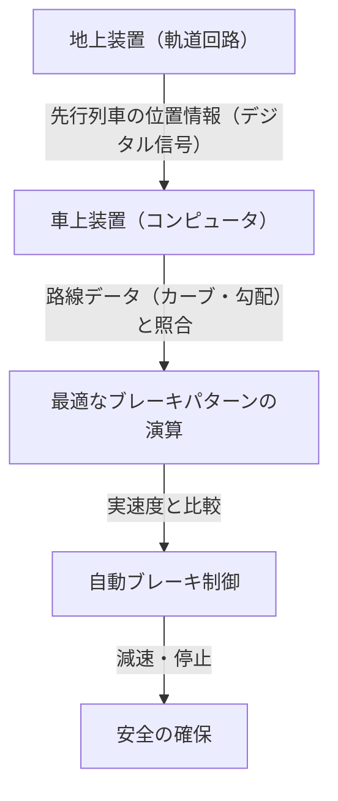

# 新幹線の仕組み：安全と高速を両立する日本の軌跡

日本の新幹線は、1964年の東海道新幹線開業以来、半世紀以上にわたって乗客の死亡事故ゼロという驚異的な記録を維持しています。この実績は、単なる偶然ではなく、幾重にも張り巡らされた安全システムと、絶え間ない技術革新の賜物です。本記事では、新幹線がどのようにして「安全」と「高速」という相反する要求を高い次元で両立させているのか、その中核となる技術を深く掘り下げていきます。

## 1. ATC（自動列車制御装置）によるフェイルセーフの徹底

新幹線の安全性を語る上で最も重要なシステムが、ATC（Automatic Train Control：自動列車制御装置）です。従来の鉄道では、運転士が線路脇の信号機を目視で確認し、手動でブレーキを操作していました。しかし、時速200キロを超える高速運転では、人間の視覚と反応速度に依存することは極めて危険です。

ATCは、先行列車との距離や線路の条件（カーブ、勾配など）に応じて、自列車が走行してよい最高速度（許容速度）を常に計算し、運転台に表示します。もし列車の実際の速度がこの許容速度を超えた場合、システムが自動的にブレーキを作動させ、安全な速度まで減速、あるいは停止させます。

### デジタルATCの進化

初期のアナログATCでは、軌道回路（レールを電気的な回路の一部として利用するシステム）を一定の区間（閉塞区間）ごとに区切り、各区間に単一の制限速度（例えば210km/h、160km/h、30km/hなど）を割り当てていました。この方式では、速度を段階的に落とす必要があるため、乗り心地が悪化したり、ブレーキのタイミングに無駄が生じたりする課題がありました。

現代の新幹線（例えば東海道新幹線のATC-NSや東北新幹線のDS-ATC）では、「デジタルATC」が採用されています。デジタルATCでは、先行列車の位置情報のみを地上から受け取り、車上側のコンピュータが自列車のブレーキ性能や線路データ（勾配やカーブ）を基に、最適なブレーキパターン（減速曲線）を連続的に計算します。

この「1段ブレーキ制御」により、無駄な減速がなくなり、乗り心地が向上するとともに、線路の容量（列車をどれだけ密に走らせられるか）も飛躍的に増加しました。さらに、システムの一部が故障した場合でも、常に安全側（列車を停止させる方向）に働く「フェイルセーフ」の設計思想が徹底されています。

## 2. 徹底した車体の軽量化と素材の進化

高速で走行する列車の運動エネルギーは質量の速度の2乗に比例して増加します。したがって、高速化と省エネルギー化、さらには軌道へのダメージを軽減するためには、車体の軽量化が不可欠です。

初代の0系新幹線では、鋼鉄（普通鋼）が使用されていましたが、その後の100系、200系を経て、アルミニウム合金が主流となりました。特に現在の車両（N700系やE5系など）では、中空構造の「アルミダブルスキン構造」が採用されています。

### アルミダブルスキン構造の利点

アルミダブルスキン構造とは、文字通りアルミニウムの「二重肌」を持つ構造です。ダンボールの断面のように、2枚のアルミ板の間にトラス状の補強リブを設けた押し出し型材を溶接して作られます。

1. **軽量かつ高剛性**: 従来のシングルスキン構造（骨組みに板を貼る方式）と比較して、はるかに軽量でありながら、新幹線の高速走行に耐えうる高い剛性（たわみやねじれに対する強さ）を持っています。
2. **遮音性の向上**: 2枚のパネルの間の空間が空気層となるため、車外の騒音（走行音や空力音）が車内に入り込むのを防ぐ効果があります。
3. **製造コストの削減とリサイクル**: 大型の押し出し型材を使用することで溶接箇所が減り、製造工程が簡略化されます。また、単一の素材（アルミ）を多く使用するため、廃車後のリサイクルも容易です。

さらに、台車（車輪がついている部分）の部品にも高張力鋼や特殊な鋳造部品を使用し、グラム単位での軽量化が図られています。

## 3. 空気ばねとアクティブサスペンションによる究極の乗り心地

時速300キロで走行しながら、車内でコーヒーがこぼれないほどの乗り心地を実現しているのは、高度なサスペンションシステムの力です。

### 空気ばねと車体傾斜システム

新幹線の車体と台車の間には、「空気ばね」が設置されています。これは、圧縮空気の弾力を利用したばねで、金属製のコイルばねに比べて柔らかく、微小な振動を効果的に吸収します。

N700系などの最新車両では、この空気ばねをさらに応用した「車体傾斜システム」が搭載されています。カーブに差し掛かると、外側の空気ばねを膨らませ、内側を収縮させることで、車体を最大1度〜1.5度傾けます。これにより、乗客にかかる遠心力を打ち消し、カーブでも減速せずに快適な乗り心地を維持したまま通過できるのです。

### フルアクティブサスペンション

左右の揺れを抑えるために、「フルアクティブサスペンション」も導入されています。車体に搭載されたセンサーが横揺れの加速度を検知すると、コンピュータが即座に計算を行い、台車と車体の間にある油圧シリンダー（または電動アクチュエータ）を動かして、揺れを打ち消す方向の力を強制的に加えます。
これにより、トンネル進入時や列車同士のすれ違い時に発生する突発的な横揺れが劇的に低減されています。

## 4. 微気圧波（トンネルドン）を防ぐ流体力学の結晶

新幹線の先頭車両は、カモノハシや鳥のくちばしのような非常に独特な形状をしています。これは単なるデザインではなく、高速鉄道特有の環境問題である「微気圧波（トンネル微気圧波）」を解決するための流体力学的なアプローチの結果です。

### トンネルドンのメカニズム

高速で走行する列車がトンネルに突入すると、トンネル内の空気がピストンのように前方に押し出され、圧縮波が発生します。この圧縮波が音速でトンネル内を伝わり、反対側の出口から放出される際に、「ドーン」という爆発音のような低周波音（微気圧波）を発生させます。これが周辺の民家の窓ガラスを揺らすなどの環境問題を引き起こします。

### 先頭形状の進化

この微気圧波を抑えるためには、列車がトンネルに入る際に空気を押しつぶすスピード（圧力変化の勾配）を滑らかにする必要があります。

- **0系**: 丸みを帯びた団子鼻。当時の速度（210km/h）では問題になりませんでした。
- **500系**: 時速300kmを実現するため、カワセミのくちばしをヒントにした、長さ15メートルにも及ぶ鋭くとがった先頭形状を採用。微気圧波を大幅に低減しましたが、客室空間が狭くなるという欠点がありました。
- **N700系**: 「エアロ・ダブルウィング」と呼ばれる形状。鳥が翼を広げたような複雑な3次元曲面により、先頭長を約10.7メートルに抑えつつ、微気圧波を最適に分散させています。
- **E5系**: 先頭長をさらに15メートルまで伸ばし、「アローライン」と呼ばれる形状を採用。時速320kmという日本最速での営業運転と環境性能を両立させています。

これらの複雑な先頭形状は、スーパーコンピュータによる膨大な流体解析（CFD）シミュレーションによって導き出されており、まさに現代の航空宇宙工学に匹敵する技術の結晶と言えます。

## 結び

新幹線は、車両、軌道、信号システム、そしてそれらを運用する人間のノウハウが三位一体となって初めて成立する巨大なシステムです。ATCによる絶対的な安全の担保、極限まで追求された軽量化とサスペンション技術、そして環境と調和するための流体力学。これら一つ一つの技術の積み重ねが、半世紀以上無事故という神話を生み出し、今もなお進化を続けています。
日本の新幹線技術は、単なる移動手段を超え、未来のインフラストラクチャーのあり方を示す世界的なベンチマークとなっているのです。
