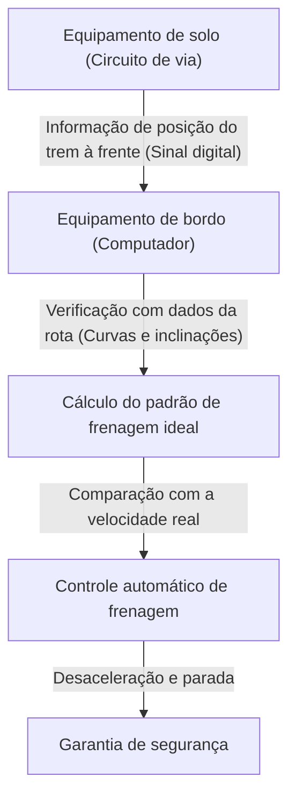

# Como Funciona o Shinkansen: A Trajetória do Japão para Conciliar Segurança e Alta Velocidade

O Shinkansen do Japão, desde a inauguração do Tokaido Shinkansen em 1964, tem mantido por mais de meio século o impressionante recorde de zero acidentes fatais com passageiros. Esta conquista não é mera coincidência, mas o fruto de múltiplas camadas de sistemas de segurança e de inovações tecnológicas contínuas. Neste artigo, exploraremos profundamente a tecnologia central que permite ao Shinkansen conciliar as demandas contrastantes de "segurança" e "alta velocidade" em um patamar tão elevado.

## 1. Implementação Rigorosa de Fail-Safe Através do ATC (Controle Automático de Trem)

O sistema mais importante ao discutir a segurança do Shinkansen é o ATC (Automatic Train Control: Controle Automático de Trem). Nas ferrovias tradicionais, o maquinista confirmava visualmente os semáforos ao lado dos trilhos e operava os freios manualmente. No entanto, em operações em alta velocidade ultrapassando os 200 km/h, depender da visão humana e do tempo de reação é extremamente perigoso.

O ATC calcula constantemente a velocidade máxima permitida em que o trem pode viajar com segurança com base na distância para o trem à frente e nas condições da via (curvas, inclinações, etc.), e a exibe no painel do maquinista. Se a velocidade real do trem exceder esta velocidade permitida, o sistema aciona automaticamente os freios, reduzindo a velocidade até um patamar seguro ou parando o trem completamente.

### A Evolução do ATC Digital

No ATC analógico inicial, os circuitos de via (um sistema que utiliza os trilhos como parte de um circuito elétrico) eram divididos em seções fixas (seções de bloqueio), e um único limite de velocidade (por exemplo, 210 km/h, 160 km/h, 30 km/h) era atribuído a cada seção. Este método exigia a redução da velocidade em estágios, o que causava problemas como a piora do conforto da viagem e o desperdício no momento da frenagem.

Os Shinkansen modernos (como o ATC-NS no Tokaido Shinkansen e o DS-ATC no Tohoku Shinkansen) adotam o "ATC Digital". No ATC digital, apenas as informações de posição do trem à frente são recebidas do solo, e o computador a bordo calcula continuamente o padrão de frenagem ideal (curva de desaceleração) com base no desempenho de frenagem do próprio trem e nos dados da via (inclinações e curvas).

Com esse "controle de frenagem de estágio único", a desaceleração desnecessária é eliminada, melhorando o conforto da viagem, enquanto a capacidade da linha (quão próximos os trens podem operar uns dos outros) aumenta dramaticamente. Além disso, mesmo que parte do sistema falhe, o princípio de design "fail-safe" (falha segura), que sempre atua para o lado seguro (para parar o trem), é rigorosamente implementado.

## 2. Redução Extrema de Peso e a Evolução dos Materiais da Carroceria

A energia cinética de um trem em alta velocidade aumenta em proporção ao quadrado de sua velocidade. Portanto, para alcançar velocidades mais altas, conservar energia e reduzir os danos aos trilhos, é essencial diminuir o peso da carroceria.

A primeira geração de trens Shinkansen, a Série 0, utilizava aço comum, mas através das subsequentes Séries 100 e 200, a liga de alumínio tornou-se o padrão. Especialmente nos trens atuais (como as Séries N700 e E5), adota-se a estrutura oca de "alumínio de pele dupla" (double-skin).

### As Vantagens da Estrutura de Alumínio de Pele Dupla

A estrutura de alumínio de pele dupla, como o nome sugere, possui uma "dupla camada" de alumínio. Semelhante à seção transversal do papelão, ela é feita soldando extrusões de alumínio que possuem nervuras de reforço em forma de treliça entre duas placas de alumínio.

1. **Leveza e Alta Rigidez**: Em comparação com a estrutura de pele simples tradicional (onde chapas são fixadas a uma estrutura), ela é muito mais leve, mas possui a alta rigidez (resistência a dobras e torções) necessária para suportar as operações em alta velocidade do Shinkansen.
2. **Melhoria no Isolamento Acústico**: O espaço entre os dois painéis atua como uma camada de ar, o que é efetivo para evitar que o ruído externo (ruído de rodagem e ruído aerodinâmico) penetre no interior.
3. **Redução de Custos de Fabricação e Reciclagem**: O uso de extrusões grandes reduz o número de pontos de solda, simplificando o processo de fabricação. Além disso, o amplo uso de um único material (alumínio) facilita a reciclagem após o trem ser aposentado.

Adicionalmente, aços de alta resistência e peças fundidas especiais são utilizadas no truque (a parte onde as rodas estão fixadas), buscando uma redução de peso em nível de gramas.

## 3. Conforto Supremo na Viagem com Suspensão a Ar e Suspensão Ativa

O fato de você não derramar o café dentro do trem enquanto viaja a 300 km/h é graças ao avançado sistema de suspensão.

### Suspensão a Ar e Sistema de Inclinação da Carroceria

"Molas pneumáticas" (suspensão a ar) estão instaladas entre a carroceria do Shinkansen e o truque. Utilizando a elasticidade do ar comprimido, elas são mais macias do que as molas helicoidais metálicas, absorvendo efetivamente vibrações mínimas.

Em trens mais novos como a Série N700, um "sistema de inclinação da carroceria", que aplica ainda mais essas molas pneumáticas, é instalado. Ao entrar em uma curva, o trem infla as molas pneumáticas do lado externo e desinfla as do lado interno, inclinando o trem em até 1 a 1,5 graus. Isso cancela a força centrífuga aplicada aos passageiros, permitindo que o trem passe pelas curvas sem desacelerar enquanto mantém uma viagem confortável.

### Suspensão Totalmente Ativa

Para suprimir a oscilação lateral, introduziu-se também a "suspensão totalmente ativa". Quando os sensores montados no trem detectam a aceleração lateral, o computador realiza cálculos instantâneos e opera cilindros hidráulicos (ou atuadores elétricos) entre o truque e a carroceria para forçar a aplicação de uma força que anula o movimento de oscilação.
Isso reduz drasticamente a oscilação lateral repentina que ocorre ao entrar em túneis ou quando trens passam um pelo outro.

## 4. O Triunfo da Dinâmica dos Fluidos na Prevenção de Ondas de Micro-Pressão (Estrondo Sônico em Túneis)

O carro da frente do Shinkansen tem um formato muito singular, lembrando o bico de um ornitorrinco ou de um pássaro. Não se trata apenas de design, mas o resultado de uma abordagem fluidodinâmica para resolver um problema ambiental específico de ferrovias de alta velocidade chamado "onda de micro-pressão" (onda de micro-pressão em túnel).

### O Mecanismo do Estrondo do Túnel

Quando um trem em alta velocidade entra em um túnel, o ar dentro dele é empurrado para a frente como um pistão, gerando uma onda de compressão. Quando esta onda de compressão viaja pelo túnel à velocidade do som e é liberada pela saída oposta, ela cria um ruído de baixa frequência semelhante a uma explosão ("boom" sônico) conhecido como onda de micro-pressão. Isso causa problemas ambientais, como o tremor nas janelas de casas próximas.

### A Evolução do Formato Dianteiro

Para suprimir esta onda de micro-pressão, é necessário suavizar a velocidade (o gradiente de mudança de pressão) com a qual o trem esmaga o ar ao entrar no túnel.

- **Série 0**: O formato de "nariz de bolinho" (arredondado). Na velocidade da época (210 km/h), isso não era um problema.
- **Série 500**: Para atingir os 300 km/h, adotou um bico pontiagudo de 15 metros de comprimento inspirado no bico do martim-pescador. Reduziu bastante a onda de micro-pressão, mas tinha a desvantagem de estreitar o espaço da cabine.
- **Série N700**: Um formato chamado "Aero Double Wing" (asa dupla aerodinâmica). Através de uma superfície tridimensional complexa como a de um pássaro abrindo suas asas, manteve o comprimento frontal em cerca de 10,7 metros, distribuindo a onda de micro-pressão de maneira otimizada.
- **Série E5**: Estendeu o comprimento dianteiro ainda mais, para 15 metros, adotando um formato chamado "Arrowline" (linha de flecha). Equilibrou o desempenho ambiental com a operação comercial mais rápida do Japão a 320 km/h.

Estes formatos frontais complexos são derivados através de simulações massivas de análise de fluidos (CFD) usando supercomputadores, o que pode ser considerado o ápice tecnológico que rivaliza com a engenharia aeroespacial moderna.

## Conclusão

O Shinkansen é um sistema massivo que só existe devido à combinação dos veículos, dos trilhos, do sistema de sinalização e do know-how humano para operá-los. A garantia absoluta de segurança fornecida pelo ATC, a busca por leveza extrema e tecnologia de suspensão, juntamente com a dinâmica de fluidos para se harmonizar com o ambiente. É o acúmulo de cada uma dessas tecnologias que gerou o mito de mais de meio século sem acidentes e continua a impulsionar sua evolução.
A tecnologia do Shinkansen japonês transcende o fato de ser um simples meio de transporte, tornando-se um marco global que aponta para o futuro da infraestrutura.
