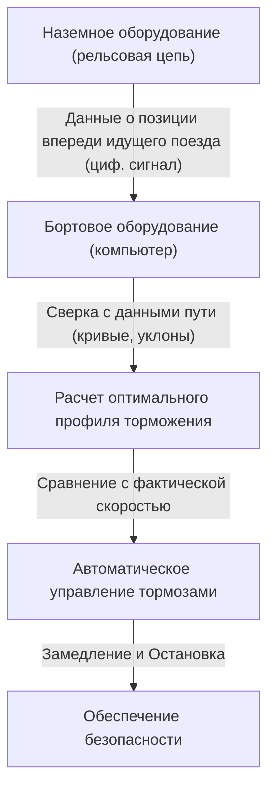

# Устройство Синкансэн: японский путь к балансу между безопасностью и высокой скоростью

Японские поезда Синкансэн (Shinkansen) с момента запуска линии Токайдо-Синкансэн в 1964 году поддерживают поразительный рекорд: за более чем полвека эксплуатации не было ни одного случая гибели пассажиров в результате аварий. Это достижение — не просто случайность, а результат многоуровневой системы безопасности и непрерывных технологических инноваций. В этой статье мы подробно рассмотрим ключевые технологии, позволяющие Синкансэн сочетать, казалось бы, противоречивые требования — высочайшую степень безопасности и огромную скорость.

## 1. Абсолютная отказоустойчивость (Fail-safe) благодаря ATC (Автоматической системе управления поездами)

Важнейшей системой, о которой необходимо упомянуть при разговоре о безопасности Синкансэн, является ATC (Automatic Train Control — Автоматическая система управления поездами). На традиционных железных дорогах машинист визуально проверяет путевые светофоры и вручную управляет тормозами. Однако при движении на скоростях свыше 200 км/ч полагаться на человеческое зрение и скорость реакции крайне опасно.

Система ATC постоянно рассчитывает максимально допустимую скорость (разрешенную скорость), с которой может двигаться поезд, исходя из дистанции до идущего впереди состава и условий пути (кривые, уклоны и т.д.), и отображает ее на приборной панели машиниста. Если фактическая скорость поезда превышает это допустимое значение, система автоматически применяет торможение, замедляя поезд до безопасной скорости или полностью останавливая его.

### Эволюция цифровой ATC

В ранних аналоговых системах ATC рельсовые цепи (система, использующая рельсы как часть электрической цепи) делились на определенные участки (блок-участки), и каждому участку назначалось единственное ограничение скорости (например, 210 км/ч, 160 км/ч, 30 км/ч и т.д.). При таком подходе скорость приходилось снижать ступенчато, что ухудшало комфорт поездки и приводило к неэффективному использованию торможения.

В современных системах Синкансэн (например, ATC-NS на линии Токайдо-Синкансэн и DS-ATC на линии Тохоку-Синкансэн) применяется «цифровая ATC». В цифровой ATC с наземного оборудования передается только информация о местоположении идущего впереди поезда, а бортовой компьютер непрерывно рассчитывает оптимальный профиль торможения (кривую замедления) на основе тормозных характеристик самого поезда и данных о пути (уклоны и кривые).

Благодаря такому «одноступенчатому управлению торможением» исключаются ненужные замедления, повышается комфорт для пассажиров, а также значительно увеличивается пропускная способность линии (насколько плотно могут идти поезда). Кроме того, в системе строго соблюдается принцип «fail-safe» (безопасный отказ): даже в случае выхода из строя части системы, она всегда срабатывает в безопасном направлении (на остановку поезда).

## 2. Глубокое снижение веса кузова и эволюция материалов

Кинетическая энергия движущегося с высокой скоростью поезда возрастает пропорционально массе и квадрату скорости. Следовательно, для достижения высоких скоростей, энергосбережения и снижения нагрузки на железнодорожный путь необходимо кардинально снижать массу кузова вагона.

В первых поездах Синкансэн серии 0 использовалась сталь (обычная углеродистая сталь), но в последующих сериях 100 и 200, а затем и далее, основным материалом стал алюминиевый сплав. В частности, в современных вагонах (таких как серии N700 и E5) применяется полая «алюминиевая конструкция с двойной обшивкой» (Double Skin).

### Преимущества алюминиевой конструкции с двойной обшивкой

Алюминиевая конструкция с двойной обшивкой буквально означает «двойную кожу» из алюминия. Она изготавливается путем сварки экструдированных профилей, в которых между двумя алюминиевыми листами расположены фермовые усиливающие ребра, подобно поперечному срезу гофрокартона.

1. **Легкость и высокая жесткость**: По сравнению с традиционной конструкцией с одинарной обшивкой (когда листы крепятся к каркасу), она значительно легче, но при этом обладает высокой жесткостью (устойчивостью к прогибу и кручению), способной выдерживать высокоскоростное движение Синкансэн.
2. **Улучшенная звукоизоляция**: Поскольку пространство между двумя панелями служит воздушной прослойкой, оно эффективно предотвращает проникновение внешнего шума (шума от качения и аэродинамического шума) в салон.
3. **Снижение производственных затрат и переработка**: Использование крупных экструдированных профилей уменьшает количество сварных швов и упрощает производственный процесс. Кроме того, использование большого количества однородного материала (алюминия) облегчает переработку после списания вагонов.

Более того, в деталях тележек (частей с колесными парами) используются высокопрочные стали и специальные литые детали, что позволяет бороться за каждый грамм веса.

## 3. Пневморессоры и активная подвеска для непревзойденного комфорта

Возможность двигаться со скоростью 300 км/ч так, чтобы в салоне не расплескался кофе, обеспечивается мощью передовых систем подвески.

### Пневморессоры и система наклона кузова

Между кузовом поезда Синкансэн и тележками установлены «пневматические рессоры» (пневморессоры). Эта подвеска использует упругость сжатого воздуха; она мягче металлических винтовых пружин и эффективно поглощает мелкие вибрации.

В новейших поездах, таких как серия N700, установлена «система наклона кузова», которая является дальнейшим развитием технологии пневморессор. При входе в поворот внешние пневморессоры накачиваются воздухом, а внутренние спускаются, наклоняя кузов на угол от 1 до 1.5 градусов. Это компенсирует центробежную силу, действующую на пассажиров, позволяя проходить повороты без снижения скорости и сохраняя при этом высокий уровень комфорта.

### Полностью активная подвеска

Для подавления боковой раскачки также внедрена «полностью активная подвеска» (Full Active Suspension). Когда датчики на кузове фиксируют ускорение бокового крена, компьютер мгновенно производит расчеты и активирует гидравлические цилиндры (или электрические актуаторы) между тележкой и кузовом, чтобы принудительно приложить силу в направлении, гасящем раскачку.
Благодаря этому резко снижаются внезапные боковые толчки, возникающие при въезде в туннель или разъезде со встречным поездом.

## 4. Вершина аэродинамики, предотвращающая микробарические волны («тоннельный хлопок»)

Головные вагоны Синкансэн имеют очень специфическую форму, напоминающую утконоса или птичий клюв. Это не просто дизайнерское решение, а результат применения гидро- и аэродинамических подходов для решения экологической проблемы, свойственной высокоскоростным железным дорогам, — «микробарических волн» в тоннелях.

### Механизм возникновения «тоннельного хлопка»

Когда высокоскоростной поезд въезжает в тоннель, воздух внутри него выталкивается вперед, как поршнем, создавая волну сжатия. Эта волна распространяется по тоннелю со скоростью звука и при выходе с противоположной стороны порождает низкочастотный звук (микробарическую волну), похожий на звук взрыва — «бум». Это вызывает экологические проблемы, такие как дребезжание оконных стекол в близлежащих домах.

### Эволюция формы головного вагона

Чтобы подавить эту микробарическую волну, необходимо сгладить скорость, с которой поезд сжимает воздух при входе в тоннель (градиент изменения давления).

- **Серия 0**: Округлая «носовая» часть, похожая на пулю. При тогдашней скорости (210 км/ч) это не было проблемой.
- **Серия 500**: Для достижения скорости в 300 км/ч была принята острая форма головной части длиной 15 метров, вдохновленная клювом зимородка. Это значительно снизило микробарические волны, но привело к недостатку — сужению пассажирского салона.
- **Серия N700**: Форма, получившая название «Aero Double-Wing» (аэро-двойное крыло). Благодаря сложным трехмерным кривым, напоминающим распростертые крылья птицы, удалось сократить длину носа примерно до 10.7 метров, при этом оптимально рассеивая микробарические волны.
- **Серия E5**: Длина носовой части была вновь увеличена до 15 метров с применением формы «Arrow Line» (линия стрелы). Это позволило совместить максимальную для Японии эксплуатационную скорость в 320 км/ч с высокими экологическими показателями.

Такие сложные формы головных вагонов были получены в результате колоссального объема вычислений в области вычислительной гидродинамики (CFD) на суперкомпьютерах, и по праву могут считаться вершиной технологий, сопоставимой с современной аэрокосмической инженерией.

## Заключение

Синкансэн — это гигантская система, которая работает лишь благодаря единству транспортных средств, путей, сигнальных систем и ноу-хау людей, которые ими управляют. Абсолютная гарантия безопасности посредством ATC, доведенные до совершенства технологии снижения веса и подвески, а также аэродинамика, направленная на гармонию с окружающей средой. Накопление каждой из этих технологий породило миф о безаварийности, длящейся более полувека, и продолжает эволюционировать по сей день.
Японская технология Синкансэн вышла за рамки простого средства передвижения, став мировым эталоном того, какой должна быть инфраструктура будущего.
