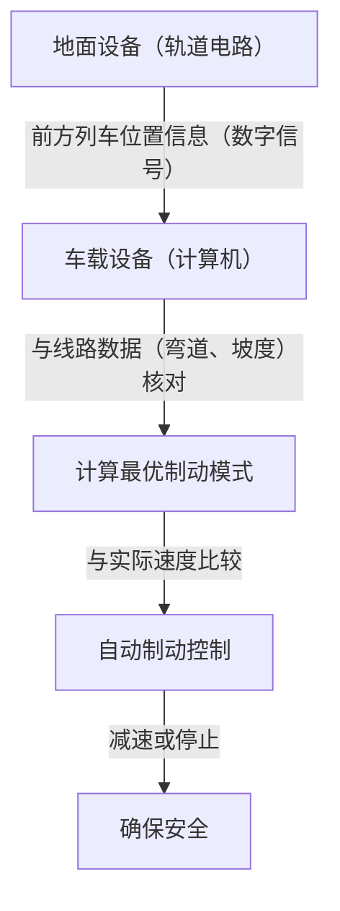

# 新干线的运行机制：日本如何兼顾安全与高速

自1964年东海道新干线开通以来，日本的新干线在半个多世纪中保持了乘客零死亡事故的惊人记录。这一成就不单单是偶然，而是得益于层层部署的安全系统以及持续不断的科技创新。本文将深入探讨新干线是如何在极高的水平上兼顾“安全”与“高速”这两个看似矛盾的需求，并详细剖析其核心技术。

## 1. 通过ATC（自动列车控制系统）贯彻故障导向安全（Fail-Safe）理念

在探讨新干线的安全性时，最重要的系统便是ATC（Automatic Train Control：自动列车控制系统）。在传统铁路中，驾驶员需要通过肉眼确认铁路旁的信号灯，并手动操作制动器。然而，在时速超过200公里的高速行驶下，依赖人类的视觉和反应速度是极其危险的。

ATC系统会根据与前方列车的距离以及线路条件（如弯道、坡度等），持续计算当前列车可以行驶的最高速度（允许速度），并显示在驾驶台上。如果列车的实际速度超过了该允许速度，系统会自动启动制动器，使列车减速至安全速度，甚至完全停止。

### 数字ATC的演进

在早期的模拟ATC系统中，通过轨道电路（将钢轨作为电气电路一部分的系统）将线路划分为若干个固定区间（闭塞区间），并为每个区间分配单一的限制速度（例如210km/h、160km/h、30km/h等）。这种方式由于需要阶段性地降低速度，因此存在影响乘坐舒适度以及制动时机存在无谓损耗等问题。

现代新干线（例如东海道新干线的ATC-NS或东北新干线的DS-ATC）采用了“数字ATC”。在数字ATC系统中，列车仅从地面接收前方列车的位置信息，然后车载计算机将根据自身列车的制动性能以及线路数据（坡度和弯道），连续计算出最理想的制动模式（减速曲线）。

凭借这种“一段制动控制”，消除了不必要的减速，在提升乘坐舒适度的同时，线路容量（列车运行的密集程度）也得到了飞跃性的提升。此外，即使系统的某一部分发生故障，也会始终朝着安全的方向（即让列车停止的方向）运行，全面贯彻了“故障导向安全（Fail-Safe）”的设计理念。

## 2. 极致的车体轻量化与材料革新

高速行驶列车的动能与质量和速度的平方成正比。因此，为了实现高速化、节能减排，以及减轻对轨道的损伤，车体轻量化是必不可少的。

初代的0系新干线使用的是钢铁（普通钢），但在随后的100系、200系之后，铝合金逐渐成为主流。特别是现在的车辆（如N700系和E5系等），采用了中空结构的“铝合金双壳结构（Double-skin Structure）”。

### 铝合金双壳结构的优势

铝合金双壳结构顾名思义就是拥有铝制“双层蒙皮”的结构。它类似于瓦楞纸板的横截面，是将两层铝板之间设有桁架状加强肋的挤压型材焊接而成的。

1. **轻量且高刚性**：与传统的单壳结构（在骨架上贴附面板的方式）相比，它不仅重量轻得多，而且具备足以承受新干线高速行驶的高刚性（抗弯曲和抗扭曲的强度）。
2. **隔音性能提升**：两层面板之间的空间形成空气层，从而有效防止车外噪音（行驶噪音和空气动力噪音）传入车内。
3. **降低制造成本与易于回收**：通过使用大型挤压型材，减少了焊接部位，简化了制造工艺。此外，由于大量使用单一材料（铝），废车后的回收也变得更加容易。

不仅如此，转向架（带有车轮的部分）的部件也使用了高张力钢和特殊的铸造零件，实现了精确到克级别的轻量化。

## 3. 空气弹簧与主动悬架带来的极致乘坐体验

能够在时速300公里行驶时依然保持车内咖啡不溢出的平稳乘坐体验，离不开先进悬架系统的功劳。

### 空气弹簧与车体倾斜系统

新干线的车体与转向架之间安装了“空气弹簧”。这是一种利用压缩空气弹力的弹簧，相比金属螺旋弹簧更加柔软，能够有效地吸收微小的震动。

在N700系等最新型号车辆中，配备了进一步应用这种空气弹簧的“车体倾斜系统”。当列车驶入弯道时，系统会使外侧的空气弹簧膨胀、内侧收缩，从而使车体倾斜最多1度至1.5度。这一举措可以抵消乘客所受到的离心力，使得列车在弯道处无需减速，即可在保持舒适乘坐体验的同时顺利通过。

### 全主动悬架

为了抑制左右摇晃，新干线还引入了“全主动悬架（Full Active Suspension）”。当安装在车体上的传感器检测到横向摇晃的加速度时，计算机会立刻进行运算，并驱动位于转向架与车体之间的液压缸（或电动执行器），强行施加一个与摇晃方向相反的力来抵消震动。
由此，在进入隧道或列车交汇时所产生的突发性横向摇晃得到了显著降低。

## 4. 防止微气压波（隧道音爆）的流体力学结晶

新干线的先头车辆采用了类似于鸭嘴兽或鸟嘴般的极为独特的形状。这并非单纯出于设计美学，而是为了解决高速铁路特有的环境问题——“微气压波（隧道微气压波）”，并基于流体力学方法得出的结果。

### 隧道音爆的机制

当高速行驶的列车冲入隧道时，隧道内的空气会像被活塞挤压一般向前推进，从而产生压缩波。当该压缩波以音速在隧道内传播，并从另一侧的出口释放时，会产生类似于爆炸声的“轰”声低频音（微气压波）。这会引发震动周边民居窗玻璃等环境问题。

### 车头形状的演进

为了抑制这种微气压波，必须使列车进入隧道时挤压空气的速度（压力变化的梯度）变得更为平缓。

- **0系**：带有圆润感的“团子鼻”。在当时的速度（210km/h）下并未成为问题。
- **500系**：为了实现时速300公里，从翠鸟的喙中获得灵感，采用了长达15米的尖锐车头形状。虽然大幅降低了微气压波，但也存在客舱空间变窄的缺点。
- **N700系**：被称为“气动双翼（Aero Double-Wing）”的形状。通过宛如鸟儿展翅般的复杂三维曲面，在将车头长度控制在约10.7米的同时，实现了微气压波的最优分散。
- **E5系**：将车头长度进一步拉长至15米，采用了被称为“箭线（Arrow Line）”的形状。成功实现了时速320公里这一日本最快运营速度与环保性能的兼顾。

这些复杂的车头形状是依靠超级计算机进行庞大的流体解析（CFD）模拟推导出来的，可以说是堪比现代航空航天工程的技术结晶。

## 结语

新干线是一个庞大的系统，只有当车辆、轨道、信号系统以及负责运营管理的人类专长三位一体结合时才能成立。凭借ATC提供的绝对安全保障、追求极致的轻量化与悬架技术，以及为了与环境协调而应用流体力学。正是这一项项技术的累积，创造了半个多世纪无事故的神话，而且至今仍在不断进化中。
日本的新干线技术早已超越了单纯的交通工具范畴，成为了展示未来基础设施发展方向的全球基准。
