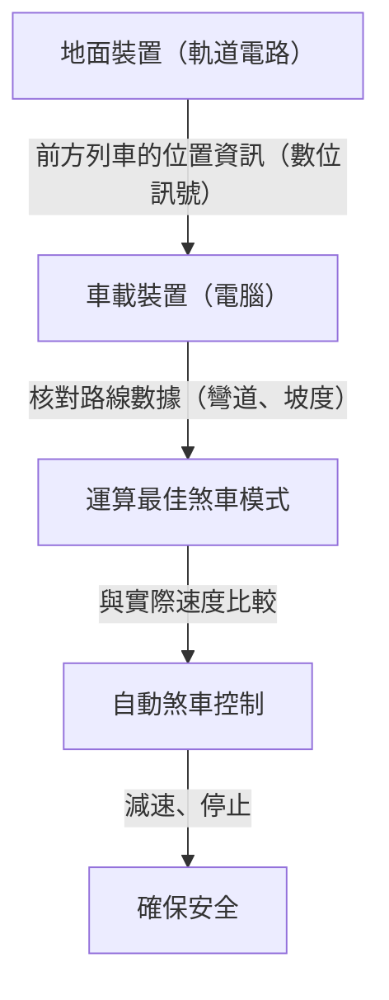

# 新幹線的運作原理：日本兼顧安全與高速的發展軌跡

日本的新幹線自1964年東海道新幹線開業以來，在長達半個多世紀的時間裡，維持著乘客零死亡事故的驚人紀錄。這項成就絕非偶然，而是重重疊加的安全系統與持續不斷的技術創新所結出的碩果。本文將深入探討新幹線究竟是如何在「安全」與「高速」這兩個互相矛盾的要求中取得高水準的平衡，並深度剖析其核心技術。

## 1. 透過ATC（自動列車控制系統）徹底落實故障失效安全（Fail-Safe）

在談論新幹線的安全性時，最重要的系統莫過於ATC（Automatic Train Control：自動列車控制系統）。在傳統的鐵路中，駕駛員需要用肉眼確認鐵軌旁的號誌，並手動操作煞車。然而，在時速超過200公里的高速行駛下，依賴人類的視覺與反應速度是極度危險的。

ATC會根據與前方列車的距離以及軌道條件（彎道、坡度等），持續計算自身列車被允許行駛的最高速度（容許速度），並顯示在駕駛台上。如果列車的實際速度超過了這個容許速度，系統便會自動啟動煞車，將列車減速至安全速度，甚至完全停止。

### 數位ATC的演進

在早期的類比ATC中，軌道電路（將鐵軌作為電氣迴路一部分的系統）被劃分為固定的區間（閉塞區間），並為每個區間分配單一的限制速度（例如210km/h、160km/h、30km/h等）。在這種方式下，由於必須階段性地降低速度，因此存在著乘坐舒適度變差，以及煞車時機產生浪費等問題。

現代的新幹線（例如東海道新幹線的ATC-NS與東北新幹線的DS-ATC）則採用了「數位ATC」。在數位ATC中，列車只需從地面接收前方列車的位置資訊，車載電腦便會根據自身列車的煞車性能與軌道數據（坡度與彎道），連續計算出最佳的煞車模式（減速曲線）。

透過這種「一段式煞車控制」，消除了不必要的減速，不僅提升了乘坐舒適度，軌道容量（列車行駛的密集程度）也獲得了飛躍性的增加。此外，即使系統的某個部分發生故障，也徹底貫徹了始終朝向安全側（使列車停止的方向）運作的「故障失效安全（Fail-Safe）」設計理念。

## 2. 徹底的車體輕量化與材質演進

高速行駛列車的動能會與質量的速度平方成正比增加。因此，為了實現高速化與節能，進而減輕對軌道的破壞，車體的輕量化是不可或缺的。

第一代的0系新幹線使用的是鋼鐵（普通鋼），但在隨後的100系、200系之後，鋁合金成為了主流。特別是現在的車輛（如N700系與E5系等），更採用了中空結構的「鋁合金雙皮層構造（Aluminum Double Skin）」。

### 鋁合金雙皮層構造的優勢

鋁合金雙皮層構造，顧名思義就是擁有鋁製「雙層表皮」的結構。就像瓦楞紙板的剖面一樣，由兩塊鋁板之間夾著桁架狀加強肋的擠壓型材焊接而成。

1. **輕量且高剛性**：與傳統的單皮層構造（在骨架上貼附金屬板的方式）相比，它不僅輕得多，還具備足以承受新幹線高速行駛的高剛性（抗彎曲與抗扭曲的強度）。
2. **隔音性能提升**：由於兩塊面板之間的空間形成了空氣層，因此能有效防止車外的噪音（行駛噪音與空氣動力噪音）傳入車內。
3. **降低製造成本與便於回收**：使用大型的擠壓型材可以減少焊接點，簡化製造工序。此外，由於大量使用單一材質（鋁），因此車輛報廢後的回收也相對容易。

不僅如此，轉向架（裝有車輪的部分）的零件也使用了高張力鋼與特殊的鑄造零件，力求達到以公克為單位的極致輕量化。

## 3. 氣壓懸吊與主動式懸吊系統帶來極致的乘坐體驗

在時速300公里的行駛狀態下，還能達到讓車內咖啡不溢出的舒適度，這全仰賴高度先進的懸吊系統。

### 氣壓懸吊與車體傾斜系統

新幹線的車體與轉向架之間，安裝有「氣壓懸吊（空氣彈簧）」。這是一種利用壓縮空氣彈力的彈簧，比起金屬製的螺旋彈簧更為柔軟，能有效吸收微小的震動。

在N700系等最新車型中，更搭載了將此氣壓懸吊進一步應用的「車體傾斜系統」。當列車接近彎道時，會使外側的氣壓懸吊膨脹、內側收縮，讓車體最大傾斜1度至1.5度。這能夠抵銷乘客所承受的離心力，讓列車即使在彎道中也不用減速，能維持著舒適的乘坐體驗順暢通過。

### 全主動式懸吊系統

為了抑制左右搖晃，系統也導入了「全主動式懸吊系統」。當安裝在車體上的感測器偵測到橫向搖晃的加速度時，電腦會立即進行計算，並驅動位於轉向架與車體之間的液壓缸（或電動致動器），強制施加一股抵銷搖晃的力道。
得益於此，列車在進入隧道或與其他列車交會時所產生的突發性橫向搖晃得到了劇烈的減輕。

## 4. 防範微氣壓波（隧道音爆）的流體力學結晶

新幹線的車頭擁有非常獨特的形狀，宛如鴨嘴獸或鳥類的喙。這絕不僅僅是為了造型設計，而是為了解決高速鐵路特有的環境問題——「微氣壓波（隧道微氣壓波）」所採取的流體力學對策。

### 隧道音爆的機制

當高速行駛的列車衝入隧道時，隧道內的空氣會像活塞一樣被推向前方，進而產生壓縮波。這個壓縮波以音速在隧道內傳播，當從另一端的出口釋放時，會產生如同爆炸聲般的低頻噪音（微氣壓波）。這會引發周邊民宅窗玻璃震動等環境問題。

### 車頭形狀的演進

為了抑制這種微氣壓波，必須讓列車進入隧道時擠壓空氣的速度（壓力變化的梯度）變得更加平滑。

- **0系**：帶有圓潤感的丸子鼻。在當時的速度（210km/h）下並未構成問題。
- **500系**：為了實現時速300km，採用了以翠鳥的喙為靈感、長達15公尺的尖銳車頭形狀。這大幅降低了微氣壓波，但缺點是犧牲了客艙空間。
- **N700系**：被稱為「氣動雙翼（Aero Double-Wing）」的形狀。透過宛如鳥類展翅般複雜的三維曲面，將車頭長度控制在約10.7公尺，同時達到最理想的微氣壓波分散效果。
- **E5系**：將車頭長度進一步延伸至15公尺，採用了被稱為「箭線（Arrow Line）」的形狀。成功兼顧了時速320km的日本最快營運速度與環境性能。

這些複雜的車頭形狀，是藉由超級電腦進行龐大流體解析（CFD）模擬所計算出來的結果，堪稱是足以媲美現代航空航太工程的技術結晶。

## 結語

新幹線是一個由車輛、軌道、號誌系統，以及負責營運這些設施的人類專業知識三位一體才得以成立的龐大系統。藉由ATC確保的絕對安全、追求極致的輕量化與懸吊技術，以及為了與環境調和的流體力學。正是這每一項技術的日積月累，創造了半世紀以上無事故的神話，且至今仍持續進化中。
日本的新幹線技術早已超越了單純的交通工具，成為了向世界展示未來基礎設施樣貌的全球標竿。
