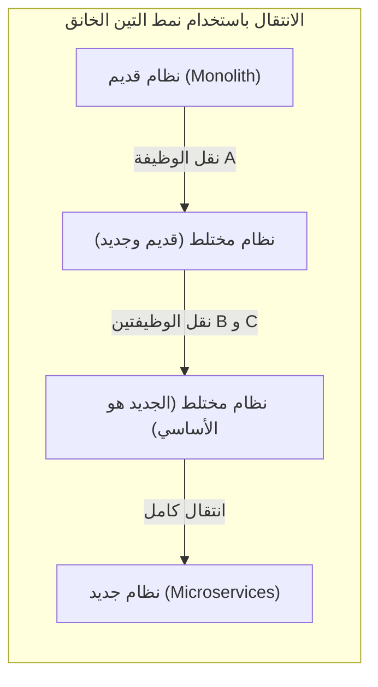
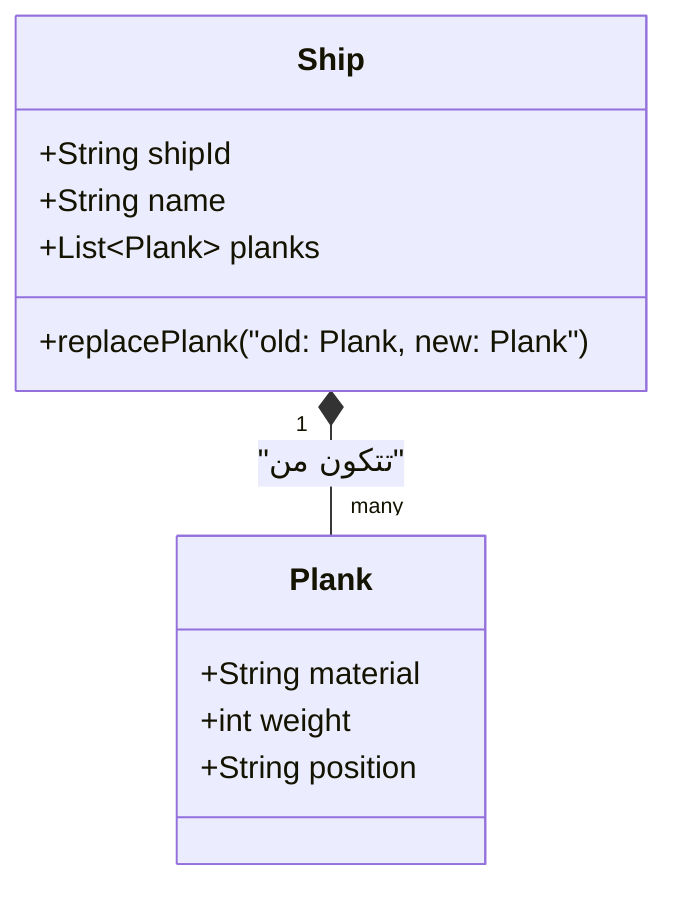
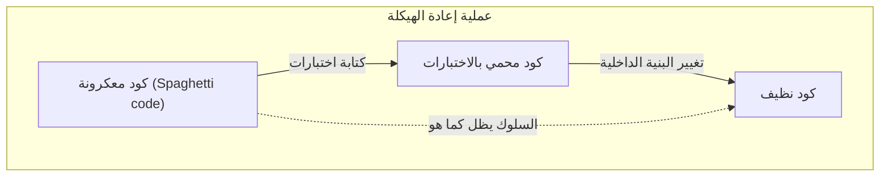
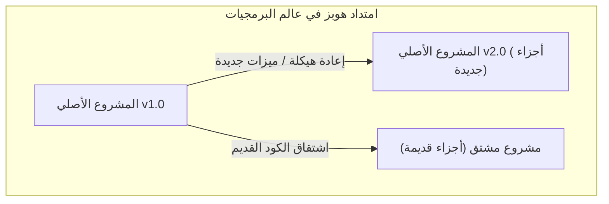

مرحباً. هل سمعتم من قبل عن المفارقة الفلسفية (التجربة الفكرية) المعروفة باسم **[سفينة ثيسيوس](https://kenji.blog/ar/p/ship-of-theseus/)** (Ship of Theseus)؟

كانت السفينة التي ركبها البطل اليوناني ثيسيوس محفوظة كنصب تذكاري من قبل الأجيال اللاحقة. ولكن، نظراً لأنها سفينة خشبية، فقد بدأت بعض أجزائها في التآكل مع مرور الوقت. قام الناس باستبدال الخشب المتعفن بخشب جديد لمواصلة ترميم السفينة. ومع مرور فترة طويلة من الزمن، وصلت السفينة أخيراً إلى حالة **لم يتبق فيها أي جزء من أجزاء السفينة الأصلية**.

هنا يطرح سؤال واحد نفسه.

"هل هذه السفينة التي تم استبدال جميع أجزائها، هي في الواقع **نفس [سفينة ثيسيوس](https://kenji.blog/ar/p/ship-of-theseus/) الأصلية**؟"

تمت مناقشة هذه التجربة الفكرية منذ العصور القديمة في الفلسفة للتساؤل عن ماهية "الهوية" (Identity). وما يثير الدهشة هو أن هذه المشكلة هي موضوع نواجهه يومياً في **هندسة البرمجيات** و**تطوير الأنظمة** الحديثة.

في هذه المقالة، وانطلاقاً من مفارقة **[سفينة ثيسيوس](https://kenji.blog/ar/p/ship-of-theseus/)** هذه، سنتعمق في استكشاف إعادة الهيكلة (Refactoring) في تطوير البرمجيات، ونقل الأنظمة القديمة (Migration)، ومفهوم "الهوية" في البرمجة الكائنية التوجه ([OOP](https://kenji.blog/ar/p/object-oriented-programming-oop-solid-principles/)).

## 1. "[سفينة ثيسيوس](https://kenji.blog/ar/p/ship-of-theseus/)" في عالم البرمجيات

في تطوير البرمجيات الحديث، نادراً ما يستمر نظام تم إصداره مرة واحدة في العمل دون أي تغييرات. يتم إعادة كتابة الكود باستمرار لأسباب مختلفة، مثل إضافة متطلبات عمل جديدة، وإصلاح الأخطاء، وتحسين الأداء، أو تحديث التقنيات الأساسية.

تماماً مثل استبدال الخشب المتعفن بخشب جديد، يتم استبدال الوحدات القديمة بوحدات جديدة باستمرار.

### نمط التين الخانق (Strangler Fig Pattern)

من أشهر الأنماط المعمارية (Architecture Patterns) لاستبدال الأنظمة نمط يسمى **نمط التين الخانق** (Strangler Fig Pattern). وهو نهج لا يتم فيه استبدال النظام القديم الضخم والمعقد (Monolith) بالكامل دفعة واحدة، بل يتم نقل الوظائف تدريجياً إلى نظام جديد (مثل الخدمات المصغرة - [Microservices](https://kenji.blog/ar/p/microservices-architecture-bff-api-gateway/)).

عند اكتمال هذه العملية، تكون البنية الداخلية للنظام الذي يصل إليه المستخدمون **مختلفة تماماً**. قد لا يتبقى سطر واحد من الكود القديم. ومع ذلك، من وجهة نظر المستخدم، إنها "نفس الخدمة المعتادة"، ولم يتغير الرابط (URL) ولا اسم العلامة التجارية.

هذه بالضبط هي **[سفينة ثيسيوس](https://kenji.blog/ar/p/ship-of-theseus/)**. حتى لو تم استبدال جميع المكونات (الأجزاء) التي يتكون منها النظام، يُعتبر أن "الهوية" الخاصة بالنظام ككل قد تم الحفاظ عليها.

## 2. "الهوية" في البرمجة الكائنية التوجه ([OOP](https://kenji.blog/ar/p/object-oriented-programming-oop-solid-principles/))

عند التفكير في "الهوية" على مستوى الكود، فإن المفهوم الأكثر ارتباطاً هو **البرمجة الكائنية التوجه (OOP)**. في البرمجة الكائنية التوجه، يوجد معياران رئيسيان لتحديد الهوية.

1. **تساوي المرجع (Reference Equality)**: ما إذا كان يشير إلى نفس الموقع في الذاكرة (هل المؤشر هو نفسه).
2. **تساوي القيمة (Value Equality)**: ما إذا كانت جميع السمات (البيانات) المحتفظ بها متطابقة.

في [سفينة ثيسيوس](https://kenji.blog/ar/p/ship-of-theseus/)، فإن الادعاء بأن "جميع الأجزاء قد تم استبدالها ولذلك فهي سفينة مختلفة" هو طريقة تفكير تؤكد على **تساوي القيمة**. من ناحية أخرى، فإن الادعاء بأن "السياق التاريخي والاجتماعي مستمر ولذلك فهي نفس السفينة" يمكن القول إنه أقرب إلى نوع من **تساوي المرجع**.

### "الكيان (Entity)" و"كائن القيمة (Value Object)" في التصميم المدفوع بالمجال (DDD)

النهج النموذجي الذي يحل هذه المشكلة بشكل جميل هو **التصميم المدفوع بالمجال (DDD)** الذي اقترحه إريك إيفانز. في DDD، يتم تصنيف نموذج المجال إلى **كيانات (Entity)** و**كائنات قيمة (Value Object)**.

- **الكيان (Entity)**: كائن يحتفظ بهويته حتى لو تغيرت سماته. يتم تحديد الهوية بواسطة معرّف (ID).
- **كائن القيمة (Value Object)**: كائن تتحدد هويته من خلال سماته نفسها. إذا اختلفت سمة واحدة، فهو كائن مختلف.

وبتطبيق هذا على [سفينة ثيسيوس](https://kenji.blog/ar/p/ship-of-theseus/)، يمكن الحصول على نمذجة واضحة جداً.

- **السفينة (Ship)** هي **كيان (Entity)**.
- **أجزاء السفينة (Plank / اللوح الخشبي)** هي **كائنات قيمة (Value Object)**.

حتى لو تآكلت أجزاء السفينة (كائن القيمة) وتم استبدالها بأخرى جديدة، فإن معرّف السفينة `shipId` (الكيان) لا يتغير. لذلك، على مستوى النظام، يتم التعامل معها على أنها **نفس السفينة تماماً**.

في عالم البرمجيات، لا تُحدد "الهوية" من خلال الكيان المادي أو الحالة المادية، بل يتم تحديدها من خلال نية المصمم في **"هل يجب التعامل معها كشيء واحد في مجال العمل (Business Domain)"**.

## 3. إعادة الهيكلة والحفاظ على السلوك

لا يمكن الحديث عن الهوية في البرمجيات دون ذكر **إعادة الهيكلة (Refactoring)**.
يعرّف مارتن فاولر إعادة الهيكلة على النحو التالي:

> تغيير البنية الداخلية لبرنامج ما بطريقة تسهل فهمه وتعديله، مع الحفاظ على سلوكه الخارجي كما هو.

هنا أيضاً، تلعب "الهوية" دوراً رئيسياً. حتى لو تمت إعادة كتابة البنية الداخلية (الأجزاء) للكود بشكل كبير، طالما أن **السلوك الخارجي** لم يتغير، فسيتم اعتباره "نفس النظام".

ما يضمن هذا "السلوك الخارجي" هو **الاختبارات الآلية ([Automate](https://kenji.blog/ar/p/automata-formal-language-theory/)d Tests)**. طالما أن جميع الاختبارات تستمر في النجاح، فمهما تم استبدال الأجزاء الداخلية (طرق أو فئات أو البنية بأكملها)، فإن هذا البرنامج سيظل "نفس الشيء" مثل [سفينة ثيسيوس](https://kenji.blog/ar/p/ship-of-theseus/).

## 4. "[سفينة ثيسيوس](https://kenji.blog/ar/p/ship-of-theseus/)" في فرق العمل (Project Teams)

ليس فقط نظام البرمجيات بحد ذاته، بل **فريق التطوير** الذي يبنيه يمكن أن يكون أيضاً [سفينة ثيسيوس](https://kenji.blog/ar/p/ship-of-theseus/).

في المشاريع طويلة الأجل، يغادر الأعضاء الأوائل تدريجياً، وينضم أعضاء جدد. بعد بضع سنوات، ليس من غير المألوف أن تجد فريقاً لم يتبق فيه أحد من الأعضاء المؤسسين.

إذن، هل يمكن القول إن الفريق الذي تم استبدال جميع أعضائه هو نفس الفريق الأصلي؟

ما يصبح مهماً هنا هو **ثقافة الفريق** و**نقل الوثائق والمعرفة الضمنية**.
حتى مع تغير الأعضاء، إذا تم توريث عملية التطوير كفريق، وقواعد كتابة الكود، ومعايير مراجعة الكود، والرؤية الخاصة بالمنتج، فيمكن القول إن هذا الفريق يحتفظ بهويته.

وعلى العكس من ذلك، إذا لم يتم توفير عملية تأهيل مناسبة أو توثيق، وتغير أسلوب التطوير ومعايير الجودة تماماً مع تغير الأعضاء، فيمكن القول إنه أصبح **فريقاً مختلفاً تماماً** يحمل نفس الاسم فقط.

## 5. امتداد مشكلة هوبز: سفينة أُعيد تجميعها من الأجزاء القديمة

هناك نسخة موسعة وشهيرة لمفارقة [سفينة ثيسيوس](https://kenji.blog/ar/p/ship-of-theseus/) أضافها الفيلسوف توماس هوبز (Thomas Hobbes).

> إذا قام شخص ما بجمع جميع "الأجزاء القديمة المتعفنة" التي أزيلت من السفينة، واستخدمها معاً لبناء "سفينة أخرى"، فأي منهما ستكون [سفينة ثيسيوس](https://kenji.blog/ar/p/ship-of-theseus/) الحقيقية؟

إحداهما هي "السفينة التي تم إصلاحها بالكامل بأجزاء جديدة، ولا تزال راسية في الميناء".
والأخرى هي "السفينة الموجودة في مكان آخر، والمصنوعة فقط من الأجزاء القديمة الأصلية".

إذا طبقنا هذا على تطوير البرمجيات، فسنجد أنه يشبه بشكل مذهل أحداث **الاشتقاق (Fork)** و**تجميد الأنظمة القديمة (Legacy Systems)**.

### المصادر المفتوحة والاشتقاق (Fork)

في عالم البرمجيات مفتوحة المصدر (OSS)، يمكن أن تنقسم الشيفرة المصدرية (Fork) بسبب الاختلافات في اتجاه المشروع.

على سبيل المثال، عندما ينتقل مشروع معين (السفينة الأصلية) تدريجياً إلى بنية جديدة (أجزاء جديدة)، قد يقوم جزء من المجتمع الذي يعارض ذلك بإطلاق مشروع جديد بناءً على الشيفرة المصدرية القديمة (الأجزاء القديمة) قبل الانتقال.

من الأمثلة الشهيرة العلاقة بين MySQL و MariaDB، أو Node.js و io.js (تم دمجهما لاحقاً). في هذه الحالة، يمكن القول إن الهوية القانونية (الاسم) كحق علامة تجارية يمتلكها المشروع الأصلي، ولكن الفلسفة وفكر التصميم القديم (الأجزاء القديمة) ورثتها السفينة المنشقة.

أي منهما هو "الشيء الحقيقي" لم يعد مشكلة تتعلق بالهوية المادية، بل ينتقل إلى قضايا اجتماعية مثل **إجماع المجتمع** و**الاعتراف بالعلامة التجارية**. في عالم البرمجيات، تتجاوز "الهوية" حدود المادة المتمثلة في الكود، وتوجد داخل إدراك الناس.

## 6. في أي مرحلة يصبح "نظاماً مختلفاً"؟

إذن، متى تتوقف البرمجيات عن كونها "نفس النظام"؟

طالما استمر استبدال الأجزاء (إعادة الهيكلة أو الترحيل)، فهي نفس النظام، ولكن يمكن اعتبارها وُلدت من جديد كـ **نظام مختلف** بشكل واضح في الأوقات التالية:

1. **عندما يتغير الغرض من وجود النظام (مجال العمل - Business Domain).**
2. **عندما يتم تحديث واجهة المستخدم أو التجربة الرئيسية (UX) بشكل غير متصل (جذري).**
3. **عندما يتم إعادة تعيين نظام المُعرّفات (ID) الذي هو أساس الكيانات.**

على سبيل المثال، لنفترض أن أداة صغيرة لإدارة المهام الداخلية للشركة قد تم تحويلها إلى أداة دردشة عامة للعالم. حتى لو تم إعادة استخدام جزء كبير من قاعدة الكود (إعادة استخدام الأجزاء)، فهذه الأداة لم تعد سوى "سفينة مختلفة".

ما يحدد "هوية السفينة" في البرمجيات ليس استمرارية الأجزاء المادية (الشيفرة المصدرية)، بل المفهوم المجرد لـ **"لماذا توجد؟ ولمن تقدم القيمة؟"**.

## 7. الخلاصة: التغيير المستمر هو الهوية بحد ذاتها

تُعلمنا مفارقة "[سفينة ثيسيوس](https://kenji.blog/ar/p/ship-of-theseus/)" اليونانية أنه تحدث تناقضات إذا سعينا إلى الهوية في الكيانات المادية.

في عالم البرمجيات، يعتبر الكيان المادي (تسلسل البايتات) للكود متغيراً ومرناً للغاية. بدلاً من ذلك، فإن **الاستمرار في التغيير** هو الشرط الأساسي لبقاء البرمجيات واستمرارها في تقديم القيمة.

النظام الذي تمت إعادة كتابة كل شيء فيه. هو بالتأكيد **النظام الأصلي**، وفي نفس الوقت هو **نظام جديد تماماً**.

إن قيامنا بتطوير البرمجيات وصيانتها يشبه تماماً مشاركتنا في صيانة [سفينة ثيسيوس](https://kenji.blog/ar/p/ship-of-theseus/) العظيمة هذه. نحن نستبدل الأجزاء واحداً تلو الآخر بأجزاء أفضل، وننقل إلى المستقبل الهوية المتمثلة في "الهدف" و"القيمة" المتأصلة في النظام.

في المرة القادمة التي تقوم فيها بإعادة هيكلة كود قديم، تذكر هذا. أنت الآن تقوم بتجديد قطعة مهمة من [سفينة ثيسيوس](https://kenji.blog/ar/p/ship-of-theseus/) التاريخية العظيمة.
