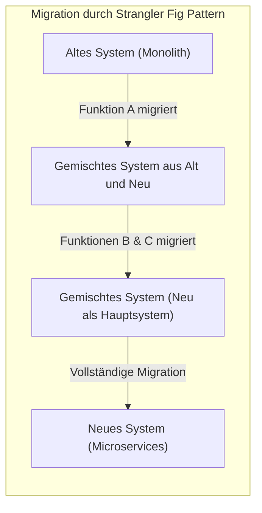
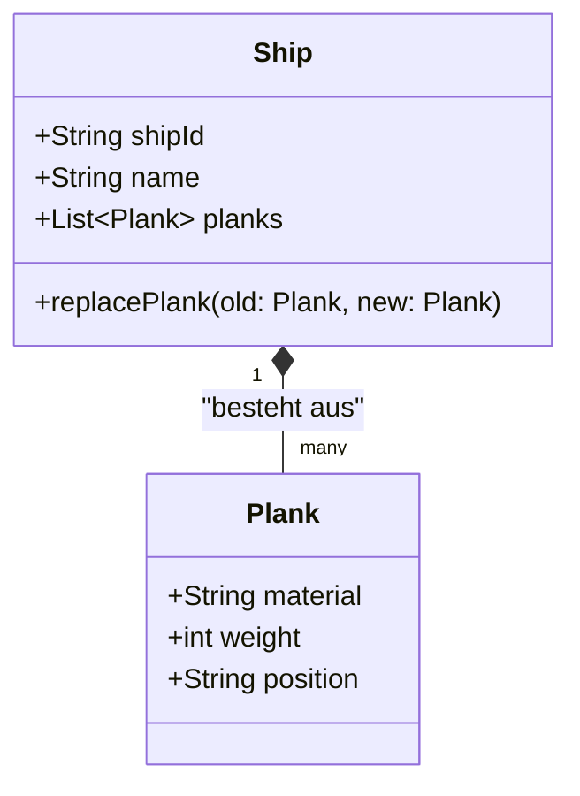
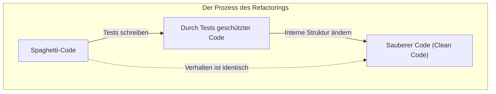
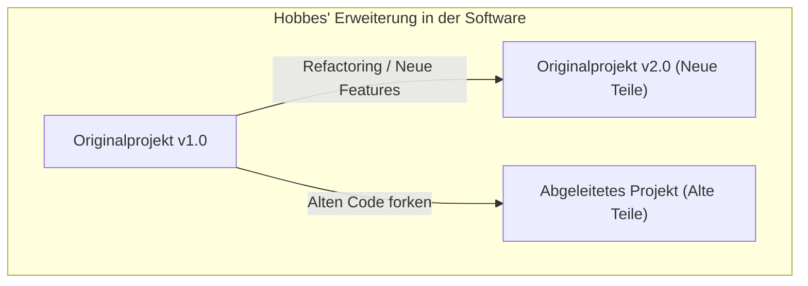

Hallo zusammen. Kennen Sie das Paradoxon (Gedankenexperiment) vom **Schiff des Theseus**?

Das Schiff, auf dem der Held Theseus aus der griechischen Mythologie fuhr, wurde von nachfolgenden Generationen als Denkmal aufbewahrt. Da es sich jedoch um ein Holzschiff handelte, begannen mit der Zeit einige Teile zu verrotten. Die Menschen ersetzten das verrottete Holz durch neues und reparierten das Schiff fortlaufend. Nach vielen Jahren war schließlich der [Zustand](https://kenji.blog/de/p/state-management-history-redux-context-recoil-zustand/) erreicht, in dem **kein einziges Teil des ursprünglichen Schiffes mehr übrig war**.

Hier stellt sich eine Frage:

„Kann man sagen, dass das Schiff, bei dem alle Teile ersetzt wurden, noch immer **das ursprüngliche Schiff des Theseus** ist?“

Dieses Gedankenexperiment wird in der Philosophie seit Langem diskutiert, um die Frage zu klären, was „Identität“ (Selbigkeit) eigentlich ist. Und überraschenderweise ist dieses Problem auch in der modernen **Softwaretechnik** und **Systementwicklung** ein alltägliches Thema.

In diesem Artikel nehmen wir das Paradoxon vom **Schiff des Theseus** als Ausgangspunkt und setzen uns eingehend mit Themen wie Refactoring in der Softwareentwicklung, Migration von Legacy-Systemen und der „Identität“ in der objektorientierten Programmierung auseinander.

## 1. Das „Schiff des Theseus“ in der Software

In der modernen Softwareentwicklung ist es selten, dass ein einmal veröffentlichtes System unverändert in Betrieb bleibt. Code wird aus verschiedenen Gründen ständig umgeschrieben: Hinzufügen von Geschäftsanforderungen, Beheben von Bugs, Verbessern der Leistung oder Aktualisieren der zugrunde liegenden Technologie.

Genau wie beim Austausch von verrottetem Holz durch neues werden alte Module sukzessive durch neue ersetzt.

### Strangler Fig Pattern (Würgefeigen-Muster)

Ein typisches Architekturmuster für den Systemersatz ist das **Strangler Fig Pattern**. Dabei wird ein riesiges und komplexes Legacy-System (Monolith) nicht auf einmal ersetzt, sondern die Funktionen werden nach und nach in ein neues System (z. B. [[Microservice](https://kenji.blog/de/p/microservices-architecture-bff-api-gateway/)s](https://kenji.blog/de/p/microservices-architecture-bff-api-gateway/)) migriert.

Wenn dieser Prozess abgeschlossen ist, hat sich die interne Struktur des Systems, auf das der Benutzer zugreift, **völlig verändert**. Möglicherweise ist keine einzige Zeile des alten Codes mehr vorhanden. Für den Benutzer ist es jedoch immer noch „der gewohnte Dienst“ – weder die URL noch der Markenname haben sich geändert.

Das ist genau das **Schiff des Theseus**. Selbst wenn alle Komponenten (Teile), aus denen das System besteht, ausgetauscht wurden, geht man davon aus, dass die „Identität“ des Systems als Ganzes gewahrt geblieben ist.

## 2. „Identität“ in der objektorientierten Programmierung

Wenn wir über „Identität“ auf Code-Ebene nachdenken, ist das Konzept, das am engsten damit verbunden ist, die **objektorientierte Programmierung ([OOP](https://kenji.blog/de/p/object-oriented-programming-oop-solid-principles/))**. In der OOP gibt es grob zwei Kriterien, um Identität zu bestimmen:

1. **Referenzgleichheit (Reference Equality)**: Verweisen sie auf denselben Ort im Speicher (ist der Zeiger derselbe)?
2. **Wertegleichheit (Value Equality)**: Sind alle gehaltenen Attribute (Daten) gleich?

Wenn man beim Schiff des Theseus argumentiert, „es ist ein anderes Schiff, weil alle Teile ausgetauscht wurden“, dann ist das eine Denkweise, die großen Wert auf die **Wertegleichheit**. Wenn man hingegen argumentiert, „es ist dasselbe Schiff, weil der historische und gesellschaftliche Kontext kontinuierlich ist“, kommt das einer Art **Referenzgleichheit** nahe.

### „Entitäten“ und „Wertobjekte“ in DDD (Domain-Driven Design)

Eine Modellierungsmethode, die dieses Problem elegant löst, findet sich im **Domain-Driven Design (DDD)**, das von Eric Evans vorgeschlagen wurde. Im DDD wird das Domänenmodell in **Entitäten (Entities)** und **Wertobjekte (Value Objects)** unterteilt.

- **Entität (Entity)**: Ein Objekt, das seine Identität beibehält, selbst wenn sich seine Attribute ändern. Die Identität wird anhand einer ID (Identifikator) bestimmt.
- **Wertobjekt (Value Object)**: Ein Objekt, dessen Identität allein durch seine Attribute bestimmt wird. Unterscheidet sich auch nur ein einziges Attribut, handelt es sich um ein anderes Objekt.

Wendet man dies auf das Schiff des Theseus an, wird eine sehr klare Modellierung möglich:

- Das **Schiff (Ship)** ist eine **Entität**.
- Die **Schiffsteile (Plank / Planken)** sind **Wertobjekte**.

Selbst wenn ein Schiffsteil (Wertobjekt) verrottet und durch ein neues ersetzt wird, ändert sich die `shipId` des Schiffs (Entität) nicht. Folglich wird es im System als **exakt dasselbe Schiff** behandelt.

In der Welt der Software wird „Identität“ nicht durch die physische Substanz oder den [Zustand](https://kenji.blog/de/p/state-management-history-redux-context-recoil-zustand/) bestimmt, sondern durch die Absicht des Designers: **„Sollte es in der Geschäftsdomäne als dasselbe Ding behandelt werden?“**

## 3. Refactoring und die Erhaltung des Verhaltens

Wenn man über die Identität von Software spricht, darf man **Refactoring** nicht vergessen.
Martin Fowler definiert Refactoring wie folgt:

> Die Veränderung der internen Struktur von Software, um sie leichter verständlich und kostengünstiger modifizierbar zu machen, ohne ihr beobachtbares Verhalten zu verändern.

Auch hier ist „Identität“ der Schlüssel. Selbst wenn die interne Struktur (die Teile) des Codes stark umgeschrieben wird, gilt die Software als „dasselbe System“, solange sich ihr **von außen beobachtbares Verhalten** nicht ändert.

Dieses „von außen beobachtbare Verhalten“ wird durch **automatisierte Tests** sichergestellt. Solange alle Tests weiterhin erfolgreich durchlaufen werden, bleibt die Software wie das Schiff des Theseus „dasselbe Ding“, egal wie viele interne Teile (Methoden, Klassen, die gesamte Architektur) ausgetauscht werden.

## 4. Das „Schiff des Theseus“ in Projektteams

Nicht nur das Softwaresystem selbst, sondern auch das **Entwicklungsteam**, das es erstellt, kann zu einem Schiff des Theseus werden.

Bei Langzeitprojekten scheiden nach und nach ursprüngliche Mitglieder aus, und neue Mitglieder kommen hinzu. Es ist keine Seltenheit, dass nach einigen Jahren kein einziges der Gründungsmitglieder mehr im Team ist.

Kann man dann noch sagen, dass ein Team, in dem alle Mitglieder ausgewechselt wurden, dasselbe ist wie das ursprüngliche Team?

Hier kommen **die Teamkultur** und **die Weitergabe von Dokumentationen und implizitem Wissen** ins Spiel.
Wenn trotz des Wechsels der Mitglieder der Entwicklungsprozess des Teams, die Programmierrichtlinien, die Kriterien für Code-Reviews und die Vision für das Produkt weitergegeben werden, dann kann man sagen, dass das Team seine Identität bewahrt hat.

Umgekehrt: Wenn kein angemessenes Onboarding oder keine ordentliche Dokumentation stattfindet und sich der Entwicklungsstil und die Qualitätsstandards mit dem Wechsel der Mitglieder grundlegend ändern, dann kann man sagen, dass es sich um ein **völlig anderes Team** handelt, das lediglich denselben Namen trägt.

## 5. Hobbes' Erweiterungsproblem: Das aus den alten Teilen neu zusammengesetzte Schiff

Zum Paradoxon des Schiffs des Theseus gibt es eine berühmte Erweiterung, die vom Philosophen Thomas Hobbes hinzugefügt wurde:

> Wenn jemand all die „alten, verrotteten Teile“, die vom Schiff entfernt wurden, aufsammeln und daraus „ein weiteres Schiff“ zusammenbauen würde, welches wäre dann das echte Schiff des Theseus?

Auf der einen Seite das „mit neuen Teilen vollständig restaurierte Schiff, das weiterhin im Hafen liegt“.
Auf der anderen Seite das „nur aus den ursprünglichen, alten Teilen bestehende Schiff an einem anderen Ort“.

Wenn wir dies auf die Softwareentwicklung übertragen, weist es erstaunliche Parallelen zu den Phänomenen **Fork (Abspaltung)** und dem **Einfrieren (Saltzen) von Legacy-Systemen** auf.

### Open Source und Forks

In der Welt der Open-Source-Software (OSS) kommt es vor, dass der Quellcode aufgrund von Meinungsverschiedenheiten über die Richtung des Projekts geforkt (abgespalten) wird.

Beispielsweise: Während ein Projekt (das ursprüngliche Schiff) schrittweise zu einer neuen Architektur (neuen Teilen) übergeht, könnte ein Teil der Community, der dies ablehnt, ein neues Projekt starten, das auf dem alten Quellcode (den alten Teilen) vor der Migration basiert.

Bekannte Beispiele hierfür sind die Beziehungen zwischen MySQL und MariaDB oder Node.js und io.js (die später wieder zusammengeführt wurden). In diesem Fall besitzt zwar das ursprüngliche Schiff die rechtliche Identität in Form der Markenrechte (den Namen), aber man könnte auch argumentieren, dass das geforkte Schiff dasjenige ist, das die alte Philosophie und Denkweise (die alten Teile) geerbt hat.

Welches nun das „Echte“ ist, ist nicht länger eine Frage der physischen Identität, sondern verlagert sich auf gesellschaftliche Fragen wie **den Konsens der Community** oder **die Markenbekanntheit**. Die „Identität“ von Software geht über den physischen Rahmen des Codes hinaus und existiert in der Wahrnehmung der Menschen.

## 6. Ab welchem Zeitpunkt wird es zu einem „anderen System“?

Wann hört eine Software auf, „dasselbe System“ zu sein?

Solange weiterhin Teile ausgetauscht werden (Refactoring oder Migration), bleibt es dasselbe System. Es kann jedoch zu folgenden Zeitpunkten klar als **anderes System** betrachtet werden, das neu geboren wurde:

1. **Wenn sich der Existenzzweck (die Geschäftsdomäne) des Systems ändert.**
2. **Wenn die primäre Benutzeroberfläche und das Nutzungserlebnis (UX) diskontinuierlich erneuert werden.**
3. **Wenn das ID-System, das die Grundlage der Entitäten bildet, zurückgesetzt wird.**

Angenommen, ein kleines Aufgabenverwaltungstool für den internen Gebrauch ändert seinen Kurs (Pivot) und wird zu einem universellen Chat-Tool für die ganze Welt. Selbst wenn ein Großteil der Codebasis übernommen wurde (die Teile wiederverwendet wurden), ist es kein „dasselbe Schiff“ mehr.

Vielmehr als die Kontinuität der physischen Teile (des Quellcodes) ist es die abstrakte Vorstellung davon, **wofür es existiert und für wen es Wert schafft**, die die „Identität des Schiffs“ in der Software bestimmt.

## 7. Fazit: Ständige Veränderung ist die wahre Identität

Das „Schiff des Theseus“ aus der griechischen Philosophie lehrt uns, dass es zu Widersprüchen führt, wenn wir Identität in der physischen Substanz suchen.

In der Welt der Software ist die physische Substanz des Codes (Byte-Folgen) extrem fließend. Vielmehr ist die **ständige Veränderung** die Grundvoraussetzung dafür, dass Software überlebt und weiterhin Wert liefert.

Ein System, bei dem alles umgeschrieben wurde. Es ist zweifellos **das ursprüngliche System**, und gleichzeitig ist es auch **ein völlig neues System**.

Dass wir Software entwickeln und warten, bedeutet, dass wir an der Instandhaltung dieses grandiosen Schiffs des Theseus beteiligt sind. Indem wir Teil für Teil durch etwas Besseres ersetzen, tragen wir die Identität des Systems – nämlich seinen „Zweck“ und „Wert“ – in die Zukunft.

Wenn Sie das nächste Mal Legacy-Code refaktorisieren, erinnern Sie sich bitte daran: Sie erneuern gerade ein wichtiges Stück eines geschichtsträchtigen Schiffs des Theseus.
