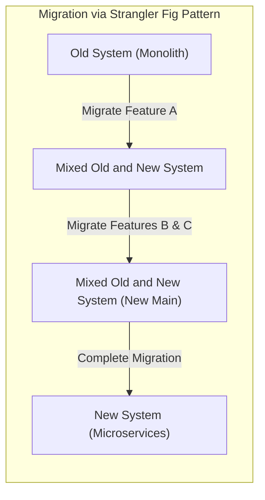
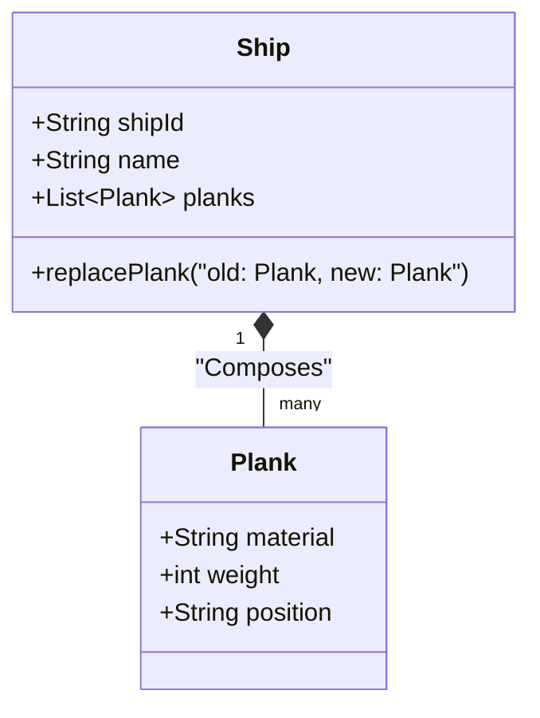
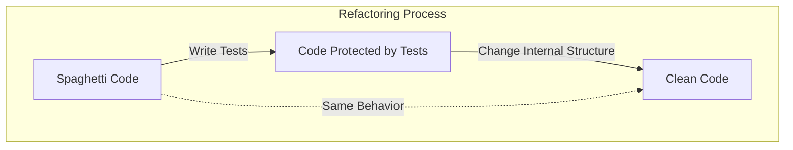
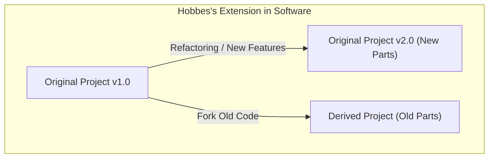

Hello, everyone. Are you familiar with the paradox (thought experiment) called **[The Ship of Theseus](https://kenji.blog/en/p/ship-of-theseus/)**?

The ship ridden by the hero Theseus from Greek mythology was preserved as a monument by later generations. However, because it was a wooden ship, parts of it decayed over time. People continued to repair the ship by replacing the decayed wood with new wood. After a long time had passed, it finally reached a state where **not a single part of the original ship remained**.

Here, a question arises.

"Can that ship, with all its parts replaced, really be said to be the same as the **original Ship of Theseus**?"

This thought experiment has been discussed since ancient times in philosophy as a way to question what "identity" is. Surprisingly, this problem is also a theme we routinely face in modern **software engineering** and **system development**.

In this article, using the paradox of **[The Ship of Theseus](https://kenji.blog/en/p/ship-of-theseus/)** as a starting point, we will deeply explore refactoring in software development, migration of legacy systems, and "identity" in object-oriented programming.

## 1. "[The Ship of Theseus](https://kenji.blog/en/p/ship-of-theseus/)" in Software

In modern software development, it is rare for a system to continue running completely unchanged after it has been released once. The code is continuously rewritten for various reasons, such as adding business requirements, fixing bugs, improving performance, or updating the underlying technology.

Just like replacing decayed wood with new wood, old modules are continuously replaced by new modules.

### Strangler Fig Pattern

A representative architecture pattern for system replacement is the **Strangler Fig Pattern**. This is a method of gradually migrating functionality to a new system (for example, microservices) rather than replacing a huge and complex legacy system (monolith) all at once.

When this process is complete, the internal structure of the system the user is accessing is **completely different**. There might not be a single line of old code left. However, from the user's perspective, it is the "same old service," and neither the URL nor the brand name has changed.

This is exactly **[The Ship of Theseus](https://kenji.blog/en/p/ship-of-theseus/)**. Even if all the components (parts) that make up the system are replaced, the "identity" of the system as a whole is considered to be maintained.

## 2. "Identity" in [Object-Oriented](https://kenji.blog/en/p/oop-vs-fp-vs-dop/) Programming

When considering "identity" at the code level, the most deeply related concept is **[Object-Oriented](https://kenji.blog/en/p/object-oriented-programming-oop-solid-principles/) Programming ([OOP](https://kenji.blog/en/p/object-oriented-programming-oop-solid-principles/))**. In [OOP](/en/p/object-oriented-programming-oop-solid-principles/), there are broadly two criteria for determining identity.

1. **Reference Equality**: Do they point to the same location in memory (are the [pointers](/en/p/c-language-pointers-memory-management-stack-heap/) the same)?
2. **Value Equality**: Are all the attributes (data) they hold the same?

In the Ship of Theseus, arguing that "it is a different ship because all the parts have been replaced" is a way of thinking that emphasizes **Value Equality**. On the other hand, arguing that "it is the same ship because the historical and social context is continuous" is akin to a certain kind of **Reference Equality**.

### "Entities" and "Value Objects" in DDD (Domain-Driven Design)

A modeling approach that beautifully solves this problem can be found in **Domain-Driven Design (DDD)** proposed by Eric Evans. In DDD, domain models are categorized into **Entities** and **Value Objects**.

- **Entity**: An object that maintains its identity even if its attributes change. Identity is determined by an ID (identifier).
- **Value Object**: An object where the attributes themselves determine its identity. If even one attribute is different, it is a different object.

Applying this to the Ship of Theseus allows for very clear modeling.

- **The Ship** is an **Entity**
- **The Ship's parts (Plank / wood)** are **Value Objects**

Even if the ship's parts (value objects) decay and are replaced with new ones, the ship's (entity's) `shipId` does not change. Therefore, it is treated as **completely the same ship** within the system.

In the software world, "identity" is not determined by physical entities or states, but defined by the designer's intent: **"Should this be treated as the same thing within the business domain?"**

## 3. Refactoring and Maintaining Behavior

An unavoidable topic when discussing identity in software is **Refactoring**.
Martin Fowler defines refactoring as follows:

> A change made to the internal structure of software to make it easier to understand and cheaper to modify without changing its observable behavior.

"Identity" is the key here as well. Even if the internal structure (parts) of the code is significantly rewritten, as long as the **externally observable behavior** does not change, it is considered the "same system."

What guarantees this "externally observable behavior" is **automated testing**. As long as all tests continue to pass, no matter how many internal parts (methods, classes, or the entire architecture) you replace, the software remains the "same thing," just like the Ship of Theseus.

## 4. "[The Ship of Theseus](https://kenji.blog/en/p/ship-of-theseus/)" in Project Teams

Not only the software system itself but also the **development team** that builds it can become a Ship of Theseus.

In long-running projects, initial members gradually leave, and new members join. It is not uncommon for a team a few years later to have no members from the time of its launch.

Then, can a team where every single member has been replaced be said to be the same as the original team?

What becomes important here is the **team culture** and the **inheritance of documentation and tacit knowledge**.
Even if the members change, if the development process, coding conventions, code review standards, and the vision for the product are carried over, the team can be said to maintain its identity.

Conversely, if proper onboarding and documentation are not done, and the development style and quality standards become completely different along with the turnover of members, it can be said that it has become a **completely different team** that only shares the same name.

## 5. Hobbes's Extension: The Ship Reassembled with Old Parts

There is a famous extended version added by the philosopher Thomas Hobbes to the Ship of Theseus paradox.

> If someone gathered all the "old decayed parts" removed from the ship and combined them to build "another ship," which one would be the real Ship of Theseus?

One is "the ship that has remained anchored in the harbor, completely restored with new parts."
The other is "the ship located elsewhere, built entirely of the original old parts."

Applying this to software development, it looks surprisingly similar to events like **Forking** or **freezing legacy systems**.

### Open Source and Forks

In the world of Open Source Software (OSS), source code is sometimes forked (branched) due to differences in the direction of the project.

For example, as a certain project (the original ship) gradually transitions to a new architecture (new parts), a part of the community that opposes this might launch a new project based on the old source code (old parts) before the transition.

Famous examples include the relationship between MySQL and MariaDB, or Node.js and io.js (which later merged). In such cases, the legal identity of the trademark (the name) belongs to the original ship, but it can be argued that it is the forked ship that inherits the old philosophy and design concepts (old parts).

Which one is "real" is no longer a question of physical identity but transitions into a social question of **community consensus** and **brand recognition**. "Identity" in software transcends the bounds of the physical material of code and exists within people's perception.

## 6. At What Point Does It Become a "Different System"?

So, when does software cease to be the "same system"?

As long as parts continue to be replaced (refactoring or migration), it is the same system. However, it can be considered reborn as a distinct, **different system** at timings such as the following:

1. **When the purpose of the system's existence (business domain) changes**
2. **When the primary user interface or experience (UX) is discontinuously revamped**
3. **When the ID system, which forms the foundation of the entities, is reset**

For example, suppose what was a small internal task management tool pivots to become a general-purpose chat tool for the world. Even if a large part of the codebase is repurposed (parts are reused), it is no longer the same ship; it is a "different ship."

More than the continuity of physical parts (source code), the abstract concept of **why it exists and to whom it provides value** determines the "ship's identity" in software.

## 7. Conclusion: To Keep Changing is the Identity Itself

The Greek philosophical "Ship of Theseus" teaches us that contradictions arise when we seek identity in physical entities.

In the software world, the physical entity (byte sequence) of code is extremely fluid. Rather, **continuing to change** is the essential requirement for software to survive and continue providing value.

A system where everything has been rewritten. It is undoubtedly the **original system**, yet simultaneously a **completely new system**.

For us to develop and maintain software is akin to participating in the maintenance of this grand Ship of Theseus. Exchanging parts one by one for better ones, we carry the identity—the "purpose" and "value" embedded in the system—into the future.

The next time you refactor legacy code, please remember: you are currently renewing a crucial piece of a historic Ship of Theseus.
