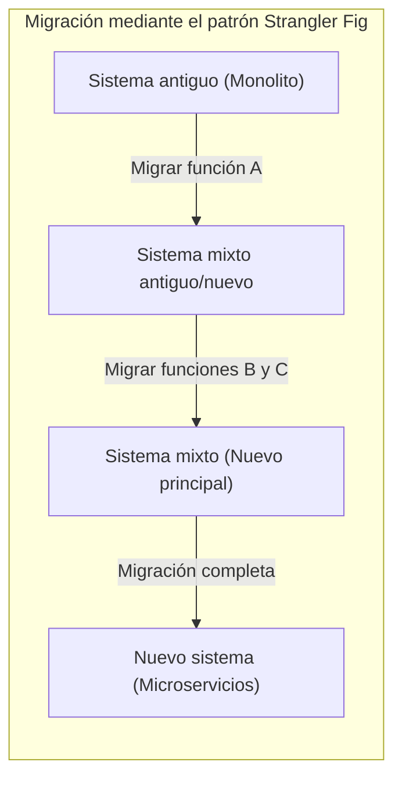
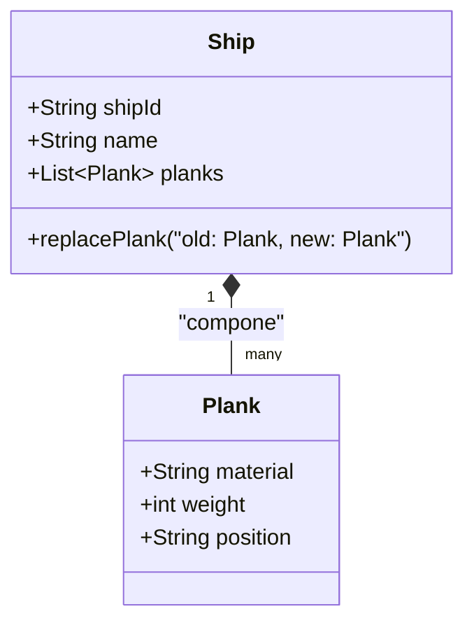
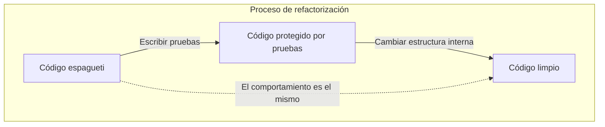
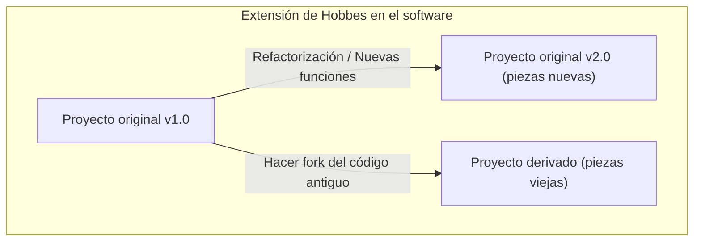

Hola. ¿Conocen todos la paradoja (experimento mental) del **Barco de Teseo**?

El barco en el que viajaba el héroe Teseo de la mitología griega, fue conservado como monumento por generaciones posteriores. Sin embargo, al ser un barco de madera, con el paso del tiempo empezaron a aparecer piezas podridas. La gente sustituyó la madera podrida por madera nueva, y continuaron reparando el barco. Y después de muchos años, finalmente llegó a un estado en el que **no quedaba ninguna pieza original del barco**.

Aquí surge una pregunta.

"Ese barco, con todas sus piezas reemplazadas, ¿puede considerarse el **mismo barco original de Teseo**?"

Este experimento mental ha sido discutido desde la antigüedad en la filosofía como una forma de cuestionar qué es la "identidad". Y sorprendentemente, este problema es un tema al que nos enfrentamos a diario en la **ingeniería de software** y el **desarrollo de sistemas** modernos.

En este artículo, tomando como punto de partida la paradoja del **Barco de Teseo**, reflexionaremos profundamente sobre la refactorización en el desarrollo de software, la migración de sistemas heredados y la "identidad" en la orientación a objetos.

## 1. El "Barco de Teseo" en el software

En el desarrollo de software moderno, es raro que un sistema, una vez lanzado, continúe operando sin modificaciones. El código se reescribe constantemente por diversas razones: adición de requisitos comerciales, corrección de errores, mejora del rendimiento o actualización de la tecnología base.

De la misma manera que se cambia madera podrida por madera nueva, los módulos antiguos son reemplazados por módulos nuevos.

### Patrón Strangler Fig (Strangler Fig Pattern)

Un patrón arquitectónico representativo en el reemplazo de sistemas es el **Patrón Strangler Fig**. Este es un método en el que un sistema heredado grande y complejo (monolito) no se reemplaza todo a la vez, sino que las funciones se migran gradualmente a un nuevo sistema (por ejemplo, microservicios).

Cuando este proceso se completa, la estructura interna del sistema al que acceden los usuarios es **completamente diferente**. Puede que no quede ni una sola línea de código antiguo. Sin embargo, desde la perspectiva del usuario, es "el servicio de siempre"; ni la URL ni el nombre de la marca han cambiado.

Esto es exactamente el **Barco de Teseo**. Aunque todos los componentes (piezas) que forman el sistema hayan sido reemplazados, se considera que la "identidad" del sistema en su conjunto se ha mantenido.

## 2. La "identidad" en la Programación Orientada a Objetos

Al pensar en la "identidad" a nivel de código, el concepto más estrechamente relacionado es el de la **Programación Orientada a Objetos ([OOP](https://kenji.blog/es/p/object-oriented-programming-oop-solid-principles/))**. En OOP, existen principalmente dos criterios para determinar la identidad.

1. **Igualdad de referencia (Reference Equality)**: ¿Apuntan al mismo lugar en la memoria (es el mismo puntero)?
2. **Igualdad de valor (Value Equality)**: ¿Son todos los atributos (datos) que contienen iguales?

En el Barco de Teseo, argumentar que "como se reemplazaron todas las piezas, es un barco diferente" es un punto de vista que pone énfasis en la **igualdad de valor**. Por otro lado, argumentar que "es el mismo barco porque el contexto histórico y social es continuo" se puede decir que es más cercano a cierta forma de **igualdad de referencia**.

### "Entidad" y "Objeto de valor" en DDD (Diseño Guiado por el Dominio)

Un método de modelado que resuelve este problema de manera elegante se encuentra en el **Diseño Guiado por el Dominio (DDD)**, propuesto por Eric Evans. En DDD, el modelo de dominio se clasifica en **Entidad (Entity)** y **Objeto de Valor (Value Object)**.

- **Entidad (Entity)**: Un objeto que mantiene su identidad incluso si sus atributos cambian. La identidad se determina mediante un ID (identificador).
- **Objeto de Valor (Value Object)**: Un objeto en el que los atributos en sí determinan la identidad. Si un solo atributo es diferente, es un objeto distinto.

Si aplicamos esto al Barco de Teseo, el modelado es muy claro.

- El **Barco (Ship)** es una **Entidad**.
- Las **Piezas del barco (Plank / Madera)** son **Objetos de Valor**.

Incluso si las piezas del barco (objetos de valor) se pudren y son reemplazadas por unas nuevas, el `shipId` del barco (entidad) no cambia. Por lo tanto, en el sistema se trata como **exactamente el mismo barco**.

En el mundo del software, la "identidad" no se determina por la entidad física o el estado, sino por la intención del diseñador: **"¿Debe ser tratado como la misma cosa en el dominio del negocio?"**.

## 3. Refactorización y mantenimiento del comportamiento

Al hablar de identidad en el software, es imprescindible mencionar la **refactorización**.
Martin Fowler define la refactorización de la siguiente manera:

> Modificar la estructura interna del software para que sea más fácil de entender o modificar, conservando su comportamiento observable desde el exterior.

Aquí también, la "identidad" es clave. Aunque se reescriba significativamente la estructura interna del código (las piezas), si el **comportamiento observable desde el exterior** no cambia, se considera que es el "mismo sistema".

Lo que garantiza este "comportamiento observable desde el exterior" son las **pruebas automatizadas**. Mientras todas las pruebas sigan pasando, no importa cuánto reemplaces las piezas internas (métodos, clases o la arquitectura completa), ese software seguirá siendo "la misma cosa", igual que el barco de Teseo.

## 4. El "Barco de Teseo" en los equipos de proyecto

No solo el sistema de software en sí, sino también el **equipo de desarrollo** que lo crea puede convertirse en el barco de Teseo.

En proyectos de larga duración, los miembros iniciales se van retirando gradualmente y se incorporan nuevos miembros. Años después, no es raro que el equipo esté formado por personas donde no queda ni un solo miembro de los que empezaron.

Entonces, ¿se puede decir que un equipo en el que todos los miembros han cambiado es el mismo equipo original?

Aquí es donde son importantes la **cultura del equipo** y la **transferencia de la documentación y el conocimiento tácito**.
Incluso si los miembros cambian, si se heredan los procesos de desarrollo, las convenciones de código, los criterios de revisión de código y la visión del producto como equipo, se puede decir que ese equipo mantiene su identidad.

A la inversa, si no hay un buen proceso de inducción y documentación, y el estilo de desarrollo y los estándares de calidad cambian por completo con la rotación de los miembros, se podría decir que se ha convertido en un **equipo completamente diferente** que solo conserva el nombre.

## 5. El problema ampliado de Hobbes: Un barco reconstruido con piezas viejas

Existe una famosa versión ampliada de la paradoja del Barco de Teseo que añadió el filósofo Thomas Hobbes.

> Si alguien recogiera todas las "piezas viejas y podridas" que se retiraron del barco, y construyera "otro barco" juntándolas, ¿cuál de los dos sería el verdadero barco de Teseo?

Por un lado está "el barco que sigue anclado en el puerto, completamente reparado con piezas nuevas".
Por el otro está "el barco en otro lugar, construido solo con las piezas viejas originales".

Si aplicamos esto al desarrollo de software, se parece sorprendentemente a los fenómenos de **Bifurcación (Fork)** y a mantener un **sistema heredado en estado latente**.

### Código abierto y Forks

En el mundo del software de código abierto (OSS), a veces el código fuente se bifurca (fork) debido a diferencias en la dirección del proyecto.

Por ejemplo, mientras un proyecto (el barco original) migra gradualmente hacia una nueva arquitectura (piezas nuevas), una parte de la comunidad que se opone puede iniciar un nuevo proyecto basado en el código fuente antiguo (piezas viejas) antes de la migración.

Ejemplos famosos son la relación entre MySQL y MariaDB, o Node.js y io.js (fusionados más tarde). En este caso, el proyecto original mantiene la identidad legal, los derechos de marca (el nombre), pero se podría argumentar que el barco bifurcado es el que ha heredado la antigua filosofía y pensamiento de diseño (piezas viejas).

Decidir cuál es "el verdadero" ya no es una cuestión de identidad física, sino que se convierte en una cuestión social, como el **consenso de la comunidad** y el **reconocimiento de la marca**. La "identidad" en el software trasciende el marco material del código y reside en la percepción de las personas.

## 6. ¿En qué momento se convierte en un "sistema diferente"?

Entonces, ¿cuándo deja el software de ser "el mismo sistema"?

Sigue siendo el mismo sistema mientras se sigan reemplazando sus piezas (refactorización o migración), pero se puede considerar que renace claramente como un **sistema diferente** en los siguientes momentos:

1. **Cuando cambia el propósito de existencia del sistema (dominio de negocio)**
2. **Cuando se renueva discontinuamente la interfaz de usuario y la experiencia principal (UX)**
3. **Cuando se reinicia el sistema de ID fundamental de las entidades**

Por ejemplo, digamos que lo que era una pequeña herramienta de gestión de tareas de uso interno cambia de rumbo y se convierte en una herramienta de chat genérica para el mundo. Incluso si se reutilizó gran parte de la base del código (se reutilizaron piezas), esto ya es "otro barco".

Más que la continuidad física de las piezas (código fuente), es el concepto abstracto de **para qué existe y a quién proporciona valor** lo que determina la "identidad del barco" en el software.

## 7. Conclusión: Cambiar continuamente es la identidad misma

El "Barco de Teseo" de la filosofía griega nos enseña que buscar la identidad en la entidad física nos lleva a contradicciones.

En el mundo del software, la entidad física del código (una secuencia de bytes) es extremadamente fluida. De hecho, **cambiar continuamente** es el requisito indispensable para que el software sobreviva y siga proporcionando valor.

Un sistema que ha sido reescrito por completo. Es sin duda **el sistema original** pero, al mismo tiempo, es también un **sistema completamente nuevo**.

Desarrollar y mantener software es participar en el mantenimiento de este gran Barco de Teseo. Reemplazando las piezas una a una por otras mejores, al tiempo que llevamos al futuro la identidad de "propósito" y "valor" imbuida en el sistema.

La próxima vez que realices una refactorización de código heredado, recuérdalo: en este preciso momento estás renovando una pieza importante de un histórico Barco de Teseo.
