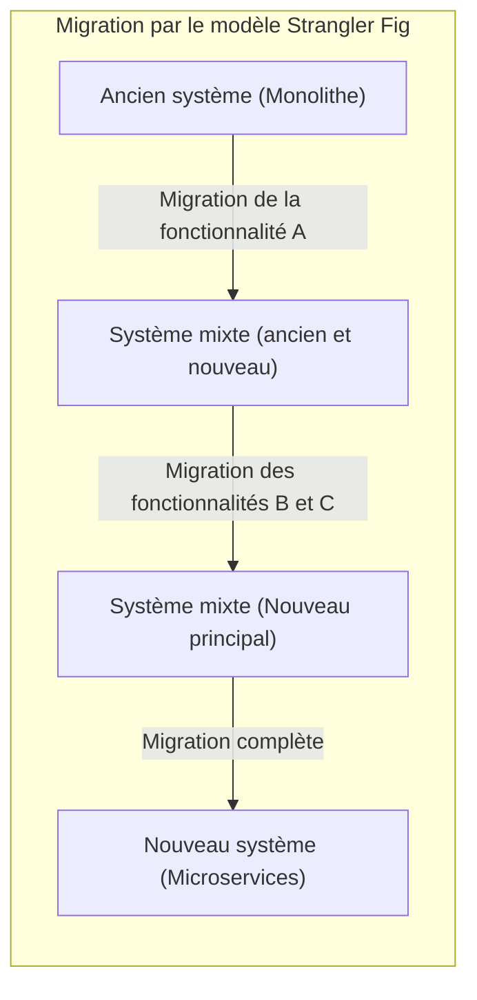
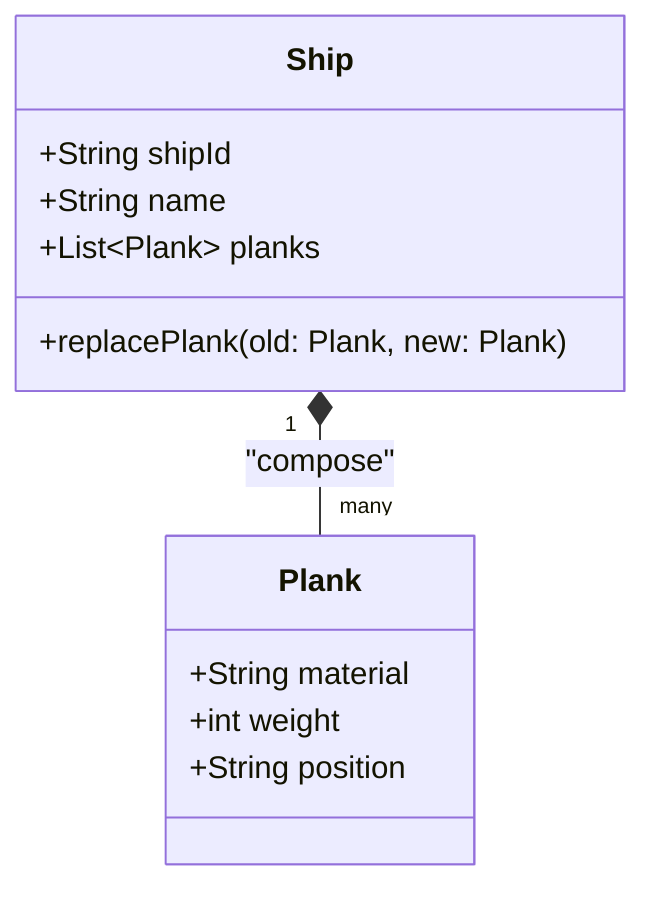
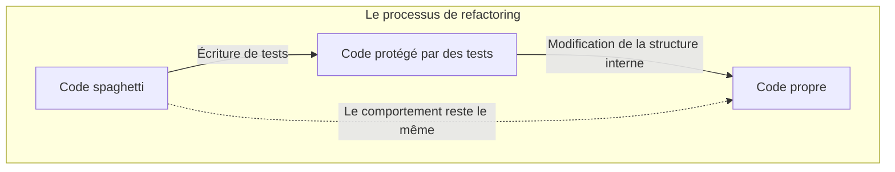
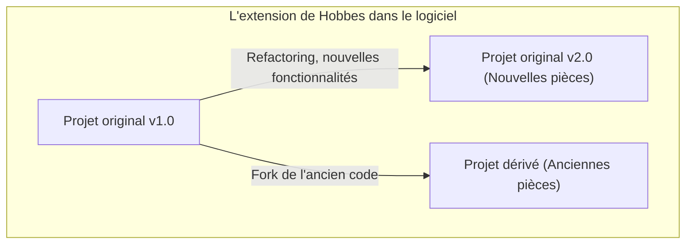

Bonjour. Connaissez-vous le paradoxe (expérience de pensée) du **bateau de Thésée** ?

Le bateau sur lequel naviguait le héros de la mythologie grecque Thésée était conservé par les générations suivantes comme monument. Cependant, s'agissant d'un navire en bois, le temps faisant son œuvre, certaines pièces finirent par pourrir. Les gens remplacèrent le bois pourri par du bois neuf, continuant ainsi à restaurer le navire. Et après de longues années, il atteignit finalement **un état où il ne restait plus une seule pièce du bateau d'origine**.

C'est ici que surgit une question.

« Ce navire dont toutes les pièces ont été remplacées peut-il vraiment être considéré comme étant le **même bateau de Thésée d'origine** ? »

Cette expérience de pensée a été débattue depuis l'Antiquité en philosophie pour interroger la notion d'« identité ». De façon surprenante, ce problème est aussi un thème auquel nous sommes confrontés quotidiennement dans le **génie logiciel** moderne et le **développement de systèmes**.

Dans cet article, en prenant comme point de départ ce paradoxe du **bateau de Thésée**, nous allons examiner en profondeur le refactoring dans le développement logiciel, la migration des systèmes hérités (legacy) et l'« identité » dans l'approche orientée objet.

## 1. Le « bateau de Thésée » dans le logiciel

Dans le développement logiciel moderne, il est rare qu'un système, une fois publié, continue de fonctionner sans subir la moindre modification. Pour répondre à l'ajout de nouvelles exigences métier, à la correction de bugs, à l'amélioration des performances ou encore à la mise à jour des technologies de base, le code est continuellement réécrit pour diverses raisons.

Tout comme l'on remplace le bois pourri par du bois neuf, les anciens modules sont peu à peu remplacés par de nouveaux modules.

### Modèle du Strangler Fig (Strangler Fig Pattern)

L'un des modèles d'architecture les plus représentatifs lors du remplacement d'un système est le **modèle du Strangler Fig**. Il s'agit d'une méthode par laquelle un système hérité massif et complexe (monolithe) n'est pas remplacé en une seule fois, mais dont les fonctionnalités sont progressivement migrées vers un nouveau système (par exemple, des microservices).

Lorsque ce processus est terminé, la structure interne du système auquel les utilisateurs accèdent est devenue **complètement différente**. Il se peut qu'il ne reste plus une seule ligne de l'ancien code. Pourtant, du point de vue de l'utilisateur, c'est « le service habituel » ; ni l'URL ni le nom de la marque n'ont changé.

C'est exactement le principe du **bateau de Thésée**. Même si tous les composants qui constituent le système ont été remplacés, l'« identité » du système dans son ensemble est considérée comme étant maintenue.

## 2. L'« identité » dans la programmation orientée objet

Lorsque l'on réfléchit à l'« identité » au niveau du code, le concept le plus proche est celui de la **programmation orientée objet (POO)**. En POO, il existe globalement deux critères pour juger de l'identité :

1. **Égalité de référence (Reference Equality)** : Est-ce qu'ils pointent vers le même emplacement en mémoire (le pointeur est-il le même) ?
2. **Égalité de valeur (Value Equality)** : Est-ce que tous les attributs (données) qu'ils contiennent sont les mêmes ?

Dans le cas du bateau de Thésée, affirmer que « puisqu'on a remplacé toutes ses pièces, c'est un autre bateau » revient à donner la priorité à l'**égalité de valeur**. En revanche, affirmer que « le contexte historique et social étant continu, c'est le même bateau », se rapproche davantage de l'**égalité de référence**.

### L'« Entité » et l'« Objet Valeur » du DDD (Domain-Driven Design)

Une méthode de modélisation qui résout ce problème avec élégance se trouve dans l'approche **Domain-Driven Design (DDD)** proposée par Eric Evans. Le DDD classe le modèle de domaine en **Entités (Entity)** et en **Objets Valeur (Value Object)**.

- **Entité (Entity)** : Objet qui conserve son identité même si ses attributs changent. Son identité est déterminée par un ID (identifiant).
- **Objet Valeur (Value Object)** : Objet dont l'identité est définie par les attributs eux-mêmes. Si ne serait-ce qu'un seul attribut diffère, alors il s'agit d'un autre objet.

En appliquant cela au bateau de Thésée, une modélisation extrêmement claire devient possible.

- **Le bateau (Ship)** est une **Entité**.
- **Les pièces du bateau (Plank / bois)** sont des **Objets Valeur**.

Même si les pièces du navire (Objets Valeur) pourrissent et sont remplacées par de nouvelles, le `shipId` du bateau (Entité) ne change pas. Par conséquent, pour le système, il est considéré comme **exactement le même bateau**.

Dans le monde du logiciel, l'« identité » n'est pas déterminée par la substance ou l'état physique, mais par l'intention du concepteur, à savoir : **« dans le domaine métier, doit-on le considérer comme étant la même chose ? »**

## 3. Le refactoring et le maintien du comportement

On ne peut parler de l'identité dans le logiciel sans mentionner le **refactoring**.
Martin Fowler définit le refactoring de la manière suivante :

> C'est une modification de la structure interne d'un logiciel dans le but de le rendre plus facile à comprendre et moins coûteux à modifier, sans altérer son comportement observable de l'extérieur.

Ici aussi, l'« identité » est la clé. Même si vous modifiez considérablement la structure interne du code (les pièces), tant que le **comportement vu de l'extérieur** ne change pas, il est considéré comme étant « le même système ».

Ce qui garantit ce « comportement vu de l'extérieur », ce sont les **tests automatisés**. Tant que tous les tests continuent de passer, peu importe le nombre de remplacements des composants internes (méthodes, classes ou l'architecture tout entière), le logiciel restera « la même chose », tout comme le bateau de Thésée.

## 4. Le « bateau de Thésée » dans une équipe projet

Non seulement le système logiciel lui-même, mais aussi **l'équipe de développement** qui le crée peut être vue comme un bateau de Thésée.

Dans les projets de longue durée, les membres de départ quittent progressivement le projet et de nouveaux membres s'y intègrent. Il n'est pas rare qu'après quelques années, il ne reste plus aucun membre de l'équipe de lancement.

Alors, une équipe dont tous les membres ont été remplacés peut-elle être considérée comme la même équipe que l'équipe d'origine ?

Ici, ce qui compte, c'est la **culture de l'équipe** et la **transmission de la documentation et des connaissances tacites**.
Si, malgré les changements de membres, les processus de développement, les conventions de code, les critères de revue de code et la vision du produit sont préservés, on peut affirmer que l'équipe maintient son identité.

À l'inverse, si l'intégration (onboarding) et la documentation ne sont pas correctement réalisées, et que le changement de membres conduit à un style de développement et des critères de qualité complètement différents, on peut dire que c'est devenu une **équipe tout à fait différente**, qui ne partage plus que le nom.

## 5. L'extension de Hobbes : un bateau reconstruit avec de vieilles pièces

Il existe une célèbre variante du paradoxe du bateau de Thésée, ajoutée par le philosophe Thomas Hobbes.

> Si quelqu'un rassemblait toutes les « vieilles pièces pourries » retirées du bateau pour construire « un autre bateau », lequel serait le véritable bateau de Thésée ?

D'un côté, il y a « le bateau ancré dans le port, constamment restauré avec de nouvelles pièces ».
De l'autre côté, il y a « un bateau situé ailleurs, composé uniquement des vieilles pièces d'origine ».

Si l'on applique cela au développement logiciel, cela ressemble étonnamment au phénomène du **Fork** ou au **gel d'un système hérité (legacy)**.

### Open source et Fork

Dans le monde des logiciels open source (OSS), il arrive que le code source se divise (Fork) en raison de divergences sur l'orientation d'un projet.

Par exemple, alors qu'un projet (le navire d'origine) migre peu à peu vers une nouvelle architecture (nouvelles pièces), une partie de la communauté qui s'y oppose peut lancer un nouveau projet basé sur l'ancien code source avant la migration (vieilles pièces).

Parmi les exemples célèbres, on peut citer les relations entre MySQL et MariaDB, ou Node.js et io.js (qui ont fusionné par la suite). Dans ce cas, on peut arguer que si l'identité juridique (la marque) appartient au navire d'origine, c'est plutôt le navire issu du fork qui a hérité de l'ancienne philosophie ou vision de conception (vieilles pièces).

Savoir lequel est « authentique » n'est plus une question d'identité physique, mais devient un problème social lié au **consensus de la communauté** et à la **reconnaissance de la marque**. L'« identité » dans le logiciel dépasse le cadre purement matériel du code ; elle réside dans la perception qu'en ont les gens.

## 6. À quel moment cela devient-il « un autre système » ?

Mais alors, à quel moment un logiciel cesse-t-il d'être « le même système » ?

Tant que l'on continue de remplacer des pièces (refactoring ou migration), c'est le même système, mais on peut considérer qu'il renaît explicitement comme un **système différent** aux moments suivants :

1. **Lorsque la finalité (le domaine métier) du système a changé.**
2. **Lorsque l'interface utilisateur ou l'expérience principale (UX) sont remaniées de manière discontinue.**
3. **Lorsque le système d'identification (ID) fondamental de l'entité est réinitialisé.**

Par exemple, imaginez qu'un petit outil de gestion des tâches interne de l'entreprise change de cap (pivot) pour devenir un outil de chat polyvalent mondial. Même si une grande partie de la base de code a été réutilisée (pièces réutilisées), il s'agit désormais d'un « autre bateau ».

L'identité du bateau d'un logiciel est déterminée bien plus par ce **pourquoi il existe et à qui il apporte de la valeur** en tant que concept abstrait, que par la continuité physique de ses composants (le code source).

## 7. Résumé : changer continuellement est l'essence même de l'identité

Le « bateau de Thésée » de la philosophie grecque nous enseigne qu'associer l'identité à la matière physique mène à des contradictions.

Dans le monde du logiciel, l'entité physique du code (les séquences d'octets) est extrêmement fluide. Au contraire, **changer en permanence** est la condition indispensable pour qu'un logiciel survive et continue d'apporter de la valeur.

Un système où tout a été réécrit. C'est sans doute le **système d'origine**, tout en étant simultanément un **système complètement nouveau**.

Développer et maintenir un logiciel, c'est participer à la maintenance de ce grand bateau de Thésée. En remplaçant les pièces une à une pour les améliorer, nous transportons vers l'avenir l'identité du système, c'est-à-dire son « objectif » et sa « valeur ».

La prochaine fois que vous ferez du refactoring sur du code hérité (legacy), rappelez-vous que vous êtes en train de renouveler une pièce essentielle d'un vieux bateau de Thésée chargé d'histoire.
