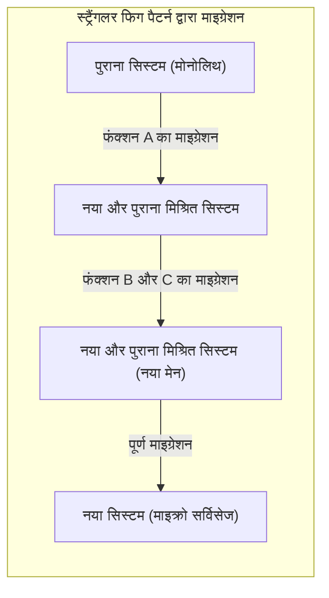
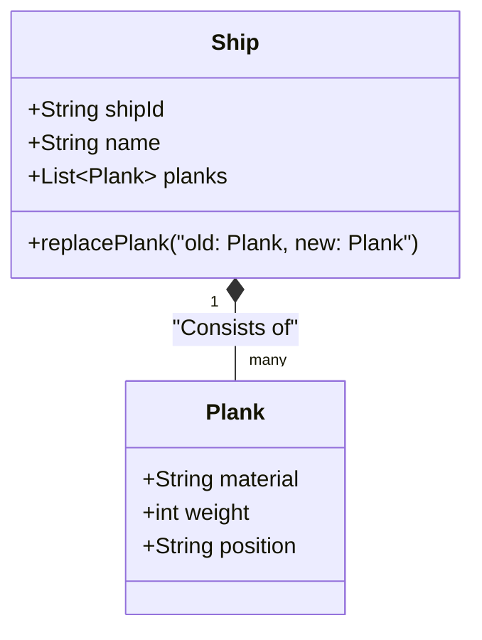
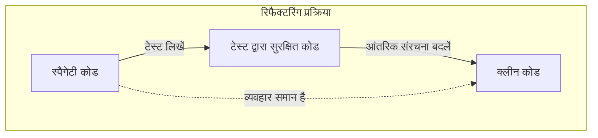
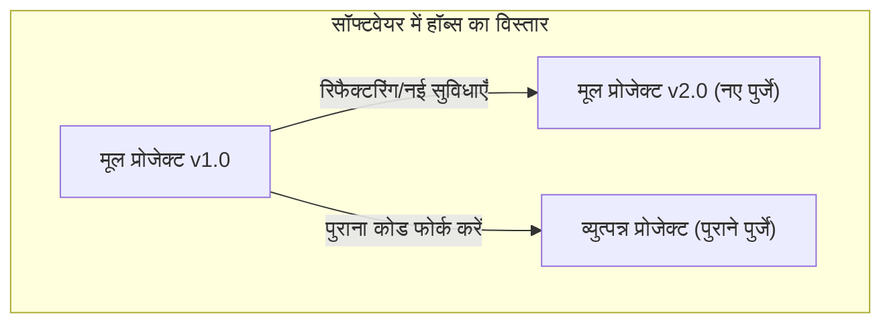

नमस्ते। क्या आप **[थीसियस का जहाज](https://kenji.blog/hi/p/ship-of-theseus/)** नामक विरोधाभास (विचार प्रयोग) के बारे में जानते हैं?

ग्रीक पौराणिक कथाओं के नायक थीसियस जिस जहाज पर सवार थे, उसे बाद की पीढ़ियों द्वारा एक स्मारक के रूप में संरक्षित किया गया था। हालाँकि, चूँकि यह एक लकड़ी का जहाज है, इसलिए समय के साथ लकड़ी सड़ने लगी। लोगों ने सड़ी हुई लकड़ी को नई लकड़ी से बदल दिया और जहाज की मरम्मत करते रहे। फिर कई साल बीत गए, और अंत में ऐसी स्थिति आ गई जहां **मूल जहाज का एक भी हिस्सा नहीं बचा था**।

यहाँ एक सवाल उठता है।

"क्या वह जहाज, जिसके सभी हिस्से बदल दिए गए हैं, वास्तव में **मूल थीसियस के जहाज** के समान है?"

यह विचार प्रयोग प्राचीन काल से दर्शनशास्त्र में इस प्रश्न के रूप में बहस का विषय रहा है कि "पहचान (Identity)" क्या है। और आश्चर्यजनक रूप से, यह समस्या आधुनिक **सॉफ्टवेयर इंजीनियरिंग** और **सिस्टम डेवलपमेंट** में भी एक आम विषय है।

इस लेख में, हम **[थीसियस का जहाज](https://kenji.blog/hi/p/ship-of-theseus/)** विरोधाभास को एक शुरुआती बिंदु के रूप में लेंगे, और सॉफ्टवेयर विकास में रिफैक्टरिंग, लीगेसी सिस्टम माइग्रेशन और [ऑब्जेक्ट-ओरिएंटेड प्रोग्रामिंग](/hi/p/object-oriented-programming-oop-solid-principles/) में "पहचान" पर गहराई से विचार करेंगे।

## 1. सॉफ्टवेयर में "[थीसियस का जहाज](https://kenji.blog/hi/p/ship-of-theseus/)"

आधुनिक सॉफ्टवेयर विकास में, यह दुर्लभ है कि एक बार जारी किया गया सिस्टम बिना किसी बदलाव के चलता रहे। व्यावसायिक आवश्यकताएं जोड़ने, बग्स को ठीक करने, प्रदर्शन में सुधार करने, या बुनियादी ढांचे की तकनीक को अपडेट करने जैसे विभिन्न कारणों से कोड को लगातार फिर से लिखा जाता है।

ठीक उसी तरह जैसे सड़ी हुई लकड़ी को नई लकड़ी से बदल दिया जाता है, पुराने मॉड्यूल को नए मॉड्यूल से बदल दिया जाता है।

### स्ट्रैंगलर फिग पैटर्न (Strangler Fig Pattern)

सिस्टम रिप्लेसमेंट के लिए एक विशिष्ट आर्किटेक्चर पैटर्न **स्ट्रैंगलर फिग पैटर्न** है। यह एक ऐसी विधि है जिसमें एक विशाल और जटिल लीगेसी सिस्टम (मोनोलिथ) को एक साथ पूरी तरह से बदलने के बजाय, कार्यों को धीरे-धीरे एक नए सिस्टम (उदाहरण के लिए, माइक्रो सर्विसेज) में स्थानांतरित किया जाता है।

जब यह प्रक्रिया पूरी हो जाती है, तो उपयोगकर्ता द्वारा एक्सेस किए जा रहे सिस्टम की आंतरिक संरचना **पूरी तरह से अलग** हो जाती है। पुराने कोड की एक भी पंक्ति नहीं बची हो सकती है। हालाँकि, उपयोगकर्ता के दृष्टिकोण से, यह "हमेशा की तरह ही सेवा" है, और URL या ब्रांड का नाम नहीं बदला है।

यह बिल्कुल **[थीसियस का जहाज](https://kenji.blog/hi/p/ship-of-theseus/)** है। भले ही सिस्टम को बनाने वाले सभी घटक (पुर्जे) बदल दिए जाएं, फिर भी पूरे सिस्टम की "पहचान" बनी हुई मानी जाती है।

## 2. ऑब्जेक्ट-ओरिएंटेड प्रोग्रामिंग में "पहचान"

जब कोड के स्तर पर "पहचान" पर विचार किया जाता है, तो सबसे अधिक प्रासंगिक अवधारणा **[ऑब्जेक्ट-ओरिएंटेड प्रोग्रामिंग](/hi/p/object-oriented-programming-oop-solid-principles/) ([OOP](https://kenji.blog/hi/p/object-oriented-programming-oop-solid-principles/))** है। [OOP](/hi/p/object-oriented-programming-oop-solid-principles/) में पहचान निर्धारित करने के लिए मुख्य रूप से दो मानदंड हैं।

1. **संदर्भ की समानता (Reference Equality)**: क्या यह मेमोरी में उसी स्थान को इंगित कर रहा है (क्या पॉइंटर समान है)
2. **मूल्य की समानता (Value Equality)**: क्या इसके द्वारा रखे गए सभी गुण (डेटा) समान हैं

थीसियस के जहाज में, यह तर्क देना कि "यह एक अलग जहाज है क्योंकि सभी हिस्से बदल दिए गए हैं" एक ऐसा दृष्टिकोण है जो **मूल्य की समानता** पर जोर देता है। दूसरी ओर, यह तर्क देना कि "यह एक ही जहाज है क्योंकि ऐतिहासिक और सामाजिक संदर्भ निरंतर है" किसी प्रकार की **संदर्भ की समानता** के करीब कहा जा सकता है।

### DDD (डोमेन ड्रिवेन डिज़ाइन) में "एंटिटी" और "वैल्यू ऑब्जेक्ट"

इस समस्या को खूबसूरती से हल करने वाली एक मॉडलिंग विधि एरिक इवांस द्वारा प्रस्तावित **डोमेन-ड्रिवन डिज़ाइन (DDD)** में देखी जा सकती है। DDD में, डोमेन मॉडल को **एंटिटी (Entity)** और **वैल्यू ऑब्जेक्ट (Value Object)** में वर्गीकृत किया जाता है।

- **एंटिटी (Entity)**: एक वस्तु जो अपनी पहचान बनाए रखती है, भले ही उसके गुण बदल जाएं। पहचान का निर्धारण ID (पहचानकर्ता) द्वारा किया जाता है।
- **वैल्यू ऑब्जेक्ट (Value Object)**: एक वस्तु जिसकी पहचान केवल उसके गुणों द्वारा निर्धारित होती है। यदि एक भी गुण भिन्न है, तो वह एक अलग वस्तु है।

इसे थीसियस के जहाज पर लागू करने पर एक बहुत ही स्पष्ट मॉडलिंग संभव हो जाती है।

- **जहाज (Ship)** एक **एंटिटी** है
- **जहाज के हिस्से (Plank / लकड़ी)** **वैल्यू ऑब्जेक्ट** हैं

भले ही जहाज के हिस्से (वैल्यू ऑब्जेक्ट) सड़ जाएं और उन्हें नए से बदल दिया जाए, जहाज (एंटिटी) की `shipId` नहीं बदलती है। इसलिए, सिस्टम पर इसे **पूरी तरह से एक ही जहाज** के रूप में माना जाता है।

सॉफ्टवेयर की दुनिया में, "पहचान" भौतिक इकाई या स्थिति द्वारा निर्धारित नहीं होती है, बल्कि डिज़ाइनर के इस इरादे से परिभाषित होती है कि **"क्या इसे व्यावसायिक डोमेन में एक ही चीज़ के रूप में माना जाना चाहिए?"**

## 3. रिफैक्टरिंग और व्यवहार बनाए रखना

सॉफ्टवेयर में पहचान के बारे में बात करते समय **रिफैक्टरिंग** को नजरअंदाज नहीं किया जा सकता।
मार्टिन फाउलर रिफैक्टरिंग को इस प्रकार परिभाषित करते हैं:

> बाहरी रूप से देखे जाने वाले व्यवहार को बनाए रखते हुए, समझने और संशोधित करने में आसान बनाने के लिए सॉफ्टवेयर की आंतरिक संरचना को बदलना।

यहाँ भी, "पहचान" कुंजी है। भले ही कोड की आंतरिक संरचना (पुर्जे) को काफी हद तक फिर से लिखा गया हो, यदि **बाहर से देखा गया व्यवहार** नहीं बदलता है, तो इसे "एक ही सिस्टम" माना जाता है।

जो चीज़ इस "बाहरी व्यवहार" की गारंटी देती है, वह **स्वचालित परीक्षण ([Automate](https://kenji.blog/hi/p/automata-formal-language-theory/)d Tests)** है। जब तक सभी परीक्षण पास होते रहते हैं, आप चाहे कितने भी आंतरिक भागों (तरीकों, कक्षाओं, या संपूर्ण वास्तुकला) को बदल लें, सॉफ्टवेयर थीसियस के जहाज की तरह "एक ही चीज़" बना रहता है।

## 4. प्रोजेक्ट टीम में "[थीसियस का जहाज](https://kenji.blog/hi/p/ship-of-theseus/)"

सॉफ्टवेयर सिस्टम ही नहीं, बल्कि उन्हें बनाने वाली **डेवलपमेंट टीम** भी [थीसियस का जहाज](https://kenji.blog/hi/p/ship-of-theseus/) बन सकती है।

लंबे समय तक चलने वाले प्रोजेक्ट्स में, शुरुआती सदस्य धीरे-धीरे चले जाते हैं और नए सदस्य शामिल होते हैं। कुछ वर्षों के बाद, ऐसी टीम का होना कोई असामान्य बात नहीं है जिसमें एक भी मूल सदस्य न बचा हो।

तो, क्या ऐसी टीम जिसके सभी सदस्य बदल दिए गए हैं, मूल टीम के समान है?

यहाँ जो महत्वपूर्ण है वह है **टीम की संस्कृति** और **दस्तावेज़ीकरण/निहित ज्ञान का हस्तांतरण**।
भले ही सदस्य बदल जाएं, अगर टीम की विकास प्रक्रिया, कोडिंग मानक, कोड समीक्षा मानदंड और उत्पाद के लिए दृष्टिकोण पारित हो जाते हैं, तो यह कहा जा सकता है कि टीम अपनी पहचान बनाए रखती है।

इसके विपरीत, यदि उचित ऑनबोर्डिंग या दस्तावेज़ीकरण नहीं किया जाता है, और सदस्यों के बदलते ही विकास शैली और गुणवत्ता मानक पूरी तरह से अलग हो जाते हैं, तो यह कहा जा सकता है कि यह उसी नाम की **पूरी तरह से अलग टीम** बन गई है।

## 5. हॉब्स की विस्तारित समस्या: पुराने भागों से फिर से बनाया गया जहाज

थीसियस के जहाज के विरोधाभास का एक प्रसिद्ध विस्तार है जिसे दार्शनिक थॉमस हॉब्स ने जोड़ा था।

> यदि कोई जहाज से हटाए गए "सभी पुराने, सड़े हुए हिस्सों" को इकट्ठा करता है और एक "दूसरा जहाज" बनाने के लिए उन्हें एक साथ रखता है, तो असली [थीसियस का जहाज](https://kenji.blog/hi/p/ship-of-theseus/) कौन सा है?

एक "जहाज है जो बंदरगाह पर खड़ा रहता है, नए हिस्सों के साथ पूरी तरह से मरम्मत की गई है।"
दूसरा "पुराने भागों से बना एक जहाज, जो दूसरी जगह पर है।"

इसे सॉफ्टवेयर विकास पर लागू करना **फोर्क (Fork)** या **लीगेसी सिस्टम को स्थिर रखने** की घटना के आश्चर्यजनक रूप से समान है।

### ओपन सोर्स और फोर्क

ओपन-सोर्स सॉफ्टवेयर (OSS) की दुनिया में, प्रोजेक्ट दिशा में अंतर के कारण स्रोत कोड फोर्क (शाखा) हो सकता है।

उदाहरण के लिए, जैसे ही एक प्रोजेक्ट (मूल जहाज) धीरे-धीरे एक नए आर्किटेक्चर (नए हिस्से) में परिवर्तित होता है, समुदाय का एक हिस्सा जो इसका विरोध करता है, संक्रमण से पहले पुराने स्रोत कोड (पुराने हिस्से) के आधार पर एक नया प्रोजेक्ट शुरू कर सकता है।

प्रसिद्ध उदाहरणों में MySQL और MariaDB, या Node.js और io.js (बाद में विलय) के बीच संबंध शामिल हैं। इस मामले में, ट्रेडमार्क (नाम) की कानूनी पहचान मूल जहाज की है, लेकिन यह तर्क दिया जा सकता है कि फोर्क किया गया जहाज ही पुरानी फिलॉसफी और डिज़ाइन (पुराने भागों) को विरासत में मिला है।

कौन सा "वास्तविक" है, यह अब भौतिक पहचान का प्रश्न नहीं है, बल्कि **समुदाय की सहमति** और **ब्रांड की पहचान** जैसे सामाजिक मुद्दों में बदल जाता है। सॉफ्टवेयर में "पहचान" कोड सामग्री की सीमाओं से परे जाती है और लोगों के मन में रहती है।

## 6. यह "अलग सिस्टम" कब बन जाता है?

तो एक सॉफ्टवेयर कब "एक ही सिस्टम" होना बंद कर देता है?

जब तक भागों को बदला जा रहा है (रिफैक्टरिंग या माइग्रेशन), यह एक ही सिस्टम है, लेकिन इसे निम्नलिखित समय में स्पष्ट रूप से **अलग सिस्टम** के रूप में पुनर्जन्म माना जा सकता है।

1. **जब सिस्टम के अस्तित्व का उद्देश्य (व्यावसायिक डोमेन) बदल जाता है**
2. **जब मुख्य यूजर इंटरफ़ेस और अनुभव (UX) को असंतत रूप से नवीनीकृत किया जाता है**
3. **जब एंटिटी की मूल आईडी प्रणाली रीसेट की जाती है**

उदाहरण के लिए, मान लें कि इन-हाउस उपयोग के लिए एक छोटा टास्क मैनेजमेंट टूल धुरी (pivot) बनकर दुनिया भर के लिए एक सामान्य-उद्देश्य वाला चैट टूल बन जाता है। भले ही कोडबेस का अधिकांश हिस्सा फिर से उपयोग किया गया हो (पुर्जों का पुन: उपयोग किया गया हो), यह अब "एक अलग जहाज" है।

भौतिक भागों (स्रोत कोड) की निरंतरता के बजाय, अमूर्त अवधारणा कि **यह किस लिए मौजूद है और किसे मूल्य प्रदान करता है** सॉफ्टवेयर में "जहाज की पहचान" निर्धारित करती है।

## 7. निष्कर्ष: लगातार बदलना ही पहचान है

यूनानी दर्शन का "[थीसियस का जहाज](https://kenji.blog/hi/p/ship-of-theseus/)" हमें सिखाता है कि जब हम भौतिक संस्थाओं में पहचान चाहते हैं तो विरोधाभास उत्पन्न होते हैं।

सॉफ्टवेयर की दुनिया में, कोड (बाइट अनुक्रम) की भौतिक इकाई अत्यंत तरल है। बल्कि, सॉफ्टवेयर के जीवित रहने और मूल्य प्रदान करना जारी रखने के लिए **लगातार बदलते रहना** एक आवश्यक शर्त है।

एक सिस्टम जिसे पूरी तरह से फिर से लिखा गया है। यह निस्संदेह **मूल सिस्टम** है, लेकिन साथ ही यह **पूरी तरह से नया सिस्टम** भी है।

जिसका अर्थ है कि जब हम सॉफ्टवेयर विकसित करते हैं और बनाए रखते हैं, तो हम थीसियस के इस भव्य जहाज के रखरखाव में शामिल होते हैं। भागों को एक-एक करके बेहतर भागों से बदलते हुए, हम सिस्टम के "उद्देश्य" और "मूल्य" की पहचान को भविष्य में ले जाते हैं।

अगली बार जब आप लीगेसी कोड को रिफैक्टर करें, तो कृपया याद रखें। आप वर्तमान में ऐतिहासिक थीसियस जहाज के एक महत्वपूर्ण टुकड़े को नवीनीकृत कर रहे हैं।
