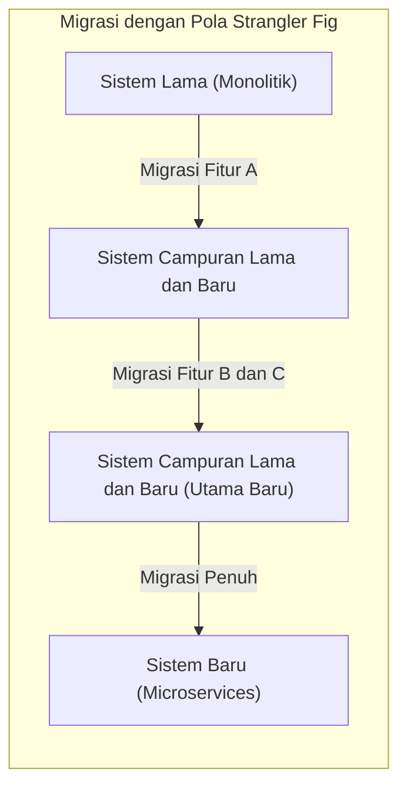
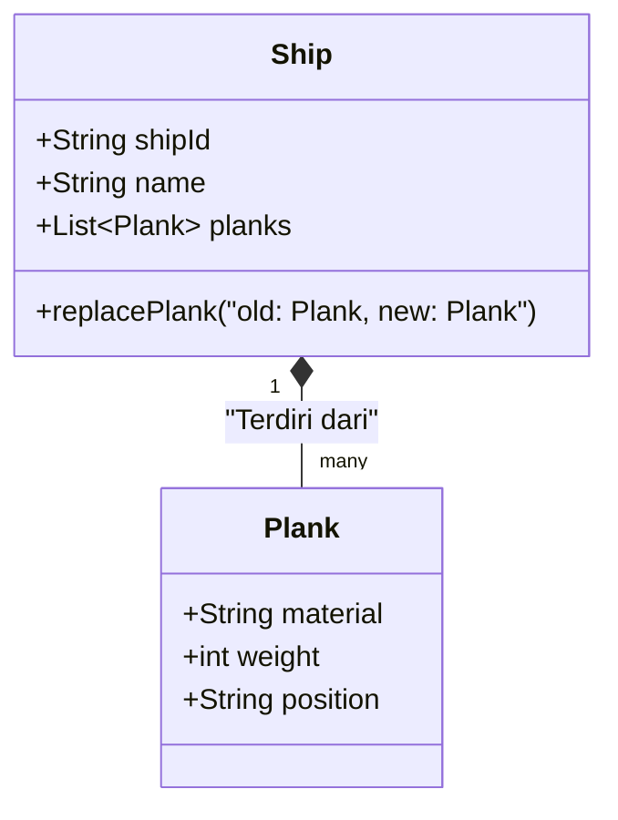
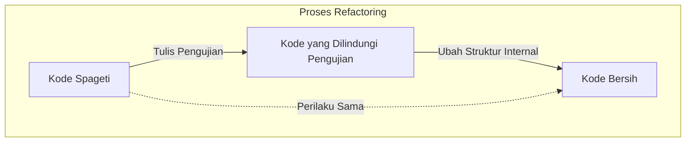
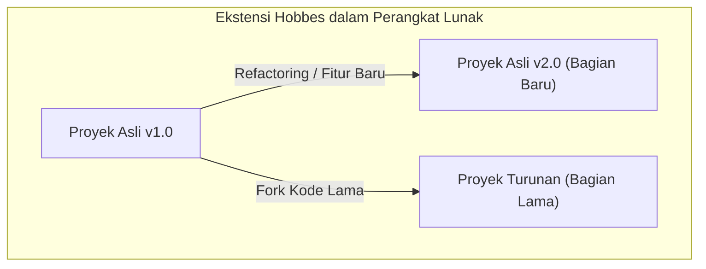

Halo. Apakah Anda pernah mendengar tentang paradoks (eksperimen pemikiran) **[Kapal Theseus](https://kenji.blog/id/p/ship-of-theseus/)**?

Kapal yang ditumpangi oleh pahlawan mitologi Yunani, Theseus, dilestarikan sebagai monumen oleh generasi berikutnya. Namun, karena terbuat dari kayu, seiring berjalannya waktu bagian-bagian kapal mulai melapuk. Orang-orang terus memperbaiki kapal tersebut dengan mengganti kayu yang lapuk dengan kayu yang baru. Bertahun-tahun kemudian, akhirnya **tidak ada satu pun bagian dari kapal asli yang tersisa**.

Di sinilah muncul sebuah pertanyaan.

"Apakah kapal yang semua bagiannya telah diganti masih bisa disebut sama dengan **[Kapal Theseus](https://kenji.blog/id/p/ship-of-theseus/) yang asli**?"

Eksperimen pemikiran ini telah lama diperdebatkan dalam filsafat sebagai pertanyaan tentang apa itu "identitas". Dan yang mengejutkan, masalah ini juga menjadi tema yang sering kita temui dalam **rekayasa perangkat lunak** dan **pengembangan sistem** modern.

Artikel ini akan menjadikan paradoks **[Kapal Theseus](https://kenji.blog/id/p/ship-of-theseus/)** sebagai titik awal untuk mengkaji secara mendalam tentang refactoring, migrasi sistem warisan (legacy systems), serta "identitas" dalam pemrograman berorientasi objek.

## 1. "[Kapal Theseus](https://kenji.blog/id/p/ship-of-theseus/)" dalam Perangkat Lunak

Dalam pengembangan perangkat lunak modern, sangat jarang sebuah sistem yang telah dirilis beroperasi terus-menerus tanpa ada perubahan. Kode terus ditulis ulang karena berbagai alasan, seperti penambahan kebutuhan bisnis, perbaikan bug, peningkatan kinerja, atau pembaruan teknologi dasar.

Sama seperti mengganti kayu lapuk dengan kayu baru, modul-modul lama terus digantikan dengan modul yang baru.

### Pola Strangler Fig (Strangler Fig Pattern)

Salah satu pola arsitektur yang representatif dalam penggantian sistem adalah **Pola Strangler Fig**. Ini adalah metode di mana sebuah sistem warisan yang besar dan kompleks (monolitik) tidak diganti seluruhnya sekaligus, melainkan fungsinya dipindahkan sedikit demi sedikit ke sistem yang baru (misalnya microservices).

Proses ini ketika selesai, struktur internal sistem yang diakses oleh pengguna telah menjadi **sesuatu yang sepenuhnya berbeda**. Mungkin tidak ada satu baris pun kode lama yang tersisa. Namun, dari sudut pandang pengguna, itu adalah "layanan yang biasa", dan baik URL maupun nama mereknya tidak berubah.

Ini benar-benar mencerminkan **[Kapal Theseus](https://kenji.blog/id/p/ship-of-theseus/)**. Meskipun semua komponen (bagian) yang menyusun sistem telah diganti, "identitas" sistem secara keseluruhan dianggap tetap terjaga.

## 2. "Identitas" dalam Pemrograman Berorientasi Objek

Saat memikirkan "identitas" di tingkat kode, konsep yang paling relevan adalah **Pemrograman Berorientasi Objek ([OOP](https://kenji.blog/id/p/object-oriented-programming-oop-solid-principles/))**. Dalam OOP, secara garis besar terdapat dua kriteria untuk menentukan identitas.

1. **Kesetaraan Referensi (Reference Equality)**: Apakah merujuk ke lokasi memori yang sama (apakah pointernya sama)
2. **Kesetaraan Nilai (Value Equality)**: Apakah semua atribut (data) yang dimiliki sama

Dalam konteks [Kapal Theseus](https://kenji.blog/id/p/ship-of-theseus/), argumen "karena semua bagiannya telah diganti, maka ini adalah kapal yang berbeda" adalah pandangan yang menitikberatkan pada **kesetaraan nilai**. Sebaliknya, argumen "karena memiliki konteks historis dan sosial yang berkelanjutan, maka ini adalah kapal yang sama" dapat dikatakan mendekati **kesetaraan referensi**.

### "Entity" dan "Value Object" dalam DDD (Domain-Driven Design)

Metode pemodelan yang dapat memecahkan masalah ini dengan elegan terlihat dalam **Domain-Driven Design (DDD)** yang diusulkan oleh Eric Evans. Dalam DDD, model domain diklasifikasikan menjadi **Entity (Entitas)** dan **Value Object (Objek Nilai)**.

- **Entity**: Objek yang mempertahankan identitasnya meskipun atributnya berubah. Identitasnya dinilai dari ID (pengenal).
- **Value Object**: Objek di mana identitasnya ditentukan oleh atribut itu sendiri. Jika satu saja atributnya berbeda, maka itu adalah objek yang berbeda.

Jika diterapkan pada [Kapal Theseus](https://kenji.blog/id/p/ship-of-theseus/), pemodelan yang sangat jelas dapat dilakukan.

- **Kapal (Ship)** adalah sebuah **Entity**
- **Bagian kapal (Plank / Kayu)** adalah sebuah **Value Object**

Meskipun bagian kapal (Value Object) lapuk dan diganti dengan yang baru, `shipId` dari kapal (Entity) tidak akan berubah. Oleh karena itu, di dalam sistem, ia diperlakukan **sebagai kapal yang sama persis**.

Di dunia perangkat lunak, "identitas" tidak ditentukan oleh wujud fisik atau statusnya, melainkan didefinisikan oleh maksud perancang sistem tentang **"apakah di dalam domain bisnis, ia harus diperlakukan sebagai hal yang sama"**.

## 3. Refactoring dan Mempertahankan Perilaku

Satu hal yang tidak bisa dilepaskan ketika membahas identitas dalam perangkat lunak adalah **refactoring**.
Martin Fowler mendefinisikan refactoring sebagai berikut:

> Mengubah struktur internal perangkat lunak sedemikian rupa sehingga lebih mudah dipahami dan dimodifikasi, tanpa mengubah perilakunya yang terlihat dari luar.

Di sini juga, "identitas" menjadi kuncinya. Meskipun struktur internal (bagian-bagian) kode ditulis ulang secara besar-besaran, jika **perilaku yang terlihat dari luar** tidak berubah, maka itu dianggap sebagai "sistem yang sama".

Yang menjamin "perilaku yang terlihat dari luar" ini adalah **pengujian otomatis (automated testing)**. Selama semua pengujian terus berhasil dilewati, tidak peduli seberapa banyak bagian di dalamnya (metode, kelas, atau seluruh arsitektur) diganti, perangkat lunak tersebut akan tetap menjadi "hal yang sama" seperti [Kapal Theseus](https://kenji.blog/id/p/ship-of-theseus/).

## 4. "[Kapal Theseus](https://kenji.blog/id/p/ship-of-theseus/)" dalam Tim Proyek

Tidak hanya sistem perangkat lunaknya saja, **tim pengembang** yang membuatnya juga bisa menjadi [Kapal Theseus](https://kenji.blog/id/p/ship-of-theseus/).

Dalam proyek jangka panjang, anggota awal secara bertahap akan pergi dan anggota baru akan bergabung. Beberapa tahun kemudian, tidak jarang ditemui tim di mana tidak ada satu pun anggota pendiri yang tersisa.

Lalu, apakah tim yang semua anggotanya telah berganti bisa disebut sama dengan tim yang asli?

Yang menjadi penting di sini adalah **budaya tim** dan **pewarisan dokumentasi serta pengetahuan diam-diam (tacit knowledge)**.
Meskipun anggotanya berganti, jika proses pengembangan, standar pengkodean, kriteria peninjauan kode, dan visi terhadap produk tetap diteruskan oleh tim, maka dapat dikatakan bahwa tim tersebut tetap mempertahankan identitasnya.

Sebaliknya, jika proses orientasi (onboarding) dan dokumentasi tidak dilakukan dengan baik, sehingga gaya pengembangan dan standar kualitas berubah total seiring dengan pergantian anggota, maka bisa dikatakan tim tersebut telah menjadi **tim yang sepenuhnya berbeda** namun hanya memiliki nama yang sama.

## 5. Masalah Ekstensi Hobbes: Kapal yang Dirakit Ulang dari Bagian-Bagian Lama

Paradoks [Kapal Theseus](https://kenji.blog/id/p/ship-of-theseus/) memiliki versi ekstensi terkenal yang ditambahkan oleh filsuf Thomas Hobbes.

> Jika seseorang mengumpulkan semua "bagian-bagian lama yang lapuk" yang telah dilepas dari kapal, lalu merakitnya kembali untuk membuat "kapal yang lain", manakah yang merupakan [Kapal Theseus](https://kenji.blog/id/p/ship-of-theseus/) yang asli?

Satu sisi adalah "kapal yang telah diperbaiki sepenuhnya dengan bagian-bagian baru dan terus berlabuh di pelabuhan".
Di sisi lain adalah "kapal yang berada di tempat berbeda, yang hanya terdiri dari bagian-bagian lama yang asli".

Jika hal ini diterapkan pada pengembangan perangkat lunak, secara mengejutkan ini sangat mirip dengan fenomena **Fork** atau **pembekuan sistem warisan (legacy systems)**.

### Open Source dan Fork

Di dunia perangkat lunak sumber terbuka (OSS), kode sumber terkadang di-fork (bercabang) karena perbedaan arah proyek.

Sebagai contoh, ketika sebuah proyek (kapal asli) secara bertahap bermigrasi ke arsitektur baru (bagian-bagian baru), sebagian komunitas yang menentang hal tersebut dapat memulai proyek baru berdasarkan kode sumber lama (bagian-bagian lama) sebelum migrasi.

Contoh terkenal yang bisa disebutkan adalah hubungan antara MySQL dan MariaDB, atau Node.js dan io.js (yang kemudian bergabung kembali). Dalam kasus ini, identitas hukum dalam bentuk hak merek dagang (nama) dimiliki oleh kapal asli, tetapi dapat juga diperdebatkan bahwa yang mewarisi filosofi dan konsep desain lama (bagian-bagian lama) adalah kapal yang di-fork.

Pertanyaan mengenai mana yang "asli" bukan lagi merupakan masalah identitas fisik, melainkan telah bergeser ke masalah sosial seperti **kesepakatan komunitas** atau **pengakuan merek (brand recognition)**. "Identitas" dalam perangkat lunak melampaui batasan materi yang disebut kode dan berada di dalam persepsi manusia.

## 6. Kapan Berubah Menjadi "Sistem yang Berbeda"?

Lalu, kapan perangkat lunak berhenti menjadi "sistem yang sama"?

Selama terus dilakukan penggantian bagian (refactoring atau migrasi), ia adalah sistem yang sama. Namun, pada momen-momen berikut ini, sistem dapat secara jelas dianggap telah terlahir kembali sebagai **sistem yang berbeda**.

1. **Ketika tujuan eksistensi sistem (domain bisnis) berubah**
2. **Ketika antarmuka pengguna (UI) atau pengalaman pengguna (UX) utama diperbarui secara diskontinu**
3. **Ketika sistem ID yang menjadi inti dari sebuah entity direset**

Misalnya, sebuah alat manajemen tugas kecil untuk keperluan internal perusahaan diubah (pivot) menjadi alat obrolan umum untuk dunia. Meskipun sebagian besar basis kodenya (codebase) masih digunakan kembali (mendaur ulang bagian-bagian), ini bukan lagi kapal yang sama.

Lebih dari sekadar kesinambungan bagian fisik (kode sumber), konsep abstrak tentang **untuk apa ia ada dan kepada siapa ia memberikan nilai** itulah yang menentukan "identitas kapal" dalam perangkat lunak.

## 7. Kesimpulan: Terus Berubah Itulah Identitas

Filsafat Yunani "[Kapal Theseus](https://kenji.blog/id/p/ship-of-theseus/)" mengajarkan kita bahwa akan timbul kontradiksi jika kita mencari identitas pada wujud fisik.

Di dunia perangkat lunak, wujud fisik yang disebut kode (rangkaian byte) sangatlah cair (fluid). Sebaliknya, **terus berubah** justru merupakan syarat mutlak agar perangkat lunak dapat bertahan hidup dan terus memberikan nilai.

Sebuah sistem di mana semuanya telah ditulis ulang. Itu tidak diragukan lagi adalah **sistem yang asli**, namun pada saat yang sama juga merupakan **sistem yang sama sekali baru**.

Bagi kita yang mengembangkan dan memelihara perangkat lunak, ini sama dengan terlibat dalam pemeliharaan [Kapal Theseus](https://kenji.blog/id/p/ship-of-theseus/) yang epik ini. Sambil mengganti bagian-bagiannya satu per satu dengan yang lebih baik, kita membawa identitas berupa "tujuan" dan "nilai" yang terkandung di dalam sistem ke masa depan.

Kali berikutnya Anda melakukan refactoring pada kode warisan (legacy code), cobalah untuk mengingatnya kembali. Bahwa saat ini, Anda sedang memperbarui satu bagian penting dari [Kapal Theseus](https://kenji.blog/id/p/ship-of-theseus/) yang bersejarah.
