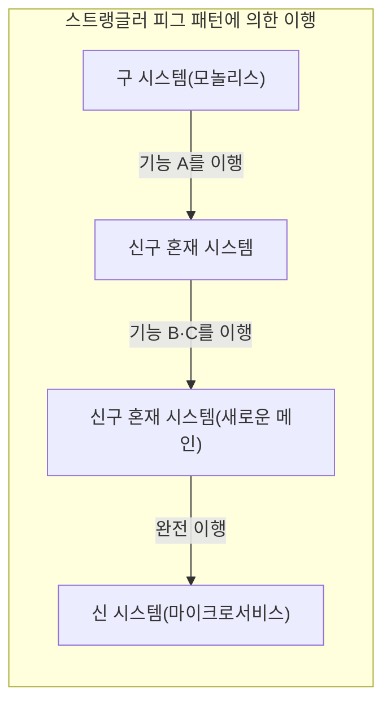
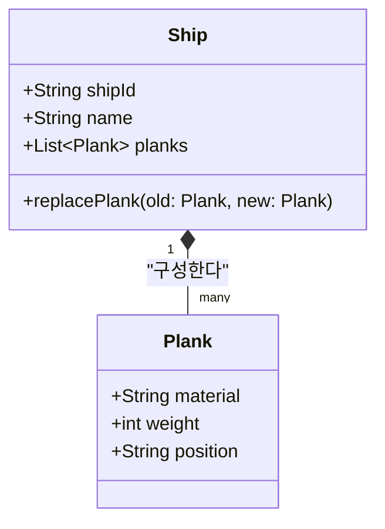
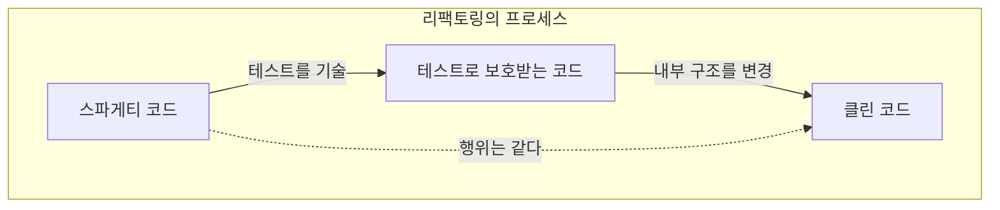
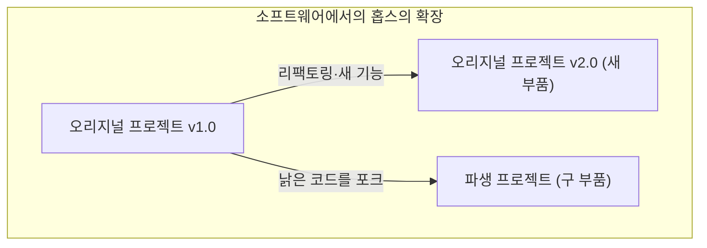

안녕하세요. 여러분은 ** [테세우스의 배](https://kenji.blog/ko/p/ship-of-theseus/) ** 라는 역설(사고 실험)을 알고 계십니까?

그리스 신화에 등장하는 영웅 테세우스가 탔던 배는 후세 사람들에 의해 기념물로 보존되고 있었습니다. 그러나 목조 배였기 때문에 시간이 지남에 따라 썩은 부품이 생겨났습니다. 사람들은 썩은 목재를 새로운 목재로 교체하며 배를 계속 복원했습니다. 그리고 긴 세월이 흘러 마침내 ** 원래 배의 부품이 하나도 남아 있지 않은 상태 ** 가 되었습니다.

여기서 하나의 의문이 생깁니다.

"모든 부품이 교체된 그 배는 과연 ** 원래 [테세우스의 배](https://kenji.blog/ko/p/ship-of-theseus/) ** 와 같은 것이라고 할 수 있을까?"

이 사고 실험은 예로부터 철학에서 '동일성(정체성)'이란 무엇인가를 묻는 것으로 논의되어 왔습니다. 그리고 놀랍게도 이 문제는 현대의 ** 소프트웨어 공학 ** 이나 ** 시스템 개발 ** 에서도 일상적으로 직면하는 주제입니다.

본 기사에서는 이 ** [테세우스의 배](https://kenji.blog/ko/p/ship-of-theseus/) ** 의 역설을 출발점으로 삼아 소프트웨어 개발에서의 리팩토링, 레거시 시스템의 마이그레이션, 그리고 객체 지향에서의 '동일성'에 대해 깊이 고찰해 보겠습니다.

## 1. 소프트웨어에서의 '[테세우스의 배](https://kenji.blog/ko/p/ship-of-theseus/)'

현대의 소프트웨어 개발에서 한 번 릴리스된 시스템이 전혀 변경되지 않고 계속 가동되는 일은 드뭅니다. 비즈니스 요구사항의 추가, 버그 수정, 퍼포먼스 개선, 혹은 기반 기술의 업데이트 등 다양한 이유로 코드는 계속 다시 작성됩니다.

마치 썩은 목재를 새로운 목재로 교체하듯이 오래된 모듈이 새로운 모듈로 교체되어 가는 것입니다.

### 스트랭글러 피그 패턴 (Strangler Fig Pattern)

시스템 교체에서의 대표적인 아키텍처 패턴으로 ** 스트랭글러 피그 패턴 ** 이 있습니다. 이는 거대하고 복잡한 레거시 시스템(모놀리스)을 한 번에 모두 교체하는 것이 아니라 새로운 시스템(예를 들어 마이크로서비스)으로 조금씩 기능을 이행해 가는 수법입니다.

이 프로세스가 완료되었을 때 유저가 접속하고 있는 시스템의 내부 구조는 ** 완전히 다른 것 ** 이 되어 있습니다. 오래된 코드는 1줄도 남아 있지 않을지도 모릅니다. 그러나 유저 입장에서 보면 그것은 '늘 쓰던 서비스'이며 URL도 브랜드명도 변하지 않았습니다.

이것은 바로 ** [테세우스의 배](https://kenji.blog/ko/p/ship-of-theseus/) ** 그 자체입니다. 시스템을 구성하는 컴포넌트(부품)가 모두 교체되더라도 시스템 전체로서의 '동일성'은 유지되고 있다고 간주되는 것입니다.

## 2. 객체 지향 프로그래밍에서의 '동일성'

코드 레벨에서 '동일성'을 생각했을 때 가장 관련이 깊은 것이 ** 객체 지향 프로그래밍(OOP) ** 의 개념입니다. OOP에서는 동일성을 판정하기 위해 크게 2가지 기준이 존재합니다.

1. ** 참조의 등가성(Reference Equality) ** : 메모리 상의 같은 위치를 가리키고 있는지(포인터가 같은지)
2. ** 값의 등가성(Value Equality) ** : 유지하고 있는 속성(데이터)이 모두 같은지

[테세우스의 배](https://kenji.blog/ko/p/ship-of-theseus/)에서 '부품이 모두 교체되었으니 다른 배다'라고 주장하는 것은 ** 값의 등가성 ** 에 무게를 두는 사고방식입니다. 반면에 '역사적·사회적 맥락이 연속되어 있으니 같은 배다'라고 주장하는 것은 일종의 ** 참조의 등가성 ** 에 가깝다고 할 수 있을 것입니다.

### DDD(도메인 주도 설계)의 '엔티티'와 '값 객체'

이 문제를 아름답게 해결하는 모델링 수법이 에릭 에반스가 제창한 ** 도메인 주도 설계(DDD) ** 에서 보입니다. DDD에서는 도메인 모델을 ** 엔티티(Entity) ** 와 ** 값 객체(Value Object) ** 로 분류합니다.

- ** 엔티티(Entity) ** : 속성이 변해도 동일성을 계속 유지하는 객체. ID(식별자)에 의해 동일성이 판단된다.
- ** 값 객체(Value Object) ** : 속성 그 자체가 동일성을 결정하는 객체. 속성이 하나라도 다르면 그것은 다른 객체이다.

이것을 [테세우스의 배](https://kenji.blog/ko/p/ship-of-theseus/)에 적용하면 매우 명백한 모델링이 가능해집니다.

- ** 배(Ship) ** 는 ** 엔티티 ** 이다
- ** 배의 부품(Plank / 목재) ** 은 ** 값 객체 ** 이다

배의 부품(값 객체)이 썩어 새로운 것으로 교체되더라도 배(엔티티)의 `shipId` 는 변하지 않습니다. 따라서 시스템 상으로는 ** 완전히 같은 배 ** 로 취급됩니다.

소프트웨어의 세계에서는 '동일성'은 물리적인 실체나 상태에 의해 결정되는 것이 아니라, ** "비즈니스 도메인에서 그것을 같은 것으로 취급해야 하는가" ** 라는 설계자의 의도에 의해 정의되는 것입니다.

## 3. 리팩토링과 행위의 유지

소프트웨어에서의 동일성을 이야기할 때 빼놓을 수 없는 것이 ** 리팩토링 ** 입니다.
마틴 파울러는 리팩토링을 다음과 같이 정의하고 있습니다.

> 소프트웨어의 외부에서 본 행위를 유지하면서 이해나 수정이 쉽도록 내부의 구조를 변화시키는 것

여기서도 '동일성'이 열쇠가 됩니다. 코드의 내부 구조(부품)를 크게 다시 작성하더라도 ** 외부에서 본 행위 ** 가 변하지 않는다면 그것은 '같은 시스템'으로 간주됩니다.

이 '외부에서 본 행위'를 담보하는 것이 ** 자동 테스트 ** 입니다. 모든 테스트를 계속 통과하는 한, 안의 부품(메소드나 클래스, 아키텍처 전체)을 아무리 교체하더라도 그 소프트웨어는 [테세우스의 배](https://kenji.blog/ko/p/ship-of-theseus/)처럼 '같은 것'으로 계속 존재합니다.

## 4. 프로젝트 팀에서의 '[테세우스의 배](https://kenji.blog/ko/p/ship-of-theseus/)'

소프트웨어 시스템 그 자체뿐만 아니라 그것을 만드는 ** 개발 팀 ** 또한 [테세우스의 배](https://kenji.blog/ko/p/ship-of-theseus/)가 될 수 있습니다.

장기간 지속되는 프로젝트에서는 초기 멤버가 서서히 이탈하고 새로운 멤버가 가입하게 됩니다. 몇 년 후에는 출범 당시의 멤버가 단 한 명도 남아 있지 않은 팀이 되는 일도 드물지 않습니다.

그렇다면 모든 멤버가 교체된 팀은 원래의 팀과 같다고 할 수 있을까요?

여기서 중요해지는 것이 ** 팀의 문화 ** 와 ** 문서·암묵지의 계승 ** 입니다.
멤버가 교체되더라도 팀으로서의 개발 프로세스, 코딩 규약, 코드 리뷰 기준, 그리고 프로덕트에 대한 비전이 인계되고 있다면 그 팀은 동일성을 유지하고 있다고 할 수 있습니다.

반대로 말하면, 적절한 온보딩이나 문서화가 이루어지지 않고 멤버의 교체와 함께 개발 스타일이나 품질 기준이 완전히 다른 것이 되어버린 경우, 그것은 이름만 같을 뿐 ** 전혀 다른 팀 ** 이 되어버렸다고 할 수 있을 것입니다.

## 5. 홉스의 확장 문제: 낡은 부품으로 다시 조립된 배

[테세우스의 배](https://kenji.blog/ko/p/ship-of-theseus/) 역설에는 철학자 토머스 홉스가 덧붙인 유명한 확장판이 있습니다.

> 만약 배에서 분리된 '오래되고 썩은 부품'을 누군가가 모두 주워 모아 그것들을 조합하여 '또 하나의 배'를 만들었다고 한다면, 어느 쪽이 진짜 [테세우스의 배](https://kenji.blog/ko/p/ship-of-theseus/)일까?

한쪽은 '새로운 부품으로 완전히 복원되어 항구에 계속 정박해 있는 배'.
다른 한쪽은 '원래의 오래된 부품으로만 구성된 다른 장소에 있는 배'입니다.

이것을 소프트웨어 개발에 적용해 보면 ** 포크(Fork) ** 나 ** 레거시 시스템의 방치 ** 라는 사상과 놀라울 정도로 잘 닮아 있습니다.

### 오픈 소스와 포크

오픈 소스 소프트웨어(OSS)의 세계에서는 프로젝트의 방향성 차이로 인해 소스 코드가 포크(분기)되는 일이 있습니다.

예를 들어 어떤 프로젝트(원래의 배)가 서서히 새로운 아키텍처(새로운 부품)로 이행해 가는 과정에서, 이에 반발한 일부 커뮤니티가 이행 전의 오래된 소스 코드(오래된 부품)를 기반으로 하여 새로운 프로젝트를 출범시키는 경우가 있습니다.

유명한 예로는 MySQL과 MariaDB, 혹은 Node.js와 io.js(나중에 통합) 등의 관계성을 들 수 있습니다. 이 경우 상표권(이름)이라는 법적 정체성은 원래의 배가 가지지만, 오래된 철학이나 설계 사상(오래된 부품)을 이어받고 있는 것은 포크된 배 쪽이라고 주장할 수도 있습니다.

어느 쪽이 '진짜'인지는 더 이상 물리적인 동일성의 문제가 아니라, ** 커뮤니티의 합의 ** 나 ** 브랜드의 인지 ** 와 같은 사회적인 문제로 넘어갑니다. 소프트웨어에서의 '동일성'은 코드라는 물질의 틀을 넘어 사람들의 인식 속에 있는 것입니다.

## 6. 어느 시점에 '다른 시스템'이 되는가?

그렇다면 소프트웨어는 언제 '같은 시스템'이기를 멈추는 것일까요.

부품의 교체(리팩토링이나 마이그레이션)를 계속하고 있는 한은 같은 시스템이지만, 다음과 같은 타이밍에 명확하게 ** 다른 시스템 ** 으로 다시 태어난다고 생각할 수 있습니다.

1. ** 시스템의 존재 목적(비즈니스 도메인)이 변했을 때 **
2. ** 주요 유저 인터페이스나 경험(UX)이 비연속적으로 쇄신되었을 때 **
3. ** 엔티티의 근간이 되는 ID 체계가 리셋되었을 때 **

예를 들어 사내용의 작은 태스크 관리 툴이었던 것이, 피벗하여 전 세계 대상의 범용 채팅 툴이 되었다고 합시다. 코드 베이스의 대부분을 유용(부품을 재사용)하고 있었다고 하더라도, 이것은 더 이상 '다른 배'입니다.

물리적인 부품(소스 코드)의 연속성보다도 ** 그것이 무엇을 위해 존재하며 누구에게 가치를 제공하고 있는가 ** 라는 추상적인 개념이야말로 소프트웨어에서의 '배의 정체성'을 결정짓는 것입니다.

## 7. 정리: 계속 변화하는 것이야말로 정체성

그리스 철학의 '[테세우스의 배](https://kenji.blog/ko/p/ship-of-theseus/)'는 물리적인 실체에서 정체성을 찾으려 하면 모순이 생긴다는 것을 가르쳐 줍니다.

소프트웨어의 세계에서는 코드라는 물리적인 실체(바이트열)는 극히 유동적입니다. 오히려 ** 계속 변화하는 것 ** 이야말로 소프트웨어가 살아남아 가치를 계속 제공하기 위한 필수 조건입니다.

모든 것이 다시 작성된 시스템. 그것은 틀림없이 ** 원래의 시스템 ** 이면서 동시에 ** 완전히 새로운 시스템 ** 이기도 합니다.

우리가 소프트웨어를 개발하고 유지 보수한다는 것은 이 장대한 [테세우스의 배](https://kenji.blog/ko/p/ship-of-theseus/)의 유지 보수에 종사하고 있는 것과 같습니다. 부품을 하나씩 더 좋은 것으로 교체하면서 시스템에 담긴 '목적'과 '가치'라는 정체성을 미래로 옮겨가는 것입니다.

다음에 여러분이 레거시 코드의 리팩토링을 수행할 때 꼭 떠올려 보시기 바랍니다. 당신은 지금 역사가 깊은 [테세우스의 배](https://kenji.blog/ko/p/ship-of-theseus/)의 중요한 한 조각을 새롭게 하고 있다는 것을.
