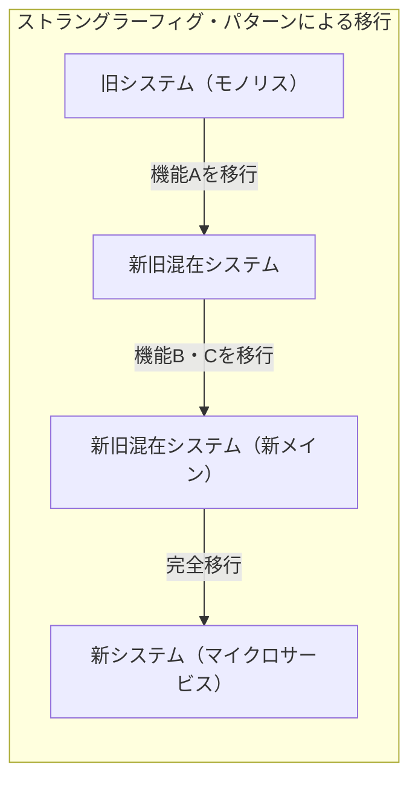
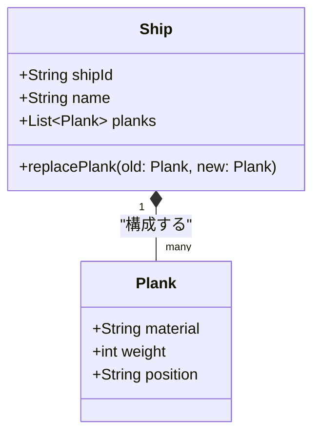
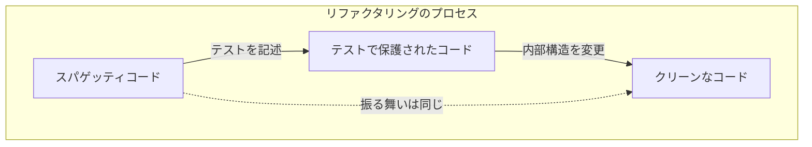
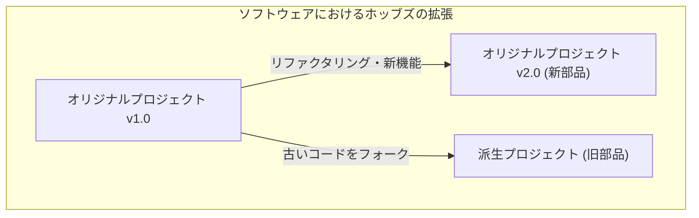

こんにちは。皆さんは **[テセウスの船](https://kenji.blog/p/ship-of-theseus/)** というパラドックス（思考実験）をご存知でしょうか？

ギリシャ神話に登場する英雄テセウスが乗っていた船は、後世の人々によって記念物として保存されていました。しかし、木造の船であるため、時間が経つにつれて朽ちた部品が出てきます。人々は朽ちた木材を新しい木材に置き換え、船を修復し続けました。そして長い年月が経ち、ついに **元の船の部品が一つも残っていない状態** になりました。

ここで一つの疑問が生じます。

「すべての部品が置き換えられたその船は、果たして **元の[テセウスの船](https://kenji.blog/p/ship-of-theseus/)** と同じものだと言えるのだろうか？」

この思考実験は、古くから哲学において「同一性（アイデンティティ）」とは何かを問うものとして議論されてきました。そして驚くべきことに、この問題は現代の **ソフトウェア工学** や **システム開発** においても、日常的に直面するテーマなのです。

本記事では、この **[テセウスの船](https://kenji.blog/p/ship-of-theseus/)** のパラドックスを出発点として、ソフトウェア開発におけるリファクタリング、レガシーシステムのマイグレーション、そして[オブジェクト指向](https://kenji.blog/p/oop-vs-fp-vs-dop/)における「同一性」について深く考察していきます。

## 1. ソフトウェアにおける「[テセウスの船](https://kenji.blog/p/ship-of-theseus/)」

現代のソフトウェア開発において、一度リリースされたシステムが全く変更されずに稼働し続けることは稀です。ビジネス要件の追加、バグの修正、パフォーマンスの改善、あるいは基盤技術のアップデートなど、様々な理由でコードは書き換えられ続けます。

まさに、朽ちた木材を新しい木材に交換するように、古いモジュールが新しいモジュールへと置き換えられていくのです。

### ストラングラーフィグ・パターン（Strangler Fig Pattern）

システムリプレイスにおける代表的なアーキテクチャパターンに **ストラングラーフィグ・パターン** があります。これは、巨大で複雑なレガシーシステム（モノリス）を一度に全て置き換えるのではなく、新しいシステム（例えば[マイクロサービス](https://kenji.blog/p/microservices-architecture-bff-api-gateway/)）へと少しずつ機能を移行させていく手法です。

このプロセスが完了したとき、ユーザーがアクセスしているシステムの内部構造は **完全に別物** になっています。古いコードは1行も残っていないかもしれません。しかし、ユーザーから見れば、それは「いつものサービス」であり、URLもブランド名も変わっていません。

これはまさに **[テセウスの船](https://kenji.blog/p/ship-of-theseus/)** そのものです。システムを構成するコンポーネント（部品）がすべて入れ替わっても、システム全体としての「同一性」は維持されていると見なされているのです。

## 2. [オブジェクト指向](https://kenji.blog/p/oop-vs-fp-vs-dop/)プログラミングにおける「同一性」

コードレベルで「同一性」を考えたとき、最も関連が深いのが **[オブジェクト指向](https://kenji.blog/p/object-oriented-programming-oop-solid-principles/)プログラミング（[OOP](https://kenji.blog/p/object-oriented-programming-oop-solid-principles/)）** の概念です。OOPでは、同一性を判定するために大きく分けて2つの基準が存在します。

1. **参照の等価性（Reference Equality）** ：メモリ上の同じ場所を指しているか（[ポインタ](https://kenji.blog/p/c-language-pointers-memory-management-stack-heap/)が同じか）
2. **値の等価性（Value Equality）** ：保持している属性（データ）がすべて同じか

[テセウスの船](https://kenji.blog/p/ship-of-theseus/)において、「部品がすべて入れ替わったのだから別の船だ」と主張するのは **値の等価性** に重きを置く考え方です。一方、「歴史的・社会的な文脈が連続しているのだから同じ船だ」と主張するのは、ある種の **参照の等価性** に近いと言えるでしょう。

### DDD（ドメイン駆動設計）の「エンティティ」と「値オブジェクト」

この問題を美しく解決するモデリング手法が、エリック・エヴァンスの提唱した **ドメイン駆動設計（DDD）** に見られます。DDDでは、ドメインモデルを **エンティティ（Entity）** と **値オブジェクト（Value Object）** に分類します。

- **エンティティ（Entity）** ：属性が変わっても、同一性を保持し続けるオブジェクト。ID（識別子）によって同一性が判断される。
- **値オブジェクト（Value Object）** ：属性そのものが同一性を決定するオブジェクト。属性が一つでも異なれば、それは別のオブジェクトである。

これを[テセウスの船](https://kenji.blog/p/ship-of-theseus/)に当てはめると、非常に明白なモデリングが可能になります。

- **船（Ship）** は **エンティティ** である
- **船の部品（Plank / 木材）** は **値オブジェクト** である

船の部品（値オブジェクト）が朽ちて新しいものに交換されたとしても、船（エンティティ）の `shipId` は変わりません。したがって、システム上は **完全に同じ船** として扱われます。

ソフトウェアの世界では、「同一性」は物理的な実体や状態によって決まるのではなく、 **「ビジネスドメインにおいて、それを同じものとして扱うべきか」** という設計者の意図によって定義されるのです。

## 3. リファクタリングと振る舞いの維持

ソフトウェアにおける同一性を語る上で外せないのが **リファクタリング** です。
マーティン・ファウラーは、リファクタリングを以下のように定義しています。

> ソフトウェアの外部から見た振る舞いを保ちつつ、理解や修正が簡単になるように、内部の構造を変化させること

ここでも「同一性」が鍵になります。コードの内部構造（部品）を大きく書き換えたとしても、 **外部から見た振る舞い** が変わらなければ、それは「同じシステム」であると見なされます。

この「外部から見た振る舞い」を担保するのが **自動テスト** です。すべてのテストが通過し続ける限り、中の部品（メソッドやクラス、アーキテクチャ全体）をどれだけ入れ替えようとも、そのソフトウェアは[テセウスの船](https://kenji.blog/p/ship-of-theseus/)のように「同じもの」であり続けます。

## 4. プロジェクトチームにおける「[テセウスの船](https://kenji.blog/p/ship-of-theseus/)」

ソフトウェアシステムそのものだけでなく、それを作る **開発チーム** もまた、[テセウスの船](https://kenji.blog/p/ship-of-theseus/)になり得ます。

長期間続くプロジェクトでは、初期メンバーが徐々に離脱し、新しいメンバーが加入していきます。数年後には、立ち上げ時のメンバーが誰一人残っていないチームになることも珍しくありません。

では、すべてのメンバーが入れ替わったチームは、元のチームと同じと言えるのでしょうか？

ここで重要になるのが **チームの文化** と **ドキュメント・暗黙知の継承** です。
メンバーが入れ替わっても、チームとしての開発プロセス、コーディング規約、コードレビューの基準、そしてプロダクトに対するビジョンが引き継がれているのであれば、そのチームは同一性を保っていると言えます。

逆に言えば、適切なオンボーディングやドキュメント化が行われず、メンバーの入れ替わりとともに開発スタイルや品質基準が全く別物になってしまった場合、それは名前が同じだけの **全く別のチーム** になってしまったと言えるでしょう。

## 5. ホッブズの拡張問題：古い部品で組み立て直された船

[テセウスの船](https://kenji.blog/p/ship-of-theseus/)のパラドックスには、哲学者トマス・ホッブズが付け加えた有名な拡張版があります。

> もし、船から取り外された「古い朽ちた部品」を誰かがすべて拾い集め、それらを組み合わせて「もう一つの船」を作ったとしたら、どちらが本物の[テセウスの船](https://kenji.blog/p/ship-of-theseus/)だろうか？

一方は「新しい部品で完全に修復された、港に停泊し続けている船」。
もう一方は「元の古い部品だけで構成された、別の場所にある船」です。

これをソフトウェア開発に当てはめると、 **フォーク（Fork）** や **レガシーシステムの塩漬け** という事象に驚くほどよく似ています。

### オープンソースとフォーク

オープンソースソフトウェア（OSS）の世界では、プロジェクトの方向性の違いからソースコードがフォーク（分岐）することがあります。

例えば、あるプロジェクト（元の船）が徐々に新しいアーキテクチャ（新しい部品）へと移行していく中で、それに反発した一部のコミュニティが、移行前の古いソースコード（古い部品）をベースにして新たなプロジェクトを立ち上げることがあります。

有名な例としては、MySQLとMariaDB、あるいはNode.jsとio.js（後に統合）などの関係性が挙げられます。この場合、商標権（名前）という法的アイデンティティは元の船が持ちますが、古い哲学や設計思想（古い部品）を受け継いでいるのはフォークされた船の方だ、と主張することもできます。

どちらが「本物」であるかは、もはや物理的な同一性の問題ではなく、 **コミュニティの合意** や **ブランドの認知** といった社会的な問題へと移行します。ソフトウェアにおける「同一性」は、コードという物質の枠を超えて、人々の認識の中にあるのです。

## 6. いつの時点で「別のシステム」になるのか？

では、ソフトウェアはいつ「同じシステム」であることをやめるのでしょうか。

部品の入れ替え（リファクタリングやマイグレーション）を続けている限りは同じシステムですが、以下のようなタイミングで、明確に **別のシステム** として生まれ変わると考えることができます。

1. **システムの存在目的（ビジネスドメイン）が変わったとき**
2. **主要なユーザーインターフェースや体験（UX）が非連続的に刷新されたとき**
3. **エンティティの根幹となるID体系がリセットされたとき**

例えば、社内用の小さなタスク管理ツールだったものが、ピボットして世界向けの汎用チャットツールになったとします。コードベースの大部分を流用（部品を再利用）していたとしても、これはもはや「別の船」です。

物理的な部品（ソースコード）の連続性よりも、 **それが何のために存在し、誰に価値を提供しているか** という抽象的な概念こそが、ソフトウェアにおける「船のアイデンティティ」を決定づけるのです。

## 7. まとめ：変化し続けることこそがアイデンティティ

ギリシャ哲学の「[テセウスの船](https://kenji.blog/p/ship-of-theseus/)」は、物理的な実体にアイデンティティを求めると矛盾が生じることを教えてくれます。

ソフトウェアの世界では、コードという物理的な実体（バイト列）は極めて流動的です。むしろ、 **変わり続けること** こそが、ソフトウェアが生き残り、価値を提供し続けるための必須条件です。

すべてが書き換えられたシステム。それは間違いなく **元のシステム** でありながら、同時に **全く新しいシステム** でもあります。

私たちがソフトウェアを開発し、保守するということは、この壮大な[テセウスの船](https://kenji.blog/p/ship-of-theseus/)のメンテナンスに携わっているのと同じです。部品を一つずつ、より良いものへと交換しながら、システムに込められた「目的」と「価値」というアイデンティティを未来へと運んでいく。

次にあなたがレガシーコードのリファクタリングを行うとき、ぜひ思い出してみてください。あなたは今、歴史ある[テセウスの船](https://kenji.blog/p/ship-of-theseus/)の、重要な一片を新しくしているのだということを。

