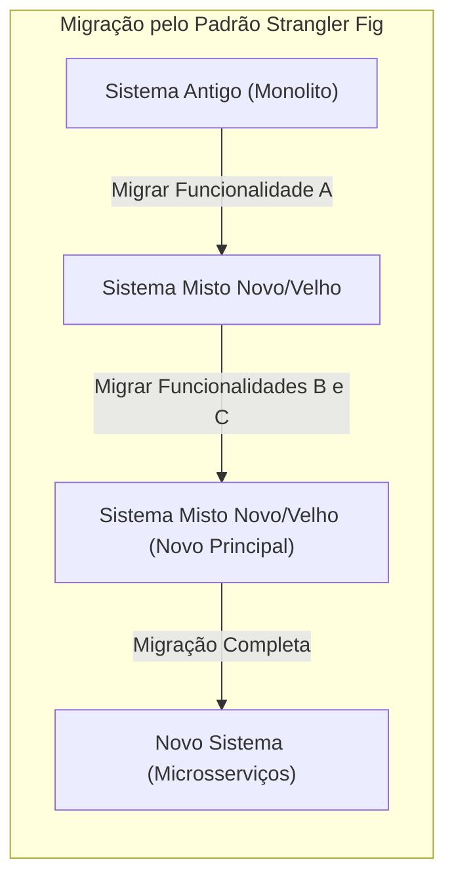
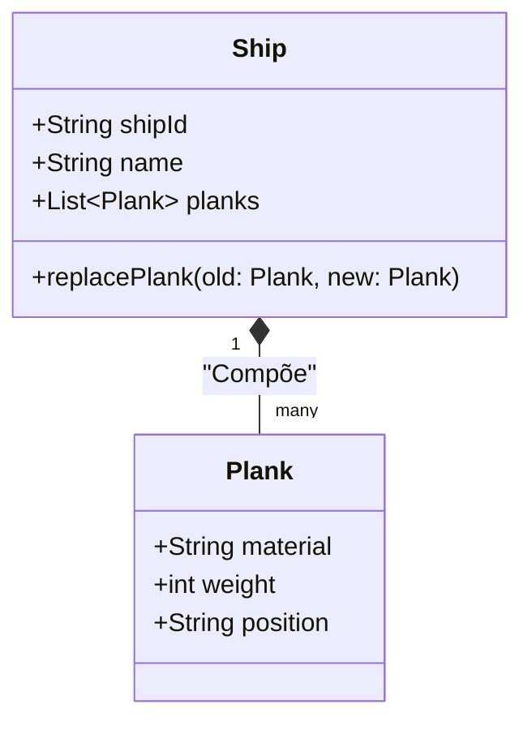
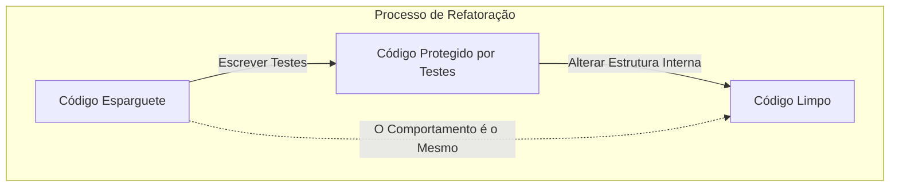
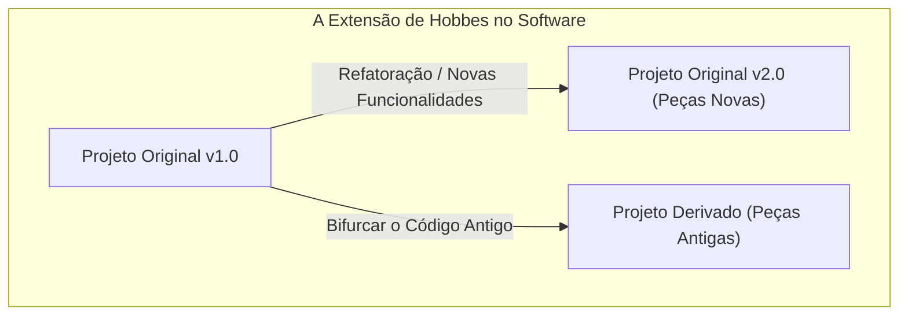

Olá. Vocês conhecem o paradoxo (experiência mental) do **Navio de Teseu**?

O navio em que o herói da mitologia grega, Teseu, navegou foi preservado como monumento pelas gerações posteriores. Contudo, como era um navio de madeira, algumas partes começaram a apodrecer ao longo do tempo. As pessoas substituíram as partes de madeira apodrecida por outras novas, mantendo sempre o navio reparado. Passado um longo período de tempo, chegou a um estado em que **não restava nenhuma peça do navio original**.

Aqui surge uma questão.

"Aquele navio no qual todas as peças foram substituídas ainda pode ser considerado **o navio original de Teseu**?"

Esta experiência mental tem sido amplamente debatida na filosofia desde os tempos antigos para explorar a natureza da "identidade" (identity). E, surpreendentemente, este problema é algo que enfrentamos frequentemente na **engenharia de software** e no **desenvolvimento de sistemas** modernos.

Neste artigo, utilizando o paradoxo do **Navio de Teseu** como ponto de partida, abordaremos profundamente as migrações de sistemas legados, refatorização e o conceito de "identidade" na programação orientada a objetos.

## 1. O "Navio de Teseu" no Software

No desenvolvimento de software moderno, é raro que um sistema, uma vez lançado, continue a funcionar perfeitamente sem necessidade de modificações. O código continua a ser reescrito por várias razões, tais como requisitos de novos negócios, correções de falhas, melhorias de desempenho ou alterações tecnológicas estruturais.

Exatamente como substituir a madeira apodrecida por uma madeira nova, os módulos antigos vão sendo substituídos por módulos novos.

### Padrão Strangler Fig (Strangler Fig Pattern)

O **padrão Strangler Fig** é um padrão arquitetónico muito representativo da migração ou substituição de sistemas. Em vez de substituir um sistema legado gigante e complexo (monólito) de uma só vez, este método migra lentamente as funções para o novo sistema (por exemplo, microsserviços).

Quando este processo termina, a estrutura interna do sistema ao qual os utilizadores têm acesso pode já estar **completamente transformada**. É possível que nem uma linha do código antigo permaneça. Contudo, do ponto de vista do utilizador, este ainda é o "mesmo serviço", sem mudança no URL ou no nome da marca.

Isto é exatamente o próprio **Navio de Teseu**. Apesar de todos os componentes (partes) que constituem o sistema terem sido substituídos, assume-se que o sistema mantém, enquanto unidade completa, a sua "identidade".

## 2. A "Identidade" na Programação Orientada a Objetos

Ao analisar a "identidade" a nível do código, a disciplina com maior relevância é a **Programação Orientada a Objetos (POO)**. Em POO, geralmente existem dois critérios principais para avaliar a identidade de algo.

1. **Igualdade por Referência (Reference Equality)**: Se ambos apontam para o mesmo espaço de memória (o apontador é o mesmo).
2. **Igualdade de Valores (Value Equality)**: Se todos os atributos (dados) que armazenam são os mesmos.

No Navio de Teseu, afirmar que "é um navio diferente porque as peças foram substituídas", sublinha essencialmente o aspeto da **igualdade de valores**. Por outro lado, argumentar que "é o mesmo navio por haver uma continuidade histórica e social", reflete algo mais parecido à **igualdade por referência**.

### As "Entidades" e os "Objetos de Valor" no DDD (Domain-Driven Design)

Uma técnica de modelação que resolve brilhantemente este problema é o **Domain-Driven Design (DDD)**, proposto por Eric Evans. No DDD, os modelos de domínio são agrupados como **Entidades (Entity)** e **Objetos de Valor (Value Object)**.

- **Entidade (Entity)**: Um objeto que mantém a sua identidade independentemente da alteração dos atributos. A sua identidade é avaliada unicamente por um ID (identificador).
- **Objeto de Valor (Value Object)**: Um objeto no qual os atributos em si definem a identidade. Se até mesmo um atributo diferir, então trata-se de um objeto diferente.

Se aplicarmos este princípio ao Navio de Teseu, teremos um método de modelação notavelmente claro.

- O **Navio (Ship)** é uma **Entidade**.
- A **Peça do navio (Plank / Madeira)** é um **Objeto de Valor**.

Mesmo que a peça do navio (objeto de valor) fique podre e seja substituída por uma nova, o `shipId` (Entidade) continuará o mesmo. Portanto, de uma perspetiva de software, este é **absolutamente considerado o mesmo navio**.

No universo do software, a "identidade" não é imposta por formas físicas ou estado; ela é definida pela intenção do autor – a decisão de: **"no domínio de negócio, isto deve ser tratado como o mesmo elemento ou como algo diferente?"**

## 3. Refatorização e a manutenção do Comportamento

É imperativo debater a **refatorização** quando falamos sobre a identidade do software.
Martin Fowler define a refatorização da seguinte forma:

> A alteração de uma estrutura interna de software para a tornar mais fácil de compreender ou mais simples de modificar, sem, contudo, alterar o seu comportamento observável do exterior.

Aqui a "identidade" também é a palavra-chave. Mesmo se a estrutura do código for drasticamente reescrita, o sistema ainda é tratado como sendo "o mesmo", contanto que **o comportamento observável externo** permaneça constante.

Quem assegura esse "comportamento visível externamente" são os **testes automatizados**. Contanto que os testes continuem a passar, não importa o quão modificadas as suas peças, métodos, classes ou toda a arquitetura interna sejam, esse software permanece, como o Navio de Teseu, sendo "o mesmo".

## 4. [O Navio de Teseu](https://kenji.blog/pt/p/ship-of-theseus/) em Equipas de Projeto

Não só os sistemas de software por si só, como também as **equipas de desenvolvimento** por trás da sua construção podem se comportar como Navios de Teseu.

Em projetos prolongados, é muito usual haver membros que saem da equipa de desenvolvimento bem como a chegada de novos membros. Passados alguns anos, não é nada de anormal ver uma equipa que não partilha quase nada em termos de constituintes relativamente aos dias do arranque.

Tendo isto em conta, será que podemos dizer que a equipa inteiramente renovada ainda é a mesma equipa de antes?

Aqui entram fatores essenciais, como a **cultura da equipa**, juntamente com a **transferência de documentação e do conhecimento implícito**.
Mesmo sob o efeito da renovação da constituição humana, se a filosofia, as normas do desenvolvimento, o sistema de code review ou a visão perante o produto se mantiverem herdados, esta equipa pode assegurar tranquilamente que a sua identidade não foi alterada.

Em sentido inverso, se a integração for inadequada e faltarem diretrizes em documentação, ao ritmo das remodelações com a entrada e a saída de membros, tudo, deste estilo, do formato da produção ou aos pressupostos subjacentes da gestão de qualidade pode mudar – ou seja, a identidade não sobrevive a despeito do facto de conservar "exatamente o mesmo nome", mas que internamente consiste agora numa **equipa radicalmente nova**.

## 5. O problema estendido por Hobbes: O navio remontado com partes velhas

O paradoxo do navio de Teseu possui uma famosa extensão da teoria adicionada pelo filósofo Thomas Hobbes:

> E se alguém decidir recolher todas as velhas peças descartadas após apodrecerem, para compilar a construção de um "outro navio", qual de entre os dois passaria a ser, validamente, o autêntico "Navio de Teseu"?

Dum lado o "Navio inteiramente constituído por madeira reparada, encalhado sempre de forma estável no seu ancoradouro".
Por outro, o "navio existente num outro sítio, apenas fabricado pelas antigas peças desgastadas".

Esta noção é uma alusão supreendente assombrosa a ocorrências que presenciamos no software com **Forks**, assim como com a preservação estática e congelada dos ditos **Sistemas Legados (Legacy System preservation)**.

### Código de Código-Aberto e o "Forks"

No ecossistema global do Software Open Source (OSS), sucede que certos projetos sejam submetidos a divisões (forks), por incompatibilidade direcional.

Por exemplo, um projeto (Navio original) está em progressiva reformação por virtude do ajustamento à moderna arquitetura (peças novas). Todavia, há quem queira abster-se deste trilho na perspetiva adotada no passado – então, estes grupos separam-se para erguer outro projeto de raiz na forma do antigo e predefinido código primário (peças originais velhas).

Temos exemplos como o caso clássico de MySQL e MariaDB. Outro evento notório foi a desvinculação entre Node.js e a base denominada de io.js (que ulteriormente tornariam-se as duas na mesma coisa). Sob este critério específico, as regalias jurídicas, como Direitos de Autor e as marcas originais são retidos pelo projeto fundamental, porém o pilar filosófico histórico e a essência subjacente do projeto original residem, inquestionavelmente, perfeitamente bem contidos nas fundações elaboradas do Fork.

Determinar onde vive no fim "O Original e Legítimo" não se qualifica em moldes puramente avaliáveis fisicamente, convertendo-se antes noutra componente impulsionada perante o patamar da **Conformidade em Comunidade**, assim como a perspetiva visualizada de uma **Identidade Corporativa e de Imagem da Marca**, assumida como um panorama eminentemente ideológico onde o estatuto transita pela forma da contemplação subjetiva do homem.

## 6. Então, em que ponto surge um "outro sistema"?

Isto leva a indagar em que ocasião se demarca realmente que o projeto foi submetido a uma total quebra da consistência na sua "Identidade original".

Enquanto houver transições (sejam modernizações, ou transições lógicas), será tratado uniformemente como o mesmo sistema perante a essência; Contudo – torna-se evidentemente demarcado, no ponto do desapego onde reencarnará perante a nova imagem **neste conjunto diferente de fatores**:

1. **Alteração do Objeto Fundamental que impulsionava a finalidade do domínio original (Business Domain).**
2. **Atualização abrupta (incongruente ou incompatível com a linha anterior) da User-Interface essencial e das premissas perante a UX.**
3. **Restruturação generalizada que implique Reiniciação Absoluta aos perfis da Estrutura Central (ID) geradora de raiz (Das Entidades).**

Pense num singelo "task management hub", concebido por funcionários e restruturado, que fez pivot para a constituição de uma enorme plataforma abrangente num aspeto generalista em termos de Mensagens de Chat mundiais, com base estrutural idêntica e sem grandes remodelações, num todo, e que a arquitetura central de código fonte ainda possua traços das origens: Contudo, essa finalidade desmarcou-se totalmente e, desta via, trata-se inequivocamente "doutra embarcação distinta".

Ao invés de dependermos meramente perante a interdependência material subjacente na matriz principal da programação originada na raiz, no cômputo derradeiro, o estipulamento fundamental na consideração de uma dada e específica "Identidade da Embarcação" em Softwares alarga a balança aos parâmetros concecionais da sua "natureza por si": – o motivo causal na existência para um utilizador específico, em consonância com a sua utilidade primária de criação que fomenta na atualidade; Este núcleo semântico forma, invariavelmente, a matriz vital identificadora da identidade e perpetuidade das estruturas originais.

## 7. Sumário: Continuar a Mudar, é efetivamente a matriz identitária

De modo semelhante ao que expressava perante um antigo dogma grego no que ditava ser o Navio de Teseu, o dogma de se atribuir um contexto identificador apenas com base na matriz do corpo substancial cria atritos de incongruências.

Os sistemas, representados fisicamente sob o domínio puramente abstrato por séries sequenciais na codificação constituída nos bytes virtuais no quadro algorítmico global fluído - são formados, pelo contrário: por uma incessante mutação transformativa, o qual não se constitui nem deve exprimir um receio perante isto! Mais ainda, sendo inteiramente **essencial estar enraizado num constante fluxo modelador progressista e metamórfico** de cariz obrigatório, a premissa assegura permanentemente uma sobrevivência que consinta prover incessantemente de relevância num propósito valorativo tangível que nunca extinga à medida da transição no tempo.

Um determinado programa que venha reescrito de forma completa na sua base de códigos a partir do marco inicial será, sem sombra para discórdia, a **extensão do programa antigo original**, porém constitui, à partida, simultaneamente também num **todo inédito, transformado integralmente num formato revitalizado.**

Fomentarmos o decurso evolutivo sustentável, perante a administração num âmbito informático de engenharia orientada, corresponde à atribuição no mesmo calibre da preservação grandiosa aplicada, à vista dos seus tempos, das tábuas nobres sobre o lendário barco de Teseu: Renovaremos de modo regular e persistente no propósito de engrandecer todos os moldes estruturais - mas de braço dado mantemos acoplada o propósito matricial bem na preservação originária dos seus objetivos concretizados rumo às glórias da posteridade.

Da próxima vez, diante na encruzilhada exigida ao submeter código antigo no projeto legado rumo a progressos contínuos de atualizações ou modelagens e em processos extensivos inerentes num âmbito de re-estruturamento de códigos ("Refatorização"). Recordem-se firmemente: Agora mesmo vocês mantêm em mãos as rédeas no aperfeiçoamento da componente orgânica pertencente ao grandioso Barco histórico de Teseu; estais a aplicar um pequeno -mas decisivo- pilar neste barco, conduzindo-o brilhantemente com determinação sob renovação para a eternidade e num bom rumo em direção na linha histórica inquebrável sobre o marco do futuro.
