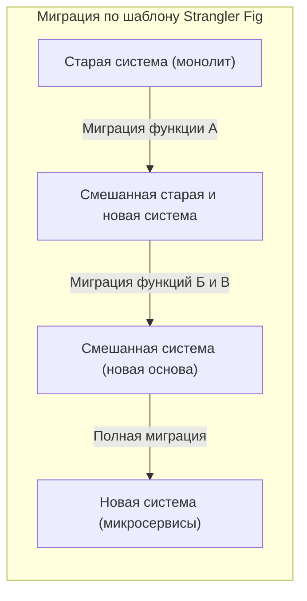
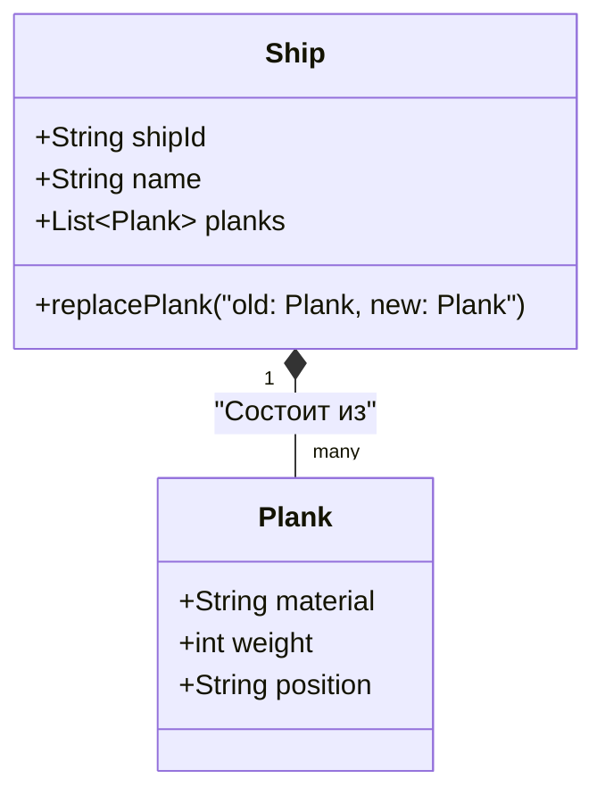
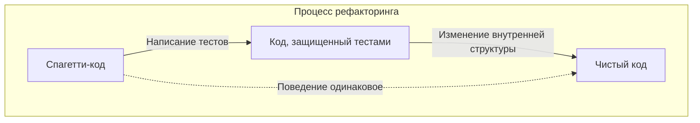
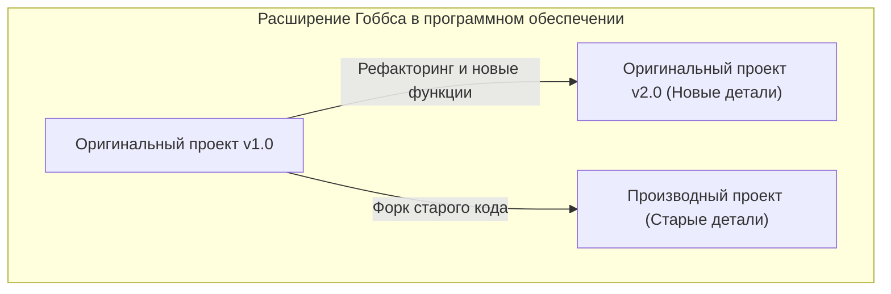

Здравствуйте. Знакомы ли вы с парадоксом (мысленным экспериментом) **[Корабль Тесея](https://kenji.blog/ru/p/ship-of-theseus/)**?

Корабль, на котором плыл герой греческой мифологии Тесей, сохранялся потомками как памятник. Однако, поскольку корабль был деревянным, со временем некоторые его части сгнили. Люди заменяли сгнившую древесину на новую, продолжая ремонтировать корабль. Прошли долгие годы, и в конце концов наступило состояние, когда **ни одной оригинальной детали корабля не осталось**.

Здесь возникает один вопрос.

«Можно ли сказать, что этот корабль, все детали которого были заменены, по-прежнему является **тем же самым оригинальным кораблем Тесея**?»

Этот мысленный эксперимент издавна обсуждался в философии как вопрос о том, что такое «идентичность» (тождественность). И что удивительно, эта проблема является темой, с которой мы ежедневно сталкиваемся в современной **программной инженерии** и **разработке систем**.

В этой статье, взяв за отправную точку парадокс **Корабля Тесея**, мы глубоко рассмотрим рефакторинг в разработке программного обеспечения, миграцию унаследованных систем, а также «идентичность» в объектно-ориентированном программировании.

## 1. «[Корабль Тесея](https://kenji.blog/ru/p/ship-of-theseus/)» в программном обеспечении

В современной разработке программного обеспечения редко бывает так, чтобы однажды выпущенная система продолжала работать без каких-либо изменений. Код постоянно переписывается по различным причинам: добавление бизнес-требований, исправление ошибок, улучшение производительности или обновление базовых технологий.

Именно так, подобно замене сгнившей древесины на новую, старые модули заменяются новыми модулями.

### Шаблон Strangler Fig (Strangler Fig Pattern)

Одним из типичных архитектурных шаблонов при замене системы является **шаблон Strangler Fig**. Это метод, при котором огромная и сложная унаследованная система (монолит) не заменяется вся сразу, а функции постепенно переносятся в новую систему (например, микросервисы).

Когда этот процесс завершен, внутренняя структура системы, к которой обращаются пользователи, становится **совершенно другой**. От старого кода может не остаться ни единой строчки. Однако с точки зрения пользователей, это «тот же самый сервис», и его URL-адрес и бренд не изменились.

Это и есть сам **[Корабль Тесея](https://kenji.blog/ru/p/ship-of-theseus/)**. Даже если все компоненты (детали), составляющие систему, были заменены, считается, что «идентичность» системы в целом сохранилась.

## 2. «Идентичность» в объектно-ориентированном программировании

Когда мы думаем об «идентичности» на уровне кода, наиболее тесно связанной концепцией является **объектно-ориентированное программирование (ООП)**. В ООП существуют два основных критерия для определения идентичности:

1. **Эквивалентность по ссылке (Reference Equality)**: Указывает ли на то же место в памяти (одинаковый ли указатель)
2. **Эквивалентность по значению (Value Equality)**: Одинаковы ли все хранимые атрибуты (данные)

В парадоксе Корабля Тесея утверждение о том, что «поскольку все детали были заменены, это другой корабль» основано на концепции **эквивалентности по значению**. С другой стороны, утверждение о том, что «поскольку исторический и социальный контекст непрерывен, это тот же самый корабль», можно сказать, близко к своего рода **эквивалентности по ссылке**.

### «Сущность» и «Объект-значение» в DDD (Предметно-ориентированном проектировании)

Метод моделирования, который элегантно решает эту проблему, можно увидеть в **предметно-ориентированном проектировании (DDD)**, предложенном Эриком Эвансом. В DDD доменные модели классифицируются на **сущности (Entity)** и **объекты-значения (Value Object)**.

- **Сущность (Entity)**: Объект, который сохраняет свою идентичность, даже если его атрибуты изменяются. Идентичность определяется по ID (идентификатору).
- **Объект-значение (Value Object)**: Объект, идентичность которого определяется самими атрибутами. Если хотя бы один атрибут отличается, это другой объект.

Применив это к Кораблю Тесея, можно выполнить очень четкое моделирование:

- **Корабль (Ship)** является **сущностью**
- **Детали корабля (Plank / Доски)** являются **объектами-значениями**

Даже если детали корабля (объекты-значения) сгнивают и заменяются новыми, `shipId` корабля (сущности) не изменяется. Поэтому в системе он рассматривается как **абсолютно тот же корабль**.

В мире программного обеспечения «идентичность» определяется не физической сущностью или состоянием, а намерением проектировщика: **«Следует ли рассматривать это как то же самое в бизнес-домене?»**.

## 3. Рефакторинг и сохранение поведения

При обсуждении идентичности в программном обеспечении нельзя обойти стороной **рефакторинг**.
Мартин Фаулер определяет рефакторинг следующим образом:

> Изменение внутренней структуры программного обеспечения таким образом, чтобы оно стало проще для понимания и модификации, при сохранении его внешнего поведения.

Здесь «идентичность» также является ключом. Даже если внутренняя структура кода (детали) сильно переписана, если **внешнее поведение** не изменилось, это считается «той же самой системой».

Именно **автоматизированное тестирование** гарантирует это «внешнее поведение». Пока все тесты продолжают проходить, независимо от того, сколько внутренних деталей (методов, классов, архитектуры в целом) было заменено, это программное обеспечение остается «тем же самым», подобно Кораблю Тесея.

## 4. «[Корабль Тесея](https://kenji.blog/ru/p/ship-of-theseus/)» в проектных командах

Не только сама программная система, но и **команда разработчиков**, которая ее создает, также может стать Кораблем Тесея.

В долгосрочных проектах первоначальные участники постепенно уходят, и к ним присоединяются новые. Нередко бывает так, что через несколько лет в команде не остается ни одного из тех, кто запускал проект.

Итак, можно ли сказать, что команда, в которой сменились все участники, — это та же самая команда?

Здесь важными становятся **культура команды** и **наследование документации и неявных знаний**.
Даже если участники меняются, если процесс разработки команды, стандарты кодирования, критерии обзора кода и видение продукта сохраняются, можно сказать, что команда сохраняет свою идентичность.

С другой стороны, если не проводится надлежащий процесс адаптации новых сотрудников или не ведется документация, и с приходом новых участников стиль разработки и стандарты качества становятся совершенно другими, можно сказать, что это стала **совершенно другая команда** с тем же названием.

## 5. Расширенная проблема Гоббса: Корабль, собранный заново из старых деталей

У парадокса Корабля Тесея есть известное дополнение, сделанное философом Томасом Гоббсом.

> Если бы кто-то собрал все «старые, сгнившие детали», снятые с корабля, и построил из них «еще один корабль», какой из них был бы настоящим Кораблем Тесея?

Один — это «корабль, полностью восстановленный из новых деталей, который продолжает стоять в порту».
Другой — это «корабль, состоящий только из старых деталей, находящийся в другом месте».

Если применить это к разработке программного обеспечения, то это удивительно похоже на такие явления, как **Форк (Fork)** или **консервация унаследованной системы**.

### Open Source и Форк

В мире программного обеспечения с открытым исходным кодом (OSS) исходный код иногда разветвляется (форкается) из-за разногласий в направлении проекта.

Например, когда определенный проект (оригинальный корабль) постепенно переходит на новую архитектуру (новые детали), часть сообщества, которая выступает против этого, может запустить новый проект, взяв за основу старый исходный код до перехода (старые детали).

В качестве известных примеров можно привести отношения между MySQL и MariaDB, или Node.js и io.js (позже объединены). В этом случае оригинальный проект сохраняет юридическую идентичность — право на товарный знак (имя), но можно утверждать, что именно форкнутый корабль унаследовал старую философию и концепцию дизайна (старые детали).

Какая из них является «настоящей», больше не является проблемой физической идентичности, а переходит в социальную плоскость, такую как **консенсус сообщества** или **узнаваемость бренда**. «Идентичность» в программном обеспечении выходит за рамки материального (кода) и находится в сознании людей.

## 6. В какой момент система становится «другой»?

Так когда же программное обеспечение перестает быть «той же самой системой»?

Пока детали заменяются (рефакторинг или миграция), это та же самая система, но можно считать, что она явно перерождается в **другую систему** в следующие моменты:

1. **Когда меняется цель существования системы (бизнес-домен)**
2. **Когда основные пользовательские интерфейсы или опыт (UX) радикально обновляются**
3. **Когда сбрасывается система идентификаторов (ID), являющаяся основой сущностей**

Например, предположим, что небольшой инструмент управления задачами для внутреннего использования был перепрофилирован во всемирный чат-инструмент общего назначения. Даже если большая часть кодовой базы была использована повторно (повторное использование деталей), это уже «другой корабль».

Скорее абстрактная концепция: **для чего оно существует и кому предоставляет ценность**, чем непрерывность физических деталей (исходного кода), определяет «идентичность корабля» в программном обеспечении.

## 7. Заключение: Постоянные изменения — это и есть идентичность

Греческий философский парадокс «[Корабль Тесея](https://kenji.blog/ru/p/ship-of-theseus/)» учит нас, что поиск идентичности в физической сущности приводит к противоречиям.

В мире программного обеспечения физическая сущность кода (последовательность байт) крайне изменчива. Напротив, **постоянное изменение** является обязательным условием для того, чтобы программное обеспечение выживало и продолжало предоставлять ценность.

Система, в которой было переписано все. Она несомненно является **оригинальной системой** и в то же время **совершенно новой системой**.

То, что мы разрабатываем и поддерживаем программное обеспечение, равносильно нашему участию в техническом обслуживании этого грандиозного Корабля Тесея. Заменяя детали одну за другой на лучшие, мы несем в будущее идентичность системы — ее «цель» и «ценность».

В следующий раз, когда вы будете выполнять рефакторинг унаследованного кода, обязательно вспомните. В этот момент вы обновляете важную часть исторического Корабля Тесея.
