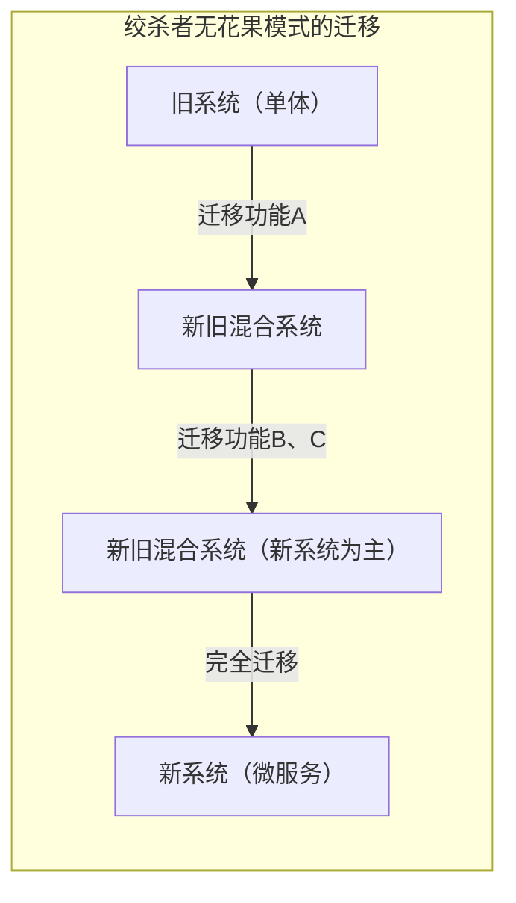
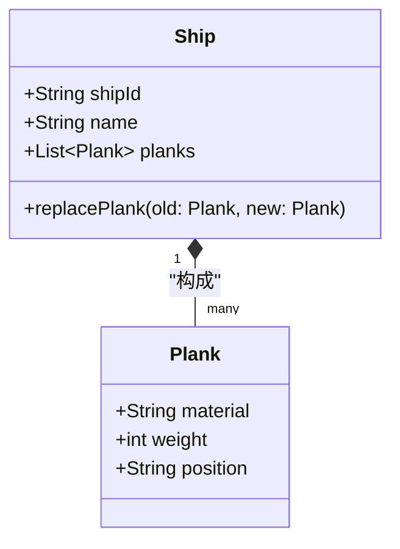
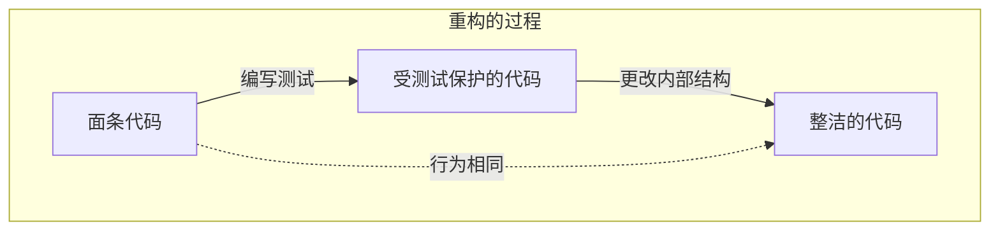
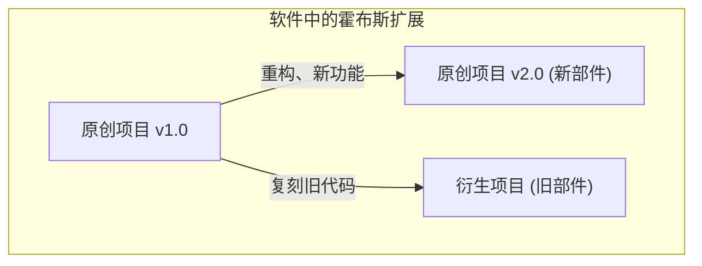

大家好。大家是否知道 **[忒修斯之船](https://kenji.blog/zh-cn/p/ship-of-theseus/)** 这个悖论（思想实验）呢？

希腊神话中登场的英雄忒修斯所乘坐的船，被后人作为纪念物保存了下来。然而，由于是木造的船，随着时间的推移，出现了一些腐朽的部件。人们不断用新木材替换腐朽的木材，持续修复这艘船。漫长的岁月过去后，最终达到了 **原来的船的部件一个都不剩的状态** 。

这时产生了一个疑问。

“所有部件都被替换过的这艘船，果真还能说是 **原来的[忒修斯之船](https://kenji.blog/zh-cn/p/ship-of-theseus/)** 吗？”

这个思想实验自古以来就在哲学中作为探讨“同一性（Identity）”是什么的问题而被争论。令人惊讶的是，这个问题在现代的 **软件工程** 和 **系统开发** 中，也是日常面临的主题。

本文将以这个 **[忒修斯之船](https://kenji.blog/zh-cn/p/ship-of-theseus/)** 的悖论为出发点，深入探讨软件开发中的重构、遗留系统的迁移，以及面向对象中的“同一性”。

## 1. 软件中的“[忒修斯之船](https://kenji.blog/zh-cn/p/ship-of-theseus/)”

在现代软件开发中，一旦发布的系统完全不加修改地持续运行是很少见的。由于添加业务需求、修复错误、改善性能或者更新基础设施技术等各种原因，代码会被不断重写。

正如用新木材替换腐朽的木材一样，旧的模块也在不断被新的模块所替换。

### 绞杀者无花果模式（Strangler Fig Pattern）

系统替换中代表性的架构模式之一是 **绞杀者无花果模式** 。这是一种不将庞大复杂的遗留系统（单体架构）一次性全部替换，而是将功能一点点迁移到新系统（例如微服务）的手法。

当这个过程完成时，用户正在访问的系统内部结构已经变成了 **完全不同的东西** 。旧的代码可能一行都没有留下。但是，从用户的角度来看，那是“一如既往的服务”，URL和品牌名称都没有改变。

这简直就是 **[忒修斯之船](https://kenji.blog/zh-cn/p/ship-of-theseus/)** 本船。即使构成系统的所有组件（部件）都被替换了，系统整体作为“同一性”依然被认为维持着。

## 2. 面向对象编程中的“同一性”

在代码层面思考“同一性”时，关系最密切的就是 **面向对象编程（[OOP](https://kenji.blog/zh-cn/p/object-oriented-programming-oop-solid-principles/)）** 的概念。在OOP中，为了判断同一性，大致存在两个标准。

1. **引用的等价性（Reference Equality）** ：是否指向内存中的同一个位置（指针是否相同）
2. **值的等价性（Value Equality）** ：所保持的属性（数据）是否全部相同

在[忒修斯之船](https://kenji.blog/zh-cn/p/ship-of-theseus/)中，主张“因为部件全部更换了，所以是另一艘船”是偏向于 **值的等价性** 的想法。另一方面，主张“因为历史和社会的脉络是连续的，所以是同一艘船”可以说是接近某种 **引用的等价性** 。

### DDD（领域驱动设计）的“实体”和“值对象”

能够优美地解决这个问题的建模手法，可以在埃里克·埃文斯提倡的 **领域驱动设计（DDD）** 中找到。在DDD中，将领域模型分为 **实体（Entity）** 和 **值对象（Value Object）** 。

- **实体（Entity）** ：即使属性发生变化，也持续保持同一性的对象。通过ID（标识符）来判断同一性。
- **值对象（Value Object）** ：属性本身决定同一性的对象。只要有一个属性不同，它就是另一个对象。

将这个概念应用到[忒修斯之船](https://kenji.blog/zh-cn/p/ship-of-theseus/)上，就能进行非常明确的建模。

- **船（Ship）** 是 **实体** 
- **船的部件（Plank / 木材）** 是 **值对象** 

即使船的部件（值对象）腐朽并被更换为新的，船（实体）的 `shipId` 也不变。因此，在系统上它被作为 **完全相同的船** 来处理。

在软件的世界里，“同一性”不是由物理实体或状态决定的，而是由设计者 **“在业务领域中，是否应该将其作为同一事物来处理”** 的意图来定义的。

## 3. 重构与行为的维持

在谈论软件同一性时，不可或缺的是 **重构** 。
马丁·福勒将重构定义如下：

> 在保持软件外部行为不变的前提下，为了使代码更容易理解和修改，而改变其内部结构

这里“同一性”也是关键。即使大幅重写了代码的内部结构（部件），只要 **从外部看到的行为** 不变，它就被认为是“同一个系统”。

担保这种“从外部看到的行为”的是 **自动化测试** 。只要所有的测试继续通过，不管里面的部件（方法、类或整个架构）被替换了多少次，该软件就像[忒修斯之船](https://kenji.blog/zh-cn/p/ship-of-theseus/)一样，继续保持“同一事物”。

## 4. 项目团队中的“[忒修斯之船](https://kenji.blog/zh-cn/p/ship-of-theseus/)”

不仅是软件系统本身，制作软件的 **开发团队** 也可能成为[忒修斯之船](https://kenji.blog/zh-cn/p/ship-of-theseus/)。

在长期持续的项目中，初期成员逐渐离职，新成员不断加入。几年后，变成一个连当初成立时的成员都不剩的团队，这也是很常见的事。

那么，所有成员都被替换过的团队，还能说是和原来的团队一样吗？

在这里变得重要的是 **团队的文化** 以及 **文档、隐性知识的继承** 。
即使成员被替换，如果作为团队的开发流程、编码规范、代码审查标准以及对产品的愿景被继承了下来，那么可以说该团队保持了同一性。

反过来说，如果没有进行适当的入职培训和文档化，随着成员的更替，开发风格和质量标准变成了完全不同的东西，那么这就可以说变成了一个只是名字相同的 **完全不同的团队** 了。

## 5. 霍布斯的扩展问题：用旧部件重新组装的船

[忒修斯之船](https://kenji.blog/zh-cn/p/ship-of-theseus/)的悖论中，有一个由哲学家托马斯·霍布斯补充的著名扩展版。

> 如果有人把从船上拆下来的“陈旧腐朽的部件”全部捡起来，用它们组装成“另一艘船”，那么哪一艘才是真正的[忒修斯之船](https://kenji.blog/zh-cn/p/ship-of-theseus/)呢？

一艘是“完全用新部件修复的、一直停泊在港口的船”。
另一艘是“仅由原来的旧部件组成、在别处的船”。

将这个应用到软件开发中，与 **复刻（Fork）** 和 **遗留系统的冻结** 现象惊人地相似。

### 开源与复刻

在开源软件（OSS）的世界里，由于项目方向性的不同，源代码有时会被复刻（分支）。

例如，在某个项目（原来的船）逐渐向新架构（新部件）迁移的过程中，一部分反对的社区可能会以迁移前的旧源代码（旧部件）为基础，启动一个新项目。

著名的例子有 MySQL 和 MariaDB，或者 Node.js 和 io.js（后来合并）等关系。在这种情况下，商标权（名称）这种法律上的同一性由原来的船拥有，但也可以主张继承了旧哲学和设计思想（旧部件）的，是复刻出来的船。

到底哪一艘是“真品”，已经不再是物理同一性的问题，而是转移到了 **社区共识** 和 **品牌认知** 等社会问题上。软件中的“同一性”，超越了代码这种物质的界限，存在于人们的认知之中。

## 6. 在什么时候变成“另一个系统”？

那么，软件在什么时候停止作为“同一个系统”呢？

只要还在继续进行部件替换（重构或迁移），它就是同一个系统，但在以下时机，可以认为它明确地重生为了 **另一个系统** 。

1. **系统的存在目的（业务领域）发生改变时** 
2. **主要的用户界面或体验（UX）发生非连续性刷新时** 
3. **作为实体根本的ID体系被重置时** 

例如，一个原本用于公司内部的小型任务管理工具，经过转型变成了面向全球的通用聊天工具。即使流用了大部分代码库（重新利用了部件），这也不再是同一艘船，而是“另一艘船”了。

比起物理部件（源代码）的连续性， **它是为了什么而存在，向谁提供价值** 这种抽象的概念，才是决定软件中“船的同一性”的关键。

## 7. 总结：不断变化本身就是同一性

希腊哲学的“[忒修斯之船](https://kenji.blog/zh-cn/p/ship-of-theseus/)”告诉我们，在物理实体中寻求同一性会产生矛盾。

在软件的世界中，代码这种物理实体（字节序列）是极度流动的。倒不如说， **不断变化** 本身，才是软件生存下来并持续提供价值的必要条件。

全部被重写过的系统。它毫无疑问是 **原来的系统** ，但同时也是 **全新的系统** 。

我们开发并维护软件，就等同于参与这艘宏大的[忒修斯之船](https://kenji.blog/zh-cn/p/ship-of-theseus/)的维护。一边将部件一件件更换为更好的东西，一边将倾注于系统中的“目的”与“价值”这种同一性，运往未来。

下次当你要对遗留代码进行重构时，请务必想一想。你现在正在更新历史悠久的[忒修斯之船](https://kenji.blog/zh-cn/p/ship-of-theseus/)的重要一片。
