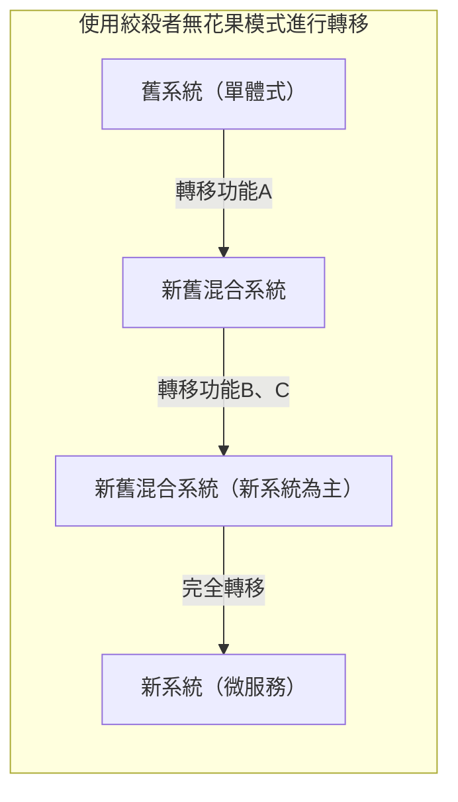
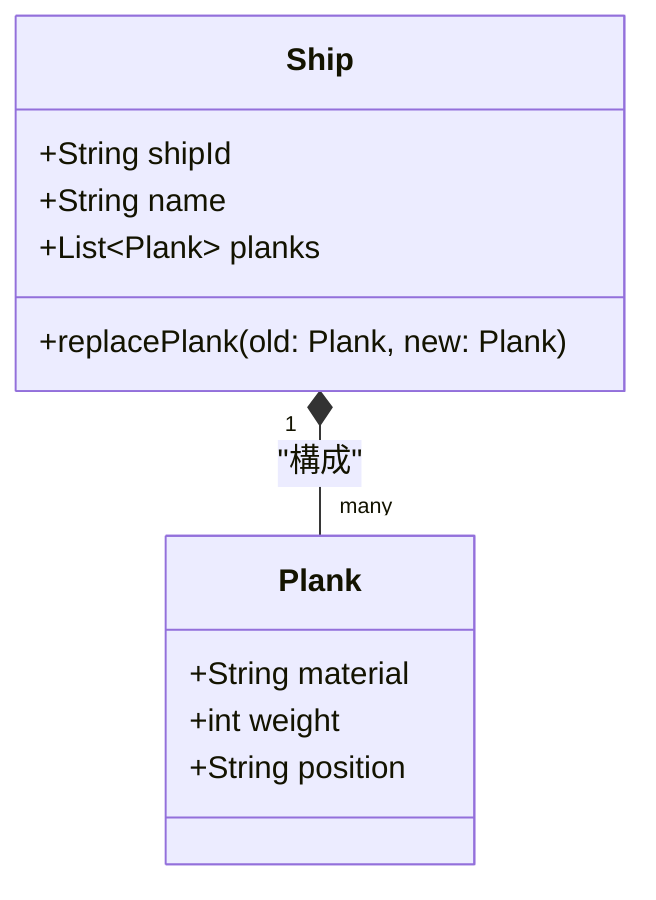
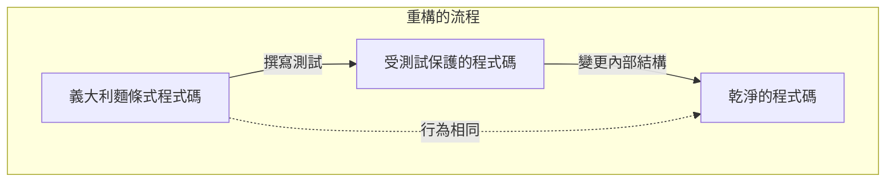
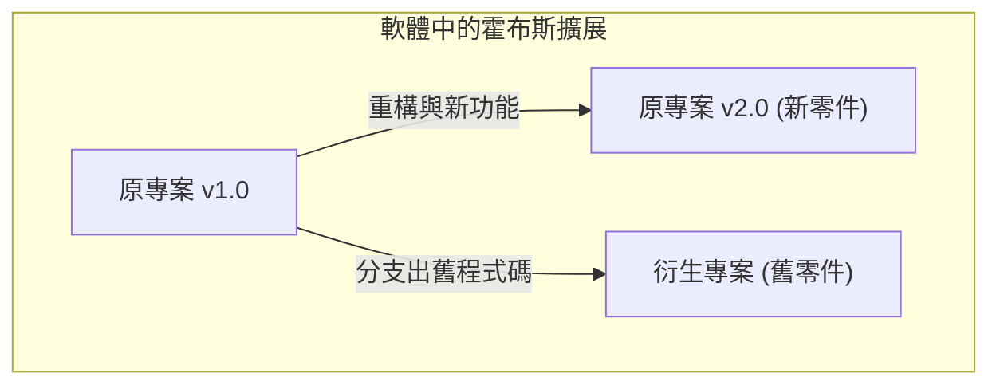

大家好。大家是否聽過 **[忒修斯之船](https://kenji.blog/p/ship-of-theseus/)** 這個悖論（思想實驗）呢？

希臘神話中登場的英雄忒修斯所搭乘的船，被後人當作紀念物保存了下來。然而，因為是木造船，隨著時間推移出現了腐朽的零件。人們將腐朽的木材替換為新木材，持續修復這艘船。漫長的歲月過去，終於變成 **原來船上的零件一個也不剩的狀態** 。

這時產生了一個疑問。

「所有零件都被替換過的這艘船，究竟還能不能說是 **原本的[忒修斯之船](https://kenji.blog/p/ship-of-theseus/)** 呢？」

這個思想實驗，自古以來就在哲學上作為探問何謂「同一性（Identity）」的問題被廣泛討論。而令人驚訝的是，這個問題在現代的 **軟體工程** 與 **系統開發** 中，也是日常會面臨的主題。

本篇文章，將以這個 **[忒修斯之船](https://kenji.blog/p/ship-of-theseus/)** 的悖論作為出發點，深入探討軟體開發中的重構、遺留系統的轉移，以及物件導向中的「同一性」。

## 1. 軟體中的「[忒修斯之船](https://kenji.blog/p/ship-of-theseus/)」

在現代的軟體開發中，一旦發布的系統完全不被修改而持續運作的情況是很少見的。追加商業需求、修正 Bug、改善效能，或者是基礎技術的更新等，程式碼會因為各種原因持續被改寫。

這就如同將腐朽的木材替換為新木材一般，舊的模組會逐漸被新的模組所替換。

### 絞殺者無花果模式（Strangler Fig Pattern）

系統替換中具代表性的架構模式之一就是 **絞殺者無花果模式** 。這不是將巨大且複雜的遺留系統（單體式架構）一次性全部替換，而是將功能一點一滴轉移到新系統（例如微服務）的手法。

當這個流程完成時，使用者所存取系統的內部結構已經變成 **完全不同的東西** 。舊的程式碼可能一行都不剩。然而，對使用者來說，它還是「平常使用的服務」，URL 和品牌名稱都沒有改變。

這簡直就是 **[忒修斯之船](https://kenji.blog/p/ship-of-theseus/)** 本身。即使構成系統的元件（零件）全部替換，系統整體的「同一性」仍被視為有維持住。

## 2. 物件導向程式設計中的「同一性」

若在程式碼層級思考「同一性」，關聯最深的就是 **物件導向程式設計（OOP）** 的概念。在 OOP 中，為了判斷同一性，大致上存在兩個基準。

1. **參考的等價性（Reference Equality）** ：是否指向記憶體上的同一個位置（指標是否相同）
2. **值的等價性（Value Equality）** ：所保持的屬性（資料）是否全部相同

在[忒修斯之船](https://kenji.blog/p/ship-of-theseus/)中，主張「因為零件全部都換過了，所以是另一艘船」是偏向重視 **值的等價性** 的想法。另一方面，主張「因為歷史與社會的脈絡是連續的，所以是同一艘船」，可以說是接近某種 **參考的等價性** 。

### DDD（領域驅動設計）的「實體」與「值物件」

能完美解決這個問題的塑模手法，可以見於 Eric Evans 所提倡的 **領域驅動設計（DDD）** 中。在 DDD 裡，領域模型被分類為 **實體（Entity）** 與 **值物件（Value Object）** 。

- **實體（Entity）** ：即使屬性改變，依然保持同一性的物件。透過 ID（識別碼）來判斷同一性。
- **值物件（Value Object）** ：屬性本身決定同一性的物件。只要有一個屬性不同，那就是另一個物件。

將這套用在[忒修斯之船](https://kenji.blog/p/ship-of-theseus/)上，就能實現非常明確的塑模。

- **船（Ship）** 是 **實體** 
- **船的零件（Plank / 木材）** 是 **值物件** 

即使船的零件（值物件）腐朽而被替換為新的，船（實體）的 `shipId` 也不會改變。因此，在系統上會被視為 **完全相同的船** 來處理。

在軟體的世界裡，「同一性」不是由實體或狀態所決定，而是由設計者 **「在商業領域中，是否應該將其視為相同的東西來處理」** 這樣的意圖來定義。

## 3. 重構與行為的維持

談論軟體同一性時不可或缺的就是 **重構** 。
Martin Fowler 對重構的定義如下：

> 在保持軟體外部可見行為的前提下，為了使內部結構更容易理解與修改，而對內部結構進行變更。

在這裡「同一性」也是關鍵。即使大幅改寫了程式碼的內部結構（零件），只要 **外部可見的行為** 沒有改變，它就被視為「同一個系統」。

能確保這個「外部可見行為」的就是 **自動化測試** 。只要所有測試持續通過，無論內部的零件（方法、類別，甚至是整體架構）被替換多少次，這個軟體就像[忒修斯之船](https://kenji.blog/p/ship-of-theseus/)一樣，持續是「同一個東西」。

## 4. 專案團隊中的「[忒修斯之船](https://kenji.blog/p/ship-of-theseus/)」

不只是軟體系統本身，製作軟體的 **開發團隊** 也有可能成為[忒修斯之船](https://kenji.blog/p/ship-of-theseus/)。

在長期持續的專案中，初期成員會逐漸離開，並有新成員加入。幾年之後，成為一個完全沒有任何創始成員留下來的團隊，也是很常見的。

那麼，所有成員都替換過的團隊，還能說是與原本相同的團隊嗎？

這裡重要的一點是 **團隊的文化** 以及 **文件與默會知識的傳承** 。
即使成員替換，只要團隊整體的開發流程、程式碼規範、程式碼審查的標準，以及對產品的願景有被繼承下來，那這個團隊可以說是保持了同一性。

反過來說，如果沒有進行適當的入職培訓或文件化，隨著成員的替換，開發風格與品質標準變得完全不同，那就可以說變成了一個只有名字相同的 **完全不同的團隊** 了。

## 5. 霍布斯的擴展問題：用舊零件重新組裝的船

在[忒修斯之船](https://kenji.blog/p/ship-of-theseus/)的悖論中，有一個由哲學家托馬斯·霍布斯追加的著名擴展版。

> 如果有人把從船上拆下來的「腐朽的舊零件」全部收集起來，並用它們組裝成「另一艘船」，那麼哪一艘才是真正的[忒修斯之船](https://kenji.blog/p/ship-of-theseus/)呢？

一艘是「用新零件完全修復，持續停泊在港口的船」。
另一艘是「全由舊零件構成，位在其他地方的船」。

如果將這套用到軟體開發上，會發現與 **分支（Fork）** 或 **遺留系統的凍結（鹽漬）** 這些現象驚人地相似。

### 開源軟體與分支

在開源軟體（OSS）的世界中，有時會因為專案方向性的分歧，導致原始碼發生分支（Fork）。

例如，某個專案（原本的船）逐漸轉移到新的架構（新零件）時，一部分反對這個變化的社群，可能會以轉移前的舊原始碼（舊零件）為基礎，啟動一個新的專案。

有名的例子包含了 MySQL 與 MariaDB，或者是 Node.js 與 io.js 等關係。在這種情況下，雖然商標權（名稱）這類的法律同一性是由原本的船所持有，但也可以主張繼承了舊哲學與設計思想（舊零件）的，其實是被分支（Fork）出來的那艘船。

到底哪一個才是「真正的」，已經不再是物理上的同一性問題，而是轉變成了 **社群的共識** 或 **品牌認知** 等社會性的問題。軟體中的「同一性」，超越了程式碼這個物質的框架，存在於人們的認知之中。

## 6. 在什麼時間點會變成「另一個系統」？

那麼，軟體在什麼時候會停止作為「同一個系統」呢？

只要還在持續替換零件（重構或轉移），它就是同一個系統，但可以認為在以下這些時間點，它會明確地脫胎換骨成為 **另一個系統** 。

1. **系統存在的目的（商業領域）改變時** 
2. **主要的使用者介面或體驗（UX）被非連續性地徹底翻新時** 
3. **作為實體根基的 ID 體系被重置時** 

例如，一個原本供公司內部使用的小型任務管理工具，經過轉型（Pivot）變成了面向全球的通用聊天工具。即使流用了大部分的程式碼庫（重新利用零件），這已經可以說是「另一艘船」了。

比起物理零件（原始碼）的連續性， **它是為了什麼而存在、提供價值給誰** 這個抽象的概念，才是決定軟體中「船的同一性」的關鍵。

## 7. 總結：持續改變本身就是同一性

希臘哲學的「[忒修斯之船](https://kenji.blog/p/ship-of-theseus/)」，告訴了我們如果從物理實體中尋求同一性，就會產生矛盾。

在軟體的世界裡，程式碼這個物理實體（位元組陣列）是極度流動的。倒不如說， **持續改變** 本身，才是軟體能夠生存並持續提供價值的必要條件。

全部都被改寫過的系統。它毫無疑問是 **原來的系統** ，但同時也是一個 **全新的系統** 。

我們開發並維護軟體這件事，就等同於參與這艘壯麗的[忒修斯之船](https://kenji.blog/p/ship-of-theseus/)的維護工作。將零件一個個替換為更好的東西，同時將注入系統中的「目的」與「價值」這份同一性，運送向未來。

下次當你進行遺留程式碼的重構時，請務必回想一下。你現在，正在為歷史悠久的[忒修斯之船](https://kenji.blog/p/ship-of-theseus/)，更新重要的一塊碎片。
