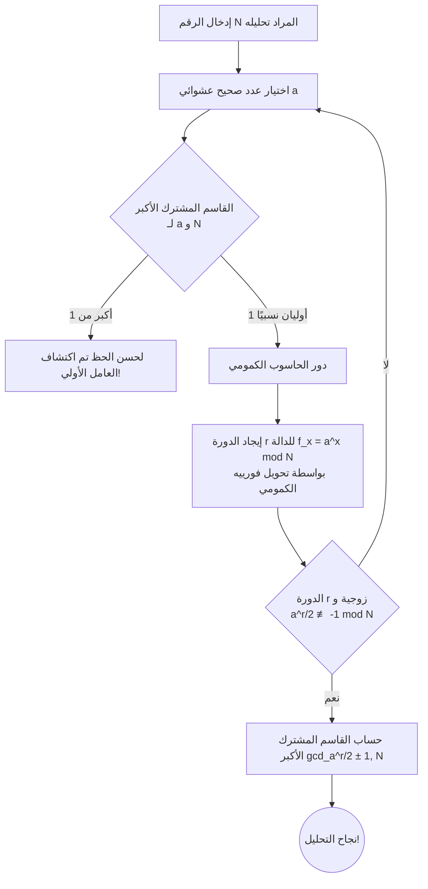

## مقدمة: تقاطع التشفير والحواسيب الكمومية

في مجتمع الإنترنت الحديث، "تشفير المفتاح العام" هو الأساس لحماية سرية الاتصالات. وأبرزها "تشفير RSA" الذي طوره كل من رون ريفست (Ron Rivest)، آدي شامير (Adi Shamir)، وليونارد أدلمان (Leonard Adleman) في عام 1977. من مدفوعات التسوق عبر الإنترنت التي نستخدمها يوميًا، إلى تصفح مواقع الويب (HTTPS)، وإرسال واستقبال رسائل البريد الإلكتروني، يعمل تشفير RSA كقلب البنية التحتية للإنترنت.

ولكن، مع ظهور "الحواسيب الكمومية"، تمت الإشارة إلى احتمال أن هذا الأمان قد يُدمر من جذوره. في وسائل الإعلام، تظهر أحيانًا عناوين مثيرة مثل "بمجرد اكتمال الحاسوب الكمومي، سيتم فك تشفير جميع كلمات المرور والتشفيرات في العالم في ثوانٍ". هل هذا صحيح حقًا؟

في هذه المقالة، سنتعمق في آليات GNFS (منخل حقل الأعداد العام) كطريقة فك تشفير كلاسيكية، والنسخة النهائية لخوارزمية فك التشفير باستخدام الحواسيب الكمومية، وهي "خوارزمية شور" (Shor's Algorithm). سنشرح المفاهيم المتقدمة مثل تحويل فورييه الكمومي واكتشاف الدورة بطريقة سهلة الفهم، وسنحقق بالتفصيل في الوضع الحالي للأجهزة الكمومية في عصر NISQ (Noisy Intermediate-Scale Quantum) والعقبات الحقيقية لكسر RSA-2048.

---

## أساس تشفير RSA: صعوبة التحليل إلى العوامل الأولية

يعتمد أمان تشفير RSA على عدم تناسق بسيط للغاية في الرياضيات. وهي حقيقة أنه "من السهل ضرب عددين أوليين ضخمين، ولكن من الصعب للغاية العثور على العددين الأوليين الأصليين (التحليل إلى عوامل أولية) من النتيجة المضروبة (الرقم المركب)".

على سبيل المثال، لنفترض أن لدينا عددين أوليين $ p = 61 $ و $ q = 53 $. حساب الضرب $ N = p \times q = 3233 $ يستغرق لحظة. ومع ذلك، إذا أُعطيت الرقم "3233" فقط وطُلب منك "ما هما العددان الأوليان اللذان مضروبهما يساوي هذا الرقم؟"، سيزداد حجم الحساب بشكل انفجاري كلما كبر الرقم.

في RSA-2048 السائد حاليًا، يتم استخدام رقم مركب ضخم $ N $ بطول مفتاح 2048 بت، أي حوالي 617 رقمًا عشريًا. إذا أمكن تحليل $ N $ هذا إلى عوامله الأولية، فسيكون التشفير قد تم كسره.

### تحدي الحواسيب الكلاسيكية: GNFS (منخل حقل الأعداد العام)

لحل مشكلة التحليل إلى العوامل، طور علماء الرياضيات والتشفير خوارزميات مختلفة على مر السنين. من بينها، أسرع خوارزمية للحواسيب الكلاسيكية حاليًا هي ** منخل حقل الأعداد العام (GNFS: General Number Field Sieve) **.

GNFS هي طريقة لتحليل عدد ضخم $ N $ عن طريق توسيع الحسابات في حلقة الأعداد الصحيحة إلى حقل جبري أكثر تجريدًا (Number Field). التدفق العام كالتالي:

1. ** اختيار متعددة الحدود **: ابحث عن متعددة حدود $ f(x) $ بدرجة ومعاملات مناسبة، بحيث يكون $ N $ جذرًا لها.
2. ** جمع البيانات (الغربلة) **: ابحث عن عدد كبير من أزواج الأرقام التي يمكن تقسيمها إلى أعداد أولية صغيرة (أرقام سلسة، Smooth numbers) فوق حقل الأعداد المنطقية والحقول الجبرية. تُعرف هذه العملية بـ "الغربلة" وهي الجزء الذي يستغرق وقتًا أطول.
3. ** توليد المصفوفة وتقليلها **: قم بإنشاء مصفوفة متناثرة ضخمة (مصفوفة معظم عناصرها 0) بناءً على العلاقات المجمعة، واعثر على الحل باستخدام طرق الجبر الخطي (مثل طريقة بلوك-لانكزوس).
4. ** حساب الجذر التربيعي **: أخيرًا، احسب الجذر التربيعي على الحقل الجبري، واستخرج عوامل (العوامل الأولية) $ N $.

يُقدّر تعقيد الحساب لـ GNFS بشكل غير تقاربي بـ $ O(\exp((\sqrt[3]{\frac{64}{9}} + o(1)) (\log N)^{\frac{1}{3}} (\log \log N)^{\frac{2}{3}})) $. يُسمى هذا تعقيد الوقت "شبه الأسي" (Sub-exponential). على الرغم من أنه أسرع من الوقت الأسي، إلا أنه أبطأ بكثير من الوقت متعدد الحدود (Polynomial time).

في الواقع، في عام 2020، نجح فريق بحث دولي في تحليل RSA-250 (رقم مركب من 829 بت، 250 رقمًا) باستخدام GNFS. استغرق هذا الحساب وقتًا هائلاً يقدر بحوالي 2700 سنة أساسية (CPU core years) بجمع موارد الحوسبة من جميع أنحاء العالم. ومع ذلك، عندما يتعلق الأمر بـ 2048 بت، يُقال إن الحساب المطلوب سيتضخم إلى تريليونات من أضعاف عمر الكون، وبغض النظر عن عدد أجهزة الكمبيوتر العملاقة الحالية التي تعمل بالتوازي، فمن المستحيل كسرها في وقت واقعي باستخدام الطرق الكلاسيكية.

---

## ورقة الحواسيب الكمومية الرابحة: خوارزمية شور

هنا تبرز "خوارزمية شور"، التي نشرها بيتر شور (Peter Shor) في عام 1994. كانت هذه الخوارزمية رائدة لأنها يمكن أن تحل مشكلة التحليل إلى العوامل الأولية على حاسوب كمومي في ** وقت متعدد الحدود ** ( $ O((\log N)^3) $ ). الفرق بين الوقت شبه الأسي والوقت متعدد الحدود حاسم، ومن الناحية النظرية، يعني ذلك أن استخدام الحواسيب الكمومية سيدمر تشفير RSA تمامًا.

### التدفق العام لخوارزمية شور

لا تحل خوارزمية شور مشكلة التحليل بشكل مباشر، بل تتخذ نهجًا يستخدم نظريات نظرية الأعداد لتحويلها إلى مشكلة أخرى تسمى "مشكلة اكتشاف الدورة" (Period Finding Problem)، ثم تحلها بسرعة باستخدام خصائص الحواسيب الكمومية.

### الخطوة 1: التحويل من التحليل إلى مشكلة اكتشاف الدورة (المعالجة الكلاسيكية)

تتم الخطوة الأولى من الخوارزمية على حاسوب كلاسيكي.
بالنسبة للرقم $ N $ الذي تريد تحليله، اختر رقمًا صحيحًا عشوائيًا $ a $ ($ 1 < a < N $) يكون أوليًا نسبيًا مع $ N $ (القاسم المشترك الأكبر هو 1). إذا حدث صدفة ألا يكون القاسم المشترك الأكبر 1، فإن القاسم المشترك الموجود هو العامل الأولي لـ $ N $ ويكتمل التشفير، لكن الاحتمال منخفض للغاية.

بعد ذلك، نعتبر تسلسل المعادلة المعيارية التالية:
$ f(x) = a^x \pmod N $

عند تعويض $ x = 1, 2, 3, \dots $ في هذه الدالة $ f(x) $، تبدو القيم عشوائية، ولكن لأن الحساب يتم ضمن نطاق محدود، فإنها ستعود بالتأكيد إلى القيمة الأصلية في مكان ما، وتكرر نفس التسلسل. تُسمى فترة هذا التكرار بـ $ r $. بمعنى آخر،
$ a^r \equiv 1 \pmod N $
مشكلة العثور على أصغر عدد صحيح موجب $ r $ يلبي هذه المعادلة هي "مشكلة اكتشاف الدورة".

إذا تم العثور على هذه الدورة $ r $ وكانت $ r $ عددًا زوجيًا، فإن $ a^r - 1 \equiv 0 \pmod N $، وبواسطة صيغة التحليل
$ (a^{r/2} - 1)(a^{r/2} + 1) \equiv 0 \pmod N $
يمكن تحويلها. من هنا، باستخدام خوارزمية إقليدس لحساب القاسم المشترك الأكبر لـ $ N $ و $ a^{r/2} \pm 1 $، يمكن الحصول على العوامل الأولية لـ $ N $ باحتمالية عالية جدًا.

العثور على الدورة $ r $ باستخدام حاسوب كلاسيكي يتطلب في النهاية خطوات أسية ولا يمكن تسريعه. ولكن مع الحاسوب الكمومي، يمكن العثور على الدورة $ r $ في لحظة (في وقت متعدد الحدود).

### الخطوة 2: تحضير الحالة الكمومية والتراكب

من هنا يبدأ دور الحاسوب الكمومي.
تستخدم الحواسيب الكمومية "الكيوبتات" (Qubits) التي يمكن أن تمتلك حالتي "0" و "1" في نفس الوقت. في خوارزمية شور، يتم إعداد سجلين: سجل لتخزين المدخلات (السجل الأول) وسجل لتخزين نتائج الحساب (السجل الثاني).

أولاً، نطبق عملية بوابة كمومية تسمى بوابة هادامارد (Hadamard gate) على جميع الكيوبتات في السجل الأول. نتيجة لذلك، يصبح السجل الأول في ** حالة تراكب متساوية ** لجميع قيم $ x $ الممكنة (من $ 0 $ إلى $ 2^n-1 $. حيث $ n $ هو عدد كبير كافٍ من البتات).

بمعنى آخر، داخل الحاسوب الكمومي، يتم إنشاء حالة تتواجد فيها عدد لا يحصى من قيم الإدخال $ x=0, 1, 2, 3, \dots $ في نفس الوقت والتوازي.

### الخطوة 3: الأس المعياري الكمومي (Quantum Modular Exponentiation)

بعد ذلك، باستخدام حالة التراكب في السجل الأول كمدخل، يتم حساب $ f(x) = a^x \pmod N $ ويتم تخزين النتيجة في السجل الثاني.
نظرًا لأن هذا الحساب يتم كتحويل وحدوي (Unitary transformation) على الدائرة الكمومية، يتم حساب $ f(x) $ لجميع قيم $ x $ "في وقت واحد (التوازي الكمومي)" مع الحفاظ على التراكب.

مساحة النظام الكمومي بأكمله في هذه المرحلة هي،
$ |x, a^x \bmod N\rangle $
تراكب هائل للحالات.

ولكن، إذا قمنا ببساطة بقياس (رصد) السجل الثاني هنا، فسيتم اختيار قيمة واحدة عشوائية لـ $ a^x \bmod N $ احتماليًا، وبشكل متصل، سيتم تحديد $ x $ السجل الأول أيضًا بقيمة واحدة. هذا يعادل الحساب مرة واحدة على حاسوب كلاسيكي، ولن نتمكن من العثور على الدورة $ r $.

وفقًا لقواعد ميكانيكا الكم، لا يمكننا النظر مباشرة داخل حالة التراكب. إذن، كيف نستخرج المعلومات العالمية المتمثلة في "الدورة" الشاملة؟

### الخطوة 4: تحويل فورييه الكمومي (QFT: Quantum Fourier Transform)

الجوهر الحقيقي لخوارزمية شور لاختراق هذا الجدار هو تطبيق ** تحويل فورييه الكمومي (QFT) ** على السجل الأول.

قبل إجراء القياس، نقوم بتحليل الخصائص الموجية للدالة $ f(x) $. لنفترض أننا رصدنا السجل الثاني. وحصلنا على قيمة معينة $ y $. عندئذٍ، ستتقلص حالة السجل الأول إلى "تراكب لجميع قيم $ x $ بحيث يكون $ a^x \pmod N = y $".
ستصطف قيم $ x $ هذه بشكل منفصل بفترات دورية $ r $ مثل $ x_0, x_0 + r, x_0 + 2r, x_0 + 3r, \dots $ (نوع من التوزيع الاحتمالي على شكل مشط).

نطبق تحويل فورييه الكمومي (QFT) على هذه الحالة. كما يحول تحويل فورييه المنفصل الكلاسيكي الإشارات في المجال الزمني إلى مجال التردد، يتسبب QFT في حدوث تداخل في السعات الاحتمالية للحالة الكمومية.

عند تطبيق QFT، بسبب تأثيرات التداخل الكمومي، تلغي احتمالات الإجابات الخاطئة التي لا يتردد صداها مع الدورة $ r $ (تكون الأطوار غير متوافقة) بعضها البعض وتقترب من الصفر (تداخل هدام)، بينما يتم تضخيم احتمال الإجابة الصحيحة فقط التي تحمل معلومات الدورة $ r $ (تداخل بناء).

### الخطوة 5: القياس وتوسيع الكسر المستمر (المعالجة الكلاسيكية البعدية)

عند قياس السجل الأول بعد تطبيق QFT، سنحصل باحتمالية عالية جدًا على عدد صحيح $ c $ قريب من الصيغة $ c \approx \frac{j \cdot 2^n}{r} $ ($ j $ عدد صحيح غير معروف، $ 2^n $ هو حجم السجل).

نعيد نتيجة القياس هذه $ c $ إلى حاسوب كلاسيكي، وننشئ الكسر $ \frac{c}{2^n} \approx \frac{j}{r} $. ثم باستخدام الطريقة الرياضية "توسيع الكسر المستمر" (Continued fraction expansion) لحساب التقريب، يمكننا استخراج القاسم، وهو الدورة $ r $ بنجاح.

إذا عرفنا $ r $، نستخدم صيغة الخطوة 1 لحساب عوامل $ N $، وبذلك يتم كسر تشفير RSA تمامًا.

---

## القدرة الحالية للحواسيب الكمومية (NISQ) والتحديات

على الرغم من أن خوارزمية شور مثالية نظريًا، إلا أن الإجابة على سؤال "هل سيتم كسر تشفير RSA غدًا؟" هي "لا" بوضوح. يكمن السبب في حدود تكنولوجيا الأجهزة للحواسيب الكمومية الحالية.

### عصر NISQ (Noisy Intermediate-Scale Quantum)

الزمن الذي نعيش فيه الآن هو عصر يسمى "NISQ". تمتلك أجهزة NISQ العشرات إلى المئات من الكيوبتات المادية، لكنها ضعيفة للغاية أمام الضوضاء.

الكيوبتات عرضة لتأثيرات البيئة الخارجية مثل الحرارة والموجات الكهرومغناطيسية، وكثيراً ما يحدث "فك الترابط" (فقدان التشابك الكمومي) حيث تنهار الحالة الكمومية، و "أخطاء البوابات" أثناء عمليات البوابات. عند محاولة تنفيذ دوائر كمومية عميقة جدًا (مع عدد هائل من خطوات العمليات) مثل خوارزمية شور، تتراكم الأخطاء أثناء الحساب، ويصبح الناتج النهائي مجرد ضوضاء عشوائية لا معنى لها.

### الكيوبتات المادية والكيوبتات المنطقية

لحل مشكلة الخطأ هذه، لا غنى عن "تصحيح الخطأ الكمومي" (Quantum Error Correction).
تُستخدم أكواد تصحيح الأخطاء في الحواسيب الكلاسيكية أيضًا، ولكن نظرًا لوجود "نظرية عدم الاستنساخ الكمومي" التي تمنع نسخ الحالات الكمومية، فإن تصحيح الأخطاء الكمومية معقد للغاية.

في تصحيح الخطأ الكمومي، باستخدام تقنيات مثل "الكود السطحي" (Surface Code)، من خلال دمج العديد من "الكيوبتات المادية" المليئة بالضوضاء، يتم إنشاء "كيوبت منطقي" واحد مثالي خالٍ من الأخطاء.

بافتراض معدلات الخطأ الحالية، يُقدر أن هناك حاجة إلى ما بين 1000 إلى 10000 كيوبت مادي لإنشاء كيوبت منطقي واحد. يُطلق على هذا اسم "عبء تصحيح الخطأ" (Overhead).

### ما هي الموارد المطلوبة لكسر RSA-2048؟

إذن، لتشغيل خوارزمية شور لكسر RSA-2048 فعليًا، ما مقدار الموارد المطلوبة؟

وفقًا للتقدير المرجعي للموارد في ورقة عام 2021 التي قدمها كريج جيدني (Craig Gidney) (جوجل) ومارتن إكيرا (Martin Ekerå)، عند استخدام خوارزمية شور المُحسّنة وإجراء تصحيح الأخطاء باستخدام الكود السطحي، ستكون هناك حاجة للموارد التالية:

* ** عدد الكيوبتات المنطقية **: حوالي 4,096
* ** عدد الكيوبتات المادية **: ** حوالي 20 مليون ** (بافتراض معدل خطأ بنسبة $10^{-3}$)
* ** وقت الحساب **: حوالي 8 ساعات (ملايين إلى مليارات عمليات البوابات المادية مطلوبة)

بالمقارنة مع هذا، ما هو المستوى الذي وصلت إليه الأجهزة الكمومية الحالية؟
يبلغ المعالج الكمومي فائق التوصيل "Condor" الذي أعلنت عنه شركة IBM في أواخر عام 2023 حوالي 1,121 كيوبت. ظهرت أيضًا أبحاث رائدة في توليد الكيوبتات المنطقية (مثل توليد 48 كيوبتًا منطقيًا باستخدام حاسوب كمومي للذرات المتعادلة بواسطة جامعة هارفارد وشركة QuEra)، لكننا لم نصل بعد إلى مرحلة يمكن فيها تشغيل "عمليات مثالية بدون ضوضاء" بشكل مستمر لفترات طويلة.

لتوسيع النطاق من بضعة آلاف من الكيوبتات المادية إلى ** 20 مليون ** كيوبت مادي عملي (نظام متصل ببعضه البعض، يعمل باستقرار في درجات حرارة منخفضة للغاية، ويعالج إشارات التحكم بسرعة فائقة)، توجد حواجز هندسية هائلة (مشاكل الأسلاك، قيود قدرة التبريد، تضخم إلكترونيات التحكم). يتوقع العديد من الخبراء أن الأمر سيستغرق ما لا يقل عن 10 إلى 30 عامًا، أو ربما أكثر، لتحقيق "حاسوب كمومي متسامح مع الأخطاء (FTQC)" قادر على فك تشفير RSA-2048.

---

## تهديد "Store Now, Decrypt Later" الخفي وفجر PQC

من السابق لأوانه الاعتقاد أنه "نحن في أمان لأن الأمر سيستغرق أكثر من 10 سنوات". يوجد حاليًا بيانات مثل أسرار الدولة، البيانات الطبية، وتصميم البنية التحتية طويلة الأمد التي يجب ضمان سريتها لعقود قادمة.

ما يُثير القلق هنا هو تقنية الهجوم ** "Store Now, Decrypt Later" (احفظ الآن، فك التشفير لاحقًا) **. تقوم دول أو منظمات خبيثة باعتراض جميع بيانات الاتصال المشفرة حاليًا بـ RSA أو ECC (تشفير المنحنى الإهليلجي) وتخزينها في مساحة التخزين. ثم بعد 10 أو 20 عامًا، بمجرد اكتمال حاسوب كمومي قوي، يستخدمون خوارزمية شور لفك تشفير جميع البيانات السابقة وكشف الأسرار.

لمواجهة تهديد الفجوة الزمنية هذا، وبقيادة NIST (المعهد الوطني للمعايير والتكنولوجيا الأمريكي)، تم تسريع عملية توحيد معايير ** "التشفير ما بعد الكمي" (PQC: Post-Quantum Cryptography) **.

PQC هي خوارزميات تشفير جديدة تستند إلى مسائل رياضية يصعب حلها حتى باستخدام الحواسيب الكمومية (بمعنى آخر، لا يمكن تطبيق خوارزمية شور عليها). تشمل الأساليب الرئيسية ما يلي:

* ** التشفير القائم على الشبكة (Lattice-based cryptography) **: يعتمد على مشاكل مثل LWE (التعلم مع الأخطاء). هو السائد في توحيد معايير NIST (مثل Kyber، Dilithium).
* ** التشفير القائم على الرمز (Code-based cryptography) **: يعتمد على صعوبة مشكلة فك تشفير أكواد تصحيح الأخطاء.
* ** التشفير متعدد الحدود متعدد المتغيرات (Multivariate cryptography) **: يعتمد على صعوبة حل أنظمة المعادلات التربيعية متعددة المتغيرات.
* ** التوقيعات القائمة على التجزئة (Hash-based signatures) **: توقيعات رقمية تعتمد فقط على أمان دوال التجزئة.

بدأ بالفعل اختبار إدخال وتنفيذ هجين لـ PQC في البرامج والمنصات الرئيسية مثل Google Chrome و Apple iMessage.

## おわりに

تنتقل الحواسيب الكمومية من حلم في عالم الخيال العلمي إلى تحدٍ هندسي في العالم الحقيقي. تعتبر خوارزمية شور إنجازًا فكريًا عظيمًا للبشرية يدمج بين الرياضيات وميكانيكا الكم، ولكنها في الوقت نفسه تحمل "قوة تدميرية" تهز أساس مجتمعنا الرقمي.

لن يصبح تشفير RSA غير صالح للاستخدام غدًا. ولكن بالنظر إلى تطور التكنولوجيا الكمومية ومخاطر "Store Now, Decrypt Later"، فإن الهجرة واسعة النطاق في تاريخ التشفير والمتمثلة في الانتقال إلى PQC قد بدأت بالفعل. نحن نشهد الآن الخطوط الأمامية لتغيير جذري في أمن المعلومات.
