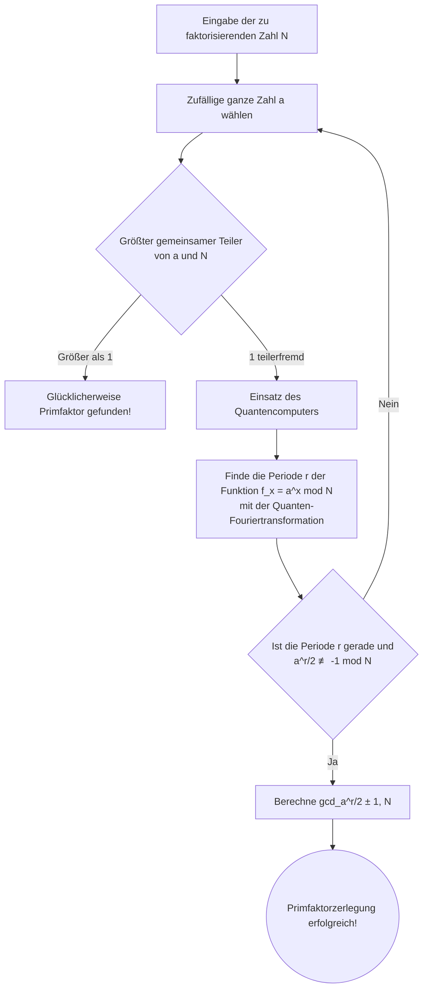

## Einleitung: Die Schnittstelle von Kryptographie und Quantencomputern

In der modernen Internetgesellschaft ist die "Public-Key-Kryptographie" die Grundlage für den Schutz des Kommunikationsgeheimnisses. Ein prominentes Beispiel ist die "RSA-Verschlüsselung", die 1977 von Ron Rivest, Adi Shamir und Leonard Adleman entwickelt wurde. Von Online-Shopping-Zahlungen, die wir täglich nutzen, über das Surfen auf Websites (HTTPS) bis hin zum Senden und Empfangen von E-Mails fungiert die RSA-Verschlüsselung als Herzstück der Internet-Infrastruktur.

Jedoch wurde darauf hingewiesen, dass die Sicherheit durch das Aufkommen von "Quantencomputern" grundlegend untergraben werden könnte. In den Medien finden sich manchmal aufsehenerregende Schlagzeilen wie "Wenn der Quantencomputer fertiggestellt ist, werden alle Passwörter und Verschlüsselungen der Welt in Sekunden geknackt". Ist das wirklich wahr?

In diesem Artikel werden wir tief in die Mechanismen der GNFS (General Number Field Sieve), einer klassischen kryptoanalytischen Methode, und des "Shor-Algorithmus (Shor's Algorithm)", des ultimativen kryptoanalytischen Algorithmus unter Verwendung eines Quantencomputers, eintauchen. Wir werden fortgeschrittene Konzepte wie die Quanten-Fouriertransformation und das Finden von Perioden leicht verständlich erklären und den aktuellen Stand der Quantenhardware in der derzeitigen NISQ-Ära (Noisy Intermediate-Scale Quantum) sowie die tatsächlichen Hürden zur Knackung von RSA-2048 detailliert untersuchen.

---

## Die Grundlage der RSA-Verschlüsselung: Die Schwierigkeit der Primfaktorzerlegung

Die Sicherheit der RSA-Verschlüsselung beruht auf einer extrem einfachen Asymmetrie in der Mathematik. Es ist die Tatsache, dass "es einfach ist, zwei riesige Primzahlen miteinander zu multiplizieren, aber extrem schwierig ist, die ursprünglichen zwei Primzahlen aus dem Ergebnis dieser Multiplikation (zusammengesetzte Zahl) zu finden (Primfaktorzerlegung)".

Angenommen, wir haben zwei Primzahlen $ p = 61 $ und $ q = 53 $. Diese Multiplikation $ N = p \times q = 3233 $ ist in einem Augenblick berechnet. Wenn uns jedoch nur die Zahl "3233" gegeben wird und wir lösen sollen: "Welche Primzahlen wurden hier multipliziert?", explodiert die Rechenkomplexität, je größer die Zahlen werden.

Beim derzeit dominierenden RSA-2048 wird eine riesige zusammengesetzte Zahl $ N $ mit einer Schlüssellänge von 2048 Bits verwendet, was etwa 617 Dezimalstellen entspricht. Wenn dieses $ N $ in Primfaktoren zerlegt werden kann, gilt die Verschlüsselung als geknackt.

### Die Herausforderung durch klassische Computer: GNFS (General Number Field Sieve)

Um das Problem der Primfaktorzerlegung zu lösen, haben Mathematiker und Kryptographen über viele Jahre verschiedene Algorithmen entwickelt. Unter ihnen gilt die ** General Number Field Sieve (GNFS) ** als die derzeit schnellste Methode für klassische Computer.

GNFS ist eine Methode zur Primfaktorzerlegung einer riesigen Zahl $ N $, indem die Berechnungen im Ring der ganzen Zahlen auf einen abstrakteren algebraischen Zahlkörper (Number Field) erweitert und analysiert werden. Der grobe Ablauf ist wie folgt:

1. ** Auswahl des Polynoms ** : Finden eines Polynoms $ f(x) $ mit geeignetem Grad und Koeffizienten, das $ N $ als Wurzel hat.
2. ** Datensammlung (Sieben) ** : Suche nach einer großen Anzahl von Zahlenpaaren über den rationalen Zahlen und dem algebraischen Zahlkörper, die sich in kleine Primzahlen (glatte Zahlen, Smooth numbers) zerlegen lassen. Dieser Prozess wird als "Sieben" bezeichnet und ist der zeitaufwändigste Teil.
3. ** Matrixerstellung und -reduktion ** : Erstellung einer riesigen dünnbesetzten Matrix (eine Matrix, deren Elemente meist 0 sind) basierend auf den gesammelten Beziehungen und Lösung unter Verwendung linearer algebraischer Methoden (wie dem Block-Lanczos-Verfahren).
4. ** Berechnung der Quadratwurzel ** : Schließlich Berechnung der Quadratwurzel über dem algebraischen Zahlkörper, um den Faktor (Primfaktor) von $ N $ abzuleiten.

Die Rechenkomplexität von GNFS wird asymptotisch mit $ O(\exp((\sqrt[3]{\frac{64}{9}} + o(1)) (\log N)^{\frac{1}{3}} (\log \log N)^{\frac{2}{3}})) $ bewertet. Dies wird als "subexponentielle" (Sub-exponential) Zeitkomplexität bezeichnet. Sie ist schneller als exponentielle Zeit, aber wesentlich langsamer als polynomiale Zeit (Polynomial time).

Tatsächlich gelang es einem internationalen Forschungsteam im Jahr 2020, RSA-250 (eine zusammengesetzte Zahl mit 829 Bits und 250 Stellen) mithilfe von GNFS erfolgreich zu faktorisieren. Für diese Berechnung wurden weltweit Rechenressourcen gebündelt und eine enorme Rechenzeit von etwa 2700 CPU-Kern-Jahren aufgewendet. Bei 2048 Bits würde die erforderliche Rechenmenge jedoch Billionen Mal länger dauern als das Alter des Universums, und es ist unmöglich, dies mit klassischen Methoden in realistischer Zeit zu knacken, egal wie viele aktuelle Supercomputer parallel betrieben werden.

---

## Der Trumpf des Quantencomputers: Shors Algorithmus

Hier kommt der 1994 von Peter Shor vorgestellte "Shor-Algorithmus" ins Spiel. Dieser Algorithmus war bahnbrechend, da er das Problem der Primfaktorzerlegung auf einem Quantencomputer in ** polynomialer Zeit ** ( $ O((\log N)^3) $ ) lösen kann. Der Unterschied zwischen subexponentieller Zeit und polynomialer Zeit ist entscheidend, und theoretisch bedeutet dies, dass die RSA-Verschlüsselung mit einem Quantencomputer vollständig gebrochen wird.

### Gesamtablauf von Shors Algorithmus

Shors Algorithmus löst das Problem der Primfaktorzerlegung nicht direkt, sondern verwendet zahlentheoretische Theoreme, um es in ein anderes Problem namens "Period Finding Problem" umzuwandeln, und löst es durch Ausnutzung der Eigenschaften von Quantencomputern mit hoher Geschwindigkeit.

### Schritt 1: Reduktion der Primfaktorzerlegung auf das Periodenfindungsproblem (Klassische Verarbeitung)

Der erste Schritt des Algorithmus wird auf einem klassischen Computer durchgeführt.
Für die zu faktorisierende Zahl $ N $ wählen wir eine zufällige ganze Zahl $ a $ ( $ 1 < a < N $ ), die teilerfremd zu $ N $ ist (der größte gemeinsame Teiler ist 1). Wenn durch Zufall der größte gemeinsame Teiler nicht 1 ist, ist der gefundene gemeinsame Teiler ein Primfaktor von $ N $ und die Entschlüsselung ist abgeschlossen, aber die Wahrscheinlichkeit ist extrem gering.

Als nächstes betrachten wir die Folge der folgenden modularen Gleichungen:
$ f(x) = a^x \pmod N $

Wenn wir $ x = 1, 2, 3, \dots $ in diese Funktion $ f(x) $ einsetzen, scheinen die Werte zufällig zu sein, aber da wir innerhalb eines endlichen Bereichs rechnen, kehrt sie an einem bestimmten Punkt immer zum ursprünglichen Wert zurück und wiederholt dieselbe Zahlenfolge. Wir nennen diese Wiederholungsperiode $ r $. Das bedeutet,
wir suchen die kleinste positive ganze Zahl $ r $, sodass
$ a^r \equiv 1 \pmod N $
gilt. Das ist das "Periodenfindungsproblem".

Wenn diese Periode $ r $ gefunden wird und $ r $ eine gerade Zahl ist, haben wir $ a^r - 1 \equiv 0 \pmod N $ und wir können die Faktorisierungsformel verwenden, um es wie folgt umzuwandeln:
$ (a^{r/2} - 1)(a^{r/2} + 1) \equiv 0 \pmod N $
Von hier aus können wir den euklidischen Algorithmus verwenden, um den größten gemeinsamen Teiler von $ N $ und $ a^{r/2} \pm 1 $ zu berechnen, was uns mit extrem hoher Wahrscheinlichkeit die Primfaktoren von $ N $ liefert.

Um die Periode $ r $ auf einem klassischen Computer zu finden, sind letztlich exponentiell viele Schritte erforderlich und können nicht beschleunigt werden. Ein Quantencomputer kann diese Periode $ r $ jedoch im Bruchteil einer Sekunde (in polynomialer Zeit) finden.

### Schritt 2: Vorbereitung des Quantenzustands und Superposition

Ab hier kommt der Quantencomputer ins Spiel.
Quantencomputer verwenden "Qubits", die die Zustände "0" und "1" gleichzeitig annehmen können. Bei Shors Algorithmus bereiten wir zwei Register vor: ein Register zum Speichern der Eingabe (das erste Register) und ein Register zum Speichern des Berechnungsergebnisses (das zweite Register).

Zuerst wird eine Quantengatteroperation, das sogenannte Hadamard-Gatter (Hadamard gate), auf alle Qubits im ersten Register angewendet. Dadurch gelangt das erste Register in einen ** gleichmäßigen Überlagerungszustand ** (Superposition) aller möglichen $ x $-Werte (von $ 0 $ bis $ 2^n-1 $ , wobei $ n $ eine ausreichend große Anzahl von Bits ist).

Das bedeutet, dass im Quantencomputer unzählige Eingabewerte $ x=0, 1, 2, 3, \dots $ gleichzeitig und parallel existieren.

### Schritt 3: Modulare Exponentiation auf dem Quantencomputer (Quantum Modular Exponentiation)

Als Nächstes berechnen wir $ f(x) = a^x \pmod N $, wobei der Überlagerungszustand des ersten Registers als Eingabe dient, und speichern das Ergebnis im zweiten Register.
Da diese Berechnung als unitäre Transformation in einem Quantenschaltkreis ausgeführt wird, wird die Berechnung von $ f(x) $ für alle $ x $ "simultan und parallel" (Quantenparallelität) ausgeführt, während die Überlagerung beibehalten wird.

Zu diesem Zeitpunkt ist der Raum des gesamten Quantensystems eine gewaltige Superposition der Zustände:
$ |x, a^x \bmod N\rangle $

Wenn wir jedoch einfach das zweite Register messen (beobachten), wird nur ein zufälliger Wert von $ a^x \bmod N $ probabilistisch ausgewählt, und in Verbindung damit ist auch der Wert $ x $ im ersten Register auf einen festgelegt. Das ist dasselbe wie eine einmalige Berechnung auf einem klassischen Computer, und wir können die Periode $ r $ nicht finden.

Nach den Regeln der Quantenmechanik können wir nicht direkt in den Überlagerungszustand schauen. Wie können wir also die globale Information extrahieren, die die "Periode" des Ganzen ist?

### Schritt 4: Quanten-Fouriertransformation (QFT: Quantum Fourier Transform)

Der geniale Durchbruch des Shor-Algorithmus zur Überwindung dieser Barriere ist die Anwendung der ** Quanten-Fouriertransformation (QFT) ** auf das erste Register.

Bevor wir eine Messung vornehmen, analysieren wir die Welleneigenschaften der Funktion $ f(x) $. Angenommen, wir beobachten das zweite Register. Angenommen, wir erhalten einen Wert $ y $. Dann kollabiert der Zustand des ersten Registers in "die Superposition aller $ x $, für die $ a^x \pmod N = y $ gilt".
Diese Werte von $ x $ werden ein diskret angeordneter Zustand (eine Art kammartige Wahrscheinlichkeitsamplitudenverteilung) in Intervallen der Periode $ r $ sein, wie $ x_0, x_0 + r, x_0 + 2r, x_0 + 3r, \dots $.

Wir wenden die Quanten-Fouriertransformation (QFT) auf diesen Zustand an. So wie die klassische diskrete Fouriertransformation ein Signal im Zeitbereich in den Frequenzbereich umwandelt, bewirkt die QFT eine Interferenz der Wahrscheinlichkeitsamplituden von Quantenzuständen.

Wenn die QFT angewendet wird, heben sich aufgrund des Quanteninterferenzeffekts die Wahrscheinlichkeiten falscher Antworten, die nicht mit der Periode $ r $ in Resonanz stehen (phasenverschoben sind), gegenseitig auf und nähern sich null (destruktive Interferenz), und nur die Wahrscheinlichkeit der richtigen Antwort, die Informationen über die Periode $ r $ enthält, wird verstärkt (konstruktive Interferenz).

### Schritt 5: Messung und Kettenbruchentwicklung (Klassische Nachbearbeitung)

Wenn wir das erste Register nach Anwendung der QFT messen, erhalten wir mit sehr hoher Wahrscheinlichkeit eine ganze Zahl $ c $, die nahe der Form $ c \approx \frac{j \cdot 2^n}{r} $ liegt (wobei $ j $ eine unbekannte ganze Zahl und $ 2^n $ die Größe des Registers ist).

Wir geben dieses Messergebnis $ c $ an den klassischen Computer zurück und bilden einen Bruch $ \frac{c}{2^n} \approx \frac{j}{r} $. Und durch die Berechnung von Näherungswerten mit einer mathematischen Methode namens "Kettenbruchentwicklung (Continued fraction expansion)" können wir die Periode $ r $, die im Nenner steht, wunderbar aufdecken.

Wenn $ r $ bekannt ist, können die Primfaktoren von $ N $ mithilfe der Formel aus Schritt 1 berechnet werden, und die RSA-Verschlüsselung wird vollständig geknackt.

---

## Das Potenzial und die Herausforderungen aktueller Quantencomputer (NISQ)

Obwohl der Shor-Algorithmus theoretisch perfekt ist, lautet die Antwort auf die Frage "Wird die RSA-Verschlüsselung morgen gebrochen sein?" eindeutig "Nein". Der Grund dafür liegt in den Grenzen der aktuellen Hardware-Technologie von Quantencomputern.

### Die Ära des NISQ (Noisy Intermediate-Scale Quantum)

Wir befinden uns derzeit in der Ära, die als "NISQ" bezeichnet wird. NISQ-Geräte haben Dutzende bis Hunderte von physikalischen Qubits, sind aber extrem anfällig für Rauschen.

Qubits werden leicht durch die äußere Umgebung, wie z.B. Wärme und elektromagnetische Wellen, beeinflusst, was häufig zu "Dekohärenz" (Verlust der Quantenverschränkung), bei der der Quantenzustand zerstört wird, und zu "Gatterfehlern" während der Gatteroperationen führt. Wenn man versucht, sehr tiefe Quantenschaltungen (mit einer riesigen Anzahl von Rechenschritten) wie Shors Algorithmus auszuführen, summieren sich Fehler während der Berechnung und die endgültige Ausgabe wird zu reinem Rauschen ohne Bedeutung.

### Physikalische Qubits und logische Qubits

Die "Quantenfehlerkorrektur (Quantum Error Correction)" ist unerlässlich, um dieses Fehlerproblem zu lösen.
Fehlerkorrekturcodes werden auch in klassischen Computern verwendet, aber Quantenfehlerkorrektur ist sehr komplex aufgrund des "No-Cloning-Theorems", das das Kopieren von Quantenzuständen verbietet.

Bei der Quantenfehlerkorrektur wird eine ideale "logische Qubit" ohne Fehler durch die Kombination vieler verrauschter "physikalischer Qubits" unter Verwendung von Technologien wie dem "Oberflächencode (Surface Code)" erzeugt.

Unter der Annahme der aktuellen Fehlerraten wird geschätzt, dass etwa 1.000 bis 10.000 physikalische Qubits erforderlich sind, um ein einziges logisches Qubit zu erzeugen. Dies wird als "Fehlerkorrektur-Overhead" bezeichnet.

### Welche Ressourcen werden benötigt, um RSA-2048 zu brechen?

Wie viele Ressourcen werden also tatsächlich benötigt, um den Shor-Algorithmus zur Knackung von RSA-2048 auszuführen?

Laut bahnbrechenden Ressourcenschätzungen aus einem Papier von Craig Gidney (Google) und Martin Ekerå aus dem Jahr 2021 werden die folgenden Ressourcen benötigt, wenn man einen optimierten Shor-Algorithmus verwendet und eine Fehlerkorrektur mit Oberflächencodes durchführt:

* ** Anzahl der logischen Qubits ** : Etwa 4.096
* ** Anzahl der physikalischen Qubits ** : ** Etwa 20 Millionen ** (unter Annahme einer Fehlerrate von etwa $10^{-3}$)
* ** Rechenzeit ** : Etwa 8 Stunden (erfordert Millionen bis Milliarden von physikalischen Gatteroperationen)

Wie weit ist im Vergleich dazu der aktuelle Stand der Quantenhardware?
Der Ende 2023 von IBM angekündigte supraleitende Quantenprozessor "Condor" hat 1.121 Qubits. Darüber hinaus haben bahnbrechende Forschungen zur Erzeugung logischer Qubits (wie die Erzeugung von 48 logischen Qubits unter Verwendung neutraler Atome durch die Harvard University und QuEra) das Licht der Welt erblickt, aber wir sind noch nicht an dem Punkt angelangt, an dem "rauschfreie, perfekte Berechnungen" kontinuierlich für lange Zeiträume ausgeführt werden können.

Die Skalierung von Tausenden physikalischen Qubits auf ** 20 Millionen ** praktikable physikalische Qubits (in einem System, das miteinander verbunden ist, bei kryogenen Temperaturen stabil arbeitet und Steuersignale bei ultrahohen Geschwindigkeiten verarbeitet) stellt eine gewaltige ingenieurtechnische Barriere dar (Verkabelungsprobleme, Grenzen der Kühlleistung und Aufblähen der Steuerelektronik). Viele Experten prognostizieren, dass es mindestens 10 bis 30 Jahre oder länger dauern wird, bis "fehlertolerante Quantencomputer (FTQC)" realisiert werden, die RSA-2048 knacken können.

---

## Die schleichende Bedrohung durch "Store Now, Decrypt Later" und die Morgendämmerung der PQC

Es ist jedoch voreilig zu denken, dass "wir sicher sind, wenn es noch mehr als 10 Jahre dauert". Derzeit gibt es Daten wie nationale Geheimnisse, medizinische Daten und langfristige Infrastrukturdesigns, deren Geheimhaltung für Jahrzehnte garantiert werden muss.

Die Besorgnis betrifft die Angriffsmethode ** "Store Now, Decrypt Later" ** . Böswillige Staaten oder Organisationen fangen alle mit aktueller RSA oder ECC (Elliptic Curve Cryptography) verschlüsselten Kommunikationsdaten ab und speichern sie. Wenn dann in 10 oder 20 Jahren leistungsstarke Quantencomputer fertiggestellt sind, nutzen sie den Shor-Algorithmus, um alle vergangenen Daten zu entschlüsseln und Geheimnisse zu lüften.

Um der Bedrohung durch diese zeitliche Verzögerung entgegenzuwirken, hat das NIST (National Institute of Standards and Technology) in den USA den Standardisierungsprozess für ** "Post-Quanten-Kryptographie (PQC)" ** rasch vorangetrieben.

PQC sind neue kryptographische Algorithmen, die auf mathematischen Problemen basieren, deren Entschlüsselung auch mit einem Quantencomputer schwierig ist (d. h. Shors Algorithmus kann nicht angewendet werden). Die Hauptansätze sind wie folgt:

* ** Gitterbasierte Kryptographie ** : Basiert auf dem LWE-Problem (Learning with Errors) usw. Der Mainstream in der NIST-Standardisierung (Kyber, Dilithium usw.).
* ** Codebasierte Kryptographie ** : Beruht auf der Schwierigkeit, Fehlerkorrekturcodes zu decodieren.
* ** Multivariate Kryptographie ** : Beruht auf der Schwierigkeit, Systeme von quadratischen Gleichungen mit mehreren Variablen zu lösen.
* ** Hash-basierte Signaturen ** : Digitale Signaturen, deren Sicherheit ausschließlich von Hash-Funktionen abhängt.

Bereits in großen Softwares und Plattformen wie Google Chrome und Apples iMessage haben PQC-Implementierungstests und Hybrid-Implementierungen begonnen.

## Fazit

Quantencomputer wandeln sich von Träumereien der Science-Fiction zu echten ingenieurtechnischen Herausforderungen. Shors Algorithmus ist eine großartige intellektuelle Errungenschaft der Menschheit, die Mathematik und Quantenmechanik vereint, aber er birgt auch die "zerstörerische Kraft", die Grundlagen unserer digitalen Gesellschaft zu erschüttern.

Die RSA-Verschlüsselung wird nicht schon morgen unbrauchbar sein. Angesichts der Entwicklung der Quantentechnologie und des Risikos von "Store Now, Decrypt Later" hat die gigantische Migration in der Geschichte der Kryptographie, der Übergang zu PQC, jedoch bereits begonnen. Wir sind heute Zeugen der vordersten Front eines Paradigmenwechsels in der Informationssicherheit.
