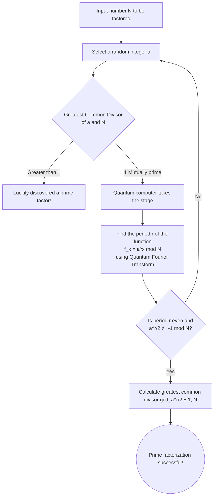

## Introduction: The Intersection of Cryptography and Quantum Computers

In modern Internet society, "public-key cryptography" is the foundation for protecting the secrecy of communications. A representative example of this is "RSA encryption," developed in 1977 by Ron Rivest, Adi Shamir, and Leonard Adleman. From online shopping payments we use every day to website browsing (HTTPS) and email transmission/reception, RSA encryption functions as the heart of the Internet infrastructure.

However, it has been pointed out that the advent of "quantum computers" could fundamentally overturn this security. Media outlets sometimes run sensational headlines like, "Once quantum computers are completed, passwords and codes worldwide will be decrypted in seconds." But is this really true?

In this article, we delve deeply into the mechanisms of GNFS (General Number Field Sieve), a classical cryptanalysis method, and "Shor's Algorithm," the definitive cryptanalysis algorithm using a quantum computer. We will explain advanced concepts like Quantum Fourier Transform and period finding in an easy-to-understand manner, and examine in detail the current state of quantum hardware in the NISQ (Noisy Intermediate-Scale Quantum) era and the hurdles required to actually break RSA-2048.

---

## The Core of RSA Encryption: The Difficulty of Prime Factorization

The security of RSA encryption relies on a very simple asymmetry in mathematics. It is based on the fact that "it is easy to multiply two enormous prime numbers together, but it is extremely difficult to find the original two prime numbers (prime factorization) from the result of that multiplication (a composite number)."

For example, suppose we have two prime numbers, $ p = 61 $ and $ q = 53 $. Calculating this multiplication $ N = p \times q = 3233 $ is instantaneous. However, if given only the number "3233" and asked, "Which prime numbers were multiplied to get this?", the computational complexity explodes as the numbers get larger.

In the currently mainstream RSA-2048, a massive composite number $ N $ with a key length of 2048 bits—about 617 decimal digits—is used. If this $ N $ can be factored into primes, the encryption is as good as broken.

### The Challenge by Classical Computers: GNFS (General Number Field Sieve)

To solve the prime factorization problem, mathematicians and cryptographers have developed various algorithms over the years. Among them, the fastest currently on classical computers is the **General Number Field Sieve (GNFS)**.

GNFS is a method that extends computations in the ring of integers to more abstract algebraic number fields (Number Fields) to analyze and factorize a huge number $ N $. The rough flow is as follows:

1. **Polynomial Selection**: Find a polynomial $ f(x) $ with appropriate degrees and coefficients that has $ N $ as a root.
2. **Data Collection (Sieving)**: Over the field of rational numbers and algebraic number fields, search for a massive amount of pairs of numbers that can be factored into small prime numbers (Smooth numbers). This process is called "sieving" and is the most time-consuming part.
3. **Matrix Generation and Reduction**: Based on the collected relations, generate a huge sparse matrix (a matrix where most components are 0) and find a solution using linear algebraic methods (such as the Block Lanczos algorithm).
4. **Square Root Calculation**: Finally, calculate the square root over the algebraic number field and derive the factors (prime factors) of $ N $.

The computational complexity of GNFS is non-asymptotically evaluated as $ O(\exp((\sqrt[3]{\frac{64}{9}} + o(1)) (\log N)^{\frac{1}{3}} (\log \log N)^{\frac{2}{3}})) $. This is called "sub-exponential" time complexity. While faster than exponential time, it is still far slower than polynomial time.

In fact, in 2020, an international research team succeeded in the prime factorization of RSA-250 (an 829-bit, 250-digit composite number) using GNFS. This calculation gathered computing resources from around the world and spent an enormous amount of computing time, roughly 2,700 CPU core years. However, when it comes to 2048 bits, the required computational complexity is said to swell to trillions of times the lifespan of the universe, making it impossible to decrypt within a realistic time frame using classical methods, no matter how many supercomputers are run in parallel.

---

## The Trump Card of Quantum Computers: Shor's Algorithm

Enter "Shor's Algorithm," announced by Peter Shor in 1994. This algorithm was groundbreaking because it could solve the prime factorization problem on a quantum computer in **polynomial time** ( $ O((\log N)^3) $ ). The difference between sub-exponential time and polynomial time is decisive; in theory, the use of quantum computers means the complete destruction of RSA encryption.

### The Overall Flow of Shor's Algorithm

Shor's algorithm does not solve the prime factorization problem directly, but rather uses theorems from number theory to transform it into another problem called the "Period Finding Problem," and solves that rapidly by leveraging the characteristics of a quantum computer.

### Step 1: Reduction from Prime Factorization to the Period Finding Problem (Classical Processing)

The first step of the algorithm is performed on a classical computer.
For the number $ N $ you want to factorize, pick a random integer $ a $ ( $ 1 < a < N $ ) that is coprime to $ N $ (their greatest common divisor is 1). If by chance the greatest common divisor is not 1, the common divisor found at that point is a prime factor of $ N $, and decryption is complete, but the probability of this is extremely low.

Next, consider the following sequence of modulo equations:
$ f(x) = a^x \pmod N $

If we substitute $ x = 1, 2, 3, \dots $ into this function $ f(x) $, the values may seem random, but because we are calculating within a finite range, it will always return to the original value somewhere and repeat the same sequence of numbers. The period of this repetition is called $ r $. In other words,
the problem of finding the smallest positive integer $ r $ such that
$ a^r \equiv 1 \pmod N $,
this is the "Period Finding Problem".

If this period $ r $ is found, and $ r $ is an even number, then $ a^r - 1 \equiv 0 \pmod N $, and using the factorization formula, it can be transformed into:
$ (a^{r/2} - 1)(a^{r/2} + 1) \equiv 0 \pmod N $
From here, by using the Euclidean algorithm to calculate the greatest common divisor of $ N $ and $ a^{r/2} \pm 1 $, a prime factor of $ N $ can be obtained with extremely high probability.

Finding the period $ r $ on a classical computer ultimately requires an exponential number of steps and cannot be sped up. However, a quantum computer can find this period $ r $ in an instant (in polynomial time).

### Step 2: Preparation and Superposition of Quantum States

This is where the quantum computer comes into play.
Quantum computers use "Qubits", which can simultaneously hold the states of "0" and "1". In Shor's algorithm, two registers are prepared: a register to store inputs (the first register) and a register to store calculation results (the second register).

First, a quantum gate operation called a Hadamard gate is applied to all qubits in the first register. As a result, the first register becomes an **equal superposition state** of all conceivable values of $ x $ (from $ 0 $ to $ 2^n-1 $, where $ n $ is a sufficiently large number of bits).

In other words, inside the quantum computer, a state is created where countless input values $ x=0, 1, 2, 3, \dots $ exist simultaneously in parallel.

### Step 3: Quantum Modular Exponentiation

Next, taking the superposition state of the first register as input, calculate $ f(x) = a^x \pmod N $ and store the result in the second register.
Because this calculation is executed as a unitary transformation on a quantum circuit, the calculation of $ f(x) $ for all $ x $ is performed "simultaneously and in parallel (quantum parallelism)" while maintaining the superposition.

The space of the entire quantum system at this point is an enormous superposition of states:
$ |x, a^x \bmod N\rangle $

However, if we simply measure (observe) the second register here, a single random value of $ a^x \bmod N $ will be probabilistically selected, and the $ x $ of the first register will be fixed to one value in conjunction with it. This is exactly the same as calculating it once on a classical computer, and the period $ r $ cannot be found.

Under the rules of quantum mechanics, you cannot directly peek into the contents of a superposition state. So how do we extract the global information of the overall "period"?

### Step 4: Quantum Fourier Transform (QFT)

The true brilliance of Shor's algorithm that breaks through this wall is the application of the **Quantum Fourier Transform (QFT)** to the first register.

Before making a measurement, we analyze the wave properties of the function $ f(x) $. Suppose we observed the second register. Suppose a value $ y $ was obtained. Then, the state of the first register collapses to a "superposition of all $ x $ such that $ a^x \pmod N = y $".
These values of $ x $ will be in a state that is discretely arranged at intervals of period $ r $, such as $ x_0, x_0 + r, x_0 + 2r, x_0 + 3r, \dots $ (a kind of comb-like probability amplitude distribution).

We apply the Quantum Fourier Transform (QFT) to this state. Just as the classical discrete Fourier transform converts a time-domain signal into the frequency domain, QFT causes interference in the probability amplitudes of the quantum state.

When QFT is applied, due to quantum interference effects, the probabilities of incorrect answers that do not resonate with the period $ r $ (where phases do not align) cancel each other out and approach zero (destructive interference), and only the probability of the correct answer that carries the information of the period $ r $ is amplified (constructive interference).

### Step 5: Measurement and Continued Fraction Expansion (Classical Post-Processing)

When the first register is measured after applying QFT, an integer $ c $ close to the form $ c \approx \frac{j \cdot 2^n}{r} $ is obtained with very high probability (where $ j $ is an unknown integer and $ 2^n $ is the size of the register).

By returning this measurement result $ c $ to a classical computer and creating a fraction $ \frac{c}{2^n} \approx \frac{j}{r} $, and then calculating an approximate value using a mathematical method called "Continued fraction expansion", the denominator, the period $ r $, can be successfully brought to light.

Once $ r $ is known, the prime factors of $ N $ can be calculated using the formula from Step 1, and the RSA encryption is completely broken.

---

## The Capability and Challenges of Current Quantum Computers (NISQ)

While Shor's algorithm is theoretically perfect, if asked, "Will RSA encryption be broken tomorrow?", the answer is a definitive "No." The reason lies in the limitations of current quantum computer hardware technology.

### The NISQ (Noisy Intermediate-Scale Quantum) Era

We currently exist in an era known as "NISQ". NISQ devices have tens to hundreds of physical qubits, but they are extremely vulnerable to noise.

Qubits are susceptible to external environmental influences such as heat and electromagnetic waves, and "decoherence" (loss of quantum entanglement) where the quantum state breaks down, and "gate errors" during gate operations occur frequently. If one tries to execute a very deep quantum circuit (with an enormous number of calculation steps) like Shor's algorithm, errors accumulate during the calculation, and the final output becomes completely meaningless noise.

### Physical Qubits and Logical Qubits

What is indispensable for solving this error problem is "Quantum Error Correction".
While error correction codes are also used in classical computers, quantum error correction is extremely complex due to the "no-cloning theorem" which forbids the duplication of quantum states.

In quantum error correction, an ideal, error-free "logical qubit" is created by combining a large number of noisy "physical qubits" using techniques such as the "Surface Code".

Assuming current error rates, it is estimated that approximately 1,000 to 10,000 physical qubits will be required to create one logical qubit. This is called "error correction overhead".

### What Resources Are Needed to Break RSA-2048?

So, how many resources are actually needed to run Shor's algorithm to decrypt RSA-2048?

According to a groundbreaking resource estimation in a 2021 paper by Craig Gidney (Google) and Martin Ekerå, if an optimized Shor's algorithm is used and error correction by surface codes is performed, the following resources will be required:

* **Number of logical qubits**: Approx. 4,096
* **Number of physical qubits**: **Approx. 20 million** (Assuming an error rate of about $10^{-3}$)
* **Computation time**: Approx. 8 hours (Millions to billions of physical gate operations required)

In contrast, what is the current state of quantum hardware?
The superconducting quantum processor "Condor" announced by IBM at the end of 2023 has 1,121 qubits. In addition, groundbreaking research on the generation of logical qubits (such as the generation of 48 logical qubits using a neutral atom quantum computer by Harvard University and QuEra, etc.) has appeared, but we are not yet at the stage where we can continuously execute "perfect, noise-free calculations" for a long time.

Scaling up from a few thousand physical qubits to **20 million** practical physical qubits (and a system that is interconnected, operates stably at cryogenic temperatures, and can process control signals at ultra-high speeds) presents a tremendous engineering wall (wiring problems, limits of cooling capacity, bloating of control electronics). Many experts predict that it will take at least 10 to 30 years, or even longer, to realize a "Fault-Tolerant Quantum Computer (FTQC)" capable of breaking RSA-2048.

---

## The Creeping Threat of "Store Now, Decrypt Later" and the Dawn of PQC

It is premature to think, "We are safe since it will still take more than 10 years." Currently, there is data that must remain secret for decades to come, such as national classified information, medical data, and long-term infrastructure designs.

What is feared here is the threat of an attack method known as **"Store Now, Decrypt Later"**. Malicious nations or organizations intercept all communication data currently encrypted with RSA or ECC (Elliptic Curve Cryptography) and store it in storage. Then, 10 or 20 years later, the moment a powerful quantum computer is completed, they use Shor's algorithm to decrypt all past data and expose secrets.

To counter this time lag threat, the standardization process for **"Post-Quantum Cryptography (PQC)"** has been rapidly advancing, primarily led by NIST (National Institute of Standards and Technology).

PQC is a new cryptographic algorithm based on mathematical problems that are difficult to solve even with a quantum computer (i.e., Shor's algorithm cannot be applied). The main approaches include the following:

* **Lattice-based cryptography**: Based on problems such as LWE (Learning with Errors). The mainstream in NIST standardization (Kyber, Dilithium, etc.).
* **Code-based cryptography**: Relies on the difficulty of the decoding problem of error-correcting codes.
* **Multivariate cryptography**: Relies on the difficulty of solving systems of multivariate quadratic equations.
* **Hash-based signatures**: Digital signatures that rely solely on the security of hash functions.

Major software and platforms such as Google Chrome and Apple's iMessage have already started introduction testing and hybrid implementation of PQC.

## Conclusion

Quantum computers are transitioning from a pipe dream in the world of science fiction to a real engineering challenge. Shor's algorithm is a great intellectual achievement of humanity that merges mathematics and quantum mechanics, but at the same time, it harbors a "destructive power" that shakes the foundations of our digital society.

RSA encryption will not suddenly become unusable tomorrow. However, considering the evolution of quantum technology and the risk of "Store Now, Decrypt Later," a large-scale migration that will remain in cryptographic history—the transition to PQC—has already begun. We are now witnessing the front lines of a paradigm shift in information security.
