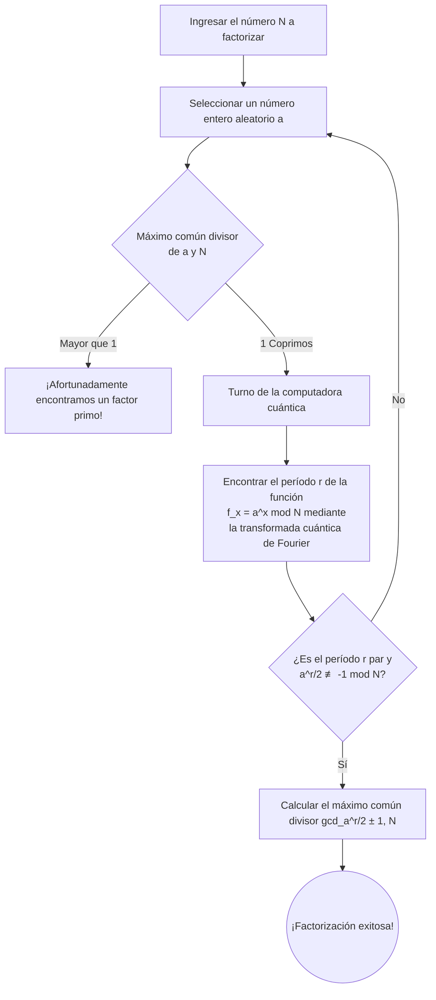

---

title: "¿Realmente las computadoras cuánticas destruirán el cifrado RSA? ~ El algoritmo de Shor y el estado actual ~"
tags: ["Computación cuántica", "Criptoanálisis", "Algoritmo de Shor", "RSA"]
image: "quantum_breaking_rsa_1788613722990.jpg"
date: 2026-09-05T22:09:21+09:00
categories: ["Matemáticas, Criptografía y Cuántica"]
---

## Introducción: La intersección entre la criptografía y la computación cuántica

En la sociedad de Internet moderna, la base para proteger el secreto de las comunicaciones es la "criptografía de clave pública". Entre ellas, un representante típico es el "cifrado RSA", desarrollado en 1977 por Ron Rivest, Adi Shamir y Leonard Adleman. Desde los pagos en compras en línea que utilizamos todos los días, la navegación de sitios web (HTTPS) hasta el envío y recepción de correos electrónicos, el cifrado RSA funciona como el corazón de la infraestructura de Internet.

Sin embargo, con la llegada de las "computadoras cuánticas", se ha señalado la posibilidad de que esta seguridad se vea socavada desde sus cimientos. A veces, en los medios de comunicación aparecen titulares sensacionalistas como: "Si se perfecciona la computadora cuántica, las contraseñas y códigos de todo el mundo serán descifrados en segundos". Pero, ¿es esto realmente cierto?

En este artículo, profundizaremos en los mecanismos del GNFS (Criba General del Cuerpo de Números), que es un método clásico de criptoanálisis, y el "Algoritmo de Shor" (Shor's Algorithm), que es la versión definitiva del algoritmo de descifrado utilizando computadoras cuánticas. Explicaremos de manera sencilla conceptos avanzados como la transformada cuántica de Fourier y el hallazgo de períodos, y examinaremos en detalle el estado actual del hardware cuántico en la era actual NISQ (Noisy Intermediate-Scale Quantum) y los obstáculos necesarios para romper realmente RSA-2048.

---

## La base del cifrado RSA: La dificultad de la factorización de enteros

La seguridad del cifrado RSA depende de una asimetría extremadamente simple en matemáticas. Es el hecho de que "multiplicar dos números primos gigantescos es fácil, pero encontrar (factorizar) los dos números primos originales a partir del resultado multiplicado (número compuesto) es extremadamente difícil".

Por ejemplo, supongamos que hay dos números primos $ p = 61 $ y $ q = 53 $. Calcular esta multiplicación $ N = p \times q = 3233 $ es instantáneo. Sin embargo, si solo se da el número "3233" y se nos pide resolver "¿de qué números primos es esta la multiplicación?", a medida que el número crece, la cantidad de cálculo explota exponencialmente.

En el RSA-2048, que es la corriente principal en la actualidad, la longitud de la clave es de 2048 bits, es decir, se utiliza un gigantesco número compuesto $ N $ de unos 617 dígitos decimales. Si este $ N $ pudiera ser factorizado, el cifrado estaría prácticamente descifrado.

### El desafío de las computadoras clásicas: GNFS (Criba General del Cuerpo de Números)

Para resolver el problema de la factorización, matemáticos y criptógrafos han desarrollado varios algoritmos a lo largo de los años. Entre ellos, el que actualmente se considera el más rápido en computadoras clásicas es la **Criba General del Cuerpo de Números (GNFS: General Number Field Sieve)**.

GNFS es un método para factorizar un número gigantesco $ N $ extendiendo el cálculo en el anillo de enteros a un cuerpo de números algebraicos más abstracto (Number Field) para su análisis. El flujo general es el siguiente:

1. **Selección de polinomios** : Encontrar un polinomio $ f(x) $ con el grado y los coeficientes adecuados que tenga a $ N $ como raíz.
2. **Recopilación de datos (cribado)** : Buscar en el cuerpo de los números racionales y en el cuerpo algebraico una gran cantidad de pares de números que se puedan descomponer en números primos pequeños (números suaves, Smooth numbers). Este proceso se llama "cribado" y es la parte que requiere más tiempo.
3. **Generación y reducción de matrices** : Generar una matriz dispersa gigante (una matriz donde la mayoría de los componentes son 0) basada en las relaciones recopiladas, y usar métodos de álgebra lineal (como el método de Block-Lanczos) para encontrar una solución.
4. **Cálculo de raíces cuadradas** : Finalmente, calcular la raíz cuadrada sobre el cuerpo algebraico para derivar los factores (factores primos) de $ N $.

La complejidad computacional de GNFS se evalúa asintóticamente como $ O(\exp((\sqrt[3]{\frac{64}{9}} + o(1)) (\log N)^{\frac{1}{3}} (\log \log N)^{\frac{2}{3}})) $. Esto se llama complejidad temporal "subexponencial" (Sub-exponential). Aunque es más rápido que el tiempo exponencial, es mucho más lento que el tiempo polinómico (Polynomial time).

De hecho, en 2020, un equipo de investigación internacional logró factorizar el RSA-250 (un número compuesto de 829 bits y 250 dígitos) utilizando GNFS. Este cálculo consumió un enorme tiempo de computación de aproximadamente 2700 CPU core-años, reuniendo recursos informáticos de todo el mundo. Sin embargo, cuando se trata de 2048 bits, se menciona que la cantidad de cálculo necesaria aumentaría a billones de veces la edad del universo, por lo que no importa cuántas supercomputadoras actuales funcionen en paralelo, es imposible descifrarlo en un tiempo realista utilizando métodos clásicos.

---

## La carta de triunfo de la computadora cuántica: El algoritmo de Shor

Aquí es donde entra en juego el "Algoritmo de Shor", publicado por Peter Shor en 1994. Este algoritmo fue revolucionario al poder resolver el problema de la factorización de enteros en una computadora cuántica en **tiempo polinómico** ( $ O((\log N)^3) $ ). La diferencia entre el tiempo subexponencial y el tiempo polinómico es decisiva, lo que significa que, en teoría, el uso de una computadora cuántica destruiría por completo el cifrado RSA.

### Flujo general del algoritmo de Shor

El algoritmo de Shor no resuelve directamente el problema de la factorización, sino que utiliza teoremas de la teoría de números para convertirlo en otro problema llamado "Problema de hallazgo de períodos" (Period Finding Problem), y aborda resolverlo rápidamente aprovechando las características de las computadoras cuánticas.

### Paso 1: Reducción de la factorización al problema de hallazgo de períodos (Procesamiento clásico)

El primer paso del algoritmo se realiza en una computadora clásica.
Para el número $ N $ que queremos factorizar, elegimos un entero aleatorio $ a $ ( $ 1 < a < N $ ) que sea coprimo con $ N $ (su máximo común divisor es 1). Si, por casualidad, el máximo común divisor no es 1, entonces el divisor común encontrado en ese punto es un factor primo de $ N $ y el descifrado está completo, pero la probabilidad es extremadamente baja.

Luego, consideramos la siguiente secuencia de ecuaciones modulares:
$ f(x) = a^x \pmod N $

Si sustituimos $ x = 1, 2, 3, \dots $ en esta función $ f(x) $, los valores parecen ser aleatorios, pero dado que estamos calculando dentro de un rango finito, inevitablemente volverá al valor original en algún punto y repetirá la misma secuencia de números. A este período de repetición lo llamamos $ r $. Es decir,
$ a^r \equiv 1 \pmod N $
El problema de encontrar el entero positivo más pequeño $ r $ que cumpla con esto, es el "Problema de hallazgo de períodos".

Si se encuentra este período $ r $, y si $ r $ es par, entonces $ a^r - 1 \equiv 0 \pmod N $, y usando la fórmula de factorización se puede transformar en:
$ (a^{r/2} - 1)(a^{r/2} + 1) \equiv 0 \pmod N $
A partir de aquí, al calcular el máximo común divisor de $ N $ y $ a^{r/2} \pm 1 $ usando el algoritmo de Euclides, se puede obtener un factor primo de $ N $ con una probabilidad extremadamente alta.

Para encontrar el período $ r $ en una computadora clásica, en última instancia, se requieren pasos exponenciales y no se puede acelerar. Sin embargo, una computadora cuántica puede encontrar este período $ r $ en un instante (en tiempo polinómico).

### Paso 2: Preparación del estado cuántico y superposición

A partir de aquí es el turno de la computadora cuántica.
Las computadoras cuánticas utilizan "cúbits" (Qubits) que pueden tener los estados "0" y "1" simultáneamente. En el algoritmo de Shor, se preparan dos registros: un registro para almacenar la entrada (el primer registro) y un registro para almacenar los resultados del cálculo (el segundo registro).

Primero, se aplica una operación de puerta cuántica llamada Puerta de Hadamard (Hadamard gate) a todos los cúbits del primer registro. Como resultado, el primer registro se convierte en un **estado de superposición uniforme** de todos los valores posibles de $ x $ (desde $ 0 $ hasta $ 2^n-1 $, donde $ n $ es un número de bits suficientemente grande).

En otras palabras, dentro de la computadora cuántica se crea un estado en el que existen de manera simultánea y paralela innumerables valores de entrada $ x=0, 1, 2, 3, \dots $.

### Paso 3: Exponenciación modular cuántica (Quantum Modular Exponentiation)

A continuación, tomando el estado de superposición del primer registro como entrada, calculamos $ f(x) = a^x \pmod N $ y almacenamos el resultado en el segundo registro.
Dado que este cálculo se ejecuta como una transformación unitaria en el circuito cuántico, el cálculo de $ f(x) $ para todos los $ x $ se realiza "simultáneamente y en paralelo (paralelismo cuántico)" manteniendo la superposición.

En este punto, el espacio general del sistema cuántico es:
$ |x, a^x \bmod N\rangle $
que es una enorme superposición de estados.

Sin embargo, si simplemente medimos (observamos) el segundo registro aquí, un valor aleatorio de $ a^x \bmod N $ se elegirá probabilísticamente, y en conjunto con esto, el $ x $ del primer registro también se fijará a uno solo. Hacer esto equivaldría a calcularlo una vez en una computadora clásica y no nos permitiría encontrar el período $ r $.

Bajo las reglas de la mecánica cuántica, no podemos mirar directamente el contenido de un estado de superposición. Entonces, ¿cómo extraemos la información global, que es el "período" de todo el sistema?

### Paso 4: Transformada Cuántica de Fourier (QFT: Quantum Fourier Transform)

La verdadera genialidad del algoritmo de Shor para superar este obstáculo es la aplicación de la **Transformada Cuántica de Fourier (QFT)** al primer registro.

Antes de realizar la medición, analizamos las propiedades de onda de la función $ f(x) $. Supongamos que observamos el segundo registro. Asumamos que se obtuvo un valor $ y $. Entonces, el estado del primer registro colapsa en "la superposición de todos los $ x $ tal que $ a^x \pmod N = y $".
Los valores de este $ x $ estarán separados por un intervalo del período $ r $ de la forma $ x_0, x_0 + r, x_0 + 2r, x_0 + 3r, \dots $, resultando en un estado discretamente alineado (una especie de distribución de amplitud de probabilidad en forma de peine).

Aplicamos la Transformada Cuántica de Fourier (QFT) a este estado. Así como la transformada discreta de Fourier clásica convierte una señal en el dominio del tiempo al dominio de la frecuencia, la QFT causa interferencia en las amplitudes de probabilidad del estado cuántico.

Al aplicar la QFT, debido al efecto de interferencia cuántica, las probabilidades de respuestas incorrectas que no resuenan (están desfasadas) con el período $ r $ se anulan mutuamente y se acercan a cero (interferencia destructiva), y solo se amplifica la probabilidad de la respuesta correcta que tiene la información del período $ r $ (interferencia constructiva).

### Paso 5: Medición y expansión en fracciones continuas (Post-procesamiento clásico)

Si se mide el primer registro después de aplicar la QFT, con una probabilidad muy alta se obtendrá un entero $ c $ muy cercano a la forma $ c \approx \frac{j \cdot 2^n}{r} $ (donde $ j $ es un número entero desconocido y $ 2^n $ es el tamaño del registro).

Este resultado de medición $ c $ se devuelve a la computadora clásica para crear una fracción $ \frac{c}{2^n} \approx \frac{j}{r} $. Luego, calculando una aproximación utilizando un método matemático llamado "expansión en fracciones continuas" (Continued fraction expansion), podemos extraer de manera brillante el período $ r $ que está en el denominador.

Una vez que conocemos $ r $, todo lo que queda es usar la fórmula del Paso 1 para calcular los factores primos de $ N $ y el cifrado RSA estará completamente descifrado.

---

## El poder y los desafíos de las computadoras cuánticas actuales (NISQ)

El algoritmo de Shor es teóricamente perfecto, pero si se pregunta "¿Se romperá el cifrado RSA mañana?", la respuesta es claramente "no". La razón radica en las limitaciones de la tecnología de hardware de las computadoras cuánticas actuales.

### La era NISQ (Noisy Intermediate-Scale Quantum)

En la actualidad nos encontramos en una era llamada "NISQ". Los dispositivos NISQ tienen decenas a cientos de cúbits físicos, pero son extremadamente vulnerables al ruido.

Los cúbits son susceptibles a influencias ambientales externas como el calor y las ondas electromagnéticas, lo que hace que ocurra con frecuencia la "decoherencia" (pérdida de entrelazamiento cuántico), que destruye el estado cuántico, o los "errores de puerta" al operar las puertas cuánticas. Si se intenta ejecutar un circuito cuántico muy profundo (con una cantidad masiva de pasos de cálculo) como el algoritmo de Shor, los errores se acumulan durante el cálculo y el resultado final será ruido completo sin significado.

### Cúbits físicos y cúbits lógicos

Para resolver este problema de errores, es indispensable la "Corrección de errores cuánticos" (Quantum Error Correction).
Aunque también se utilizan códigos de corrección de errores en las computadoras clásicas, la corrección de errores cuánticos es muy compleja debido al "Teorema de no clonación cuántica" que prohíbe copiar estados cuánticos.

En la corrección de errores cuánticos, se utilizan tecnologías como el "Código de superficie" (Surface Code) para combinar muchos "cúbits físicos" ruidosos, y así crear un "cúbit lógico" ideal y sin errores.

Teniendo en cuenta las tasas de error actuales, se estima que se necesitarán aproximadamente de 1,000 a 10,000 cúbits físicos para crear un solo cúbit lógico. Esto se denomina la "sobrecarga de la corrección de errores".

### ¿Cuáles son los recursos necesarios para destruir RSA-2048?

Entonces, para descifrar realmente RSA-2048, ¿cuántos recursos se necesitan para ejecutar el algoritmo de Shor?

En una estimación de recursos revolucionaria realizada en un artículo de 2021 por Craig Gidney (Google) y Martin Ekerå, utilizando un algoritmo de Shor optimizado y realizando la corrección de errores con código de superficie, se requerirían los siguientes recursos:

* **Número de cúbits lógicos** : Aproximadamente 4,096
* **Número de cúbits físicos** : **Aproximadamente 20 millones** (asumiendo una tasa de error de alrededor de $10^{-3}$)
* **Tiempo de cálculo** : Aproximadamente 8 horas (se requieren de millones a miles de millones de operaciones de puertas físicas)

Por el contrario, ¿cuál es el nivel alcanzado por el hardware cuántico actual?
A finales de 2023, el procesador cuántico superconductor "Condor", anunciado por IBM, tiene 1,121 cúbits. Además, también han aparecido investigaciones innovadoras sobre la generación de cúbits lógicos (como la generación de 48 cúbits lógicos utilizando una computadora cuántica de átomos neutros por la Universidad de Harvard y la empresa QuEra), pero aún no estamos en la etapa en que se puedan ejecutar "cálculos perfectos sin ruido" de manera continua y prolongada.

Para escalar desde unos miles de cúbits físicos hasta **20 millones** de cúbits físicos prácticos (y un sistema interconectado, operando de manera estable a temperaturas criogénicas y capaz de procesar señales de control a ultra alta velocidad) existe un muro de ingeniería tremendo (problemas de cableado, límites de capacidad de enfriamiento y la expansión excesiva de la electrónica de control). Muchos expertos predicen que tomará al menos de 10 a 30 años, o incluso más, lograr una "Computadora cuántica tolerante a fallas (FTQC)" capaz de descifrar RSA-2048.

---

## La inminente amenaza de "Store Now, Decrypt Later" y el amanecer de PQC

Es prematuro pensar: "Si faltan más de 10 años, estamos a salvo". Actualmente existen datos cuyo secreto debe garantizarse durante décadas en el futuro, como la información confidencial del estado, los datos médicos y el diseño de infraestructura a largo plazo.

Lo que preocupa aquí es el método de ataque **"Store Now, Decrypt Later" (Almacenar ahora, descifrar después)** . Estados u organizaciones malintencionadas interceptan todos los datos de comunicaciones cifrados actualmente con RSA o ECC (Criptografía de curva elíptica) y los guardan en sistemas de almacenamiento. Luego, dentro de 10 o 20 años, en el momento en que se complete una poderosa computadora cuántica, utilizarán el algoritmo de Shor para descifrar todos los datos pasados y exponer los secretos.

Para contrarrestar la amenaza de este desfase temporal, el proceso de estandarización de la **"Criptografía Post-Cuántica (PQC: Post-Quantum Cryptography)"** ha avanzado a un ritmo acelerado, centrado principalmente en el NIST (Instituto Nacional de Estándares y Tecnología de EE. UU.).

PQC es un nuevo algoritmo criptográfico basado en problemas matemáticos que son difíciles de resolver incluso utilizando computadoras cuánticas (es decir, a los que no se puede aplicar el algoritmo de Shor). Los enfoques principales incluyen los siguientes:

* **Criptografía basada en retículos (Lattice-based cryptography)** : Basado en el problema LWE (Learning with Errors), entre otros. Es la corriente principal en la estandarización del NIST (Kyber, Dilithium, etc.).
* **Criptografía basada en códigos (Code-based cryptography)** : Depende de la dificultad del problema de decodificar códigos de corrección de errores.
* **Criptografía multivariante (Multivariate cryptography)** : Depende de la dificultad de resolver sistemas de ecuaciones cuadráticas con múltiples variables.
* **Firmas basadas en hash (Hash-based signatures)** : Firmas digitales que dependen únicamente de la seguridad de la función hash.

Ya se han iniciado las pruebas de implementación y las implementaciones híbridas de PQC en los principales software y plataformas, como Google Chrome y el iMessage de Apple.

## Conclusión

Las computadoras cuánticas están pasando de ser el sueño del mundo de la ciencia ficción a un desafío de ingeniería en la realidad. El algoritmo de Shor es un gran logro intelectual de la humanidad que fusiona las matemáticas y la mecánica cuántica, pero al mismo tiempo tiene un "poder destructivo" oculto que puede sacudir los cimientos de nuestra sociedad digital.

El cifrado RSA no quedará inutilizable inmediatamente mañana. Sin embargo, considerando la evolución de la tecnología cuántica y el riesgo de "Store Now, Decrypt Later", la migración masiva en la historia de la criptografía, que es la transición a PQC, ya ha comenzado. Ahora mismo somos testigos de la primera línea de un cambio de paradigma en la seguridad de la información.
