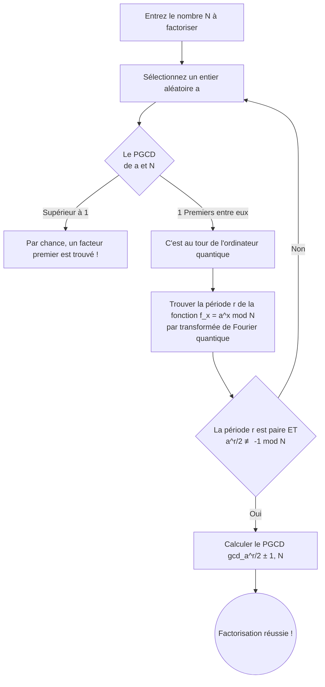

## Introduction : À la croisée de la cryptographie et de l'informatique quantique

Dans la société Internet moderne, la cryptographie à clé publique est la base de la protection du secret des communications. Le représentant le plus célèbre est le "cryptage RSA", développé en 1977 par Ron Rivest, Adi Shamir et Leonard Adleman. Du paiement des achats en ligne que nous utilisons tous les jours, à la navigation sur des sites Web (HTTPS), en passant par l'envoi et la réception d'e-mails, le cryptage RSA fonctionne comme le cœur de l'infrastructure Internet.

Cependant, avec l'avènement de l'"ordinateur quantique", il a été souligné que cette sécurité pourrait être fondamentalement bouleversée. Dans les médias, on voit parfois des gros titres sensationnels comme : "Une fois l'ordinateur quantique achevé, les mots de passe et les cryptages du monde entier seront décryptés en quelques secondes". Est-ce vraiment le cas ?

Cet article se penche sur les mécanismes de la méthode classique de décryptage GNFS (Crible du corps de nombres généralisé) et sur l'algorithme définitif de décryptage utilisant des ordinateurs quantiques, l'"Algorithme de Shor" (Shor's Algorithm). Nous expliquerons de manière simple des concepts avancés tels que la transformée de Fourier quantique et la recherche de période, et examinerons en détail l'état actuel du matériel quantique à l'ère NISQ (Noisy Intermediate-Scale Quantum) ainsi que les obstacles nécessaires pour briser réellement le RSA-2048.

---

## Les fondements du cryptage RSA : La difficulté de la factorisation en nombres premiers

La sécurité du cryptage RSA repose sur une asymétrie mathématique extrêmement simple. Il s'agit du fait qu' "il est facile de multiplier deux nombres premiers géants, mais il est extrêmement difficile de retrouver les deux nombres premiers originaux (factorisation) à partir du résultat de cette multiplication (nombre composé)".

Par exemple, supposons qu'il y ait deux nombres premiers, $ p = 61 $ et $ q = 53 $. Le calcul de leur multiplication $ N = p \times q = 3233 $ est instantané. Cependant, si on ne vous donne que le nombre "3233" et qu'on vous demande "quelle est la multiplication de quels nombres premiers ?", la complexité du calcul augmente de façon explosive à mesure que les nombres s'agrandissent.

Dans le RSA-2048, actuellement dominant, on utilise une longueur de clé de 2048 bits, c'est-à-dire un nombre composé géant $ N $ d'environ 617 chiffres en base 10. Si l'on parvient à factoriser ce $ N $, le cryptage sera considéré comme déchiffré.

### Le défi des ordinateurs classiques : GNFS (Crible du corps de nombres généralisé)

Pour résoudre le problème de la factorisation, les mathématiciens et les cryptographes ont développé divers algorithmes au fil des ans. Parmi eux, le plus rapide actuellement sur les ordinateurs classiques est le ** Crible du corps de nombres généralisé (GNFS : General Number Field Sieve) **.

GNFS est une méthode qui étend les calculs dans l'anneau des entiers à un corps algébrique plus abstrait (Number Field) afin de factoriser un nombre géant $ N $. Le processus général est le suivant :

1. ** Sélection de polynômes ** : Trouver un polynôme $ f(x) $ avec un degré et des coefficients appropriés qui a $ N $ comme racine.
2. ** Collecte de données (criblage) ** : Rechercher un grand nombre de paires de nombres qui peuvent être décomposées en petits nombres premiers (nombres friables, Smooth numbers) sur le corps des rationnels et des corps algébriques. Ce processus est appelé "criblage" et est la partie la plus chronophage.
3. ** Génération et réduction de matrices ** : Générer une matrice creuse géante (une matrice dont la plupart des éléments sont 0) sur la base des relations collectées, et trouver une solution à l'aide de méthodes d'algèbre linéaire (comme la méthode de Lanczos par blocs).
4. ** Calcul des racines carrées ** : Enfin, calculer la racine carrée sur le corps algébrique pour dériver les facteurs (facteurs premiers) de $ N $.

La complexité de GNFS est évaluée de manière non asymptotique à $ O(\exp((\sqrt[3]{\frac{64}{9}} + o(1)) (\log N)^{\frac{1}{3}} (\log \log N)^{\frac{2}{3}})) $. C'est ce qu'on appelle une complexité temporelle "sous-exponentielle" (Sub-exponential). Bien que plus rapide qu'un temps exponentiel, c'est une complexité beaucoup plus lente qu'un temps polynomial (Polynomial time).

En fait, en 2020, une équipe de recherche internationale a réussi à factoriser le RSA-250 (un nombre composé de 829 bits et 250 chiffres) en utilisant GNFS. Ce calcul a nécessité un temps de calcul énorme d'environ 2700 cœurs-années de CPU en rassemblant les ressources informatiques du monde entier. Cependant, lorsqu'il s'agit de 2048 bits, on dit que la complexité de calcul requise gonflerait jusqu'à des billions de fois l'âge de l'univers, et peu importe le nombre de superordinateurs actuels fonctionnant en parallèle, il est impossible de le décrypter dans un temps réaliste avec des méthodes classiques.

---

## L'atout des ordinateurs quantiques : L'algorithme de Shor

C'est ici qu'intervient l'"Algorithme de Shor", présenté par Peter Shor en 1994. Cet algorithme était révolutionnaire car il permettait de résoudre le problème de la factorisation sur un ordinateur quantique en ** temps polynomial ** ( $ O((\log N)^3) $ ). La différence entre le temps sous-exponentiel et le temps polynomial est décisive et signifie qu'en théorie, les ordinateurs quantiques détruiront complètement le cryptage RSA.

### Flux global de l'algorithme de Shor

L'algorithme de Shor ne résout pas directement le problème de la factorisation, mais utilise des théorèmes de la théorie des nombres pour le convertir en un autre problème appelé "problème de recherche de période" (Period Finding Problem), puis utilise les caractéristiques des ordinateurs quantiques pour le résoudre rapidement.

### Étape 1 : Réduction de la factorisation au problème de recherche de période (Traitement classique)

La première étape de l'algorithme est exécutée sur un ordinateur classique.
Pour le nombre $ N $ à factoriser, choisissez un entier aléatoire $ a $ ($ 1 < a < N $) premier avec $ N $ (le plus grand commun diviseur est 1). Si, par hasard, le plus grand commun diviseur n'est pas 1, le diviseur commun trouvé à ce moment-là est un facteur premier de $ N $, et le décryptage est terminé, mais la probabilité est extrêmement faible.

Ensuite, considérez la suite d'équations modulo suivante :
$ f(x) = a^x \pmod N $

En substituant $ x = 1, 2, 3, \dots $ dans cette fonction $ f(x) $, les valeurs semblent aléatoires, mais puisqu'elles sont calculées dans une plage finie, elles reviendront toujours à la valeur d'origine à un moment donné et répéteront la même suite de nombres. La période de cette répétition est appelée $ r $. En d'autres termes,
$ a^r \equiv 1 \pmod N $
Le problème de trouver le plus petit entier positif $ r $ qui satisfait cette condition est le "problème de recherche de période".

Si cette période $ r $ est trouvée et que $ r $ est pair, alors $ a^r - 1 \equiv 0 \pmod N $, et en utilisant la formule de factorisation, on peut la transformer en
$ (a^{r/2} - 1)(a^{r/2} + 1) \equiv 0 \pmod N $
À partir de là, en utilisant l'algorithme d'Euclide pour calculer le plus grand commun diviseur de $ N $ et de $ a^{r/2} \pm 1 $, les facteurs premiers de $ N $ peuvent être obtenus avec une probabilité extrêmement élevée.

En fin de compte, pour trouver la période $ r $ avec un ordinateur classique, des étapes exponentielles sont nécessaires et ne peuvent pas être accélérées. Cependant, avec un ordinateur quantique, cette période $ r $ peut être trouvée instantanément (en temps polynomial).

### Étape 2 : Préparation de l'état quantique et superposition

C'est ici qu'interviennent les ordinateurs quantiques.
Les ordinateurs quantiques utilisent des "qubits" qui peuvent avoir simultanément les états "0" et "1". L'algorithme de Shor prépare deux registres : un registre pour stocker les entrées (premier registre) et un registre pour stocker les résultats du calcul (deuxième registre).

Tout d'abord, une opération de porte quantique appelée porte de Hadamard est appliquée à tous les qubits du premier registre. En conséquence, le premier registre sera dans un ** état de superposition uniforme ** de toutes les valeurs possibles de $ x $ (de $ 0 $ à $ 2^n-1 $. $ n $ est un nombre de bits suffisamment grand).

En d'autres termes, un état est créé à l'intérieur de l'ordinateur quantique où un nombre infini de valeurs d'entrée, $ x = 0, 1, 2, 3, \dots $, existent simultanément et en parallèle.

### Étape 3 : Exponentiation modulaire quantique (Quantum Modular Exponentiation)

Ensuite, en prenant l'état de superposition du premier registre comme entrée, calculez $ f(x) = a^x \pmod N $ et stockez le résultat dans le deuxième registre.
Étant donné que ce calcul est exécuté sous forme de transformation unitaire sur un circuit quantique, le calcul de $ f(x) $ pour tout $ x $ est effectué "simultanément et en parallèle (parallélisme quantique)" tout en maintenant la superposition.

L'espace de l'ensemble du système quantique à ce stade est une vaste superposition d'états :
$ |x, a^x \bmod N\rangle $

Cependant, si l'on se contente de mesurer (observer) le deuxième registre à ce stade, seule une valeur aléatoire de $ a^x \bmod N $ sera choisie de manière probabiliste, et en conjonction avec cela, le $ x $ du premier registre sera également fixé à une seule valeur. Cela équivaut à calculer une seule fois sur un ordinateur classique et ne permet pas de trouver la période $ r $.

Selon les règles de la mécanique quantique, vous ne pouvez pas regarder directement à l'intérieur d'un état superposé. Alors, comment extraire l'information globale de "période" de l'ensemble ?

### Étape 4 : Transformée de Fourier quantique (QFT: Quantum Fourier Transform)

La véritable valeur de l'algorithme de Shor, qui permet de franchir ce mur, est l'application de la ** Transformée de Fourier Quantique (QFT) ** au premier registre.

Avant de mesurer, on analyse les propriétés ondulatoires de la fonction $ f(x) $. Supposons que nous observions le deuxième registre. Supposons qu'une valeur $ y $ soit obtenue. Ensuite, l'état du premier registre se réduit à la "superposition de tous les $ x $ tels que $ a^x \pmod N = y $".
Les valeurs de ce $ x $ seront un état discret (une sorte de distribution d'amplitude de probabilité en forme de peigne) espacé par des intervalles de période $ r $, tel que $ x_0, x_0 + r, x_0 + 2r, x_0 + 3r, \dots $.

La transformée de Fourier quantique (QFT) est appliquée à cet état. Tout comme la transformée de Fourier discrète classique convertit un signal dans le domaine temporel en domaine fréquentiel, la QFT provoque des interférences dans l'amplitude de probabilité des états quantiques.

Lorsque la QFT est appliquée, en raison des effets d'interférence quantique, la probabilité de réponses incorrectes qui ne résonnent pas avec la période $ r $ (phases non alignées) s'annule mutuellement pour s'approcher de zéro (interférence destructive), et seule la probabilité de la réponse correcte contenant les informations de la période $ r $ est amplifiée (interférence constructive).

### Étape 5 : Mesure et expansion en fraction continue (Post-traitement classique)

Lorsque le premier registre est mesuré après l'application de la QFT, un entier $ c $ proche de la forme $ c \approx \frac{j \cdot 2^n}{r} $ est obtenu avec une probabilité très élevée ($ j $ est un entier inconnu et $ 2^n $ est la taille du registre).

Ce résultat de mesure $ c $ est renvoyé à l'ordinateur classique pour créer la fraction $ \frac{c}{2^n} \approx \frac{j}{r} $. Ensuite, en calculant une valeur approximative à l'aide d'une méthode mathématique appelée "expansion en fraction continue" (Continued fraction expansion), on peut brillamment extraire le dénominateur, la période $ r $.

Une fois que l'on connaît $ r $, il suffit de calculer les facteurs premiers de $ N $ en utilisant la formule de l'étape 1, et le cryptage RSA est complètement déchiffré.

---

## Capacités et défis actuels des ordinateurs quantiques (NISQ)

Bien que l'algorithme de Shor soit parfait en théorie, si l'on se demande "Le cryptage RSA sera-t-il brisé demain ?", la réponse est clairement "Non". La raison réside dans les limites de la technologie matérielle des ordinateurs quantiques actuels.

### L'ère NISQ (Noisy Intermediate-Scale Quantum)

L'ère dans laquelle nous nous trouvons actuellement est appelée l'ère "NISQ". Les dispositifs NISQ possèdent de quelques dizaines à quelques centaines de qubits physiques, mais sont extrêmement vulnérables au bruit.

Les qubits sont sensibles aux environnements externes tels que la chaleur et les ondes électromagnétiques, entraînant de fréquentes "décohérences" (pertes d'intrication quantique) où l'état quantique se brise, et des "erreurs de porte" lors des opérations de porte. Lorsque vous essayez d'exécuter un circuit quantique très profond (avec un nombre énorme d'étapes de calcul) comme l'algorithme de Shor, des erreurs s'accumulent pendant le calcul et la sortie finale devient un bruit complet et dénué de sens.

### Qubits physiques et Qubits logiques

La "correction d'erreurs quantiques" (Quantum Error Correction) est essentielle pour résoudre ce problème d'erreur.
Des codes de correction d'erreurs sont également utilisés dans les ordinateurs classiques, mais comme il existe un "théorème de non-clonage quantique" qui interdit de copier les états quantiques, la correction d'erreurs quantiques est extrêmement complexe.

Dans la correction d'erreurs quantiques, en utilisant des technologies telles que le "code de surface" (Surface Code), on combine un grand nombre de "qubits physiques" bruyants pour créer un seul "qubit logique" idéal et sans erreur.

En supposant le taux d'erreur actuel, on estime qu'il faudrait entre 1 000 et 10 000 qubits physiques pour créer un seul qubit logique. On appelle cela la "surcharge de correction d'erreur".

### Quelles sont les ressources nécessaires pour briser le RSA-2048 ?

Alors, combien de ressources sont nécessaires pour exécuter l'algorithme de Shor afin de décrypter réellement le RSA-2048 ?

Selon une estimation révolutionnaire des ressources dans un article de 2021 de Craig Gidney (Google) et Martin Ekerå, si l'on utilise un algorithme de Shor optimisé et une correction d'erreur par code de surface, les ressources suivantes sont nécessaires :

* ** Nombre de qubits logiques ** : environ 4 096
* ** Nombre de qubits physiques ** : ** environ 20 millions ** (en supposant un taux d'erreur d'environ $10^{-3}$)
* ** Temps de calcul ** : environ 8 heures (des millions à des milliards d'opérations de portes physiques sont nécessaires)

Face à cela, où en est le matériel quantique actuel ?
Le processeur quantique supraconducteur "Condor" annoncé par IBM fin 2023 compte 1 121 qubits. Par ailleurs, des recherches révolutionnaires sur la génération de qubits logiques ont émergé (telles que la génération de 48 qubits logiques à l'aide d'un ordinateur quantique à atomes neutres par l'Université de Harvard et QuEra, etc.), mais on n'en est pas encore au stade où des "calculs parfaits et sans bruit" peuvent être exécutés en continu pendant de longues périodes.

Il existe des obstacles d'ingénierie colossaux (problèmes de câblage, limites de la capacité de refroidissement, hypertrophie de l'électronique de contrôle) pour passer de quelques milliers de qubits physiques à un système avec ** 20 millions ** de qubits physiques pratiques (interconnectés, fonctionnant de manière stable à des températures cryogéniques et capables de traiter les signaux de contrôle à des vitesses ultra-rapides). De nombreux experts prédisent qu'il faudra au moins 10 à 30 ans, ou plus, avant qu'un "ordinateur quantique tolérant aux pannes (FTQC)" capable de décrypter le RSA-2048 ne devienne une réalité.

---

## La menace imminente de "Store Now, Decrypt Later" et l'aube de la PQC

Il est prématuré de penser : "Nous sommes en sécurité car cela prendra encore plus de 10 ans". À l'heure actuelle, il existe des données dont la confidentialité doit être garantie pendant des décennies, comme les secrets d'État, les données médicales et la conception d'infrastructures à long terme.

Ce que l'on craint ici, c'est une méthode d'attaque appelée ** "Store Now, Decrypt Later" (Stockez maintenant, décryptez plus tard) **. Des pays ou des organisations malveillants interceptent toutes les données de communication cryptées avec le RSA ou ECC (cryptographie sur les courbes elliptiques) actuels et les stockent. Puis, 10 ou 20 ans plus tard, au moment où un puissant ordinateur quantique est achevé, ils utilisent l'algorithme de Shor pour décrypter toutes les données passées et révéler des secrets.

Pour lutter contre cette menace de décalage temporel, le NIST (National Institute of Standards and Technology des États-Unis) a dirigé le processus de standardisation de la ** "Cryptographie post-quantique (PQC: Post-Quantum Cryptography)" ** à un rythme effréné.

La PQC est un nouvel algorithme cryptographique basé sur des problèmes mathématiques difficiles à décrypter même à l'aide d'ordinateurs quantiques (c'est-à-dire que l'algorithme de Shor ne peut pas être appliqué). Les principales approches incluent :

* ** Cryptographie basée sur les réseaux euclidiens (Lattice-based cryptography) ** : Basée sur des problèmes tels que LWE (Learning with Errors). Actuellement le courant dominant dans la standardisation du NIST (Kyber, Dilithium, etc.).
* ** Cryptographie basée sur les codes (Code-based cryptography) ** : Repose sur la difficulté de décodage des codes correcteurs d'erreurs.
* ** Cryptographie multivariée (Multivariate cryptography) ** : Repose sur la difficulté de résoudre un système d'équations quadratiques à plusieurs variables.
* ** Signatures basées sur le hachage (Hash-based signatures) ** : Signatures numériques qui reposent uniquement sur la sécurité des fonctions de hachage.

Les principaux logiciels et plateformes tels que Google Chrome et Apple iMessage ont déjà commencé les tests de déploiement de la PQC et des implémentations hybrides.

## Conclusion

L'ordinateur quantique est passé d'un conte de fées de science-fiction à un véritable défi d'ingénierie. L'algorithme de Shor est une grande réalisation intellectuelle de l'humanité combinant les mathématiques et la mécanique quantique, mais en même temps, il cache un "pouvoir destructeur" qui ébranle les fondements de notre société numérique.

Le cryptage RSA ne deviendra pas inutilisable dès demain. Cependant, compte tenu de l'évolution de la technologie quantique et du risque du "Store Now, Decrypt Later", une migration massive vers la PQC, qui restera dans l'histoire de la cryptographie, a déjà commencé. Nous sommes actuellement témoins d'un changement de paradigme en matière de sécurité de l'information.
