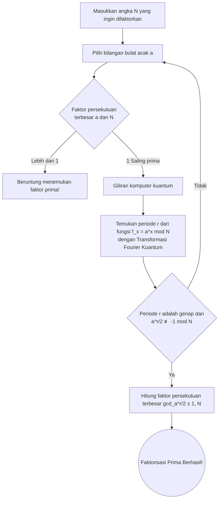

## Pengantar: Persimpangan Kriptografi dan Komputer Kuantum

Di masyarakat internet modern, dasar untuk melindungi rahasia komunikasi adalah "Kriptografi Kunci Publik". Yang paling representatif dari hal ini adalah "Enkripsi RSA" yang dikembangkan pada tahun 1977 oleh Ron Rivest, Adi Shamir, dan Leonard Adleman. Dari pembayaran belanja online, penelusuran situs web (HTTPS), hingga pengiriman dan penerimaan email, enkripsi RSA berfungsi sebagai jantung infrastruktur internet.

Namun, dengan munculnya "komputer kuantum", ada kemungkinan keamanan ini dihancurkan dari akarnya. Di media berita, kadang-kadang terdapat tajuk utama yang sensasional seperti "Setelah komputer kuantum selesai, semua kata sandi dan enkripsi di dunia akan didekripsi dalam hitungan detik". Apakah ini benar-benar terjadi?

Artikel ini mendalami mekanisme GNFS (General Number Field Sieve) sebagai metode dekripsi kriptografi klasik, dan algoritma dekripsi definitif menggunakan komputer kuantum, yaitu "Algoritma Shor" (Shor's Algorithm). Kita akan menjelaskan konsep lanjutan seperti Transformasi Fourier Kuantum dan penemuan periode dengan cara yang mudah dimengerti, serta menyelidiki kondisi perangkat keras kuantum saat ini di era NISQ (Noisy Intermediate-Scale Quantum) dan tantangan nyata untuk menghancurkan RSA-2048.

---

## Inti Enkripsi RSA: Kesulitan Faktorisasi Prima

Keamanan enkripsi RSA bergantung pada asimetri yang sangat sederhana dalam matematika. Fakta bahwa "mudah untuk mengalikan dua bilangan prima raksasa, tetapi sangat sulit untuk menemukan (memfaktorkan) dua bilangan prima asli dari hasil perkalian (bilangan komposit) tersebut".

Misalnya, mari asumsikan ada dua bilangan prima $ p = 61 $ dan $ q = 53 $. Sangat cepat untuk menghitung perkalian $ N = p \times q = 3233 $. Namun, hanya diberi angka "3233" dan diminta untuk memecahkan "bilangan prima apa dan bilangan prima apa yang dikalikan untuk ini?", jumlah perhitungan meledak seiring dengan bertambahnya angka.

Dalam RSA-2048 yang saat ini merupakan arus utama, angka komposit besar $ N $ digunakan dengan panjang kunci 2048 bit, atau sekitar 617 digit desimal. Jika $ N $ ini dapat difaktorkan, enkripsinya sama saja dengan sudah terpecahkan.

### Tantangan Komputer Klasik: GNFS (General Number Field Sieve)

Untuk memecahkan masalah faktorisasi prima, matematikawan dan ahli kriptografi telah mengembangkan berbagai algoritma selama bertahun-tahun. Di antaranya, yang saat ini dianggap tercepat untuk komputer klasik adalah ** GNFS (General Number Field Sieve) **.

GNFS adalah metode perluasan dan analisis perhitungan dalam cincin bilangan bulat menjadi Number Field aljabar yang lebih abstrak untuk memfaktorkan angka raksasa $ N $. Alurnya secara garis besar sebagai berikut:

1. ** Pemilihan Polinomial **: Temukan polinomial $ f(x) $ dengan derajat dan koefisien yang sesuai yang memiliki $ N $ sebagai akar.
2. ** Pengumpulan Data (Sieving) **: Cari sejumlah besar pasangan angka yang dapat diuraikan menjadi bilangan prima kecil (bilangan halus, Smooth numbers) di atas field rasional dan field aljabar. Proses ini disebut "Sieving" dan merupakan bagian yang paling memakan waktu.
3. ** Pembuatan dan Pengurangan Matriks **: Hasilkan matriks sparse raksasa (sebagian besar elemennya adalah 0) berdasarkan relasi yang dikumpulkan, dan selesaikan dengan menggunakan metode aljabar linier (seperti metode block Lanczos).
4. ** Perhitungan Akar Kuadrat **: Terakhir, hitung akar kuadrat pada field aljabar, dan turunkan faktor (faktor prima) dari $ N $.

Kompleksitas waktu untuk GNFS dievaluasi secara non-asimtotik sebagai $ O(\exp((\sqrt[3]{\frac{64}{9}} + o(1)) (\log N)^{\frac{1}{3}} (\log \log N)^{\frac{2}{3}})) $. Ini disebut kompleksitas waktu "Sub-eksponensial". Meskipun lebih cepat dari waktu eksponensial, ini masih jauh lebih lambat dari waktu polinomial.

Faktanya, pada tahun 2020, tim peneliti internasional berhasil memfaktorkan RSA-250 (angka komposit 829 bit, 250 digit) menggunakan GNFS. Perhitungan ini membutuhkan waktu perhitungan yang sangat besar sekitar 2700 core-year CPU, dengan mengumpulkan sumber daya komputasi dari seluruh dunia. Namun, ketika menjadi 2048 bit, jumlah perhitungan yang diperlukan melonjak triliunan kali umur alam semesta, dan tidak peduli berapa banyak superkomputer saat ini yang dijalankan secara paralel, tidak mungkin untuk memecahkannya dalam waktu yang realistis menggunakan metode klasik.

---

## Kartu Truf Komputer Kuantum: Algoritma Shor

Di sinilah "Algoritma Shor", yang diumumkan oleh Peter Shor pada tahun 1994, muncul. Algoritma ini merupakan terobosan yang dapat memecahkan masalah faktorisasi prima pada komputer kuantum dalam ** waktu polinomial ** ( $ O((\log N)^3) $ ). Perbedaan antara waktu sub-eksponensial dan waktu polinomial sangat menentukan, secara teoritis berarti bahwa jika Anda menggunakan komputer kuantum, enkripsi RSA akan hancur sama sekali.

### Alur Keseluruhan Algoritma Shor

Algoritma Shor tidak menyelesaikan masalah faktorisasi prima secara langsung, tetapi mengambil pendekatan menggunakan teorema teori bilangan untuk mengubahnya menjadi masalah lain yang disebut "Period Finding Problem", dan menyelesaikannya dengan kecepatan tinggi menggunakan karakteristik komputer kuantum.

### Langkah 1: Reduksi dari Faktorisasi Prima ke Masalah Penemuan Periode (Pemrosesan Klasik)

Langkah pertama algoritma dilakukan pada komputer klasik.
Untuk angka $ N $ yang ingin difaktorkan, pilih bilangan bulat acak $ a $ ( $ 1 < a < N $ ) yang relatif prima terhadap $ N $ (faktor persekutuan terbesar adalah 1). Jika secara kebetulan faktor persekutuan terbesarnya bukan 1, faktor persekutuan yang ditemukan pada saat itu adalah faktor prima dari $ N $, dan dekripsi selesai, tetapi kemungkinannya sangat rendah.

Selanjutnya, pertimbangkan urutan persamaan modulo berikut:
$ f(x) = a^x \pmod N $

Saat mengganti $ x = 1, 2, 3, \dots $ ke fungsi $ f(x) $ ini, nilainya tampak acak, tetapi karena dihitung dalam rentang terbatas, nilainya selalu kembali ke aslinya di suatu tempat dan mengulangi urutan bilangan yang sama. Periode pengulangan ini disebut $ r $. Yaitu,
$ a^r \equiv 1 \pmod N $
Masalah mencari bilangan bulat positif terkecil $ r $ ini adalah "Period Finding Problem".

Jika periode $ r $ ini ditemukan dan $ r $ genap, menjadi $ a^r - 1 \equiv 0 \pmod N $, dan dengan menggunakan rumus faktorisasi dapat diubah menjadi
$ (a^{r/2} - 1)(a^{r/2} + 1) \equiv 0 \pmod N $.
Dari sini, dengan menggunakan algoritma Euclidean untuk menghitung faktor persekutuan terbesar $ N $ dan $ a^{r/2} \pm 1 $, faktor prima $ N $ dapat diperoleh dengan probabilitas yang sangat tinggi.

Untuk menemukan periode $ r $ dengan komputer klasik, bagaimanapun juga langkah eksponensial diperlukan dan tidak dapat dipercepat. Namun, dengan komputer kuantum, periode $ r $ ini dapat ditemukan secara instan (dalam waktu polinomial).

### Langkah 2: Persiapan dan Superposisi Keadaan Kuantum

Di sinilah peran komputer kuantum.
Komputer kuantum menggunakan "Qubit" yang dapat menahan keadaan "0" dan "1" pada saat yang sama. Dalam algoritma Shor, kami menyiapkan dua register: register pertama untuk menyimpan input, dan register kedua untuk menyimpan hasil perhitungan.

Pertama, operasi gerbang kuantum yang disebut gerbang Hadamard diterapkan ke semua qubit pada register pertama. Akibatnya, register pertama menjadi ** keadaan superposisi merata ** dari semua kemungkinan nilai $ x $ (dari $ 0 $ hingga $ 2^n-1 $. Di mana $ n $ adalah jumlah bit yang cukup besar).

Dengan kata lain, keadaan dibuat di mana nilai input tak terhitung $ x=0, 1, 2, 3, \dots $ ada secara paralel di komputer kuantum.

### Langkah 3: Eksponensiasi Modular Kuantum (Quantum Modular Exponentiation)

Selanjutnya, ambil keadaan superposisi register pertama sebagai input, hitung $ f(x) = a^x \pmod N $, dan simpan hasilnya di register kedua.
Karena perhitungan ini dijalankan sebagai transformasi kesatuan pada rangkaian kuantum, perhitungan $ f(x) $ untuk semua $ x $ dilakukan "secara paralel secara bersamaan (Paralelisme Kuantum)" sambil mempertahankan superposisi.

Pada titik ini ruang keseluruhan sistem kuantum adalah
$ |x, a^x \bmod N\rangle $
yang merupakan superposisi besar keadaan.

Namun, jika kita hanya mengukur (mengamati) register kedua di sini, satu nilai $ a^x \bmod N $ acak dipilih secara probabilistik, dan seiring dengan itu, $ x $ pada register pertama juga akan ditentukan. Ini sama dengan menghitung sekali pada komputer klasik, dan periode $ r $ tidak dapat ditemukan.

Menurut aturan mekanika kuantum, kita tidak bisa mengintip ke dalam keadaan superposisi secara langsung. Lalu, bagaimana kita mengekstrak informasi global tentang "periode" secara keseluruhan?

### Langkah 4: Transformasi Fourier Kuantum (QFT: Quantum Fourier Transform)

Inti sebenarnya dari algoritma Shor untuk menembus dinding ini adalah penerapan ** Transformasi Fourier Kuantum (QFT) ** ke register pertama.

Sebelum mengukur, mari kita analisis sifat gelombang dari fungsi $ f(x) $. Misalkan register kedua diamati dan nilai $ y $ tertentu diperoleh. Kemudian keadaan register pertama menyusut ke "superposisi semua $ x $ di mana $ a^x \pmod N = y $".
Nilai $ x $ ini akan diatur secara diskrit dengan interval periode $ r $, seperti $ x_0, x_0 + r, x_0 + 2r, x_0 + 3r, \dots $ (semacam distribusi probabilitas amplitudo berbentuk sisir).

Terapkan Transformasi Fourier Kuantum (QFT) ke keadaan ini. Sama seperti transformasi Fourier diskrit klasik yang mengubah sinyal dalam domain waktu ke domain frekuensi, QFT menyebabkan interferensi dalam amplitudo probabilitas keadaan kuantum.

Ketika QFT diterapkan, karena efek interferensi kuantum, probabilitas jawaban salah yang tidak beresonansi dengan periode $ r $ (fase tidak cocok) saling meniadakan dan mendekati nol (interferensi destruktif), dan hanya probabilitas jawaban yang benar dengan informasi tentang periode $ r $ yang diperkuat (interferensi konstruktif).

### Langkah 5: Pengukuran dan Ekspansi Pecahan Berlanjut (Pemrosesan Klasik Lanjutan)

Ketika register pertama diukur setelah menerapkan QFT, kemungkinan besar akan didapatkan bilangan bulat $ c $ yang mendekati bentuk $ c \approx \frac{j \cdot 2^n}{r} $ ($ j $ adalah bilangan bulat yang tidak diketahui, $ 2^n $ adalah ukuran register).

Kembalikan hasil pengukuran $ c $ ini ke komputer klasik, dan buat pecahan $ \frac{c}{2^n} \approx \frac{j}{r} $. Kemudian, dengan menghitung pendekatan menggunakan metode matematika "Continued fraction expansion", kita berhasil mengekstraksi penyebut, yang merupakan periode $ r $.

Jika $ r $ diketahui, sisanya adalah menghitung faktor dari $ N $ menggunakan rumus langkah 1, dan enkripsi RSA sepenuhnya hancur.

---

## Kemampuan dan Tantangan Komputer Kuantum Saat Ini (NISQ)

Meskipun secara teoritis algoritma Shor sempurna, jika ditanya, "Apakah enkripsi RSA akan dibobol besok?", jawabannya jelas "Tidak". Alasannya terletak pada batasan teknologi perangkat keras komputer kuantum saat ini.

### Era NISQ (Noisy Intermediate-Scale Quantum)

Tempat kita berada sekarang adalah era yang disebut "NISQ". Perangkat NISQ memiliki puluhan hingga ratusan qubit fisik, tetapi sangat rentan terhadap kebisingan.

Qubit rentan terhadap pengaruh lingkungan eksternal seperti panas dan gelombang elektromagnetik, dan sering kali terjadi "Dekoherensi" di mana keadaan kuantum hancur, atau "Kesalahan Gerbang" selama operasi gerbang. Jika seseorang mencoba menjalankan rangkaian kuantum yang sangat dalam (jumlah langkah operasi sangat besar) seperti algoritma Shor, kesalahan akan menumpuk di tengah perhitungan, dan hasil akhirnya hanyalah noise yang sama sekali tidak berarti.

### Qubit Fisik dan Qubit Logis

Penting untuk menyelesaikan masalah kesalahan ini dengan "Koreksi Kesalahan Kuantum".
Kode koreksi kesalahan juga digunakan pada komputer klasik, tetapi karena ada "Teorema Larangan Penggandaan Kuantum" yang melarang penyalinan keadaan kuantum, koreksi kesalahan kuantum sangat kompleks.

Dalam koreksi kesalahan kuantum, "Qubit logis" tunggal yang bebas dari kesalahan yang ideal dibuat dengan menggabungkan sejumlah besar "Qubit fisik" yang penuh kebisingan, menggunakan teknologi seperti "Surface Code".

Dengan asumsi tingkat kesalahan saat ini, diperkirakan dibutuhkan sekitar 1.000 hingga 10.000 qubit fisik untuk membuat satu qubit logis. Ini disebut "Overhead koreksi kesalahan".

### Sumber Daya Apa yang Diperlukan untuk Menghancurkan RSA-2048?

Lalu, berapa banyak sumber daya yang dibutuhkan untuk benar-benar chạy algoritma Shor guna mendekripsi RSA-2048?

Menurut estimasi sumber daya yang memecahkan rekor dalam makalah tahun 2021 oleh Craig Gidney (Google) dan Martin Ekerå, menggunakan algoritma Shor yang dioptimalkan dan melakukan koreksi kesalahan menggunakan Surface Code membutuhkan sumber daya berikut:

* ** Qubit Logis **: Sekitar 4.096
* ** Qubit Fisik **: ** Sekitar 20 Juta ** (Berasumsi tingkat kesalahan $10^{-3}$)
* ** Waktu Perhitungan **: Sekitar 8 jam (membutuhkan jutaan hingga miliaran operasi gerbang fisik)

Sebagai perbandingan, di manakah posisi perangkat keras kuantum saat ini?
Prosesor kuantum superkonduktor "Condor" yang diumumkan oleh IBM pada akhir tahun 2023 adalah 1.121 qubit. Penelitian terobosan pada pembangkitan qubit logis (seperti 48 qubit logis menggunakan komputer kuantum atom netral oleh Harvard University dan QuEra) juga telah muncul, tetapi masih belum pada tahap di mana "operasi tanpa noise yang sempurna" dapat dijalankan terus menerus dalam jangka waktu yang lama.

Untuk meningkatkan skala dari beberapa ribu qubit fisik ke ** 20 juta ** qubit fisik praktis (sistem yang saling terhubung, stabil pada suhu kriogenik, dan memproses sinyal kontrol super cepat), ada kendala rekayasa besar (masalah pemasangan kabel, batasan kapasitas pendinginan, peningkatan elektronik kontrol). Banyak ahli memperkirakan akan memakan waktu setidaknya 10 hingga 30 tahun, atau lebih lama, untuk merealisasikan "Komputer Kuantum Toleransi Kesalahan" (FTQC) yang mampu memecahkan RSA-2048.

---

## Ancaman yang Mengintai "Store Now, Decrypt Later" dan Fajar PQC

Adalah terlalu dini untuk berpikir bahwa "Aman karena masih butuh lebih dari 10 tahun". Saat ini, terdapat data rahasia negara, data medis, dan desain infrastruktur jangka panjang yang rahasianya harus dijamin untuk beberapa dekade mendatang.

Yang menjadi perhatian di sini adalah metode serangan ** "Store Now, Decrypt Later" (Simpan Sekarang, Dekripsi Nanti) **. Negara atau organisasi yang berniat jahat dapat mencegat semua data komunikasi yang saat ini dienkripsi dengan RSA atau ECC, dan menyimpannya. Kemudian, dalam 10 atau 20 tahun, segera setelah komputer kuantum yang kuat selesai dibangun, mereka akan menggunakan algoritma Shor untuk memecahkan semua data yang lalu dan mengungkap rahasianya.

Untuk mengatasi ancaman kelambatan waktu ini, proses standardisasi ** "Kriptografi Pasca-Kuantum" (PQC: Post-Quantum Cryptography) ** telah berjalan dengan kecepatan penuh, berpusat di NIST (National Institute of Standards and Technology AS).

PQC adalah algoritma enkripsi baru berdasarkan masalah matematika yang sulit dipecahkan bahkan dengan komputer kuantum (dengan kata lain, algoritma Shor tidak dapat diterapkan). Pendekatan utamanya adalah:

* ** Kriptografi berbasis Kisi (Lattice-based cryptography) **: Berdasarkan masalah seperti LWE (Learning with Errors). Ini arus utama dalam standardisasi NIST (Kyber, Dilithium, dll.).
* ** Kriptografi berbasis Kode (Code-based cryptography) **: Mengandalkan sulitnya masalah decoding dari kode koreksi kesalahan.
* ** Kriptografi Multivariat (Multivariate cryptography) **: Mengandalkan sulitnya memecahkan sistem persamaan polinomial kuadratik multivariat.
* ** Tanda Tangan berbasis Hash (Hash-based signatures) **: Tanda tangan digital yang hanya mengandalkan keamanan fungsi hash.

Platform perangkat lunak utama seperti Google Chrome dan Apple iMessage sudah mulai menguji implementasi PQC atau integrasi hybrid.

## Kesimpulan

Komputer kuantum sedang bergeser dari impian fiksi ilmiah menjadi tantangan teknik dunia nyata. Algoritma Shor adalah pencapaian intelektual umat manusia yang hebat yang menggabungkan matematika dan mekanika kuantum, tetapi pada saat yang sama memegang "kekuatan destruktif" untuk mengguncang fondasi masyarakat digital kita.

Enkripsi RSA tidak akan berhenti menjadi tidak berguna besok. Namun, mengingat evolusi teknologi kuantum dan risiko "Store Now, Decrypt Later", migrasi skala besar dalam sejarah kriptografi ke PQC sudah dimulai. Kita sekarang menyaksikan garis depan pergeseran paradigma dalam keamanan informasi.
