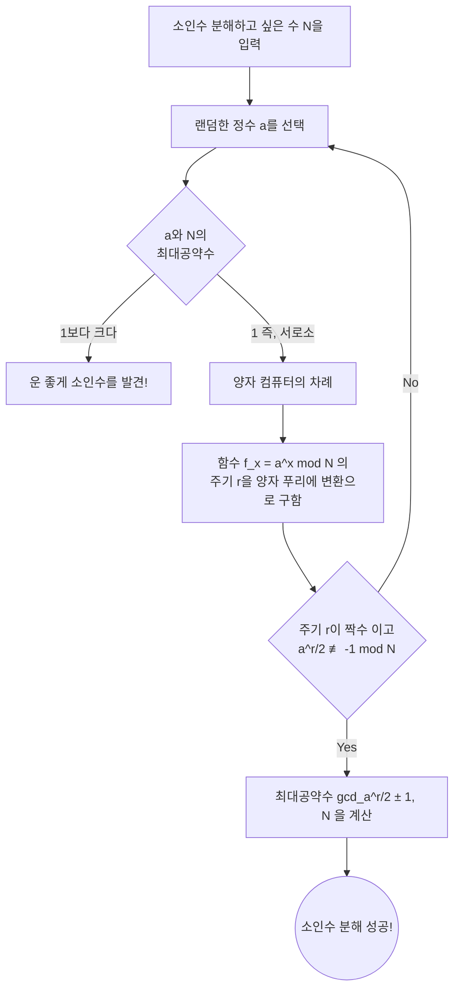

---

title: "양자 컴퓨터는 정말 RSA 암호를 파괴할 것인가? ~쇼어의 알고리즘과 현재의 도달점~"
tags: ["양자 컴퓨터", "암호 해독", "Shor의 알고리즘", "RSA"]
image: "quantum_breaking_rsa_1788613722990.jpg"
date: 2026-09-05T22:09:21+09:00
categories: ["수학・암호・양자"]
---

## 시작하며: 암호 기술과 양자 컴퓨터의 교차점

현대 인터넷 사회에서 통신의 비밀을 지키기 위한 기반이 되고 있는 것이 '공개키 암호'입니다. 그 중에서도 대표적인 것이 1977년 Ron Rivest, Adi Shamir, Leonard Adleman 세 사람에 의해 개발된 'RSA 암호'입니다. 우리가 매일 이용하는 온라인 쇼핑 결제, 웹사이트 열람(HTTPS), 이메일 송수신에 이르기까지 RSA 암호는 인터넷 인프라의 심장부로서 기능하고 있습니다.

그러나 '양자 컴퓨터'의 등장으로 인해 이러한 안전성이 근본부터 뒤집힐 가능성이 지적되고 있습니다. 미디어에서는 "양자 컴퓨터가 완성되면 전 세계의 비밀번호나 암호가 몇 초 만에 해독되어 버린다"는 등 선정적인 헤드라인이 장식되기도 합니다. 과연 그것은 사실일까요?

이 글에서는 고전적인 암호 해독 기법인 GNFS(일반 수체 체)와 양자 컴퓨터를 이용한 암호 해독 알고리즘의 결정판인 '쇼어의 알고리즘(Shor''s Algorithm)'의 구조를 깊이 파헤쳐 봅니다. 양자 푸리에 변환이나 주기 발견과 같은 고도의 개념을 알기 쉽게 해설하고, 현재의 NISQ(Noisy Intermediate-Scale Quantum) 시대에 있어서 양자 하드웨어의 현황과, 실제로 RSA-2048을 깨기 위해 필요한 난관들에 대해 상세히 검증해 보겠습니다.

---

## RSA 암호의 근간: 소인수 분해의 어려움

RSA 암호의 안전성은 수학에서의 매우 단순한 비대칭성에 의존하고 있습니다. 그것은 "두 개의 거대한 소수를 곱하는 것은 간단하지만, 그 곱한 결과(합성수)로부터 원래의 두 소수를 찾아내는(소인수 분해하는) 것은 극히 어렵다"는 사실입니다.

예를 들어, $ p = 61 $, $ q = 53 $ 이라는 두 개의 소수가 있다고 가정해 봅시다. 이 곱셈 $ N = p \times q = 3233 $ 을 계산하는 것은 순식간입니다. 하지만 '3233'이라는 숫자만 주어지고 "이것은 어느 소수와 어느 소수의 곱셈인가?"를 푸는 것은 숫자가 커질수록 계산량이 폭발적으로 증가합니다.

현재 주류가 되고 있는 RSA-2048에서는 키 길이가 2048비트, 즉 10진수로 약 617자리에 달하는 거대한 합성수 $ N $ 이 사용되고 있습니다. 이 $ N $ 을 소인수 분해할 수 있다면, 암호는 해독된 거나 다름없게 됩니다.

### 고전 컴퓨터의 도전: GNFS (일반 수체 체)

소인수 분해 문제를 풀기 위해 수학자나 암호학자들은 오랜 세월에 걸쳐 다양한 알고리즘을 개발해 왔습니다. 그 중에서도 고전 컴퓨터에서 현재 가장 빠르다고 여겨지는 것이 **일반 수체 체(GNFS: General Number Field Sieve)** 입니다.

GNFS는 거대한 수 $ N $ 을 소인수 분해하기 위해, 정수환에서의 계산을 더 추상적인 대수체(Number Field)로 확장하여 해석하는 기법입니다. 대략적인 흐름은 다음과 같습니다.

1. **다항식의 선택** : $ N $ 을 근으로 가지는, 적절한 차수와 계수를 가진 다항식 $ f(x) $ 를 찾습니다.
2. **데이터 수집(체질)** : 유리수체 및 대수체 위에서, 작은 소수(매끄러운 수, Smooth numbers)로 분해될 수 있는 수의 쌍을 대량으로 탐색합니다. 이 과정이 '체질(Sieving)'이라 불리며 가장 많은 시간을 필요로 하는 부분입니다.
3. **행렬의 생성과 축약** : 수집한 관계식을 바탕으로 거대한 희소 행렬(성분의 대부분이 0인 행렬)을 생성하고, 선형대수학적 기법(블록 란초스 방법 등)을 사용하여 해를 구합니다.
4. **제곱근의 계산** : 마지막으로 대수체 위에서 제곱근을 계산하여, $ N $ 의 인수(소인수)를 도출해 냅니다.

GNFS의 계산량은 점근적으로 $ O(\exp((\sqrt[3]{\frac{64}{9}} + o(1)) (\log N)^{\frac{1}{3}} (\log \log N)^{\frac{2}{3}})) $ 로 평가됩니다. 이는 '준지수함수적(Sub-exponential)' 시간 계산량이라 불립니다. 지수 시간보다는 빠르지만, 다항 시간(Polynomial time)보다는 훨씬 느린 계산량입니다.

실제로 2020년에는 국제적인 연구팀이 GNFS를 사용하여 RSA-250(829비트, 250자리 합성수)의 소인수 분해에 성공했습니다. 이 계산에는 전 세계의 컴퓨터 자원을 끌어모아 약 2700 CPU 코어 연도라는 방대한 계산 시간을 소모했습니다. 그러나 이것이 2048비트가 되면, 필요한 계산량은 우주의 수명의 수조 배로 부풀어 오른다고 언급되고 있어, 현재의 슈퍼컴퓨터를 아무리 병렬로 가동시킨다 해도 고전적인 기법으로는 현실적인 시간 내에 해독하는 것이 불가능합니다.

---

## 양자 컴퓨터의 비장의 카드: 쇼어의 알고리즘

여기서 등장하는 것이 1994년 피터 쇼어(Peter Shor)에 의해 발표된 '쇼어의 알고리즘'입니다. 이 알고리즘은 소인수 분해 문제를 양자 컴퓨터 상에서 **다항 시간** ( $ O((\log N)^3) $ ) 안에 풀 수 있다는 획기적인 것이었습니다. 준지수함수적 시간과 다항 시간의 차이는 결정적인 것이며, 이론상 양자 컴퓨터를 사용하면 RSA 암호는 완전히 파괴됨을 의미합니다.

### 쇼어의 알고리즘의 전체 흐름

쇼어의 알고리즘은 소인수 분해라는 문제를 직접 푸는 것이 아니라, 정수론의 정리를 이용하여 '주기 발견 문제(Period Finding Problem)'라는 별개의 문제로 변환하고, 그것을 양자 컴퓨터의 특성을 살려 고속으로 푸는 접근법을 취합니다.

### 단계 1: 소인수 분해에서 주기 발견 문제로의 환원 (고전적 처리)

알고리즘의 첫 단계는 고전 컴퓨터에서 이루어집니다.
소인수 분해하고자 하는 수 $ N $ 에 대해, $ N $ 과 서로소인(최대공약수가 1인) 랜덤한 정수 $ a $ ( $ 1 < a < N $ )를 선택합니다. 만약 우연히도 최대공약수가 1이 아니라면, 그 시점에서 찾은 공약수가 $ N $ 의 소인수이므로 해독 완료이지만 확률은 극히 낮습니다.

다음으로 이하의 모듈로 방정식 수열을 생각합니다.
$ f(x) = a^x \pmod N $

이 함수 $ f(x) $ 에 $ x = 1, 2, 3, \dots $ 를 대입해 가면 값은 무작위인 것처럼 보이지만, 유한한 범위 내에서 계산하고 있기 때문에 반드시 어딘가에서 원래 값으로 돌아오고 같은 수열을 반복합니다. 이 반복의 주기를 $ r $ 이라고 부릅니다. 즉,
$ a^r \equiv 1 \pmod N $
이 되는 최소의 양의 정수 $ r $ 을 찾는 문제, 이것이 '주기 발견 문제'입니다.

만약 이 주기 $ r $ 이 발견되고 $ r $ 이 짝수라면, $ a^r - 1 \equiv 0 \pmod N $ 이 되어 인수 분해 공식을 사용하여
$ (a^{r/2} - 1)(a^{r/2} + 1) \equiv 0 \pmod N $
와 같이 변형할 수 있습니다. 여기서 유클리드 호제법을 사용하여 $ N $ 과 $ a^{r/2} \pm 1 $ 의 최대공약수를 계산함으로써, $ N $ 의 소인수를 극히 높은 확률로 얻을 수 있습니다.

고전 컴퓨터로 주기 $ r $ 을 찾기 위해서는 결국 지수 시간적인 단계가 필요해져 고속화할 수 없습니다. 하지만 양자 컴퓨터라면 이 주기 $ r $ 을 순식간에(다항 시간 안에) 찾을 수 있는 것입니다.

### 단계 2: 양자 상태의 준비와 중첩

여기서부터 양자 컴퓨터가 나설 차례입니다.
양자 컴퓨터는 '0'과 '1'의 상태를 동시에 가질 수 있는 '양자 비트(Qubit)'를 사용합니다. 쇼어의 알고리즘에서는 입력을 저장하는 레지스터(제1 레지스터)와 계산 결과를 저장하는 레지스터(제2 레지스터) 두 가지를 준비합니다.

먼저 아다마르 게이트(Hadamard gate)라 불리는 양자 게이트 조작을 제1 레지스터의 모든 양자 비트에 적용합니다. 이로써 제1 레지스터는 생각할 수 있는 모든 $ x $ 의 값( $ 0 $ 부터 $ 2^n-1 $ 까지. $ n $ 은 충분히 큰 비트 수)의 **균등한 중첩 상태** 가 됩니다.

즉, 양자 컴퓨터의 내부에는 $ x=0, 1, 2, 3, \dots $ 이라는 무수한 입력값이 동시에 병행하여 존재하고 있는 상태가 만들어집니다.

### 단계 3: 양자 모듈로 거듭제곱 (Quantum Modular Exponentiation)

다음으로 제1 레지스터의 중첩 상태를 입력으로 하여 $ f(x) = a^x \pmod N $ 을 계산하고, 그 결과를 제2 레지스터에 저장합니다.
이 계산은 양자 회로 상의 유니터리 변환으로서 실행되기 때문에, 중첩이 유지된 채 모든 $ x $ 에 대한 $ f(x) $ 의 계산이 '동시 병행적으로(양자 병렬성)' 이루어집니다.

이 시점에서의 양자 시스템 전체의 공간은,
$ |x, a^x \bmod N\rangle $
이라는 상태의 방대한 중첩으로 되어 있습니다.

그러나 여기서 단순히 제2 레지스터를 측정(관측)해 버리면, 랜덤한 $ a^x \bmod N $ 의 값이 단 하나만 확률적으로 선택되고, 그에 연동되어 제1 레지스터의 $ x $ 도 하나로 확정되어 버립니다. 이래서는 고전 컴퓨터로 한 번 계산한 것과 다를 바 없어, 주기 $ r $ 을 찾을 수 없습니다.

양자역학의 규칙에서는 중첩 상태의 내용을 직접 들여다보는 것은 불가능합니다. 그렇다면 어떻게 전체의 '주기'라는 전역적인(global) 정보를 추출하는 것일까요?

### 단계 4: 양자 푸리에 변환 (QFT: Quantum Fourier Transform)

이 벽을 돌파하는 쇼어 알고리즘의 진면목이 바로 제1 레지스터에 대한 **양자 푸리에 변환(QFT)** 의 적용입니다.

측정을 실시하기 전에, 함수 $ f(x) $ 의 파동적 성질을 해석합니다. 제2 레지스터를 관측했다고 가정해 봅시다. 어떤 값 $ y $ 를 얻었다고 합시다. 그러면 제1 레지스터의 상태는 "$ a^x \pmod N = y $ 가 되는 모든 $ x $ 의 중첩"으로 수축됩니다.
이 $ x $ 의 값은 $ x_0, x_0 + r, x_0 + 2r, x_0 + 3r, \dots $ 와 같이 주기 $ r $ 의 간격으로 이산적으로 나열된 상태(일종의 빗 모양의 확률 진폭 분포)가 됩니다.

이 상태에 대해 양자 푸리에 변환(QFT)을 적용합니다. 고전적인 이산 푸리에 변환이 시간 영역의 신호를 주파수 영역으로 변환하듯이, QFT는 양자 상태의 확률 진폭에 간섭을 일으킵니다.

QFT를 걸면 양자 간섭 효과에 의해 주기 $ r $ 과 공명하지 않는(위상이 맞지 않는) 잘못된 답의 확률은 서로 상쇄되어 0에 가까워지고(상쇄 간섭), 주기 $ r $ 의 정보를 가진 올바른 답의 확률만이 증폭됩니다(보강 간섭).

### 단계 5: 측정과 연분수 전개 (고전적 후처리)

QFT 적용 후에 제1 레지스터를 측정하면, 매우 높은 확률로 $ c \approx \frac{j \cdot 2^n}{r} $ 이라는 형태에 가까운 정수 $ c $ 를 얻게 됩니다( $ j $ 는 미지의 정수, $ 2^n $ 은 레지스터의 크기).

이 측정 결과 $ c $ 를 고전 컴퓨터로 가져와서 $ \frac{c}{2^n} \approx \frac{j}{r} $ 이라는 분수를 만듭니다. 그리고 수학적 기법인 '연분수 전개(Continued fraction expansion)'를 사용하여 근사치를 계산함으로써 분모인 주기 $ r $ 을 멋지게 찾아낼 수 있습니다.

$ r $ 을 알게 되면, 남은 것은 단계 1의 공식을 사용하여 $ N $ 의 소인수를 계산하기만 하면 되며 RSA 암호는 완전히 해독됩니다.

---

## 현재의 양자 컴퓨터(NISQ)의 실력과 과제

이론적으로는 완벽한 쇼어의 알고리즘이지만, "내일이라도 당장 RSA 암호가 깨지는가?"라고 묻는다면 답은 명확히 "아니오"입니다. 그 이유는 현재의 양자 컴퓨터의 하드웨어 기술의 한계에 있습니다.

### NISQ (Noisy Intermediate-Scale Quantum) 시대

현재 우리가 살고 있는 것은 'NISQ'라 불리는 시대입니다. NISQ 디바이스는 수십에서 수백 개의 물리 양자 비트를 가지지만, 노이즈에 대해 극히 취약합니다.

양자 비트는 열이나 전자파 등의 외부 환경의 영향을 받기 쉬워, 양자 상태가 깨져 버리는 '결어긋남(Decoherence, 양자 얽힘 상실)'이나 게이트 조작 시의 '게이트 에러'가 빈번하게 발생합니다. 쇼어의 알고리즘과 같이 매우 깊은(연산 단계 수가 방대한) 양자 회로를 실행하려고 하면, 계산 도중에 에러가 축적되어 최종적인 출력은 의미를 가지지 않는 완전한 노이즈가 되어 버립니다.

### 물리 양자 비트와 논리 양자 비트

이 에러 문제를 해결하기 위해 필수불가결한 것이 '양자 오류 정정(Quantum Error Correction)'입니다.
고전 컴퓨터에서도 오류 정정 코드가 사용되고 있지만, 양자 상태의 복제를 금지하는 '복제 불가능성 정리(No-cloning theorem)'가 있기 때문에 양자 오류 정정은 매우 복잡합니다.

양자 오류 정정에서는 '표면 부호(Surface Code)' 등의 기술을 이용하여, 다수의 노이즈투성이인 '물리 양자 비트'를 조합함으로써 에러가 없는 이상적인 하나의 '논리 양자 비트'를 만들어 냅니다.

현재의 에러율을 전제로 하면, 하나의 논리 양자 비트를 만들기 위해서는 약 1,000~10,000개의 물리 양자 비트가 필요해진다고 추산되고 있습니다. 이를 '오류 정정의 오버헤드'라고 부릅니다.

### RSA-2048을 파괴하기 위해 필요한 자원이란?

그렇다면 실제로 RSA-2048을 해독하기 위해, 쇼어의 알고리즘을 구동시키려면 어느 정도의 자원이 필요할까요?

Craig Gidney (Google) 와 Martin Ekerå 의 2021년 논문에 따른 획기적인 자원 추정에 의하면, 최적화된 쇼어의 알고리즘을 사용하고 표면 부호에 의한 오류 정정을 수행할 경우 다음과 같은 자원이 필요하다고 합니다.

* **논리 양자 비트 수** : 약 4,096 개
* **물리 양자 비트 수** : **약 2000만 개** (에러율 $10^{-3}$ 정도를 가정)
* **계산 시간** : 약 8시간 (물리 게이트 조작이 수백만~수십억 회 필요)

이에 반해, 현재의 양자 하드웨어의 도달점은 어떨까요?
2023년 말에 IBM이 발표한 초전도 양자 프로세서 'Condor(콘도르)'는 1,121 양자 비트입니다. 또한 논리 양자 비트의 생성과 관련된 획기적인 연구(하버드 대학이나 QuEra사 등에 의한 중성 원자 양자 컴퓨터를 이용한 48개의 논리 양자 비트 생성 등)도 등장하고 있지만, 아직 "노이즈 없는 완벽한 연산"을 장시간 연속으로 실행할 수 있는 단계에는 이르지 못했습니다.

수천 개의 물리 양자 비트에서 **2000만 개**의 실용적인 물리 양자 비트(게다가 상호 결선되어 극저온에서 안정적으로 동작하고 초고속으로 제어 신호를 처리할 수 있는 시스템)로의 스케일업은 공학적으로 엄청난 장벽(배선 문제, 냉각 능력의 한계, 제어 전자장치의 비대화)이 존재합니다. 많은 전문가들은 RSA-2048을 해독할 수 있는 '결함 허용(Fault-Tolerant) 양자 컴퓨터(FTQC)'가 실현되려면 적어도 10년에서 30년, 혹은 그 이상의 세월이 필요하다고 예측하고 있습니다.

---

## 다가오는 'Store Now, Decrypt Later'의 위협과 PQC의 여명

"아직 10년 이상 걸린다면 안심이다"라고 생각하는 것은 시기상조입니다. 현재 국가 기밀정보나 의료 데이터, 장기적인 인프라 설계 등 수십 년 후까지 비밀을 보장해야만 하는 데이터가 존재합니다.

여기서 우려되고 있는 것이 바로 **'Store Now, Decrypt Later (지금 저장하고, 나중에 해독한다)'** 는 공격 기법입니다. 악의가 있는 국가나 조직이 현재의 RSA나 ECC(타원곡선암호)로 암호화된 통신 데이터를 모두 도청하여 스토리지에 저장해 두는 것입니다. 그리고 10년 후, 20년 후에 강력한 양자 컴퓨터가 완성되는 순간에 쇼어의 알고리즘을 사용하여 과거의 데이터를 모두 해독해내어 비밀을 폭로한다는 기법입니다.

이러한 타임 래그의 위협에 대항하기 위해 NIST(미국 국립표준기술연구소)를 중심으로 **'양자 내성 암호 (PQC: Post-Quantum Cryptography)'** 의 표준화 프로세스가 급피치로 진행되어 왔습니다.

PQC는 양자 컴퓨터를 이용하더라도 해독이 곤란한(즉, 쇼어의 알고리즘을 적용할 수 없는) 수학적 문제를 기반으로 한 새로운 암호 알고리즘입니다. 주요 접근법으로는 다음과 같은 것들이 있습니다.

* **격자 암호 (Lattice-based cryptography)** : LWE(Learning with Errors) 문제 등을 기초로 합니다. NIST의 표준화에서 주류 (Kyber, Dilithium 등).
* **부호 기반 암호 (Code-based cryptography)** : 오류 정정 부호의 복호 문제의 어려움에 의존합니다.
* **다변수 다항식 암호 (Multivariate cryptography)** : 다변수의 연립 이차방정식을 푸는 어려움에 의존합니다.
* **해시 기반 서명 (Hash-based signatures)** : 해시 함수의 안전성에만 의존하는 디지털 서명입니다.

이미 Google Chrome이나 Apple의 iMessage 등 주요 소프트웨어나 플랫폼에서는 PQC의 도입 테스트나 하이브리드 구현이 시작되었습니다.

## 마치며

양자 컴퓨터는 SF 세계의 꿈 같은 이야기에서 현실적인 공학적 도전으로 넘어가고 있습니다. 쇼어의 알고리즘은 수학과 양자역학이 융합된 인류의 위대한 지적 성과이지만, 동시에 우리 디지털 사회의 기반을 뒤흔드는 '파괴적인 힘'을 간직하고 있습니다.

RSA 암호가 내일 당장 쓰지 못하게 되는 것은 아닙니다. 하지만 양자 기술의 진화와 'Store Now, Decrypt Later'의 리스크를 감안한다면, PQC로의 이행이라는 암호 역사에 남을 대규모의 마이그레이션은 이미 시작되었습니다. 우리는 지금 정보 보안의 패러다임 시프트의 최전선을 목격하고 있는 것입니다.
