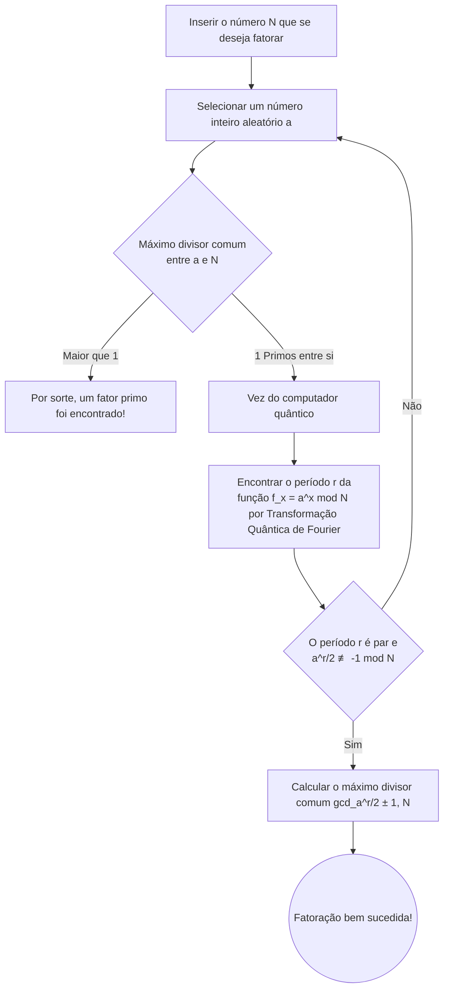

## Introdução: A Interseção entre Criptografia e Computadores Quânticos

Na sociedade da internet moderna, a base para proteger o segredo das comunicações é a "criptografia de chave pública". Um dos mais representativos é a "Criptografia RSA", desenvolvida em 1977 por Ron Rivest, Adi Shamir e Leonard Adleman. Desde pagamentos de compras online que usamos diariamente, navegação em sites (HTTPS), até envio e recebimento de e-mails, a criptografia RSA funciona como o coração da infraestrutura da internet.

No entanto, com o surgimento dos "computadores quânticos", foi apontado que essa segurança pode ser subvertida desde a base. Na mídia, às vezes vemos manchetes sensacionalistas como "Se um computador quântico for concluído, senhas e criptografias em todo o mundo serão decifradas em segundos". Mas será que isso é verdade?

Neste artigo, aprofundaremos como funcionam o GNFS (General Number Field Sieve), um método clássico de descriptografia, e a versão definitiva dos algoritmos de descriptografia usando computadores quânticos, o "Algoritmo de Shor (Shor's Algorithm)". Explicaremos de forma fácil conceitos avançados, como a transformação quântica de Fourier e a descoberta de períodos, e examinaremos em detalhes o estado atual do hardware quântico na era NISQ (Noisy Intermediate-Scale Quantum) e os obstáculos reais necessários para quebrar a RSA-2048.

---

## O Núcleo da Criptografia RSA: A Dificuldade da Fatoração em Números Primos

A segurança da criptografia RSA depende de uma assimetria extremamente simples na matemática. Trata-se do fato de que "é fácil multiplicar dois números primos gigantes, mas é extremamente difícil encontrar (fatorar em números primos) os dois números primos originais a partir do resultado dessa multiplicação (número composto)".

Por exemplo, suponha que existam dois números primos, $ p = 61 $ e $ q = 53 $. Calcular esta multiplicação $ N = p \times q = 3233 $ é instantâneo. No entanto, se receber apenas o número "3233" e tiver que resolver "de quais números primos essa é a multiplicação?", a quantidade de cálculos explode à medida que o número se torna maior.

No RSA-2048, que é a norma atual, o comprimento da chave é de 2048 bits, ou seja, é usado um número composto gigante $ N $ que chega a cerca de 617 dígitos em decimal. Se esse $ N $ puder ser fatorado em números primos, a criptografia será essencialmente decifrada.

### O Desafio dos Computadores Clássicos: GNFS (General Number Field Sieve)

Para resolver o problema da fatoração em números primos, matemáticos e criptógrafos desenvolveram vários algoritmos ao longo dos anos. Entre eles, o que atualmente é considerado o mais rápido em computadores clássicos é o **GNFS: General Number Field Sieve**.

O GNFS é um método que expande e analisa os cálculos no anel de inteiros para um corpo algébrico (Number Field) mais abstrato, a fim de fatorar o número gigante $ N $. O fluxo geral é o seguinte.

1. **Seleção de Polinômio** : Encontrar um polinômio $ f(x) $ com grau e coeficientes apropriados, que tenha $ N $ como raiz.
2. **Coleta de Dados (Peneiramento)** : No corpo dos números racionais e no corpo algébrico, procuramos em grande quantidade por pares de números que podem ser decompostos em números primos pequenos (números suaves, Smooth numbers). Esse processo é chamado de "peneiramento" e é a parte que leva mais tempo.
3. **Geração e Redução de Matriz** : Com base nas relações coletadas, uma enorme matriz esparsa (uma matriz em que a maioria dos componentes é zero) é gerada e resolvida usando métodos de álgebra linear (como o método de Block Lanczos).
4. **Cálculo da Raiz Quadrada** : Finalmente, calcula-se a raiz quadrada no corpo algébrico para derivar os fatores (fatores primos) de $ N $.

A complexidade computacional do GNFS é avaliada não assintoticamente como $ O(\exp((\sqrt[3]{\frac{64}{9}} + o(1)) (\log N)^{\frac{1}{3}} (\log \log N)^{\frac{2}{3}})) $. Isso é chamado de complexidade de tempo "Sub-exponencial" (Sub-exponential). Embora seja mais rápido que o tempo exponencial, é muito mais lento que o tempo polinomial (Polynomial time).

De fato, em 2020, uma equipe de pesquisa internacional obteve sucesso em fatorar a RSA-250 (829 bits, número composto de 250 dígitos) usando o GNFS. Esse cálculo consumiu um tempo computacional enorme, equivalente a cerca de 2700 CPU-core anos, reunindo recursos de computação de todo o mundo. No entanto, quando isso chega a 2048 bits, é mencionado que a quantidade de cálculo necessária explodiria para trilhões de vezes a idade do universo, tornando impossível descriptografar em um tempo realista com métodos clássicos, não importa quantos supercomputadores atuais funcionem em paralelo.

---

## O Trunfo do Computador Quântico: Algoritmo de Shor

Aqui é onde entra o "Algoritmo de Shor", publicado por Peter Shor em 1994. Esse algoritmo foi revolucionário por permitir que o problema de fatoração em números primos fosse resolvido no computador quântico em **tempo polinomial** ( $ O((\log N)^3) $ ). A diferença entre tempo sub-exponencial e polinomial é decisiva e significa, na teoria, que a criptografia RSA será completamente destruída se um computador quântico for usado.

### Fluxo Geral do Algoritmo de Shor

O algoritmo de Shor não resolve o problema da fatoração em números primos diretamente, mas usa teoremas da teoria dos números para convertê-lo em outro problema chamado "Problema de Descoberta de Período" (Period Finding Problem) e, em seguida, resolve isso rapidamente aproveitando as características do computador quântico.

### Passo 1: Redução da Fatoração ao Problema de Descoberta de Período (Processamento Clássico)

O primeiro passo do algoritmo é feito em um computador clássico.
Para o número $ N $ que se deseja fatorar, escolhe-se um número inteiro aleatório $ a $ ( $ 1 < a < N $ ) que seja co-primo (com o máximo divisor comum igual a 1) com $ N $. Se por acaso o máximo divisor comum não for 1, o divisor comum encontrado nesse momento já é um fator de $ N $, e a fatoração está concluída, mas a probabilidade é extremamente baixa.

Em seguida, considere a sequência das seguintes equações modulares:
$ f(x) = a^x \pmod N $

Substituindo $ x = 1, 2, 3, \dots $ nesta função $ f(x) $, os valores parecem aleatórios, mas como são calculados em um limite finito, eles sempre voltarão ao valor original em algum ponto, repetindo a mesma sequência de números. Este ciclo de repetição é chamado de período $ r $. Ou seja,
O problema de encontrar o menor número inteiro positivo $ r $ tal que $ a^r \equiv 1 \pmod N $, este é o "Problema de Descoberta de Período".

Se este período $ r $ for encontrado, e $ r $ for um número par, então $ a^r - 1 \equiv 0 \pmod N $, e usando a fórmula de fatoração,
pode ser transformado em $ (a^{r/2} - 1)(a^{r/2} + 1) \equiv 0 \pmod N $. A partir daqui, ao calcular o máximo divisor comum entre $ N $ e $ a^{r/2} \pm 1 $ usando o algoritmo de Euclides, um fator de $ N $ pode ser obtido com uma probabilidade extremamente alta.

Para encontrar o período $ r $ em um computador clássico, no final, etapas exponenciais são necessárias e isso não pode ser acelerado. No entanto, com um computador quântico, este período $ r $ pode ser encontrado em um instante (tempo polinomial).

### Passo 2: Preparação e Superposição do Estado Quântico

A partir daqui é a vez do computador quântico.
Os computadores quânticos usam "qubits", que podem ter o estado "0" e "1" simultaneamente. No algoritmo de Shor, são preparados dois registradores: o primeiro para armazenar a entrada e o segundo para os resultados do cálculo.

Primeiro, uma operação de porta quântica chamada porta de Hadamard (Hadamard gate) é aplicada a todos os qubits do primeiro registrador. Isso coloca o primeiro registrador em um **estado de superposição uniforme** de todos os valores concebíveis de $ x $ (de $ 0 $ a $ 2^n-1 $. $ n $ é um número de bits suficientemente grande).

Em outras palavras, dentro do computador quântico, é criado um estado em que incontáveis valores de entrada como $ x=0, 1, 2, 3, \dots $ existem em paralelo ao mesmo tempo.

### Passo 3: Exponenciação Modular Quântica (Quantum Modular Exponentiation)

Em seguida, o estado de superposição do primeiro registrador é usado como entrada para calcular $ f(x) = a^x \pmod N $, e o resultado é armazenado no segundo registrador.
Como este cálculo é executado como uma transformação unitária no circuito quântico, o cálculo de $ f(x) $ para todos os $ x $ é feito de forma "paralela (paralelismo quântico)" enquanto a superposição é mantida.

O espaço do sistema quântico inteiro neste ponto,
torna-se uma enorme superposição de estados $ |x, a^x \bmod N\rangle $.

No entanto, se você simplesmente medir (observar) o segundo registrador aqui, um valor aleatório de $ a^x \bmod N $ será probabilisticamente selecionado, e em conjunto com isso, o $ x $ do primeiro registrador também será determinado. Isso não é diferente de calcular uma vez em um computador clássico, e você não conseguirá encontrar o período $ r $.

Nas regras da mecânica quântica, você não pode observar o conteúdo de um estado de superposição diretamente. Então, como extrair a informação global chamada "período"?

### Passo 4: Transformada Quântica de Fourier (QFT: Quantum Fourier Transform)

O verdadeiro valor do algoritmo de Shor, que supera esse obstáculo, é a aplicação da **Transformada Quântica de Fourier (QFT)** ao primeiro registrador.

Antes de medir, analisamos a natureza da onda da função $ f(x) $. Vamos supor que o segundo registrador foi observado. Suponha que um valor $ y $ foi obtido. Então, o estado do primeiro registrador encolhe para "a superposição de todos os $ x $ tais que $ a^x \pmod N = y $".
O valor deste $ x $ estará em um estado discreto com intervalos do período $ r $ (uma espécie de distribuição de amplitude de probabilidade em forma de pente), como $ x_0, x_0 + r, x_0 + 2r, x_0 + 3r, \dots $.

Aplicamos a Transformada Quântica de Fourier (QFT) a este estado. Assim como a Transformada Discreta de Fourier clássica converte sinais no domínio do tempo para o domínio da frequência, a QFT faz com que as amplitudes de probabilidade do estado quântico interfiram.

Quando a QFT é aplicada, devido ao efeito de interferência quântica, as probabilidades de respostas incorretas que não ressoam com o período $ r $ (fases não alinhadas) se cancelam mutuamente chegando perto de zero (interferência destrutiva), e apenas as probabilidades da resposta correta contendo a informação do período $ r $ são amplificadas (interferência construtiva).

### Passo 5: Medição e Fração Contínua (Pós-processamento Clássico)

Após aplicar a QFT, se você medir o primeiro registrador, com uma probabilidade muito alta, um número inteiro $ c $ próximo à forma $ c \approx \frac{j \cdot 2^n}{r} $ será obtido ( $ j $ é um inteiro desconhecido, e $ 2^n $ é o tamanho do registrador).

Trazendo o resultado desta medição $ c $ de volta para um computador clássico, criamos uma fração $ \frac{c}{2^n} \approx \frac{j}{r} $. Em seguida, usando o método matemático da "Expansão de Fração Contínua" (Continued fraction expansion) para calcular valores aproximados, podemos descobrir o período $ r $, que é o denominador.

Uma vez conhecido o $ r $, o resto é calcular os fatores de $ N $ usando a fórmula do Passo 1, e a criptografia RSA é completamente quebrada.

---

## A Força e os Desafios do Computador Quântico Atual (NISQ)

Embora teoricamente o algoritmo de Shor seja perfeito, se perguntado "A criptografia RSA será quebrada amanhã?", a resposta é claramente "Não". O motivo está nas limitações da tecnologia de hardware dos computadores quânticos atuais.

### A Era NISQ (Noisy Intermediate-Scale Quantum)

A era em que nos encontramos atualmente é chamada de "NISQ". Dispositivos NISQ possuem dezenas a centenas de qubits físicos, mas são extremamente vulneráveis ao ruído.

Os qubits são facilmente afetados pelo ambiente externo, como calor e ondas eletromagnéticas, e ocorrem frequentemente "decoerência" (perda de emaranhamento quântico), onde o estado quântico se quebra, e "erros de porta" durante as operações. Quando se tenta executar um circuito quântico muito profundo (com um número enorme de passos operacionais) como o algoritmo de Shor, os erros se acumulam durante o cálculo e a saída final torna-se puro ruído sem significado.

### Qubit Físico e Qubit Lógico

O que é essencial para resolver este problema de erros é a "Correção de Erros Quânticos" (Quantum Error Correction).
Embora códigos de correção de erros também sejam usados em computadores clássicos, devido ao "teorema da não-clonagem", que proíbe a cópia de estados quânticos, a correção de erros quânticos é extremamente complexa.

Na correção de erros quânticos, utilizando tecnologias como "Código de Superfície" (Surface Code), muitos "qubits físicos" ruidosos são combinados para criar um "qubit lógico" ideal e livre de erros.

Assumindo a taxa de erro atual, estima-se que cerca de 1.000 a 10.000 qubits físicos seriam necessários para criar um único qubit lógico. Isso é chamado de "overhead da correção de erros".

### Que Recursos são Necessários para Quebrar a RSA-2048?

Então, para realmente descriptografar a RSA-2048, quantos recursos seriam necessários para rodar o algoritmo de Shor?

Em uma estimativa inovadora de recursos em um artigo de 2021 de Craig Gidney (Google) e Martin Ekerå, foi afirmado que se um algoritmo de Shor otimizado fosse usado, e correção de erros com código de superfície fosse realizada, os seguintes recursos seriam necessários:

* **Número de qubits lógicos** : Aproximadamente 4.096
* **Número de qubits físicos** : **Aproximadamente 20 milhões** (assumindo uma taxa de erro de $10^{-3}$)
* **Tempo de cálculo** : Aproximadamente 8 horas (milhões a bilhões de operações físicas de porta necessárias)

Em contraste com isso, qual é o nível que o hardware quântico atual alcançou?
O processador quântico supercondutor "Condor", anunciado pela IBM no final de 2023, possui 1.121 qubits. Além disso, pesquisas inovadoras sobre a geração de qubits lógicos têm aparecido (como a geração de 48 qubits lógicos usando computadores quânticos de átomos neutros pela Universidade de Harvard, QuEra, etc.), mas ainda não chegamos no estágio de conseguir executar "cálculos perfeitos e sem ruído" continuamente por longos períodos.

Passar de alguns milhares de qubits físicos para **20 milhões** de qubits físicos práticos (que estão interconectados, operam de forma estável em temperaturas ultrabaixas e podem processar sinais de controle em velocidades ultrarrápidas) apresenta uma enorme barreira na engenharia (problemas de fiação, limites da capacidade de refrigeração e inchaço da eletrônica de controle). Muitos especialistas preveem que levará pelo menos 10 a 30 anos, ou mais, até que um "Computador Quântico Tolerante a Falhas" (FTQC - Fault-Tolerant Quantum Computer), capaz de quebrar a RSA-2048, se torne uma realidade.

---

## A Ameaça Silenciosa de "Store Now, Decrypt Later" e o Amanhecer da PQC

Concluir que "estamos seguros porque ainda levará mais de 10 anos" é precipitado. Atualmente, existem dados que devem ser mantidos em segredo por décadas no futuro, como segredos de estado, dados médicos e projetos de infraestrutura de longo prazo.

A preocupação aqui é o método de ataque chamado **"Store Now, Decrypt Later" (Armazene Agora, Descriptografe Depois)**. Nações ou organizações mal-intencionadas interceptam todos os dados de comunicação atualmente criptografados usando RSA ou ECC (Criptografia de Curva Elíptica) e os guardam no armazenamento. E então, no momento em que um poderoso computador quântico for concluído em 10 ou 20 anos, eles usarão o algoritmo de Shor para descriptografar todos os dados do passado e expor os segredos.

Para combater essa ameaça de tempo, liderado pelo NIST (Instituto Nacional de Padrões e Tecnologia dos EUA), o processo de padronização da **"Criptografia Pós-Quântica" (PQC: Post-Quantum Cryptography)** tem sido acelerado em ritmo acelerado.

A PQC é um novo algoritmo de criptografia baseado em problemas matemáticos que são difíceis de descriptografar mesmo usando um computador quântico (ou seja, o algoritmo de Shor não pode ser aplicado). Como principais abordagens, temos:

* **Criptografia baseada em reticulados (Lattice-based cryptography)** : Baseado em problemas como LWE (Learning with Errors). O método dominante na padronização do NIST (Kyber, Dilithium, etc.).
* **Criptografia baseada em códigos (Code-based cryptography)** : Depende da dificuldade do problema de decodificação de códigos corretores de erro.
* **Criptografia polinomial multivariável (Multivariate cryptography)** : Depende da dificuldade de resolver equações quadráticas simultâneas multivariáveis.
* **Assinaturas baseadas em hash (Hash-based signatures)** : Assinaturas digitais que dependem exclusivamente da segurança das funções de hash.

Testes de implementação e implementações híbridas da PQC já foram iniciados nos principais softwares e plataformas, como o Google Chrome e o iMessage da Apple.

## Conclusão

Os computadores quânticos estão passando de histórias de ficção científica para desafios reais de engenharia. O algoritmo de Shor é uma grande conquista intelectual da humanidade que mescla a matemática e a mecânica quântica, mas, ao mesmo tempo, guarda um "poder destrutivo" para sacudir as bases da nossa sociedade digital.

Isso não significa que a criptografia RSA se tornará inutilizável a partir de amanhã. No entanto, considerando a evolução da tecnologia quântica e o risco do "Store Now, Decrypt Later", a grande migração que ficará na história da criptografia - a transição para a PQC - já começou. Agora estamos testemunhando a linha de frente de uma mudança de paradigma na segurança da informação.
