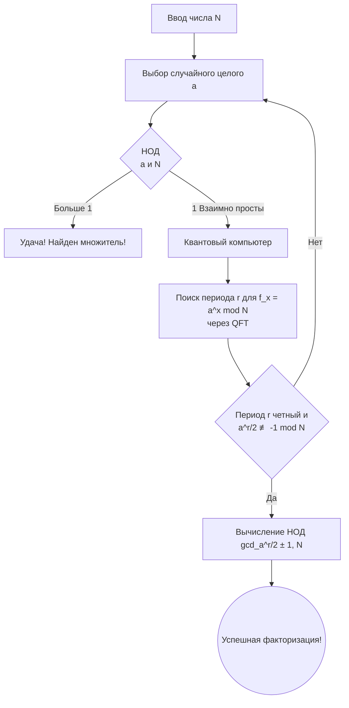

## Введение: Пересечение криптографии и квантовых компьютеров

В современном интернет-обществе основой защиты секретности связи является «криптография с открытым ключом». Наиболее представительным является шифрование RSA, разработанное в 1977 году Роном Ривестом, Ади Шамиром и Леонардом Адлеманом. От покупок в Интернете и просмотра веб-сайтов (HTTPS) до отправки и получения электронной почты, шифрование RSA служит сердцем интернет-инфраструктуры.

Однако появление «квантовых компьютеров» указывает на возможность того, что эта безопасность может быть разрушена на корню. В СМИ иногда появляются сенсационные заголовки, такие как «Как только квантовый компьютер будет готов, все пароли в мире будут расшифрованы за секунды». Так ли это на самом деле?

В этой статье подробно рассматривается механизм GNFS (Общий метод решета числового поля) как классический метод дешифрования, а также окончательный алгоритм дешифрования с использованием квантовых компьютеров — «Алгоритм Шора» (Shor's Algorithm). Мы доступно объясним такие концепции, как квантовое преобразование Фурье и поиск периода, и подробно рассмотрим текущее состояние аппаратного обеспечения в эпоху NISQ (Noisy Intermediate-Scale Quantum) и реальные препятствия для взлома RSA-2048.

---

## Основа RSA: Сложность факторизации

Безопасность RSA зависит от математической асимметрии: «Легко перемножить два гигантских простых числа, но крайне сложно найти (факторизовать) исходные простые числа из результата (составного числа)».

Например, пусть есть $ p = 61 $ и $ q = 53 $. Вычисление $ N = p \times q = 3233 $ мгновенно. Однако, если дано только «3233» и нужно найти исходные простые числа, факторизация требует экспоненциально больше вычислений с ростом числа.

В текущем стандарте RSA-2048 используется составное число $ N $ длиной 2048 бит (около 617 десятичных цифр). Если мы сможем факторизовать $ N $, шифр будет взломан.

### Классический подход: GNFS (Общий метод решета числового поля)

Для факторизации математики разрабатывали различные алгоритмы. Самым быстрым для классических компьютеров в настоящее время является ** GNFS (General Number Field Sieve) **.

GNFS расширяет вычисления в кольце целых чисел до более абстрактного алгебраического числового поля. Основные этапы:
1. ** Выбор полинома **: Найти полином $ f(x) $, корнем которого является $ N $.
2. ** Сбор данных (просеивание) **: Найти много пар чисел, разложимых на малые простые (гладкие числа). Это самый долгий этап.
3. ** Генерация и редукция матрицы **: Создать гигантскую разреженную матрицу и решить её методами линейной алгебры.
4. ** Вычисление квадратного корня **: Найти факторы (простые множители) $ N $.

Сложность вычисляется как $ O(\exp((\sqrt[3]{\frac{64}{9}} + o(1)) (\log N)^{\frac{1}{3}} (\log \log N)^{\frac{2}{3}})) $ — это «субэкспоненциальное» время.

В 2020 году исследователи успешно факторизовали RSA-250 (829 бит) с помощью GNFS, потратив около 2700 процессоро-лет. Но для 2048 бит требуемые вычисления превышают возраст Вселенной в триллионы раз, что делает классические методы непрактичными.

---

## Козырь квантовых компьютеров: Алгоритм Шора

В 1994 году Питер Шор представил «алгоритм Шора», который решает проблему факторизации на квантовом компьютере за ** полиномиальное время ** ($ O((\log N)^3) $). Это теоретически означает полный взлом RSA.

### Общая схема алгоритма Шора

### Шаг 1: Сведение к поиску периода (Классическая часть)
Выбираем $ a $, взаимно простое с $ N $. Рассмотрим последовательность:
$ f(x) = a^x \pmod N $
Эта функция периодична, и задача — найти её период $ r $. Если период $ r $ найден и он четный, то с помощью:
$ (a^{r/2} - 1)(a^{r/2} + 1) \equiv 0 \pmod N $
и алгоритма Евклида мы можем легко найти факторы $ N $.

### Шаг 2: Суперпозиция
Квантовый компьютер готовит два регистра. С помощью вентилей Адамара первый регистр переводится в ** состояние равномерной суперпозиции ** всех возможных значений $ x $.

### Шаг 3: Квантовое модульное возведение в степень
Параллельно для всех состояний суперпозиции вычисляется $ a^x \pmod N $.

### Шаг 4: Квантовое преобразование Фурье (QFT)
Чтобы извлечь информацию о периоде, применяется ** QFT ** к первому регистру. Благодаря конструктивной и деструктивной интерференции, вероятности неправильных периодов гасятся, а вероятность правильного периода $ r $ усиливается.

### Шаг 5: Измерение и непрерывные дроби
После применения QFT измерение первого регистра дает значение, из которого классическим методом непрерывных дробей находится точный период $ r $. Имея $ r $, мы получаем множители $ N $.

---

## Возможности и проблемы эпохи NISQ

Будет ли RSA взломан завтра? Ответ — однозначное «Нет», из-за аппаратных ограничений.

### Эпоха NISQ
Мы находимся в эре устройств NISQ с десятками/сотнями физических кубитов, подверженных сильному шуму. Декогеренция и ошибки вентилей разрушают результаты сложных алгоритмов вроде алгоритма Шора.

### Физические и логические кубиты
Для исправления ошибок требуется "квантовая коррекция ошибок" (например, Surface Code). Для создания одного идеального логического кубита требуется от 1000 до 10000 физических кубитов (оверхед).

### Ресурсы для взлома RSA-2048
По оценкам 2021 года от Craig Gidney и Martin Ekerå, для взлома RSA-2048 потребуется:
* ** Логические кубиты **: ~ 4,096
* ** Физические кубиты **: ** ~ 20 миллионов ** (при уровне ошибок $10^{-3}$)
* ** Время вычислений **: ~ 8 часов

В конце 2023 года IBM представила процессор "Condor" с 1,121 кубитом. Масштабирование до ** 20 миллионов ** практических кубитов связано с колоссальными инженерными барьерами. Большинство экспертов считают, что для создания отказоустойчивого квантового компьютера (FTQC) потребуется от 10 до 30 лет или больше.

---

## Угроза "Store Now, Decrypt Later" и эра PQC

Считать, что можно расслабиться на 10 лет, преждевременно. Существует угроза ** "Store Now, Decrypt Later" (Сохрани сейчас, расшифруй позже) **. Злоумышленники собирают и хранят зашифрованные данные, чтобы расшифровать их, как только квантовые компьютеры станут доступны.

В ответ на эту угрозу NIST ускоряет стандартизацию ** Постквантовой криптографии (PQC: Post-Quantum Cryptography) **.
Основные направления PQC:
* ** Криптография на решетках (Lattice-based cryptography) **: На основе задачи LWE (Kyber, Dilithium).
* ** Криптография на кодах (Code-based cryptography) **: Сложность декодирования кодов.
* ** Многомерная криптография (Multivariate cryptography) **: Системы квадратных уравнений.
* ** Хэш-сигнатуры (Hash-based signatures) **: Только на основе хэш-функций.

Основные платформы, такие как Google Chrome и Apple iMessage, уже начали тестировать и внедрять гибридные PQC решения.

## Заключение

Квантовые компьютеры переходят из области фантастики в реальную инженерную задачу. Алгоритм Шора — это великое интеллектуальное достижение, объединившее математику и квантовую механику, обладающее разрушительной силой для основ нашего цифрового общества.

RSA не устареет завтра, но в свете угроз вроде "Store Now, Decrypt Later", масштабный переход криптографии к PQC уже начался. Мы являемся свидетелями смены парадигмы в информационной безопасности.
