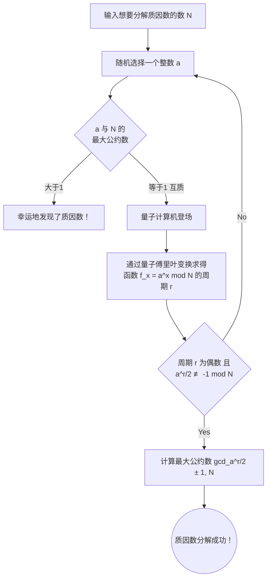

## 引言：密码学技术与量子计算机的交汇点

在现代互联网社会中，“公钥加密”是保护通信机密的基础。其中最具代表性的，是1977年由Ron Rivest、Adi Shamir和Leonard Adleman三位学者开发的“RSA加密”。从我们每天使用的在线购物支付、网站浏览（HTTPS）到电子邮件的收发，RSA加密作为互联网基础设施的心脏发挥着作用。

然而，随着“量子计算机”的出现，人们指出这种安全性有可能被彻底颠覆。媒体上甚至会看到“量子计算机一旦完成，世界上的密码和加密将在几秒钟内被破解”这样耸人听闻的标题。这到底是不是真的呢？

在本文中，我们将深入探讨经典的密码破解方法GNFS（一般数域筛选法），以及使用量子计算机的密码破解算法终极武器——“秀尔算法（Shor's Algorithm）”的原理。我们将通俗易懂地讲解量子傅里叶变换和周期寻找等高级概念，并详细验证在当前NISQ（含噪中型量子）时代的量子硬件现状，以及实际破解RSA-2048所需跨越的障碍。

---

## RSA加密的根基：大数质因数分解的困难性

RSA加密的安全性依赖于数学中极其简单的非对称性。那就是这样一个事实：“将两个巨大的质数相乘很容易，但要从它们相乘的结果（合数）中找出原来的两个质数（质因数分解）却极其困难。”

例如，假设有两个质数 $ p = 61 $、$ q = 53 $。计算它们的乘积 $ N = p \times q = 3233 $ 只需一瞬。但是，如果只给你“3233”这个数字，问你“这是哪两个质数相乘的结果？”，随着数字变大，解题的计算量会呈爆炸性增长。

在目前主流的RSA-2048中，使用的密钥长度为2048位，即十进制下约有617位的巨大合数 $ N $。如果能将这个 $ N $ 进行质因数分解，加密就等同于被破解了。

### 经典计算机的挑战：GNFS（一般数域筛选法）

为了解决质因数分解问题，数学家和密码学家多年来开发了各种算法。其中，目前在经典计算机上被认为最快的是 **一般数域筛选法（GNFS: General Number Field Sieve）**。

GNFS为了将巨大的数 $ N $ 进行质因数分解，会将整数环中的计算扩展到更抽象的代数域（Number Field）中进行分析。其大致流程如下：

1. **选择多项式**：寻找一个以 $ N $ 为根、具有适当次数和系数的多项式 $ f(x) $。
2. **数据收集（筛选）**：在有理数域和代数域上，大量寻找能够分解为小质数（平滑数，Smooth numbers）的数对。这个过程被称为“筛选”，是耗时最长的部分。
3. **矩阵生成与化简**：基于收集到的关系式生成一个巨大的稀疏矩阵（大部分元素为0的矩阵），并使用线性代数的方法（如块Lanczos算法）求解。
4. **平方根计算**：最后在代数域上计算平方根，推导出 $ N $ 的因数（质因数）。

GNFS的计算复杂度非渐进地评估为 $ O(\exp((\sqrt[3]{\frac{64}{9}} + o(1)) (\log N)^{\frac{1}{3}} (\log \log N)^{\frac{2}{3}})) $。这被称为“亚指数（Sub-exponential）”时间复杂度。虽然比指数时间快，但比多项式时间（Polynomial time）慢得多。

实际上，在2020年，一个国际研究团队使用GNFS成功完成了RSA-250（829位，250位的合数）的质因数分解。这项计算汇集了世界各地的计算机资源，耗费了约2700个CPU核心年的庞大计算时间。然而，如果换成2048位，所需的计算量将膨胀到宇宙寿命的数兆倍。无论现在用多少台超级计算机并行运行，使用经典方法都不可能在现实时间内完成破解。

---

## 量子计算机的杀手锏：秀尔算法

在这里登场的是1994年由彼得·秀尔（Peter Shor）提出的“秀尔算法（Shor's Algorithm）”。该算法具有划时代的意义，它能够让质因数分解问题在量子计算机上以 **多项式时间**（ $ O((\log N)^3) $ ）被解出。亚指数时间和多项式时间之间的差距是决定性的，这在理论上意味着，如果使用量子计算机，RSA加密将被彻底破坏。

### 秀尔算法的整体流程

秀尔算法并不是直接去解质因数分解问题，而是利用数论定理将其转换为另一个称为“周期寻找问题（Period Finding Problem）”的问题，并利用量子计算机的特性来高速求解。

### 步骤1：从质因数分解还原为周期寻找问题（经典计算处理）

算法的第一步在经典计算机上进行。
对于想要进行质因数分解的数 $ N $，随机选择一个与 $ N $ 互质（最大公约数为1）的整数 $ a $（ $ 1 < a < N $ ）。如果很偶然地最大公约数不为1，那么此时找到的公约数就是 $ N $ 的质因数，破解完成，但这种概率极低。

接下来，考虑以下模方程序列：
$ f(x) = a^x \pmod N $

如果将 $ x = 1, 2, 3, \dots $ 代入该函数 $ f(x) $，得到的值看起来可能是随机的，但由于是在有限范围内计算，它必然会在某个点回到原来的值，并重复相同的数列。这个重复的周期被称为 $ r $。也就是说，
寻找使得
$ a^r \equiv 1 \pmod N $
成立的最小正整数 $ r $ 的问题，这就是“周期寻找问题”。

如果找到了这个周期 $ r $，且 $ r $ 是偶数，则 $ a^r - 1 \equiv 0 \pmod N $，利用因式分解公式可以变形为：
$ (a^{r/2} - 1)(a^{r/2} + 1) \equiv 0 \pmod N $
由此，通过使用欧几里得算法（辗转相除法）计算 $ N $ 与 $ a^{r/2} \pm 1 $ 的最大公约数，就能以极高的概率获得 $ N $ 的质因数。

在经典计算机上寻找周期 $ r $ 最终还是需要指数级的步骤，无法实现加速。但是，如果是量子计算机，就能在瞬间（多项式时间内）找到这个周期 $ r $。

### 步骤2：量子态的准备与叠加

接下来就是量子计算机的舞台了。
量子计算机使用能够同时拥有“0”和“1”状态的“量子比特（Qubit）”。在秀尔算法中，准备了两个寄存器：用于存储输入的寄存器（第一寄存器）和用于存储计算结果的寄存器（第二寄存器）。

首先，将一种称为阿达马门（Hadamard gate）的量子逻辑门操作应用于第一寄存器的所有量子比特。借此，第一寄存器会进入所有可能的 $ x $ 值（从 $ 0 $ 到 $ 2^n-1 $，$ n $ 为足够大的比特数）的 **均匀叠加态**。

也就是说，在量子计算机内部，构建出了一个无数个输入值 $ x=0, 1, 2, 3, \dots $ 同时并行存在的状态。

### 步骤3：量子模幂运算（Quantum Modular Exponentiation）

接下来，以第一寄存器的叠加态作为输入，计算 $ f(x) = a^x \pmod N $，并将结果存储在第二寄存器中。
由于这种计算是作为量子电路上的幺正变换（Unitary transformation）执行的，因此在保持叠加态的同时，对所有 $ x $ 的 $ f(x) $ 计算是“同时并行地（量子并行性）”进行的。

此时整个量子系统的空间，变成了
$ |x, a^x \bmod N\rangle $
这种状态的庞大叠加。

但是，如果在这里简单地对第二寄存器进行测量（观测），就会按概率随机选出一个 $ a^x \bmod N $ 的值，与之联动的第一寄存器中的 $ x $ 也会确定为一个值。这就和用经典计算机计算一次是一样的，无法找到周期 $ r $。

根据量子力学的规则，我们无法直接窥探叠加态的内容。那么，如何提取出整体“周期”这种全局信息呢？

### 步骤4：量子傅里叶变换（QFT: Quantum Fourier Transform）

突破这道壁垒的秀尔算法之精髓，就在于对第一寄存器应用 **量子傅里叶变换（QFT）**。

在进行测量之前，分析函数 $ f(x) $ 的波的性质。假设我们观测了第二寄存器，并得到了一个值 $ y $。那么，第一寄存器的状态就会坍缩为“所有满足 $ a^x \pmod N = y $ 的 $ x $ 的叠加”。
这个 $ x $ 的值，会变成像 $ x_0, x_0 + r, x_0 + 2r, x_0 + 3r, \dots $ 这样以周期 $ r $ 为间隔离散排列的状态（一种梳状的概率幅分布）。

对这种状态应用量子傅里叶变换（QFT）。就像经典的离散傅里叶变换将时域信号转换为频域一样，QFT会让量子态的概率幅发生干涉。

应用QFT后，由于量子干涉效应，与周期 $ r $ 不共振（相位不一致）的错误答案的概率会相互抵消并趋近于零（破坏性干涉），而只有包含周期 $ r $ 信息的正确答案的概率才会被放大（建设性干涉）。

### 步骤5：测量与连分数展开（经典后处理）

在应用QFT之后测量第一寄存器，以极高的概率可以得到一个非常接近 $ c \approx \frac{j \cdot 2^n}{r} $ 这种形式的整数 $ c $（其中 $ j $ 是一个未知的整数，$ 2^n $ 是寄存器的大小）。

将这个测量结果 $ c $ 传回经典计算机，构建分数 $ \frac{c}{2^n} \approx \frac{j}{r} $。然后，利用称为“连分数展开（Continued fraction expansion）”的数学方法计算近似值，就能巧妙地找出作为分母的周期 $ r $。

一旦知道了 $ r $，剩下的就是使用步骤1的公式计算出 $ N $ 的质因数，RSA加密就被彻底破解了。

---

## 当前量子计算机（NISQ）的实力与课题

虽然秀尔算法在理论上是完美的，但如果问“明天RSA加密就会被破解吗？”，答案明确是“否定”的。其原因在于当前量子计算机的硬件技术限制。

### NISQ（含噪中型量子）时代

我们目前正处于被称为“NISQ”的时代。NISQ设备拥有几十到几百个物理量子比特，但对噪声极为脆弱。

量子比特很容易受到热量和电磁波等外部环境的影响，从而频繁发生导致量子态被破坏的“退相干（量子纠缠丧失）”或门操作时的“门错误”。如果试图运行像秀尔算法这样极其深（运算步骤庞大）的量子电路，错误会在计算过程中累积，最终的输出将变成毫无意义的完全噪声。

### 物理量子比特与逻辑量子比特

为了解决这个错误问题，“量子纠错（Quantum Error Correction）”是不可或缺的。
虽然经典计算机中也使用了纠错码，但由于存在禁止复制量子态的“不可克隆定理”，量子纠错极其复杂。

在量子纠错中，通过使用“表面码（Surface Code）”等技术，将许多充满噪声的“物理量子比特”组合起来，从而创造出一个没有错误的理想“逻辑量子比特”。

在当前错误率的前提下，据估算，制造1个逻辑量子比特大约需要1,000到10,000个物理量子比特。这被称为“纠错开销（Overhead）”。

### 破坏RSA-2048需要怎样的资源？

那么，为了实际破解RSA-2048而运行秀尔算法，需要多少资源呢？

Craig Gidney（谷歌）和Martin Ekerå在2021年的一篇论文中进行的突破性资源估算表明，如果使用优化的秀尔算法，并使用表面码进行纠错，则需要以下资源：

* **逻辑量子比特数**：约 4,096 个
* **物理量子比特数 **：** 约 2000万个**（假设错误率在 $10^{-3}$ 左右）
* **计算时间**：约 8小时（需要数百万到数十亿次物理门操作）

对此，当前量子硬件的水平达到了什么程度呢？
2023年底，IBM发布的超导量子处理器“Condor”达到了1,121个量子比特。此外，有关逻辑量子比特生成的突破性研究（如哈佛大学和QuEra公司等利用中性原子量子计算机生成了48个逻辑量子比特）也已涌现，但目前仍未达到能够长时间连续执行“无噪声完美运算”的阶段。

从几千个物理量子比特，扩展到 **2000万个** 实用的物理量子比特（且互相连接，在极低温下稳定工作，并能超高速处理控制信号的系统），在工程上存在着巨大的壁垒（布线问题、冷却能力限制、控制电子设备的臃肿化）。许多专家预测，能够破解RSA-2048的“容错量子计算机（FTQC）”至少需要10到30年，甚至更长的时间才能实现。

---

## 悄然逼近的“Store Now, Decrypt Later”威胁与PQC的曙光

认为“既然还需要10年以上，那就安心了”还为时过早。目前，诸如国家机密信息、医疗数据以及长期的基础设施设计等，存在着必须确保未来几十年内依然保密的数据。

在此令人担忧的，是一种被称为 **“Store Now, Decrypt Later（现在存储，以后解密）”** 的攻击手法。恶意的国家或组织会拦截当前所有用RSA或ECC（椭圆曲线加密）加密的通信数据，并将它们保存在存储器中。然后等到10年、20年后强大的量子计算机完成的瞬间，再使用秀尔算法将过去的数据全部解密，从而暴露机密信息。

为了对抗这种时间差带来的威胁，以NIST（美国国家标准与技术研究院）为中心，**“后量子密码学（PQC: Post-Quantum Cryptography）”** 的标准化进程一直在加紧推进。

PQC是基于即使使用量子计算机也很难破解（即无法应用秀尔算法）的数学问题的新型加密算法。主要的方法有以下几种：

* **基于格的密码学（Lattice-based cryptography）**：以LWE（容错学习）等问题为基础。在NIST标准化中占据主流（如Kyber、Dilithium等）。
* **基于编码的密码学（Code-based cryptography）**：依赖于纠错码解码问题的困难性。
* **多变量密码学（Multivariate cryptography）**：依赖于求解多变量非线性多项式方程组的困难性。
* **基于哈希的签名（Hash-based signatures）**：仅依赖于哈希函数安全性的数字签名。

目前在Google Chrome和Apple的iMessage等主要软件和平台上，PQC的导入测试和混合实现已经启动。

## 结语

量子计算机正在从科幻世界里的梦想，转变为现实的工程挑战。秀尔算法是数学与量子力学融合的人类伟大智力成果，但同时，它也暗藏着动摇我们数字社会基石的“破坏力”。

RSA加密并不会明天立刻就变得不可用。但是，考虑到量子技术的发展以及“Store Now, Decrypt Later”的风险，向PQC过渡这一密码学史上规模空前的迁移已经开始。我们现在正在见证信息安全领域范式转移的最前线。
